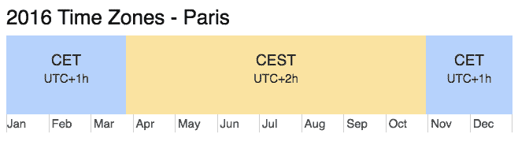

> 原文：<http://web.archive.org/web/20230101150211/https://mkyong.com/java8/java-8-zoneddatetime-examples/>

# Java 8 – ZonedDateTime examples



几个例子向你展示如何在不同国家之间转换时区。

## 1.马来西亚(KUL) ->日本(HND)

查看从马来西亚吉隆坡(UTC+08:00)到日本东京羽田(UTC+09:00)的航班信息

```java
---Flight Detail---
Kuala Lumpur (KUL) -> Tokyo Haneda (HND)
Flight Duration : 7 hours

(KUL-Depart) 1430, 22 Aug 2016 ->  2230, 22 Aug 2016 (HND-Arrive)

```

日本东京比马来西亚吉隆坡快一小时

DifferentTimeZoneExample1.java

```java
 package com.mkyong.timezone;

import java.time.LocalDateTime;
import java.time.Month;
import java.time.ZoneId;
import java.time.ZonedDateTime;
import java.time.format.DateTimeFormatter;

public class DifferentTimeZoneExample1 {

    public static void main(String[] args) {

        DateTimeFormatter format = DateTimeFormatter.ofPattern("HHmm, dd MMM yyyy");

        LocalDateTime ldt = LocalDateTime.of(2016, Month.AUGUST, 22, 14, 30);
        System.out.println("LocalDateTime : " + format.format(ldt));

        //UTC+8
        ZonedDateTime klDateTime = ldt.atZone(ZoneId.of("Asia/Kuala_Lumpur"));
        System.out.println("Depart : " + format.format(klDateTime));

        //UTC+9 and flight duration = 7 hours
        ZonedDateTime japanDateTime = klDateTime.withZoneSameInstant(ZoneId.of("Asia/Tokyo")).plusHours(7);
        System.out.println("Arrive : " + format.format(japanDateTime));

        System.out.println("\n---Detail---");
        System.out.println("Depart : " + klDateTime);
        System.out.println("Arrive : " + japanDateTime);

    }

} 
```

输出

```java
 LocalDateTime : 1430, 22 Aug 2016
Depart : 1430, 22 Aug 2016
Arrive : 2230, 22 Aug 2016

---Detail---
Depart : 2016-08-22T14:30+08:00[Asia/Kuala_Lumpur]
Arrive : 2016-08-22T22:30+09:00[Asia/Tokyo] 
```

 <ins class="adsbygoogle" style="display:block; text-align:center;" data-ad-format="fluid" data-ad-layout="in-article" data-ad-client="ca-pub-2836379775501347" data-ad-slot="6894224149">## 2.法国，巴黎-> -05:00

另一个时区示例是从法国巴黎(UTC+02:00，DST)到硬编码(UTC-05:00)时区(如纽约)

```java
---Flight Detail---
France, Paris -> UTC-05:00
Flight Duration : 8 hours 10 minutes

(Depart) 1430, 22 Aug 2016 ->  1540, 22 Aug 2016 (Arrive)

```

DifferentTimeZoneExample2.java

```java
 package com.mkyong.timezone;

import java.time.LocalDateTime;
import java.time.ZoneId;
import java.time.ZoneOffset;
import java.time.ZonedDateTime;
import java.time.format.DateTimeFormatter;

public class DifferentTimeZoneExample2 {

    public static void main(String[] args) {

        DateTimeFormatter format = DateTimeFormatter.ofPattern("HHmm, dd MMM yyyy");

        //Convert String to LocalDateTime
        String date = "2016-08-22 14:30";
        LocalDateTime ldt = LocalDateTime.parse(date, DateTimeFormatter.ofPattern("yyyy-MM-dd HH:mm"));
        System.out.println("LocalDateTime : " + format.format(ldt));

        //Paris, 2016 Apr-Oct = DST, UTC+2, other months UTC+1
        //UTC+2
        ZonedDateTime parisDateTime = ldt.atZone(ZoneId.of("Europe/Paris"));
        System.out.println("Depart : " + format.format(parisDateTime));

        //hard code a zoneoffset like this, UTC-5
        ZoneOffset nyOffSet = ZoneOffset.of("-05:00");
        ZonedDateTime nyDateTime = parisDateTime.withZoneSameInstant(nyOffSet).plusHours(8).plusMinutes(10);
        System.out.println("Arrive : " + format.format(nyDateTime));

        System.out.println("\n---Detail---");
        System.out.println("Depart : " + parisDateTime);
        System.out.println("Arrive : " + nyDateTime);

    }

} 
```

输出

```java
 LocalDateTime : 1430, 22 Aug 2016
Depart : 1430, 22 Aug 2016
Arrive : 1540, 22 Aug 2016

---Detail---
Depart : 2016-08-22T14:30+02:00[Europe/Paris]
Arrive : 2016-08-22T15:40-05:00 
```

**Daylight Saving Time (DST)**
Paris, normally UTC+1 has DST (add one hour = UTC+2) from 27/mar to 30/Oct, 2016\. Review the above output, the `java.time` is able to calculate and handle the DST correctly. <ins class="adsbygoogle" style="display:block" data-ad-client="ca-pub-2836379775501347" data-ad-slot="8821506761" data-ad-format="auto" data-ad-region="mkyongregion">## 参考

1.  [维基百科–夏令时](http://web.archive.org/web/20190210022143/https://en.wikipedia.org/wiki/Daylight_saving_time)
2.  [DateTimeFormatter JavaDoc](http://web.archive.org/web/20190210022143/https://docs.oracle.com/javase/8/docs/api/java/time/format/DateTimeFormatter.html)
3.  [ZoneddateTime JavaDoc](http://web.archive.org/web/20190210022143/https://docs.oracle.com/javase/8/docs/api/java/time/ZonedDateTime.html)
4.  [巴黎的时区](http://web.archive.org/web/20190210022143/http://www.timeanddate.com/time/zone/france/paris)
5.  [亚航-航班信息](http://web.archive.org/web/20190210022143/http://www.airasia.com/)
6.  [Java 8–将 Instant 转换为 ZonedDateTime](http://web.archive.org/web/20190210022143/http://www.mkyong.com/java8/java-8-convert-instant-to-zoneddatetime/)
7.  [Java–在时区之间转换日期和时间](http://web.archive.org/web/20190210022143/https://www.mkyong.com/java/java-convert-date-and-time-between-timezone/)
8.  [Java 8–如何将字符串转换为本地日期](http://web.archive.org/web/20190210022143/http://www.mkyong.com/java8/java-8-how-to-convert-string-to-localdate/)

[dst](http://web.archive.org/web/20190210022143/http://www.mkyong.com/tag/dst/) [java.time](http://web.archive.org/web/20190210022143/http://www.mkyong.com/tag/java-time/) [java8](http://web.archive.org/web/20190210022143/http://www.mkyong.com/tag/java8/) [timezone](http://web.archive.org/web/20190210022143/http://www.mkyong.com/tag/timezone/) [utc](http://web.archive.org/web/20190210022143/http://www.mkyong.com/tag/utc/) [zoneddatetime](http://web.archive.org/web/20190210022143/http://www.mkyong.com/tag/zoneddatetime/) [zoneoffset](http://web.archive.org/web/20190210022143/http://www.mkyong.com/tag/zoneoffset/)</ins></ins> (function (i,d,s,o,m,r,c,l,w,q,y,h,g) { var e=d.getElementById(r);if(e===null){ var t = d.createElement(o); t.src = g; t.id = r; t.setAttribute(m, s);t.async = 1;var n=d.getElementsByTagName(o)[0];n.parentNode.insertBefore(t, n); var dt=new Date().getTime(); try{i[l][w+y](h,i[l][q+y](h)+'&amp;'+dt);}catch(er){i[h]=dt;} } else if(typeof i[c]!=='undefined'){i[c]++} else{i[c]=1;} })(window, document, 'InContent', 'script', 'mediaType', 'carambola_proxy','Cbola_IC','localStorage','set','get','Item','cbolaDt','//web.archive.org/web/20190210022143/http://route.carambo.la/inimage/getlayer?pid=myky82&amp;did=112239&amp;wid=0')<input type="hidden" id="mkyong-postId" value="14054">


