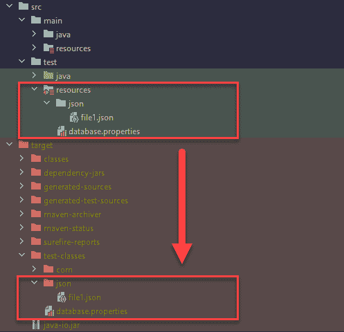

# Java–从资源文件夹中读取文件

> 原文：<http://web.archive.org/web/20230101150211/https://mkyong.com/java/java-read-a-file-from-resources-folder/>


在 Java 中，我们可以使用`getResourceAsStream`或`getResource`从类路径的`resources`文件夹或根目录中读取一个或多个文件。

`getResourceAsStream`方法返回一个`InputStream`。

```java
 // the stream holding the file content
  InputStream is = getClass().getClassLoader().getResourceAsStream("file.txt");

  // for static access, uses the class name directly
  InputStream is = JavaClassName.class.getClassLoader().getResourceAsStream("file.txt"); 
```

`getResource`方法返回一个`URL`并通常将其转换为一个`File`；**不在 JAR 文件中工作**。

```java
 // get the file url, not working in JAR file.
  URL resource = getClass().getClassLoader().getResource("file.txt");
  if (resource == null) {
      throw new IllegalArgumentException("file not found!");
  } else {

      // failed if files have whitespaces or special characters
      //return new File(resource.getFile());

      return new File(resource.toURI());
  }

  // for static access
  // URL resource = JavaClassName.class.getClassLoader().getResource("fileName"); 
```

## 1.资源文件夹中的文件

1.1 查看`src/main/resources`中的文件，稍后我们将访问这些文件并打印出文件内容。

src/main/resources/database.properties

```java
 datasource.url=jdbc:mysql://localhost/mkyong?useSSL=false
datasource.username=root
datasource.password=password
datasource.driver-class-name=com.mysql.jdbc.Driver 
```

src/main/resources/json/file1.json

```java
 {
  "name": "mkyong",
  "age": 38
} 
```

src/main/resources/json/file2.json

```java
 {
  "name": "jack",
  "age": 40
} 
```

src/main/resources/json/sub/subfile1.json

```java
 {
  "name": "sub",
  "age": 99
} 
```

1.2 默认情况下，Maven、Gradle 或 common Java practice 等构建工具会将所有文件从`src/main/resources`复制到`target/classes`或`build/classes`的根目录下。因此，当我们试图从`src/main/resources`读取文件时，我们从项目类路径的根目录读取文件。


1.3 下面是一个 JAR 文件结构。通常，`resources`文件夹中的文件会复制到类路径的根目录。

Terminal

```java
 $ jar -tf target/example.jar

META-INF/MANIFEST.MF
META-INF/
json/
json/sub/
json/file2.json
json/sub/subfile1.json
json/file1.json
database.properties
com/
com/mkyong/
com/mkyong/io/
com/mkyong/io/utils/
//... 
```

## 2.从资源文件夹中获取文件。

2.1 下面的例子演示了使用`getResourceAsStream`和`getResource`方法从`resources`文件夹中读取文件`json/file1.json`并打印出文件内容。

**注**

*   `getResource`方法在 JAR 文件中不起作用。
*   `getResourceAsStream`方法在任何地方都有效。

FileResourcesUtils.java

```java
 package com.mkyong.io.utils;

import java.io.*;
import java.net.URI;
import java.net.URISyntaxException;
import java.net.URL;
import java.nio.charset.StandardCharsets;
import java.nio.file.Files;
import java.util.List;

public class FileResourcesUtils {

    public static void main(String[] args) throws IOException {

        FileResourcesUtils app = new FileResourcesUtils();

        //String fileName = "database.properties";
        String fileName = "json/file1.json";

        System.out.println("getResourceAsStream : " + fileName);
        InputStream is = app.getFileFromResourceAsStream(fileName);
        printInputStream(is);

        System.out.println("\ngetResource : " + fileName);
        File file = app.getFileFromResource(fileName);
        printFile(file);

    }

    // get a file from the resources folder
    // works everywhere, IDEA, unit test and JAR file.
    private InputStream getFileFromResourceAsStream(String fileName) {

        // The class loader that loaded the class
        ClassLoader classLoader = getClass().getClassLoader();
        InputStream inputStream = classLoader.getResourceAsStream(fileName);

        // the stream holding the file content
        if (inputStream == null) {
            throw new IllegalArgumentException("file not found! " + fileName);
        } else {
            return inputStream;
        }

    }

    /*
        The resource URL is not working in the JAR
        If we try to access a file that is inside a JAR,
        It throws NoSuchFileException (linux), InvalidPathException (Windows)

        Resource URL Sample: file:java-io.jar!/json/file1.json
     */
    private File getFileFromResource(String fileName) throws URISyntaxException{

        ClassLoader classLoader = getClass().getClassLoader();
        URL resource = classLoader.getResource(fileName);
        if (resource == null) {
            throw new IllegalArgumentException("file not found! " + fileName);
        } else {

            // failed if files have whitespaces or special characters
            //return new File(resource.getFile());

            return new File(resource.toURI());
        }

    }

    // print input stream
    private static void printInputStream(InputStream is) {

        try (InputStreamReader streamReader =
                    new InputStreamReader(is, StandardCharsets.UTF_8);
             BufferedReader reader = new BufferedReader(streamReader)) {

            String line;
            while ((line = reader.readLine()) != null) {
                System.out.println(line);
            }

        } catch (IOException e) {
            e.printStackTrace();
        }

    }

    // print a file
    private static void printFile(File file) {

        List<String> lines;
        try {
            lines = Files.readAllLines(file.toPath(), StandardCharsets.UTF_8);
            lines.forEach(System.out::println);
        } catch (IOException e) {
            e.printStackTrace();
        }

    }

} 
```

输出

Terminal

```java
 getResourceAsStream : json/file1.json
{
  "name": "mkyong",
  "age": 38
}

getResource : json/file1.json
{
  "name": "mkyong",
  "age": 38
} 
```

2.2 现在，我们把项目打包成一个 JAR 文件，运行它；这一次，`getResource`将失败并返回`NoSuchFileException`或`InvalidPathException`。我们无法通过资源 URL 读取 JAR 文件中的文件。

在 Linux (Ubuntu)上运行 JAR 文件，它抛出`NoSuchFileException`。

Terminal

```java
 $ mvn clean package

$ java -jar target/java-io.jar

getResourceAsStream : json/file1.json
{
  "name": "mkyong",
  "age": 38
}

# for new File(resource.getFile());
getResource : json/file1.json
java.nio.file.NoSuchFileException: file:/home/mkyong/projects/core-java/java-io/target/java-io.jar!/json/file1.json
	at java.base/sun.nio.fs.UnixException.translateToIOException(UnixException.java:92)
	at java.base/sun.nio.fs.UnixException.rethrowAsIOException(UnixException.java:111)
	at java.base/sun.nio.fs.UnixException.rethrowAsIOException(UnixException.java:116)
	at java.base/sun.nio.fs.UnixFileSystemProvider.newByteChannel(UnixFileSystemProvider.java:219)
	at java.base/java.nio.file.Files.newByteChannel(Files.java:370)
	at java.base/java.nio.file.Files.newByteChannel(Files.java:421)
	at java.base/java.nio.file.spi.FileSystemProvider.newInputStream(FileSystemProvider.java:420)
	at java.base/java.nio.file.Files.newInputStream(Files.java:155)
	at java.base/java.nio.file.Files.newBufferedReader(Files.java:2838)
	at java.base/java.nio.file.Files.readAllLines(Files.java:3329)
	at com.mkyong.io.utils.FileResourcesUtils.printFile(FileResourcesUtils.java:135)
	at com.mkyong.io.utils.FileResourcesUtils.main(FileResourcesUtils.java:24)

# for new File(resource.toURI());
getResource : json/file1.json
Exception in thread "main" java.lang.IllegalArgumentException: URI is not hierarchical
	at java.base/java.io.File.<init>(File.java:420)
	at com.mkyong.io.utils.FileResourcesUtils.getFileFromResource(FileResourcesUtils.java:112)
	at com.mkyong.io.utils.FileResourcesUtils.main(FileResourcesUtils.java:29) 
```

在 Windows 上运行 JAR 文件，它抛出`InvalidPathException`。

Terminal

```java
 $ mvn clean package

$ java -jar target/java-io.jar

getResourceAsStream : json/file1.json
{
  "name": "mkyong",
  "age": 38
}

getResource : json/file1.json
Exception in thread "main" java.nio.file.InvalidPathException:
        Illegal char <:> at index 4: file:\C:\Users\mkyong\projects\core-java\java-io\target\java-io.jar!\json\file1.json

        at java.base/sun.nio.fs.WindowsPathParser.normalize(WindowsPathParser.java:182)
        at java.base/sun.nio.fs.WindowsPathParser.parse(WindowsPathParser.java:153)
        at java.base/sun.nio.fs.WindowsPathParser.parse(WindowsPathParser.java:77)
        at java.base/sun.nio.fs.WindowsPath.parse(WindowsPath.java:92)
        at java.base/sun.nio.fs.WindowsFileSystem.getPath(WindowsFileSystem.java:229)
        at java.base/java.io.File.toPath(File.java:2290)
        at com.mkyong.io.utils.FileResourcesUtils.printFile(FileResourcesUtils.java:166)
        at com.mkyong.io.utils.FileResourcesUtils.main(FileResourcesUtils.java:32) 
```

这个例子使用 Maven 插件`maven-jar-plugin`来创建 JAR 文件。

pom.xml

```java
 <!-- Make this jar executable -->
  <plugin>
      <groupId>org.apache.maven.plugins</groupId>
      <artifactId>maven-jar-plugin</artifactId>
      <version>3.2.0</version>
      <configuration>
          <archive>
              <manifest>
                  <addClasspath>true</addClasspath>
                  <mainClass>com.mkyong.io.utils.FileResourcesUtils</mainClass>
              </manifest>
          </archive>
      </configuration>
  </plugin> 
```

## 3.从 resources 文件夹获取一个文件——单元测试

3.1 我们将测试资源放在文件夹`src/test/resources`中进行单元测试。通常，测试资源中的文件会复制到`target/test-classes`文件夹中。

src/test/resources/json/file1.json

```java
 {
  "name": "unit test",
  "age": 38
} 
```

src/test/resources/database.properties

```java
 datasource.url=jdbc:mysql://localhost/test?useSSL=false
datasource.username=test
datasource.password=password
datasource.driver-class-name=com.mysql.jdbc.Driver 
```

3.2 它的工作方式与我们从`src/main/resources`读取文件的方式相同。我们使用相同的`getResourceAsStream`和`getResource`方法从`src/test/resources`中读取文件。

FileResourcesTest.java

```java
 package com.mkyong.io;

import org.junit.jupiter.api.DisplayName;
import org.junit.jupiter.api.Test;

import java.io.*;
import java.net.URISyntaxException;
import java.net.URL;
import java.nio.charset.StandardCharsets;
import java.nio.file.Files;
import java.util.List;

// Unit test class
public class FileResourcesTest {

    @DisplayName("Test loading a JSON file")
    @Test
    void loadJSONTest() {

        String fileName = "json/file1.json";

        ClassLoader classLoader = getClass().getClassLoader();

        try (InputStream inputStream = classLoader.getResourceAsStream(fileName);
             InputStreamReader streamReader = new InputStreamReader(inputStream, StandardCharsets.UTF_8);
             BufferedReader reader = new BufferedReader(streamReader)) {

            String line;
            while ((line = reader.readLine()) != null) {
                System.out.println(line);
            }

        } catch (IOException e) {
            e.printStackTrace();
        }
    }

    @DisplayName("Test loading a properties file")
    @Test
    void loadPropTest() throws IOException, URISyntaxException {

        String fileName = "database.properties";

        ClassLoader classLoader = getClass().getClassLoader();

        URL resource = classLoader.getResource(fileName);
        if (resource == null) {
            throw new IllegalArgumentException("file not found! " + fileName);
        }

        //File file = new File(resource.getFile());
        File file = new File(resource.toURI());

        List<String> lines = Files.readAllLines(file.toPath(), StandardCharsets.UTF_8);
        lines.forEach(System.out::println);

    }

} 
```

输出

Terminal

```java
 {
  "name": "unit test",
  "age": 38
}

datasource.url=jdbc:mysql://localhost/test?useSSL=false
datasource.username=test
datasource.password=password
datasource.driver-class-name=com.mysql.jdbc.Driver 
```

## 4.从资源文件夹中获取所有文件。(非 JAR 环境)

如果我们不知道确切的文件名，并且想要读取所有文件，包括 resources 文件夹中的子文件夹文件，我们可以使用 NIO `Files.walk`轻松地访问和读取文件。

4.1 以下示例使用`Files.walk`从文件夹`src/main/resources/json`中读取所有文件:

FileResourcesUtils.java

```java
 package com.mkyong.io.utils;

import java.io.*;
import java.net.URISyntaxException;
import java.net.URL;
import java.nio.charset.StandardCharsets;
import java.nio.file.Files;
import java.nio.file.Paths;
import java.util.List;
import java.util.stream.Collectors;

public class FileResourcesUtils {

    public static void main(String[] args) throws IOException {

        FileResourcesUtils app = new FileResourcesUtils();

        // read all files from a resources folder
        try {

            // files from src/main/resources/json
            List<File> result = app.getAllFilesFromResource("json");
            for (File file : result) {
                System.out.println("file : " + file);
                printFile(file);
            }

        } catch (URISyntaxException | IOException e) {
            e.printStackTrace();
        }

    }

    private List<File> getAllFilesFromResource(String folder)
        throws URISyntaxException, IOException {

        ClassLoader classLoader = getClass().getClassLoader();

        URL resource = classLoader.getResource(folder);

        // dun walk the root path, we will walk all the classes
        List<File> collect = Files.walk(Paths.get(resource.toURI()))
                .filter(Files::isRegularFile)
                .map(x -> x.toFile())
                .collect(Collectors.toList());

        return collect;
    }

    // print a file
    private static void printFile(File file) {

        List<String> lines;
        try {
            lines = Files.readAllLines(file.toPath(), StandardCharsets.UTF_8);
            lines.forEach(System.out::println);
        } catch (IOException e) {
            e.printStackTrace();
        }

    }

} 
```

输出

Terminal

```java
 file : /home/mkyong/projects/core-java/java-io/target/classes/json/file1.json
{
"name": "mkyong",
"age": 38
}

file : /home/mkyong/projects/core-java/java-io/target/classes/json/file2.json
{
"name": "jack",
"age": 40
}

file : /home/mkyong/projects/core-java/java-io/target/classes/json/sub/subfile1.json
{
"name": "sub",
"age": 99
} 
```

4.2 但是，例 4.1 中的标准`Files.walk`不能直接访问 JAR 文件中的文件，尝试在 JAR 环境中运行例 4.1，它抛出`FileSystemNotFoundException`。

Terminal

```java
 $ mvn clean package

$ java -jar target/java-io.jar
Exception in thread "main" java.nio.file.FileSystemNotFoundException
        at jdk.zipfs/jdk.nio.zipfs.ZipFileSystemProvider.getFileSystem(ZipFileSystemProvider.java:169)
        at jdk.zipfs/jdk.nio.zipfs.ZipFileSystemProvider.getPath(ZipFileSystemProvider.java:155)
        at java.base/java.nio.file.Path.of(Path.java:208)
        at java.base/java.nio.file.Paths.get(Paths.java:97)
        at com.mkyong.io.utils.FileResourcesUtils.getAllFilesFromResource(FileResourcesUtils.java:128)
        at com.mkyong.io.utils.FileResourcesUtils.main(FileResourcesUtils.java:35) 
```

## 5.从资源文件夹中获取所有文件。(JAR 版本)

5.1 这个例子展示了如何通过`FileSystems`和 URI `jar:file:xxx.jar`来`Files.walk`一个 JAR 文件中的一个文件夹。

这个想法是:

*   File 使用`FileSystems`遍历 JAR 文件中的文件夹，并获取所有文件名，参见`getPathsFromResourceJAR()`
*   循环所有文件名，像例 2.1 一样访问并打印每个文件，见`getFileFromResourceAsStream()`。

FileResourcesUtils.java

```java
 package com.mkyong.io.utils;

import java.io.*;
import java.net.URI;
import java.net.URISyntaxException;
import java.nio.charset.StandardCharsets;
import java.nio.file.FileSystem;
import java.nio.file.FileSystems;
import java.nio.file.Files;
import java.nio.file.Path;
import java.util.Collections;
import java.util.List;
import java.util.stream.Collectors;

public class FileResourcesUtils {

    public static void main(String[] args) throws IOException {

        FileResourcesUtils app = new FileResourcesUtils();

        // Sample 3 - read all files from a resources folder (JAR version)
        try {

            // get paths from src/main/resources/json
            List<Path> result = app.getPathsFromResourceJAR("json");
            for (Path path : result) {
                System.out.println("Path : " + path);

                String filePathInJAR = path.toString();
                // Windows will returns /json/file1.json, cut the first /
                // the correct path should be json/file1.json
                if (filePathInJAR.startsWith("/")) {
                    filePathInJAR = filePathInJAR.substring(1, filePathInJAR.length());
                }

                System.out.println("filePathInJAR : " + filePathInJAR);

                // read a file from resource folder
                InputStream is = app.getFileFromResourceAsStream(filePathInJAR);
                printInputStream(is);
            }

        } catch (URISyntaxException | IOException e) {
            e.printStackTrace();
        }

    }

    // get a file from the resources folder
    // works everywhere, IDEA, unit test and JAR file.
    private InputStream getFileFromResourceAsStream(String fileName) {

        // The class loader that loaded the class
        ClassLoader classLoader = getClass().getClassLoader();
        InputStream inputStream = classLoader.getResourceAsStream(fileName);

        // the stream holding the file content
        if (inputStream == null) {
            throw new IllegalArgumentException("file not found! " + fileName);
        } else {
            return inputStream;
        }

    }

    // Get all paths from a folder that inside the JAR file
    private List<Path> getPathsFromResourceJAR(String folder)
        throws URISyntaxException, IOException {

        List<Path> result;

        // get path of the current running JAR
        String jarPath = getClass().getProtectionDomain()
                .getCodeSource()
                .getLocation()
                .toURI()
                .getPath();
        System.out.println("JAR Path :" + jarPath);

        // file walks JAR
        URI uri = URI.create("jar:file:" + jarPath);
        try (FileSystem fs = FileSystems.newFileSystem(uri, Collections.emptyMap())) {
            result = Files.walk(fs.getPath(folder))
                    .filter(Files::isRegularFile)
                    .collect(Collectors.toList());
        }

        return result;

    }

    // print input stream
    private static void printInputStream(InputStream is) {

        try (InputStreamReader streamReader = new InputStreamReader(is, StandardCharsets.UTF_8);
             BufferedReader reader = new BufferedReader(streamReader)) {

            String line;
            while ((line = reader.readLine()) != null) {
                System.out.println(line);
            }

        } catch (IOException e) {
            e.printStackTrace();
        }

    }

} 
```

输出

Terminal

```java
 $ java -jar target/java-io.jar

JAR Path :/C:/Users/mkyong/projects/core-java/java-io/target/java-io.jar

Path : /json/file2.json
filePathInJAR : json/file2.json
{
  "name": "jack",
  "age": 40
}

Path : /json/file1.json
filePathInJAR : json/file1.json
{
  "name": "mkyong",
  "age": 38
}

Path : /json/sub/subfile1.json
filePathInJAR : json/sub/subfile1.json
{
  "name": "sub",
  "age": 99
} 
```

## 下载源代码

$ git 克隆[https://github.com/mkyong/core-java](http://web.archive.org/web/20221211223736/https://github.com/mkyong/core-java)

$ cd java-io

## 参考

*   [Files.walk JavaDoc](http://web.archive.org/web/20221211223736/https://docs.oracle.com/en/java/javase/11/docs/api/java.base/java/nio/file/Files.html#walk(java.nio.file.Path,int,java.nio.file.FileVisitOption...))
*   [代码源 JavaDoc](http://web.archive.org/web/20221211223736/https://docs.oracle.com/en/java/javase/11/docs/api/java.base/java/security/CodeSource.html)
*   [RFC 2396–URI 的语法和格式](http://web.archive.org/web/20221211223736/https://www.ietf.org/rfc/rfc2396.txt)
*   [Maven–创建 JAR 文件](/web/20221211223736/https://mkyong.com/maven/how-to-create-a-jar-file-with-maven/)
*   [Zip 文件系统提供商](http://web.archive.org/web/20221211223736/https://docs.oracle.com/javase/7/docs/technotes/guides/io/fsp/zipfilesystemprovider.html)
*   [Java Files.walk 示例](/web/20221211223736/https://mkyong.com/java/java-files-walk-examples/)
*   [Java–获取正在运行的 JAR 文件的路径](/web/20221211223736/https://mkyong.com/java/java-get-the-name-or-path-of-a-running-jar-file/)

<input type="hidden" id="mkyong-current-postId" value="13417">