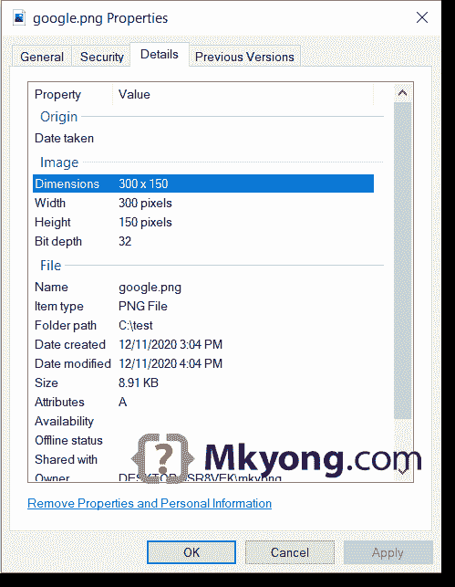

# 如何在 Java 中读写图像

> 原文：<http://web.archive.org/web/20230101150211/https://mkyong.com/java/how-to-write-an-image-to-file-imageio/>

在 Java 中，我们可以使用 [javax.imageio.ImageIO](http://web.archive.org/web/20220619003336/https://docs.oracle.com/en/java/javase/11/docs/api/java.desktop/javax/imageio/package-summary.html) 类来读写图像。

## 1.阅读图像

从文件中读取图像。

```java
 BufferedImage image = ImageIO.read(new File("c:\\test\\image.png")); 
```

从 URL 读取图像。

```java
 BufferedImage image = ImageIO.read(new URL("https://example.com/image.png")); 
```

## 2.编写或保存图像

以不同的图像格式编写或保存图像。

```java
 ImageIO.write(bufferedImage , "jpg", new File("c:\\test\\image.jpg"));

  ImageIO.write(bufferedImage , "gif", new File("c:\\test\\image.gif"));

  ImageIO.write(bufferedImage , "png", new File("c:\\test\\image.png")); 
```

下面的代码片段列出了所有支持的格式。

```java
 String writerNames[] = ImageIO.getWriterFormatNames();
  Arrays.stream(writerNames).forEach(System.out::println); 
```

输出

```java
 PG
jpg
tiff
bmp
BMP
gif
GIF
WBMP
png
PNG
JPEG
tif
TIF
TIFF
wbmp
jpeg 
```

## 3.读取、调整和保存图像。

一个完整的 Java 例子，使用`ImageIO`从一个 URL (Google logo)中读取一个图像，将其大小调整为`300x150`并保存到一个文件中。

ReadWriteImage.java

```java
 package com.mkyong.io.image;

import javax.imageio.ImageIO;
import java.awt.*;
import java.awt.image.BufferedImage;
import java.io.File;
import java.io.IOException;
import java.net.MalformedURLException;
import java.net.URL;

public class ReadWriteImage {

    // Google logo url
    private static final String GOOGLE_LOGO =
            "https://www.google.cimg/branding/googlelogo/2x/googlelogo_color_272x92dp.png";

    public static void main(String[] args) {

        try {

            URL url = new URL(GOOGLE_LOGO);

            // read an image from url
            BufferedImage image = ImageIO.read(url);

            // resize image to 300x150
            Image scaledImage = image.getScaledInstance(300, 150, Image.SCALE_DEFAULT);

            // save the resize image aka thumbnail
            ImageIO.write(
                    convertToBufferedImage(scaledImage),
                    "png",
                    new File("C:\\test\\google.png"));

        } catch (MalformedURLException e) {
            e.printStackTrace();
        } catch (IOException e) {
            e.printStackTrace();
        }
        System.out.println("Done");

    }

    // convert Image to BufferedImage
    public static BufferedImage convertToBufferedImage(Image img) {

        if (img instanceof BufferedImage) {
            return (BufferedImage) img;
        }

        // Create a buffered image with transparency
        BufferedImage bi = new BufferedImage(
                img.getWidth(null), img.getHeight(null),
                BufferedImage.TYPE_INT_ARGB);

        Graphics2D graphics2D = bi.createGraphics();
        graphics2D.drawImage(img, 0, 0, null);
        graphics2D.dispose();

        return bi;
    }

} 
```

下载的图像大小调整为 300×150。



## 下载源代码

$ git 克隆[https://github.com/mkyong/core-java](http://web.archive.org/web/20220619003336/https://github.com/mkyong/core-java)

$ cd java-io/howto/images

## 参考

*   [Java ImageIO](http://web.archive.org/web/20220619003336/https://docs.oracle.com/en/java/javase/11/docs/api/java.desktop/javax/imageio/package-summary.html)
*   [Java 教程–使用图像](http://web.archive.org/web/20220619003336/https://docs.oracle.com/javase/tutorial/img/index.html)
*   [Java 调整图像大小](/web/20220619003336/https://mkyong.com/java/how-to-resize-an-image-in-java/)

<input type="hidden" id="mkyong-current-postId" value="3052">