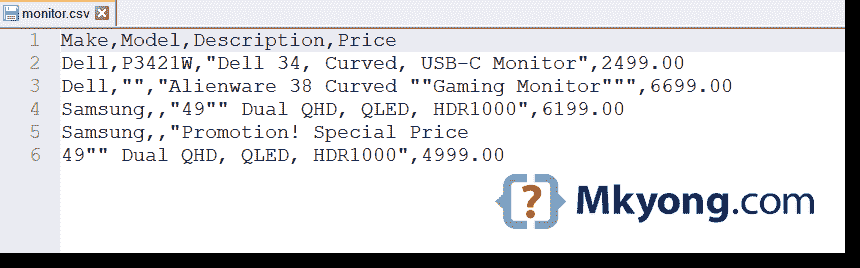
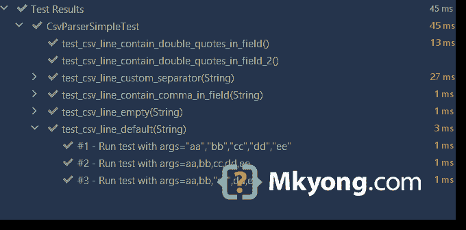

# 如何在 Java 中读取和解析 CSV 文件

> 原文：<http://web.archive.org/web/20230101150211/https://mkyong.com/java/how-to-read-and-parse-csv-file-in-java/>



本文展示了如何读取和解析一个[逗号分隔值(CSV)](http://web.archive.org/web/20221230032447/https://en.wikipedia.org/wiki/Comma-separated_values) 文件。

主题:

1.  [CSV 文件和 RFC 4180](#csv-file-and-rfc-4180)
2.  [open CSV–读取并解析 CSV 文件](#opencsv---read-and-parse-csv-file)
3.  [open CSV–将 CSV 文件转换为对象](#opencsv---convert-csv-file-to-object)
4.  [解析 CSV 文件挑战–嵌入逗号、双引号和换行符](#csv-and-embedded-commas-double-quotes-and-line-breaks)
5.  [读取和解析 CSV 文件的单个类](#single-class-to-read-and-parse-a-csv-file)
6.  [String#split 解析 CSV 文件](#stringsplit-to-parse-a-csv-file)

## 1。CSV 文件和 RFC 4180。

逗号分隔值(CSV)文件是使用`comma`分隔值的标准文本文件。文件的每一行由一个或多个字段组成，用逗号分隔。每个字段可以用双引号括起来，也可以不用。

```java
 1995,Java,James Gosling
"1995","Java","James Gosling" 
```

[RFC 4180](http://web.archive.org/web/20221230032447/https://tools.ietf.org/html/rfc4180) 定义了 CSV 文件或`text/csv`文件的格式或定义。

## 2。open CSV–读取和解析 CSV 文件。

2.1[open CSV](http://web.archive.org/web/20221230032447/http://opencsv.sourceforge.net/)是简单易用的 Java CSV 解析器。

pom.xml

```java
 <dependency>
      <groupId>com.opencsv</groupId>
      <artifactId>opencsv</artifactId>
      <version>5.3</version>
  </dependency> 
```

2.2 然而，`opencsv.jar`具有如下依赖关系，如`commons-lang3.jar`、`commons-text.jar`、`commons-beanutils.jar`、`commons-logging.jar`和`commons-collections4:jar`。

Terminal

```java
 [INFO] \- com.opencsv:opencsv:jar:5.3:compile
[INFO]    +- org.apache.commons:commons-lang3:jar:3.11:compile
[INFO]    +- org.apache.commons:commons-text:jar:1.9:compile
[INFO]    +- commons-beanutils:commons-beanutils:jar:1.9.4:compile
[INFO]    |  +- commons-logging:commons-logging:jar:1.2:compile
[INFO]    |  \- commons-collections:commons-collections:jar:3.2.2:compile
[INFO]    \- org.apache.commons:commons-collections4:jar:4.4:compile 
```

*附注:`OpenCSV`及其依赖项的总文件大小约为 2M+。*

2.3`OpenCSV`示例读取或解析 CSV 文件。

读取全部并返回一个`List<String[]>`。

```java
 try (CSVReader reader = new CSVReader(new FileReader("file.csv"))) {
      List<String[]> r = reader.readAll();
      r.forEach(x -> System.out.println(Arrays.toString(x)));
  } 
```

逐行读取并将行转换为`String[]`。

```java
 try (CSVReader reader = new CSVReader(new FileReader("file.csv"))) {
      String[] lineInArray;
      while ((lineInArray = reader.readNext()) != null) {
          System.out.println(lineInArray[0] + lineInArray[1] + "etc...");
      }
  } 
```

解析 CSV 文件的完整`OpenCSV`示例。

c:\\test\\csv\\country.csv

```java
 "1.0.0.0","1.0.0.255","AU","Australia"
"1.0.1.0","1.0.3.255","CN","China"
"1.0.4.0","1.0.7.255","AU","Australia"
"1.0.128.0","1.0.255.255","TH","Thailand" 
```

OpenCsvExample.java

```java
 package com.mkyong.io.csv.opencsv;

import com.opencsv.CSVReader;
import com.opencsv.exceptions.CsvException;

import java.io.FileReader;
import java.io.IOException;
import java.util.Arrays;
import java.util.List;

public class OpenCsvExample {

    public static void main(String[] args) throws IOException, CsvException {

        String fileName = "c:\\test\\csv\\country.csv";
        try (CSVReader reader = new CSVReader(new FileReader(fileName))) {
            List<String[]> r = reader.readAll();
            r.forEach(x -> System.out.println(Arrays.toString(x)));
        }

    }

} 
```

输出

Terminal

```java
 [1.0.0.0, 1.0.0.255, AU, Australia]
[1.0.1.0, 1.0.3.255, CN, China]
[1.0.4.0, 1.0.7.255, AU, Australia]
[1.0.128.0, 1.0.255.255, TH, Thailand] 
```

2.4 常用分号`;`作为分隔符。这个`OpenCSV`示例展示了如何使用自定义分隔符`;`解析 CSV 文件并跳过第一行。

```java
 CSVParser csvParser = new CSVParserBuilder().withSeparator(';').build(); // custom separator
  try(CSVReader reader = new CSVReaderBuilder(
          new FileReader(fileName))
          .withCSVParser(csvParser)   // custom CSV parser
          .withSkipLines(1)           // skip the first line, header info
          .build()){
      List<String[]> r = reader.readAll();
      r.forEach(x -> System.out.println(Arrays.toString(x)));
  } 
```

**注意**
使用分号`;`作为分隔符不符合 [RFC 4180](http://web.archive.org/web/20221230032447/https://tools.ietf.org/html/rfc4180) 。然而，在 CSV 文件中看到分号分隔符是很常见的；不是每个人都遵循 RFC。

## 3。open CSV–将 CSV 文件转换为对象。

`OpenCSV`还支持将 CSV 文件直接读取或解析成 Java 对象。

3.1 本例读取一个 CSV 文件，并通过`@CsvBindByPosition`将其映射到一个`Country`对象。

c:\\test\\csv\\country.csv

```java
 "1.0.0.0","1.0.0.255","AU","Australia"
"1.0.1.0","1.0.3.255","CN","China"
"1.0.4.0","1.0.7.255","AU","Australia"
"1.0.128.0","1.0.255.255","TH","Thailand" 
```

Country.java

```java
 package com.mkyong.io.csv.opencsv;

import com.opencsv.bean.CsvBindByPosition;

public class Country {

    @CsvBindByPosition(position = 0)
    private String startIp;

    @CsvBindByPosition(position = 1)
    private String endIp;

    @CsvBindByPosition(position = 2)
    private String countryCode;

    @CsvBindByPosition(position = 3)
    private String country;

    //  getters, setters, toString
} 
```

OpenCsvExample.java

```java
 package com.mkyong.io.csv.opencsv;

import com.opencsv.bean.CsvToBeanBuilder;

import java.io.FileReader;
import java.io.IOException;
import java.util.List;

public class OpenCsvExample {

    public static void main(String[] args) throws IOException {

        String fileName = "c:\\test\\csv\\country.csv";

        List<Country> beans = new CsvToBeanBuilder(new FileReader(fileName))
                .withType(Country.class)
                .build()
                .parse();

        beans.forEach(System.out::println);

    }

} 
```

输出

Terminal

```java
 Country{startIp='1.0.0.0', endIp='1.0.0.255', countryCode='AU', country='Australia'}
Country{startIp='1.0.1.0', endIp='1.0.3.255', countryCode='CN', country='China'}
Country{startIp='1.0.4.0', endIp='1.0.7.255', countryCode='AU', country='Australia'}
Country{startIp='1.0.128.0', endIp='1.0.255.255', countryCode='TH', country='Thailand'} 
```

3.2 如果 CSV 文件包含头文件信息，我们也可以使用`@CsvBindByName`将 CSV 文件映射到一个 Java 对象。

c:\\test\\csv\\country.csv

```java
 start ip,end ip,country code, country
"1.0.0.0","1.0.0.255","AU","Australia"
"1.0.1.0","1.0.3.255","CN","China"
"1.0.4.0","1.0.7.255","AU","Australia"
"1.0.128.0","1.0.255.255","TH","Thailand" 
```

Country.java

```java
 package com.mkyong.io.csv.opencsv;

import com.opencsv.bean.CsvBindByName;

public class Country {

    @CsvBindByName(column = "start ip")
    private String startIp;

    @CsvBindByName(column = "end ip")
    private String endIp;

    @CsvBindByName(column = "country code")
    private String countryCode;

    @CsvBindByName
    private String country;

    //  getters, setters, toString
} 
```

输出

Terminal

```java
 Country{startIp='1.0.0.0', endIp='1.0.0.255', countryCode='AU', country='Australia'}
Country{startIp='1.0.1.0', endIp='1.0.3.255', countryCode='CN', country='China'}
Country{startIp='1.0.4.0', endIp='1.0.7.255', countryCode='AU', country='Australia'}
Country{startIp='1.0.128.0', endIp='1.0.255.255', countryCode='TH', country='Thailand'} 
```

**注**
更多`OpenCSV`示例，请查看 [OpenCSV 官方文档](http://web.archive.org/web/20221230032447/http://opencsv.sourceforge.net/#reading_into_beans)

## 4。CSV 和嵌入的逗号、双引号和换行符

4.1[RFC 4180](http://web.archive.org/web/20221230032447/https://tools.ietf.org/html/rfc4180)描述了 CSV 文件格式的定义，规则 1-5 是一些基本且易于实现的规则，真正的挑战是规则 6 和 7。

```java
 6\. Fields containing line breaks (CRLF), double quotes, and commas
     should be enclosed in double-quotes.  For example:

     "aaa","b CRLF
     bb","ccc" CRLF
     zzz,yyy,xxx

7\.  If double-quotes are used to enclose fields, then a double-quote
     appearing inside a field must be escaped by preceding it with
     another double quote.  For example:

     "aaa","b""bb","ccc" 
```

4.2 表到 CVS 文件。

| 制造 | 模型 | 描述 | 价格 |
| --- | --- | --- | --- |
| （里面或周围有树的）小山谷 | P3421W | 戴尔 34 英寸曲面 USB-C 显示器 | Two thousand four hundred and ninety-nine |
| （里面或周围有树的）小山谷 |  | 外星人 38 曲面“游戏显示器” | Six thousand six hundred and ninety-nine |
| 三星电子 |  | 49 英寸双 QHD，QLED，HDR1000 | Six thousand one hundred and ninety-nine |
| 三星电子 |  | 升职！特价
49 英寸双 QHD，QLED，HDR1000 | Four thousand nine hundred and ninety-nine |

上表可以 CSV 格式表示如下:

monitor.csv

```java
 Make,Model,Description,Price
Dell,P3421W,"Dell 34, Curved, USB-C Monitor",2499.00
Dell,"","Alienware 38 Curved ""Gaming Monitor""",6699.00
Samsung,,"49"" Dual QHD, QLED, HDR1000",6199.00
Samsung,,"Promotion! Special Price
49"" Dual QHD, QLED, HDR1000",4999.00 
```

4.3 用`OpenCSV`再次测试上述 CSV 文件，并检查结果:

```java
 package com.mkyong.io.csv.opencsv;

import com.opencsv.CSVReader;
import com.opencsv.exceptions.CsvException;

import java.io.FileReader;
import java.io.IOException;
import java.util.Arrays;
import java.util.List;

public class OpenCsvExample {

    public static void main(String[] args) throws IOException, CsvException {

        String fileName = "c:\\test\\csv\\monitor.csv";

        List<String[]> r;
        try (CSVReader reader = new CSVReader(new FileReader(fileName))) {
            r = reader.readAll();
        }

        int listIndex = 0;
        for (String[] arrays : r) {
            System.out.println("\nString[" + listIndex++ + "] : " + Arrays.toString(arrays));

            int index = 0;
            for (String array : arrays) {
                System.out.println(index++ + " : " + array);
            }

        }
    }

} 
```

输出

Terminal

```java
 String[0] : [Make, Model, Description, Price]
0 : Make
1 : Model
2 : Description
3 : Price

String[1] : [Dell, P3421W, Dell 34, Curved, USB-C Monitor, 2499.00]
0 : Dell
1 : P3421W
2 : Dell 34, Curved, USB-C Monitor
3 : 2499.00

String[2] : [Dell, , Alienware 38 Curved "Gaming Monitor", 6699.00]
0 : Dell
1 :
2 : Alienware 38 Curved "Gaming Monitor"
3 : 6699.00

String[3] : [Samsung, , 49" Dual QHD, QLED, HDR1000, 6199.00]
0 : Samsung
1 :
2 : 49" Dual QHD, QLED, HDR1000
3 : 6199.00

String[4] : [Samsung, , Promotion! Special Price
49" Dual QHD, QLED, HDR1000, 4999.00]
0 : Samsung
1 :
2 : Promotion! Special Price
49" Dual QHD, QLED, HDR1000
3 : 4999.00 
```

上面的输出是一个完美的、精确的匹配。

## 5。读取和解析 CSV 文件的单个类。

5.1 如果你不想下载`OpenCSV`库由于文件大小太多的依赖关系，下面是我解析一个 CSV 文件的单个类实现。

包含嵌入逗号、双引号和换行符的同一个 CSV 文件。

monitor.csv

```java
 Make,Model,Description,Price
Dell,P3421W,"Dell 34, Curved, USB-C Monitor",2499.00
Dell,"","Alienware 38 Curved ""Gaming Monitor""",6699.00
Samsung,,"49"" Dual QHD, QLED, HDR1000",6199.00
Samsung,,"Promotion! Special Price
49"" Dual QHD, QLED, HDR1000",4999.00 
```

解析上述 CSV 文件的单个类实现。阅读注释，了解更多信息。

CsvParserSimple.java

```java
 package com.mkyong.io.csv;

import java.io.BufferedReader;
import java.io.File;
import java.io.FileReader;
import java.net.URL;
import java.nio.file.Paths;
import java.util.ArrayList;
import java.util.Arrays;
import java.util.List;
import java.util.stream.Stream;

public class CsvParserSimple {

    private static final char DEFAULT_SEPARATOR = ',';
    private static final char DOUBLE_QUOTES = '"';
    private static final char DEFAULT_QUOTE_CHAR = DOUBLE_QUOTES;
    private static final String NEW_LINE = "\n";

    private boolean isMultiLine = false;
    private String pendingField = "";
    private String[] pendingFieldLine = new String[]{};

    public static void main(String[] args) throws Exception {

        // loads CSV file from the resource folder.
        URL resource = CsvParserSimple.class.getClassLoader().getResource("csv/monitor.csv");
        File file = Paths.get(resource.toURI()).toFile();

        CsvParserSimple obj = new CsvParserSimple();
        List<String[]> result = obj.readFile(file, 1);

        int listIndex = 0;
        for (String[] arrays : result) {
            System.out.println("\nString[" + listIndex++ + "] : " + Arrays.toString(arrays));

            int index = 0;
            for (String array : arrays) {
                System.out.println(index++ + " : " + array);
            }

        }

    }

    public List<String[]> readFile(File csvFile) throws Exception {
        return readFile(csvFile, 0);
    }

    public List<String[]> readFile(File csvFile, int skipLine)
        throws Exception {

        List<String[]> result = new ArrayList<>();
        int indexLine = 1;

        try (BufferedReader br = new BufferedReader(new FileReader(csvFile))) {

            String line;
            while ((line = br.readLine()) != null) {

                if (indexLine++ <= skipLine) {
                    continue;
                }

                String[] csvLineInArray = parseLine(line);

                if (isMultiLine) {
                    pendingFieldLine = joinArrays(pendingFieldLine, csvLineInArray);
                } else {

                    if (pendingFieldLine != null && pendingFieldLine.length > 0) {
                        // joins all fields and add to list
                        result.add(joinArrays(pendingFieldLine, csvLineInArray));
                        pendingFieldLine = new String[]{};
                    } else {
                        // if dun want to support multiline, only this line is required.
                        result.add(csvLineInArray);
                    }

                }

            }
        }

        return result;
    }

    public String[] parseLine(String line) throws Exception {
        return parseLine(line, DEFAULT_SEPARATOR);
    }

    public String[] parseLine(String line, char separator) throws Exception {
        return parse(line, separator, DEFAULT_QUOTE_CHAR).toArray(String[]::new);
    }

    private List<String> parse(String line, char separator, char quoteChar)
        throws Exception {

        List<String> result = new ArrayList<>();

        boolean inQuotes = false;
        boolean isFieldWithEmbeddedDoubleQuotes = false;

        StringBuilder field = new StringBuilder();

        for (char c : line.toCharArray()) {

            if (c == DOUBLE_QUOTES) {               // handle embedded double quotes ""
                if (isFieldWithEmbeddedDoubleQuotes) {

                    if (field.length() > 0) {       // handle for empty field like "",""
                        field.append(DOUBLE_QUOTES);
                        isFieldWithEmbeddedDoubleQuotes = false;
                    }

                } else {
                    isFieldWithEmbeddedDoubleQuotes = true;
                }
            } else {
                isFieldWithEmbeddedDoubleQuotes = false;
            }

            if (isMultiLine) {                      // multiline, add pending from the previous field
                field.append(pendingField).append(NEW_LINE);
                pendingField = "";
                inQuotes = true;
                isMultiLine = false;
            }

            if (c == quoteChar) {
                inQuotes = !inQuotes;
            } else {
                if (c == separator && !inQuotes) {  // if find separator and not in quotes, add field to the list
                    result.add(field.toString());
                    field.setLength(0);             // empty the field and ready for the next
                } else {
                    field.append(c);                // else append the char into a field
                }
            }

        }

        //line done, what to do next?
        if (inQuotes) {
            pendingField = field.toString();        // multiline
            isMultiLine = true;
        } else {
            result.add(field.toString());           // this is the last field
        }

        return result;

    }

    private String[] joinArrays(String[] array1, String[] array2) {
        return Stream.concat(Arrays.stream(array1), Arrays.stream(array2))
                .toArray(String[]::new);
    }
} 
```

输出。

Terminal

```java
 String[0] : [Dell, P3421W, Dell 34, Curved, USB-C Monitor, 2499.00]
0 : Dell
1 : P3421W
2 : Dell 34, Curved, USB-C Monitor
3 : 2499.00

String[1] : [Dell, , Alienware 38 Curved "Gaming Monitor", 6699.00]
0 : Dell
1 :
2 : Alienware 38 Curved "Gaming Monitor"
3 : 6699.00

String[2] : [Samsung, , 49" Dual QHD, QLED, HDR1000, 6199.00]
0 : Samsung
1 :
2 : 49" Dual QHD, QLED, HDR1000
3 : 6199.00

String[3] : [Samsung, , Promotion! Special Price
49" Dual QHD, QLED, HDR1000, 4999.00]
0 : Samsung
1 :
2 : Promotion! Special Price
49" Dual QHD, QLED, HDR1000
3 : 4999.00 
```

输出是正确的。

5.3 阅读下面不同类型 CSV 文件的单元测试。

CsvParserSimpleTest.java

```java
 package com.mkyong.io.csv;

import org.junit.jupiter.api.Test;
import org.junit.jupiter.params.ParameterizedTest;
import org.junit.jupiter.params.provider.ValueSource;

import static org.junit.jupiter.api.Assertions.assertEquals;

public class CsvParserSimpleTest {

    private CsvParserSimple parser = new CsvParserSimple();
    // OpenCSV
    //private CSVParser parser = new CSVParser();

    @ParameterizedTest(name = "#{index} - Run test with args={0}")
    @ValueSource(strings = {
            "\"aa\",\"bb\",\"cc\",\"dd\",\"ee\"",
            "aa,bb,cc,dd,ee",
            "aa,bb,\"cc\",dd,ee"
    }
    )
    void test_csv_line_default(String line) throws Exception {
        String[] result = parser.parseLine(line);
        assertEquals(5, result.length);
        assertEquals("aa", result[0]);
        assertEquals("bb", result[1]);
        assertEquals("cc", result[2]);
        assertEquals("dd", result[3]);
        assertEquals("ee", result[4]);
    }

    @ParameterizedTest(name = "#{index} - Run test with args={0}")
    @ValueSource(strings = {
            "\"aa\",\"\",\"\",\"\",\"\"",
            "aa,,,,",
            "aa,,\"\",,"
    }
    )
    void test_csv_line_empty(String line) throws Exception {
        String[] result = parser.parseLine(line);
        assertEquals(5, result.length);
        assertEquals("aa", result[0]);
        assertEquals("", result[1]);
        assertEquals("", result[2]);
        assertEquals("", result[3]);
        assertEquals("", result[4]);
    }

    // RFC 4180 require comma as separator, but in real life , it can be a semicolon,
    // not everyone follows RFC.
    @ParameterizedTest(name = "#{index} - Run test with args={0}")
    @ValueSource(strings = {
            "\"aa\";\"bb\";\"cc\";\"dd\";\"ee\"",
            "aa;bb;cc;dd;ee",
            "aa;bb;\"cc\";dd;ee"
    }
    )
    void test_csv_line_custom_separator(String line) throws Exception {
        String[] result = parser.parseLine(line, ';');
        assertEquals(5, result.length);
        assertEquals("aa", result[0]);
        assertEquals("bb", result[1]);
        assertEquals("cc", result[2]);
        assertEquals("dd", result[3]);
        assertEquals("ee", result[4]);
    }

    @ParameterizedTest(name = "#{index} - Run test with args={0}")
    @ValueSource(strings = {
            "\"Australia\",\"11 Lakkari Cl, Taree, NSW 2430\"",
            "Australia,\"11 Lakkari Cl, Taree, NSW 2430\""
    }
    )
    void test_csv_line_contain_comma_in_field(String line) throws Exception {

        String[] result = parser.parseLine(line);

        assertEquals(2, result.length);
        assertEquals("Australia", result[0]);
        assertEquals("11 Lakkari Cl, Taree, NSW 2430", result[1]);

    }

    @Test
    void test_csv_line_contain_double_quotes_in_field() throws Exception {

        String line = "\"Australia\",\"51 Maritime Avenue, \"\"Western Australia\"\", 6286\"";
        String[] result = parser.parseLine(line);

        assertEquals(2, result.length);
        assertEquals("Australia", result[0]);
        assertEquals("51 Maritime Avenue, \"Western Australia\", 6286", result[1]);

    }

    @Test
    void test_csv_line_contain_double_quotes_in_field_2() throws Exception {

        String line = "Australia,Welcome to \"\"Western Australia\"\"";
        String[] result = parser.parseLine(line);

        assertEquals(2, result.length);
        assertEquals("Australia", result[0]);
        assertEquals("Welcome to \"Western Australia\"", result[1]);

    }

    /*
    private File getFileFromTestResourcesFolder(String fileName) throws URISyntaxException {
        // get uri from the test resources folder.
        URL resource = CsvParserMyImplTest.class.getClassLoader().getResource(fileName);
        File file = Paths.get(resource.toURI()).toFile();
        return file;
    }*/
} 
```



检查结果和单元测试；`CsvParserSimple`应该读取或解析大多数标准 CSV 文件。

## 6。String#split 解析 CSV 文件。

*6.1 问:我可以使用`String#split`来解析一个简单的 CSV 文件吗？*
是的，如果你确定，CSV 文件格式简单明了，不包含任何嵌入的逗号、双引号和换行符，如上面的[解析 CSV 文件挑战](#csv-and-embedded-commas-double-quotes-and-line-breaks)所述。

country.csv

```java
 "1.0.0.0","1.0.0.255","AU","Australia"
"1.0.1.0","1.0.3.255","CN","China"
"1.0.4.0","1.0.7.255","AU","Australia"
"1.0.128.0","1.0.255.255","TH","Thailand" 
```

6.2 Java 8 流和拆分示例解析上述 CSV 文件。

```java
 List<String[]> collect =
          Files.lines(Paths.get("c:\\test\\csv\\country.csv"))
                .map(line -> line.split(","))
                .collect(Collectors.toList()); 
```

输出

Terminal

```java
 ["1.0.0.0", "1.0.0.255", "AU", "Australia"]
["1.0.1.0", "1.0.3.255", "CN", "China"]
["1.0.4.0", "1.0.7.255", "AU", "Australia"]
["1.0.128.0", "1.0.255.255", "TH", "Thailand"] 
```

6.3 这里是老派风格。

```java
 String line;
  try (BufferedReader br = new BufferedReader(
          new FileReader("c:\\test\\csv\\country.csv"))) {

      while ((line = br.readLine()) != null) {

          // split by a comma separator
          String[] split = line.split(",");
          System.out.println("\nLength : " + split.length);
          System.out.println("split[0] : " + split[0]);
          System.out.println("split[1] : " + split[1]);
          System.out.println("split[2] : " + split[2]);
          System.out.println("split[3] : " + split[3]);
      }

  } catch (IOException e) {
      e.printStackTrace();
  } 
```

## 下载源代码

$ git 克隆[https://github.com/mkyong/core-java](http://web.archive.org/web/20221230032447/https://github.com/mkyong/core-java)

$ Java-io/CSV CD

## 参考文献

*   [RFC 4180](http://web.archive.org/web/20221230032447/https://tools.ietf.org/html/rfc4180)
*   [维基百科–逗号分隔值(CSV)](http://web.archive.org/web/20221230032447/https://en.wikipedia.org/wiki/Comma-separated_values)
*   [OpenCSV 网站](http://web.archive.org/web/20221230032447/http://opencsv.sourceforge.net/)
*   [如何在 Java 中拆分字符串](/web/20221230032447/https://mkyong.com/java/java-how-to-split-a-string/)
*   [Java–从资源文件夹中读取文件](/web/20221230032447/https://mkyong.com/java/java-read-a-file-from-resources-folder/)

<input type="hidden" id="mkyong-current-postId" value="12943">