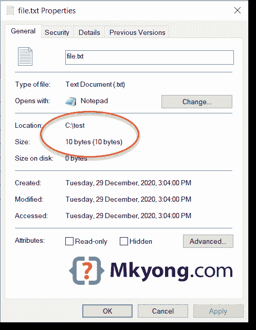

# 如何在 Java 中读取文件–file inputstream

> 原文：<http://web.archive.org/web/20230101150211/https://mkyong.com/java/how-to-read-file-in-java-fileinputstream/>

在 Java 中，我们使用 [FileInputStream](http://web.archive.org/web/20220619003338/https://docs.oracle.com/en/java/javase/11/docs/api/java.base/java/io/FileInputStream.html) 从文件中读取字节，比如图像文件或二进制文件。

主题

1.  [文件输入流–读取文件](#fileinputstream---read-a-file)
2.  [文件输入流–剩余字节](#fileinputstream---remaining-bytes)
3.  [文件输入流–更好的性能](#fileinputstream---better-performance)
4.  [文件输入流 vs 缓冲输入流](#fileinputstream-vs-bufferedinputstream)
5.  [InputStreamReader–将文件输入流转换为阅读器](#convert-fileinputstream-to-reader)
6.  [FileInputStream – Read a Unicode file](#fileinputstream---read-a-unicode-file)

**注意**
然而，下面所有的例子都使用`FileInputStream`从文本文件中读取字节并打印出来。文本文件允许读者正确地“看到”输出。通常，我们使用`Reader`从文本文件中读取字符。

## 1。file inputstream–读取文件

这个例子使用`FileInputStream`从文件中读取字节并打印出内容。`fis.read()`一次读取一个字节，如果到达文件末尾，它将返回一个`-1`。

FileInputStreamExample1.java

```
 package com.mkyong.io.api.inputstream;

import java.io.File;
import java.io.FileInputStream;
import java.io.IOException;

public class FileInputStreamExample1 {

    public static void main(String[] args) {
        readFile("c:\\test\\file.txt");
    }

    private static void readFile(String fileName) {

        try (FileInputStream fis = new FileInputStream(new File(fileName))) {
            int content;
            // reads a byte at a time, if it reached end of the file, returns -1
            while ((content = fis.read()) != -1) {
                System.out.println((char)content);
            }
        } catch (IOException e) {
            e.printStackTrace();
        }

    }

} 
```

## 2。文件输入流–剩余字节

我们可以使用`fis.available()`来检查剩余的可以读取的字节。例如:

下面是一个包含 10 个字节的文本文件。

c:\\test\\file.txt

```
 mkyong.com 
```

FileInputStreamExample2.java

```
 package com.mkyong.io.api.inputstream;

import java.io.File;
import java.io.FileInputStream;
import java.io.IOException;

public class FileInputStreamExample2 {

    public static void main(String[] args) {
        readFile("c:\\test\\file.txt");
    }

    private static void readFile(String fileName) {

        try (FileInputStream fis = new FileInputStream(new File(fileName))) {

            // remaining bytes that can be read
            System.out.println("Remaining bytes that can be read : " + fis.available());

            int content;
            // reads a byte at a time, if end of the file, returns -1
            while ((content = fis.read()) != -1) {
                System.out.println((char) content);

                System.out.println("Remaining bytes that can be read : " + fis.available());
            }
        } catch (IOException e) {
            e.printStackTrace();
        }

    }

} 
```

输出

Terminal

```
 Remaining bytes that can be read : 10
m
Remaining bytes that can be read : 9
k
Remaining bytes that can be read : 8
y
Remaining bytes that can be read : 7
o
Remaining bytes that can be read : 6
n
Remaining bytes that can be read : 5
g
Remaining bytes that can be read : 4
.
Remaining bytes that can be read : 3
c
Remaining bytes that can be read : 2
o
Remaining bytes that can be read : 1
m
Remaining bytes that can be read : 0 
```

对于一个包含 10 个字节的文件，`fis.read()`将运行十次，每次读取一个字节。(看到这里的问题？)

## 3。文件输入流–更好的性能

3.1 查看`FileInputStream#read()`源代码，每个`read()`都会调用`native`方法从磁盘中读取一个字节。

```
 package java.io;

public class FileInputStream extends InputStream {

    /**
     * Reads a byte of data from this input stream. This method blocks
     * if no input is yet available.
     *
     * @return     the next byte of data, or <code>-1</code> if the end of the
     *             file is reached.
     * @exception  IOException  if an I/O error occurs.
     */
    public int read() throws IOException {
        return read0();
    }

    private native int read0() throws IOException;

    //...
} 
```

3.2 我们可以使用`read(byte b[])`将预定义的字节读入一个字节数组；这将显著提高读取性能。

FileInputStreamExample3.java

```
 package com.mkyong.io.api.inputstream;

import java.io.File;
import java.io.FileInputStream;
import java.io.IOException;
import java.nio.charset.StandardCharsets;

public class FileInputStreamExample3 {

    public static void main(String[] args) {
        readFileBetterPerformance("c:\\test\\file.txt");
    }

    private static void readFileBetterPerformance(String fileName) {

        try (FileInputStream fis = new FileInputStream(new File(fileName))) {

            // remaining bytes that can be read
            System.out.println("Remaining bytes that can be read : " + fis.available());

            // 8k a time
            byte[] bytes = new byte[8192];

            // reads 8192 bytes at a time, if end of the file, returns -1
            while (fis.read(bytes) != -1) {

                // convert bytes to string for demo
                System.out.println(new String(bytes, StandardCharsets.UTF_8));

                System.out.println("Remaining bytes that can be read : " + fis.available());
            }
        } catch (IOException e) {
            e.printStackTrace();
        }

    }

} 
```

上面的例子会一次读取`8192`个字节，对于一个包含 10 个字节的文件，只读取一次。

Terminal

```
 Remaining bytes that can be read : 10
mkyong.com
Remaining bytes that can be read : 0 
```

**注意**例如
，如果一个文件包含`81920`个字节(80 kb)，默认`fis.read`将需要一个 81920 本地调用来从文件中读取所有字节；而`fis.read(bytes)`(对于 8192 的大小)，我们只需要 10 个本地调用。差别是巨大的。

## 4。文件输入流 vs 缓冲输入流

`FileInputStream`一次读取一个字节，每个`read()`将从磁盘进行本地读取。对于读取大文件，它会变慢。

`BufferedInputStream`一次读取`8192`个字节(默认),并缓冲它们，直到需要它们为止；`BufferedInputStream#read()`仍然一次返回一个字节，但是其他剩余的字节在缓冲区中，为下一次读取保留。概念类似于上面的[FileInputStreamExample3.java](#fileinputstream---better-performance)

通常的做法是使用`BufferedInputStream`来包装`FileInputStream`以提供缓冲区缓存来提高读取性能。

FileInputStreamExample4.java

```
 package com.mkyong.io.api.inputstream;

import java.io.BufferedInputStream;
import java.io.File;
import java.io.FileInputStream;
import java.io.IOException;

public class FileInputStreamExample4 {

    public static void main(String[] args) {
        readFileBetterPerformance2("c:\\test\\file.txt");
    }

    private static void readFileBetterPerformance2(String fileName) {

        try (BufferedInputStream bis =
                     new BufferedInputStream(
                             new FileInputStream(new File(fileName)))) {

            // remaining bytes that can be read
            System.out.println("Remaining bytes that can be read : " + bis.available());

            int content;
            // reads 8192 bytes at a time and buffers them until they are needed,
            // if end of the file, returns -1
            while ((content = bis.read()) != -1) {

                // convert bytes to string for demo
                System.out.println((char) content);

                System.out.println("Remaining bytes that can be read : " + bis.available());
            }
        } catch (IOException e) {
            e.printStackTrace();
        }

    }

} 
```

输出

Terminal

```
 Remaining bytes that can be read : 10
m
Remaining bytes that can be read : 9
k
Remaining bytes that can be read : 8
y
Remaining bytes that can be read : 7
o
Remaining bytes that can be read : 6
n
Remaining bytes that can be read : 5
g
Remaining bytes that can be read : 4
.
Remaining bytes that can be read : 3
c
Remaining bytes that can be read : 2
o
Remaining bytes that can be read : 1
m
Remaining bytes that can be read : 0 
```

## 5。将文件输入流转换为阅读器

使用`InputStreamReader`将`InputStream`转换为`Reader`也很常见。

这个例子展示了如何将一个`FileInputStream`转换成`BufferedReader`，并逐行读取。

```
 private static void readFileBetterInputStreamReader(String fileName) {

    try (BufferedReader br =
                 new BufferedReader(
                         new InputStreamReader(
                                 new FileInputStream(new File(fileName))))) {

        String line;
        while ((line = br.readLine()) != null) {
            System.out.println(line);
        }

    } catch (IOException e) {
        e.printStackTrace();
    }

} 
```

## 6\. FileInputStream – Read a Unicode file

这个例子使用`FileInputStream`来读取一个 [Unicode](http://web.archive.org/web/20220619003338/https://en.wikipedia.org/wiki/Unicode) 文件。例如:

一种包含几个中文字符的 Unicode 文件，每个 Unicode 编码字符包含两个或多个字节。

c:\\test\\file-unicode.txt

```
 你好
我好
大家好 
```


我们可以使用上面的[例子 3](#fileinputstream---better-performance) 来读取 Unicode 文件并正确打印它们。

FileInputStreamExample3.java

```
 private static void readFileBetterPerformance(String fileName) {

      try (FileInputStream fis = new FileInputStream(new File(fileName))) {

          // remaining bytes that can be read
          System.out.println("Remaining bytes that can be read : " + fis.available());

          // 8k a time
          byte[] bytes = new byte[8192];

          // reads 8192 bytes at a time, if end of the file, returns -1
          while (fis.read(bytes) != -1) {

              // convert bytes to string for demo

              // convert bytes unicode to string
              System.out.println(new String(bytes, StandardCharsets.UTF_8));

              System.out.println("Remaining bytes that can be read : " + fis.available());
          }
      } catch (IOException e) {
          e.printStackTrace();
      }

  } 
```

输出

Terminal

```
 Remaining bytes that can be read : 25
你好
我好
大家好
Remaining bytes that can be read : 0 
```

此外，我们还可以使用[示例 5 InputStreamReader](#convert-fileinputstream-to-reader) 来读取和打印 Unicode 文件，默认情况下`InputStreamReader`有一个默认的 UTF-8 字符集。

## 下载源代码

$ git 克隆[https://github.com/mkyong/core-java](http://web.archive.org/web/20220619003338/https://github.com/mkyong/core-java)

$ cd api/inputstream

## 参考文献

*   [文件输入流 JavaDoc](http://web.archive.org/web/20220619003338/https://docs.oracle.com/en/java/javase/11/docs/api/java.base/java/io/FileInputStream.html)
*   [BufferedInputStream JavaDoc](http://web.archive.org/web/20220619003338/https://docs.oracle.com/en/java/javase/11/docs/api/java.base/java/io/BufferedInputStream.html)
*   [文件输出流–写入文件](/web/20220619003338/https://mkyong.com/java/how-to-write-to-file-in-java-fileoutputstream-example/)
*   [buffered reader–读取文件](/web/20220619003338/https://mkyong.com/java/how-to-read-file-from-java-bufferedreader-example/)
*   [在 Java 中将 InputStream 转换为 buffered reader](/web/20220619003338/https://mkyong.com/java/convert-inputstream-to-bufferedreader-in-java/)
*   [Java–读取 UTF-8 文件](/web/20220619003338/https://mkyong.com/java/how-to-read-utf-8-encoded-data-from-a-file-java/)

<input type="hidden" id="mkyong-current-postId" value="10527">