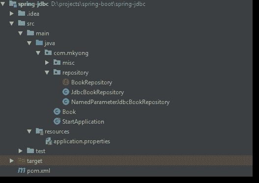

# Spring Boot JDBC 的例子

> 原文：<http://web.archive.org/web/20230101150211/https://mkyong.com/spring-boot/spring-boot-jdbc-examples/>


在本教程中，我们将向您展示如何使用 Spring Boot JDBC `JdbcTemplate`和`NamedParameterJdbcTemplate`。

使用的技术:

*   Spring Boot 2.1.2 .版本
*   春季 JDBC 5.1.4 .发布
*   HikariCP 3.2.0
*   H2 内存数据库 1.4.197
*   maven3
*   Java 8

在 Spring Boot JDBC，数据库相关的 bean 如`DataSource`、`JdbcTemplate`和`NamedParameterJdbcTemplate`将在启动时配置和创建，要使用它，只需`@Autowired`你想要的 bean，例如:

```
 @Autowired
    JdbcTemplate jdbcTemplate;

	@Autowired
    private NamedParameterJdbcTemplate jdbcTemplate; 
```

要连接到数据库(例如 MySQL)，请在项目类路径中包含 JDBC 驱动程序:

pom.xml

```
 <!-- MySQL JDBC driver -->
	<dependency>
		<groupId>mysql</groupId>
		<artifactId>mysql-connector-java</artifactId>
	</dependency> 
```

并在`application.properties`中定义`datasoure`属性

application.properties

```
 ## MySQL
#spring.datasource.url=jdbc:mysql://192.168.1.4:3306/test
#spring.datasource.username=mkyong
#spring.datasource.password=password

# Oracle
#spring.datasource.url=jdbc:oracle:thin:@localhost:1521:orcl
#spring.datasource.username=system
#spring.datasource.password=Password123 
```

**Note**
By default, Spring Boot 2 uses [HikariCP](http://web.archive.org/web/20221206180122/https://docs.spring.io/spring-boot/docs/2.1.3.RELEASE/reference/htmlsingle/#boot-features-connect-to-production-database) as the database connection pool.

## 1.项目目录



## 2.专家

2.1 `spring-boot-starter-jdbc`就是我们需要的。

pom.xml

```
 <?xml version="1.0" encoding="UTF-8"?>
<project 
         xmlns:xsi="http://www.w3.org/2001/XMLSchema-instance"
         xsi:schemaLocation="http://maven.apache.org/POM/4.0.0 
		 http://maven.apache.org/xsd/maven-4.0.0.xsd">
    <modelVersion>4.0.0</modelVersion>

    <artifactId>spring-jdbc</artifactId>
    <packaging>jar</packaging>
    <name>Spring Boot JDBC</name>
    <version>1.0</version>

    <parent>
        <groupId>org.springframework.boot</groupId>
        <artifactId>spring-boot-starter-parent</artifactId>
        <version>2.1.2.RELEASE</version>
    </parent>

    <properties>
        <java.version>1.8</java.version>
        <downloadSources>true</downloadSources>
        <downloadJavadocs>true</downloadJavadocs>
    </properties>

    <dependencies>

        <dependency>
            <groupId>org.springframework.boot</groupId>
            <artifactId>spring-boot-starter-jdbc</artifactId>
        </dependency>

        <!-- MySQL JDBC driver
        <dependency>
            <groupId>mysql</groupId>
            <artifactId>mysql-connector-java</artifactId>
        </dependency>
        -->

        <!-- in-memory database -->
        <dependency>
            <groupId>com.h2database</groupId>
            <artifactId>h2</artifactId>
        </dependency>

    </dependencies>

    <build>
        <plugins>

            <plugin>
                <groupId>org.springframework.boot</groupId>
                <artifactId>spring-boot-maven-plugin</artifactId>
            </plugin>

            <plugin>
                <groupId>org.apache.maven.plugins</groupId>
                <artifactId>maven-surefire-plugin</artifactId>
                <version>2.22.0</version>
            </plugin>

        </plugins>

    </build>
</project> 
```

显示项目依赖关系。

```
 $ mvn dependency:tree

[INFO] org.springframework.boot:spring-jdbc:jar:1.0
[INFO] +- org.springframework.boot:spring-boot-starter-jdbc:jar:2.1.2.RELEASE:compile
[INFO] |  +- org.springframework.boot:spring-boot-starter:jar:2.1.2.RELEASE:compile
[INFO] |  |  +- org.springframework.boot:spring-boot:jar:2.1.2.RELEASE:compile
[INFO] |  |  |  \- org.springframework:spring-context:jar:5.1.4.RELEASE:compile
[INFO] |  |  |     +- org.springframework:spring-aop:jar:5.1.4.RELEASE:compile
[INFO] |  |  |     \- org.springframework:spring-expression:jar:5.1.4.RELEASE:compile
[INFO] |  |  +- org.springframework.boot:spring-boot-autoconfigure:jar:2.1.2.RELEASE:compile
[INFO] |  |  +- org.springframework.boot:spring-boot-starter-logging:jar:2.1.2.RELEASE:compile
[INFO] |  |  |  +- ch.qos.logback:logback-classic:jar:1.2.3:compile
[INFO] |  |  |  |  \- ch.qos.logback:logback-core:jar:1.2.3:compile
[INFO] |  |  |  +- org.apache.logging.log4j:log4j-to-slf4j:jar:2.11.1:compile
[INFO] |  |  |  |  \- org.apache.logging.log4j:log4j-api:jar:2.11.1:compile
[INFO] |  |  |  \- org.slf4j:jul-to-slf4j:jar:1.7.25:compile
[INFO] |  |  +- javax.annotation:javax.annotation-api:jar:1.3.2:compile
[INFO] |  |  +- org.springframework:spring-core:jar:5.1.4.RELEASE:compile
[INFO] |  |  |  \- org.springframework:spring-jcl:jar:5.1.4.RELEASE:compile
[INFO] |  |  \- org.yaml:snakeyaml:jar:1.23:runtime
[INFO] |  +- com.zaxxer:HikariCP:jar:3.2.0:compile
[INFO] |  |  \- org.slf4j:slf4j-api:jar:1.7.25:compile
[INFO] |  \- org.springframework:spring-jdbc:jar:5.1.4.RELEASE:compile
[INFO] |     +- org.springframework:spring-beans:jar:5.1.4.RELEASE:compile
[INFO] |     \- org.springframework:spring-tx:jar:5.1.4.RELEASE:compile
[INFO] +- com.h2database:h2:jar:1.4.197:compile 
```

## 3.图书仓库

存储库的纯 Java 接口，稍后用`JdbcTemplate`和`NamedParameterJdbcTemplate`实现

BookRepository.java

```
 package com.mkyong.repository;

import com.mkyong.Book;

import java.math.BigDecimal;
import java.util.List;
import java.util.Optional;

public interface BookRepository {

    int count();

    int save(Book book);

    int update(Book book);

    int deleteById(Long id);

    List<Book> findAll();

    List<Book> findByNameAndPrice(String name, BigDecimal price);

    Optional<Book> findById(Long id);

    String getNameById(Long id);

} 
```

Book.java

```
 package com.mkyong;

import java.math.BigDecimal;

public class Book {

    private Long id;
    private String name;
    private BigDecimal price;

    //... setters getters constructors...
} 
```

## 4.JDBC 模板

4.1 一些积垢示例:

JdbcBookRepository.java

```
 package com.mkyong.repository;

import com.mkyong.Book;
import org.springframework.beans.factory.annotation.Autowired;
import org.springframework.jdbc.core.JdbcTemplate;
import org.springframework.jdbc.core.namedparam.NamedParameterJdbcTemplate;
import org.springframework.stereotype.Repository;

import java.math.BigDecimal;
import java.util.List;
import java.util.Optional;

@Repository
public class JdbcBookRepository implements BookRepository {

	// Spring Boot will create and configure DataSource and JdbcTemplate
	// To use it, just @Autowired
    @Autowired
    private JdbcTemplate jdbcTemplate;

    @Override
    public int count() {
        return jdbcTemplate
                .queryForObject("select count(*) from books", Integer.class);
    }

    @Override
    public int save(Book book) {
        return jdbcTemplate.update(
                "insert into books (name, price) values(?,?)",
                book.getName(), book.getPrice());
    }

    @Override
    public int update(Book book) {
        return jdbcTemplate.update(
                "update books set price = ? where id = ?",
                book.getPrice(), book.getId());
    }

    @Override
    public int deleteById(Long id) {
        return jdbcTemplate.update(
                "delete books where id = ?",
                id);
    }

    @Override
    public List<Book> findAll() {
        return jdbcTemplate.query(
                "select * from books",
                (rs, rowNum) ->
                        new Book(
                                rs.getLong("id"),
                                rs.getString("name"),
                                rs.getBigDecimal("price")
                        )
        );
    }

    // jdbcTemplate.queryForObject, populates a single object
    @Override
    public Optional<Book> findById(Long id) {
        return jdbcTemplate.queryForObject(
                "select * from books where id = ?",
                new Object[]{id},
                (rs, rowNum) ->
                        Optional.of(new Book(
                                rs.getLong("id"),
                                rs.getString("name"),
                                rs.getBigDecimal("price")
                        ))
        );
    }

    @Override
    public List<Book> findByNameAndPrice(String name, BigDecimal price) {
        return jdbcTemplate.query(
                "select * from books where name like ? and price <= ?",
                new Object[]{"%" + name + "%", price},
                (rs, rowNum) ->
                        new Book(
                                rs.getLong("id"),
                                rs.getString("name"),
                                rs.getBigDecimal("price")
                        )
        );
    }

    @Override
    public String getNameById(Long id) {
        return jdbcTemplate.queryForObject(
                "select name from books where id = ?",
                new Object[]{id},
                String.class
        );
    }

} 
```

## 5.NamedParameterJdbcTemplate

5.1`NamedParameterJdbcTemplate`在经典占位符`?`参数的 steads 中增加了对命名参数的支持。

NamedParameterJdbcBookRepository.java

```
 package com.mkyong.repository;

import com.mkyong.Book;
import org.springframework.beans.factory.annotation.Autowired;
import org.springframework.jdbc.core.namedparam.BeanPropertySqlParameterSource;
import org.springframework.jdbc.core.namedparam.MapSqlParameterSource;
import org.springframework.jdbc.core.namedparam.NamedParameterJdbcTemplate;
import org.springframework.stereotype.Repository;

import java.math.BigDecimal;
import java.util.List;
import java.util.Optional;

@Repository
public class NamedParameterJdbcBookRepository extends JdbcBookRepository {

    @Autowired
    private NamedParameterJdbcTemplate namedParameterJdbcTemplate;

    @Override
    public int update(Book book) {
        return namedParameterJdbcTemplate.update(
                "update books set price = :price where id = :id",
                new BeanPropertySqlParameterSource(book));
    }

    @Override
    public Optional<Book> findById(Long id) {
        return namedParameterJdbcTemplate.queryForObject(
                "select * from books where id = :id",
                new MapSqlParameterSource("id", id),
                (rs, rowNum) ->
                        Optional.of(new Book(
                                rs.getLong("id"),
                                rs.getString("name"),
                                rs.getBigDecimal("price")
                        ))
        );
    }

    @Override
    public List<Book> findByNameAndPrice(String name, BigDecimal price) {

        MapSqlParameterSource mapSqlParameterSource = new MapSqlParameterSource();
        mapSqlParameterSource.addValue("name", "%" + name + "%");
        mapSqlParameterSource.addValue("price", price);

        return namedParameterJdbcTemplate.query(
                "select * from books where name like :name and price <= :price",
                mapSqlParameterSource,
                (rs, rowNum) ->
                        new Book(
                                rs.getLong("id"),
                                rs.getString("name"),
                                rs.getBigDecimal("price")
                        )
        );
    }

} 
```

## 6.应用程序.属性

6.1 对于内存数据库，没有什么需要配置的，如果我们想连接一个真实的数据库，定义一个`datasource.url`属性:

application.properties

```
 logging.level.org.springframework=info
#logging.level.org.springframework.jdbc=DEBUG
logging.level.com.mkyong=INFO
logging.level.com.zaxxer=DEBUG
logging.level.root=ERROR

spring.datasource.hikari.connectionTimeout=20000
spring.datasource.hikari.maximumPoolSize=5

logging.pattern.console=%-5level %logger{36} - %msg%n

## MySQL
#spring.datasource.url=jdbc:mysql://192.168.1.4:3306/test
#spring.datasource.username=mkyong
#spring.datasource.password=password

# Oracle
#spring.datasource.url=jdbc:oracle:thin:@localhost:1521:orcl
#spring.datasource.username=system
#spring.datasource.password=Password123 
```

## 7.开始 Spring Boot

7.1 启动 Spring Boot 应用程序，测试 CRUD。

StartApplication.java

```
 package com.mkyong;

import com.mkyong.repository.BookRepository;
import org.slf4j.Logger;
import org.slf4j.LoggerFactory;
import org.springframework.beans.factory.annotation.Autowired;
import org.springframework.beans.factory.annotation.Qualifier;
import org.springframework.boot.CommandLineRunner;
import org.springframework.boot.SpringApplication;
import org.springframework.boot.autoconfigure.SpringBootApplication;
import org.springframework.jdbc.core.JdbcTemplate;

import java.math.BigDecimal;
import java.util.Arrays;
import java.util.List;

@SpringBootApplication
public class StartApplication implements CommandLineRunner {

    private static final Logger log = LoggerFactory.getLogger(StartApplication.class);

    @Autowired
    JdbcTemplate jdbcTemplate;

    @Autowired
    //@Qualifier("jdbcBookRepository")              // Test JdbcTemplate
    @Qualifier("namedParameterJdbcBookRepository")  // Test NamedParameterJdbcTemplate
    private BookRepository bookRepository;

    public static void main(String[] args) {
        SpringApplication.run(StartApplication.class, args);
    }

    @Override
    public void run(String... args) {
        log.info("StartApplication...");
        runJDBC();
    }

    void runJDBC() {

        log.info("Creating tables for testing...");

        jdbcTemplate.execute("DROP TABLE books IF EXISTS");
        jdbcTemplate.execute("CREATE TABLE books(" +
                "id SERIAL, name VARCHAR(255), price NUMERIC(15, 2))");

        List<Book> books = Arrays.asList(
                new Book("Thinking in Java", new BigDecimal("46.32")),
                new Book("Mkyong in Java", new BigDecimal("1.99")),
                new Book("Getting Clojure", new BigDecimal("37.3")),
                new Book("Head First Android Development", new BigDecimal("41.19"))
        );

        log.info("[SAVE]");
        books.forEach(book -> {
            log.info("Saving...{}", book.getName());
            bookRepository.save(book);
        });

        // count
        log.info("[COUNT] Total books: {}", bookRepository.count());

        // find all
        log.info("[FIND_ALL] {}", bookRepository.findAll());

        // find by id
        log.info("[FIND_BY_ID] :2L");
        Book book = bookRepository.findById(2L).orElseThrow(IllegalArgumentException::new);
        log.info("{}", book);

        // find by name (like) and price
        log.info("[FIND_BY_NAME_AND_PRICE] : like '%Java%' and price <= 10");
        log.info("{}", bookRepository.findByNameAndPrice("Java", new BigDecimal(10)));

        // get name (string) by id
        log.info("[GET_NAME_BY_ID] :1L = {}", bookRepository.getNameById(1L));

        // update
        log.info("[UPDATE] :2L :99.99");
        book.setPrice(new BigDecimal("99.99"));
        log.info("rows affected: {}", bookRepository.update(book));

        // delete
        log.info("[DELETE] :3L");
        log.info("rows affected: {}", bookRepository.deleteById(3L));

        // find all
        log.info("[FIND_ALL] {}", bookRepository.findAll());

    }

} 
```

## 8.演示

```
 $ mvn spring-boot:run

INFO  com.mkyong.StartApplication - Started StartApplication in 1.051 seconds (JVM running for 1.3)
INFO  com.mkyong.StartApplication - StartApplication...
INFO  com.mkyong.StartApplication - Creating tables for testing...
DEBUG com.zaxxer.hikari.HikariConfig - HikariPool-1 - configuration:
DEBUG com.zaxxer.hikari.HikariConfig - allowPoolSuspension.............false
DEBUG com.zaxxer.hikari.HikariConfig - autoCommit......................true
DEBUG com.zaxxer.hikari.HikariConfig - catalog.........................none
DEBUG com.zaxxer.hikari.HikariConfig - connectionInitSql...............none
DEBUG com.zaxxer.hikari.HikariConfig - connectionTestQuery.............none
DEBUG com.zaxxer.hikari.HikariConfig - connectionTimeout...............20000
DEBUG com.zaxxer.hikari.HikariConfig - dataSource......................none
DEBUG com.zaxxer.hikari.HikariConfig - dataSourceClassName.............none
DEBUG com.zaxxer.hikari.HikariConfig - dataSourceJNDI..................none
DEBUG com.zaxxer.hikari.HikariConfig - dataSourceProperties............{password=<masked>}
DEBUG com.zaxxer.hikari.HikariConfig - driverClassName................."org.h2.Driver"
DEBUG com.zaxxer.hikari.HikariConfig - healthCheckProperties...........{}
DEBUG com.zaxxer.hikari.HikariConfig - healthCheckRegistry.............none
DEBUG com.zaxxer.hikari.HikariConfig - idleTimeout.....................600000
DEBUG com.zaxxer.hikari.HikariConfig - initializationFailTimeout.......1
DEBUG com.zaxxer.hikari.HikariConfig - isolateInternalQueries..........false
DEBUG com.zaxxer.hikari.HikariConfig - jdbcUrl.........................jdbc:h2:mem:testdb;DB_CLOSE_DELAY=-1;DB_CLOSE_ON_EXIT=FALSE
DEBUG com.zaxxer.hikari.HikariConfig - leakDetectionThreshold..........0
DEBUG com.zaxxer.hikari.HikariConfig - maxLifetime.....................1800000
DEBUG com.zaxxer.hikari.HikariConfig - maximumPoolSize.................5
DEBUG com.zaxxer.hikari.HikariConfig - metricRegistry..................none
DEBUG com.zaxxer.hikari.HikariConfig - metricsTrackerFactory...........none
DEBUG com.zaxxer.hikari.HikariConfig - minimumIdle.....................5
DEBUG com.zaxxer.hikari.HikariConfig - password........................<masked>
DEBUG com.zaxxer.hikari.HikariConfig - poolName........................"HikariPool-1"
DEBUG com.zaxxer.hikari.HikariConfig - readOnly........................false
DEBUG com.zaxxer.hikari.HikariConfig - registerMbeans..................false
DEBUG com.zaxxer.hikari.HikariConfig - scheduledExecutor...............none
DEBUG com.zaxxer.hikari.HikariConfig - schema..........................none
DEBUG com.zaxxer.hikari.HikariConfig - threadFactory...................internal
DEBUG com.zaxxer.hikari.HikariConfig - transactionIsolation............default
DEBUG com.zaxxer.hikari.HikariConfig - username........................"sa"
DEBUG com.zaxxer.hikari.HikariConfig - validationTimeout...............5000
INFO  com.zaxxer.hikari.HikariDataSource - HikariPool-1 - Starting...
DEBUG com.zaxxer.hikari.pool.HikariPool - HikariPool-1 - Added connection conn0: url=jdbc:h2:mem:testdb user=SA
INFO  com.zaxxer.hikari.HikariDataSource - HikariPool-1 - Start completed.

INFO  com.mkyong.StartApplication - [SAVE]
INFO  com.mkyong.StartApplication - Saving...Thinking in Java
INFO  com.mkyong.StartApplication - Saving...Mkyong in Java
INFO  com.mkyong.StartApplication - Saving...Getting Clojure
INFO  com.mkyong.StartApplication - Saving...Head First Android Development

INFO  com.mkyong.StartApplication - [COUNT] Total books: 4

INFO  com.mkyong.StartApplication - [FIND_ALL] 
[Book{id=1, name='Thinking in Java', price=46.32}, 
Book{id=2, name='Mkyong in Java', price=1.99}, 
Book{id=3, name='Getting Clojure', price=37.30}, 
Book{id=4, name='Head First Android Development', price=41.19}]

INFO  com.mkyong.StartApplication - [FIND_BY_ID] :2L
INFO  com.mkyong.StartApplication - Book{id=2, name='Mkyong in Java', price=1.99}

INFO  com.mkyong.StartApplication - [FIND_BY_NAME_AND_PRICE] : like '%Java%' and price <= 10
INFO  com.mkyong.StartApplication - [Book{id=2, name='Mkyong in Java', price=1.99}]

INFO  com.mkyong.StartApplication - [GET_NAME_BY_ID] :1L = Thinking in Java

INFO  com.mkyong.StartApplication - [UPDATE] :2L :99.99
INFO  com.mkyong.StartApplication - rows affected: 1

INFO  com.mkyong.StartApplication - [DELETE] :3L
INFO  com.mkyong.StartApplication - rows affected: 1

INFO  com.mkyong.StartApplication - [FIND_ALL] 
[Book{id=1, name='Thinking in Java', price=46.32},
Book{id=2, name='Mkyong in Java', price=99.99}, 
Book{id=4, name='Head First Android Development', price=41.19}]

INFO  com.zaxxer.hikari.HikariDataSource - HikariPool-1 - Shutdown initiated...
DEBUG com.zaxxer.hikari.pool.HikariPool - HikariPool-1 - Before shutdown stats (total=1, active=0, idle=1, waiting=0)
DEBUG com.zaxxer.hikari.pool.PoolBase - HikariPool-1 - Closing connection conn0: url=jdbc:h2:mem:testdb user=SA: (connection evicted)
DEBUG com.zaxxer.hikari.pool.HikariPool - HikariPool-1 - After shutdown stats (total=0, active=0, idle=0, waiting=0)
INFO  com.zaxxer.hikari.HikariDataSource - HikariPool-1 - Shutdown completed. 
```

## 下载源代码

$ git clone [https://github.com/mkyong/spring-boot.git](http://web.archive.org/web/20221206180122/https://github.com/mkyong/spring-boot.git)
$ cd spring-jdbc
$ mvn spring-boot:run

## 参考

*   [JDBC 可调用语句-存储过程输出参数示例](http://web.archive.org/web/20221206180122/https://www.mkyong.com/jdbc/jdbc-callablestatement-stored-procedure-out-parameter-example/)
*   [春季 JDBC 文档](http://web.archive.org/web/20221206180122/https://docs.spring.io/spring/docs/current/spring-framework-reference/data-access.html#jdbc)
*   [使用 SQL 数据库](http://web.archive.org/web/20221206180122/https://docs.spring.io/spring-boot/docs/2.1.3.RELEASE/reference/htmlsingle/#boot-features-sql)
*   [常用应用属性](http://web.archive.org/web/20221206180122/https://docs.spring.io/spring-boot/docs/current/reference/html/common-application-properties.html)
*   [Spring Boot+Spring Data JPA+Oracle 示例](http://web.archive.org/web/20221206180122/https://www.mkyong.com/spring-boot/spring-boot-spring-data-jpa-oracle-example/)
*   [鼠标指针](http://web.archive.org/web/20221206180122/https://github.com/brettwooldridge/HikariCP)
*   [Java JDBC 教程](/web/20221206180122/https://mkyong.com/tutorials/jdbc-tutorials/)

<input type="hidden" id="mkyong-current-postId" value="15147">