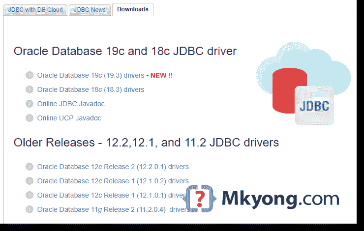

# 如何在您的 Maven 本地存储库中添加 Oracle JDBC 驱动程序

> 原文：<http://web.archive.org/web/20230101150211/https://mkyong.com/maven/how-to-add-oracle-jdbc-driver-in-your-maven-local-repository/>

这里有一个简单的指南，向您展示如何将 Oracle JDBC 驱动程序添加到您的 Maven 本地存储库中，以及如何在`pom.xml`中引用它

*使用 Oracle 数据库 19c 和 Java 8 进行测试*

**Note**
Due to Oracle license restrictions, the Oracle JDBC driver is not available in the public Maven repository. To use the Oracle JDBC driver with Maven, you have to download and install it into your Maven local repository manually.

## 1.获取 Oracle JDBC 驱动程序

**Note**
Read this [What are the Oracle JDBC releases Vs JDK versions?](http://web.archive.org/web/20221023054402/https://www.oracle.com/technetwork/database/enterprise-edition/jdbc-faq-090281.html#01_01)

访问 [Oracle 数据库网站](http://web.archive.org/web/20221023054402/https://www.oracle.com/technetwork/database/application-development/jdbc/downloads/index.html)并下载。



在本例中，我们为 Java 8 项目选择了 Oracle 数据库 19c 和`ojdbc8.jar`。

**Note**
Alternatively, you can get the Oracle JDBC driver from the Oracle database installed folder, for example: `{ORACLE_HOME}\jdbc\lib\ojdbc8.jar`

## 2.Maven 安装 ojdbc8.jar

2.1 将下载的`ojdbc.jar`上传或安装到 Maven 本地库。

ojdbc8.jar

```
 $ mvn install:install-file -Dfile=path/to/your/ojdbc8.jar -DgroupId=com.oracle 
	-DartifactId=ojdbc8 -Dversion=19.3 -Dpackaging=jar 
```

对于旧版本。

ojdbc7.jar

```
 $ mvn install:install-file -Dfile=path/to/your/ojdbc7.jar -DgroupId=com.oracle 
	-DartifactId=ojdbc7 -Dversion=12.2.0.1 -Dpackaging=jar 
```

ojdbc6.jar

```
 $ mvn install:install-file -Dfile=path/to/your/ojdbc6.jar -DgroupId=com.oracle 
	-DartifactId=ojdbc6 -Dversion=11.2.0.4 -Dpackaging=jar 
```

**Note**
The `-Dversion=` is depends on your database version, in this example, we are using Oracle database 19c, so put `-Dversion=19.3`

2.2 安装一个`ojdbc8.jar`的完整示例

Terminal

```
 C:\> mvn install:install-file -Dfile=d:/projects/ojdbc8.jar -DgroupId=com.oracle -DartifactId=ojdbc8 -Dversion=19.3 -Dpackaging=jar
[INFO] Scanning for projects...
[INFO]
[INFO] ------------------< org.apache.maven:standalone-pom >-------------------
[INFO] Building Maven Stub Project (No POM) 1
[INFO] --------------------------------[ pom ]---------------------------------
[INFO]
[INFO] --- maven-install-plugin:2.4:install-file (default-cli) @ standalone-pom ---
[INFO] Installing d:\projects\ojdbc8.jar to C:\Users\mkyong\.m2\repository\com\oracle\ojdbc8\19.3\ojdbc8-19.3.jar
[INFO] Installing C:\Users\mkyong\AppData\Local\Temp\mvninstall14285592711568231406.pom 
		to C:\Users\mkyong\.m2\repository\com\oracle\ojdbc8\19.3\ojdbc8-19.3.pom
[INFO] ------------------------------------------------------------------------
[INFO] BUILD SUCCESS
[INFO] ------------------------------------------------------------------------
[INFO] Total time:  0.872 s
[INFO] Finished at: 2019-06-20T12:36:18+08:00
[INFO] ------------------------------------------------------------------------ 
```

## 3.pom.xml

现在，我们可以这样定义 Oracle JDBC 驱动程序依赖关系:

pom.xml

```
 <dependency>
		<groupId>com.oracle</groupId>
		<artifactId>ojdbc8</artifactId>
		<version>19.3</version>
	</dependency> 
```

对于旧版本:

pom.xml

```
 <!-- ojdbc7.jar -->
	<dependency>
		<groupId>com.oracle</groupId>
		<artifactId>ojdbc7</artifactId>
		<version>12.2.0.1</version>
	</dependency>

	<!-- ojdbc6.jar -->
	<dependency>
		<groupId>com.oracle</groupId>
		<artifactId>ojdbc6</artifactId>
		<version>11.2.0.4</version>
	</dependency> 
```

## 4.系统路径

或者，我们可以下载`.jar`并告诉项目在系统路径中找到`.jar`，如下所示:

pom.xml

```
 <dependency>
		<groupId>com.oracle</groupId>
		<artifactId>ojdbc</artifactId>
		<version>8</version>
		<scope>system</scope>
		<systemPath>d:/projects/ojdbc8.jar</systemPath>
	</dependency> 
```

pom.xml

```
 <dependency>
		<groupId>com.oracle</groupId>
		<artifactId>ojdbc</artifactId>
		<version>8</version>
		<scope>system</scope>
		<systemPath>${project.basedir}/lib/ojdbc8.jar</systemPath>
	</dependency> 
```

## 下载源代码

$ git clone [https://github.com/mkyong/java-jdbc.git](http://web.archive.org/web/20221023054402/https://github.com/mkyong/java-jdbc.git)

## 参考

*   Oracle 常见问题解答–支持哪个版本的 JDBC 驱动程序？
*   [从 Oracle Maven 仓库获取 Oracle JDBC 驱动程序和 UCP](http://web.archive.org/web/20221023054402/https://blogs.oracle.com/dev2dev/get-oracle-jdbc-drivers-and-ucp-from-oracle-maven-repository-without-ides)
*   Oracle JDBC 版本与 JDK 版本相比有哪些？
*   [如何将自定义库纳入 maven 本地库？](http://web.archive.org/web/20221023054402/https://www.mkyong.com/maven/how-to-include-library-manully-into-maven-local-repository/)

<input type="hidden" id="mkyong-current-postId" value="8584">