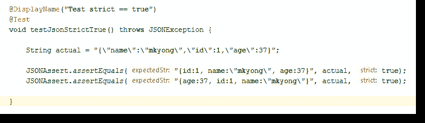

# JSONAssert——如何对 JSON 数据进行单元测试

> 原文：<http://web.archive.org/web/20230101150211/https://www.mkyong.com/java/jsonassert-how-to-unit-test-json-data/>



在 Java 中，我们可以使用`JSONAssert`轻松地对 JSON 数据进行单元测试。

## 1.专家

pom.xml

```java
 <dependency>
		<groupId>org.skyscreamer</groupId>
		<artifactId>jsonassert</artifactId>
		<version>1.5.0</version>
	</dependency> 
```

## 2.JSON 对象

为了测试 JSON 对象，无论严格与否，字段顺序都无关紧要。如果扩展字段很重要，则启用严格模式。

2.1 当`strictMode`关闭时。

```java
 JSONObject actual = new JSONObject();
	actual.put("id", 1);
	actual.put("name", "mkyong");
	actual.put("age", 37);

	JSONAssert.assertEquals("{id:1}", actual, false); 					//Pass, extended fields doesn't matter
	JSONAssert.assertEquals("{name:\"mkyong\"}", actual, false);		//Pass
	JSONAssert.assertEquals("{name:\"mkyong\", age:37}", actual, false);//Pass
	JSONAssert.assertEquals("{name:mkyong, id:1}", actual, false);		//Pass
	JSONAssert.assertEquals("{id:1, age:37}", actual, false);			//Pass 
```

2.2 当`strictMode`开启时。

```java
 String actual = "{\"name\":\"mkyong\",\"id\":1,\"age\":37}";

	JSONAssert.assertEquals("{id:1, name:\"mkyong\", age:37}", actual, true); //Pass, fields order doesn't matter
	JSONAssert.assertEquals("{age:37, id:1, name:\"mkyong\"}", actual, true); //Pass

	JSONAssert.assertEquals("{name:\"mkyong\"}", actual, true); 		// Fail, extended fields must match
	JSONAssert.assertEquals("{name:\"mkyong\", age:37}", actual, true); // Fail, extended fields must match 
```

## 3.JSON 数组

为了测试 JSON 数组，无论严格与否，扩展字段必须匹配。如果字段顺序很重要，则启用严格模式。

3.1 当`strictMode`关闭时。

```java
 String result = "[1,2,3,4,5]";

	JSONAssert.assertEquals("[1,2,3,4,5]", result, false); // Pass
	JSONAssert.assertEquals("[5,3,2,1,4]", result, false); // Pass, fields order doesn't matter
	JSONAssert.assertEquals("[1,2,3,4]", result, false);   // Fail, extended fields must match 
```

3.2 当`strictMode`开启时。

```java
 String result = "[1,2,3,4,5]";

	JSONAssert.assertEquals("[1,2,3,4,5]", result, true); // Pass
	JSONAssert.assertEquals("[5,3,2,1,4]", result, true); // Fail, fields order must match.
	JSONAssert.assertEquals("[1,2,3,4]", result, true);   // Fail, extended fields must match 
```

## 4.Spring Boot + JSONAssert

4.1 对于 Spring Boot，`JSONAssert`捆绑在`spring-boot-starter-test`中

```java
 +- org.springframework.boot:spring-boot-starter-test:jar:2.1.2.RELEASE:test
[INFO] |  +- org.springframework.boot:spring-boot-test:jar:2.1.2.RELEASE:test
[INFO] |  +- org.springframework.boot:spring-boot-test-autoconfigure:jar:2.1.2.RELEASE:test
[INFO] |  +- com.jayway.jsonpath:json-path:jar:2.4.0:test
[INFO] |  |  \- net.minidev:json-smart:jar:2.3:test
[INFO] |  |     \- net.minidev:accessors-smart:jar:1.2:test
[INFO] |  |        \- org.ow2.asm:asm:jar:5.0.4:test
[INFO] |  +- junit:junit:jar:4.12:test
[INFO] |  +- org.assertj:assertj-core:jar:3.11.1:test
[INFO] |  +- org.mockito:mockito-core:jar:2.23.4:test
[INFO] |  |  +- net.bytebuddy:byte-buddy-agent:jar:1.9.7:test
[INFO] |  |  \- org.objenesis:objenesis:jar:2.6:test
[INFO] |  +- org.hamcrest:hamcrest-core:jar:1.3:test
[INFO] |  +- org.hamcrest:hamcrest-library:jar:1.3:test
[INFO] |  +- org.skyscreamer:jsonassert:jar:1.5.0:test     <<-------- JSONAssert
[INFO] |  |  \- com.vaadin.external.google:android-json:jar:0.0.20131108.vaadin1:test
[INFO] |  \- org.xmlunit:xmlunit-core:jar:2.6.2:test 
```

4.2 用`JSONAssert`进行简单的弹簧靴集成测试

```java
 package com.mkyong;

import org.json.JSONException;
import org.junit.Test;
import org.junit.runner.RunWith;
import org.skyscreamer.jsonassert.JSONAssert;
import org.springframework.beans.factory.annotation.Autowired;
import org.springframework.boot.test.context.SpringBootTest;
import org.springframework.boot.test.mock.mockito.MockBean;
import org.springframework.boot.test.web.client.TestRestTemplate;
import org.springframework.http.*;
import org.springframework.test.context.ActiveProfiles;
import org.springframework.test.context.junit4.SpringRunner;

import static org.junit.Assert.assertEquals;
import static org.mockito.ArgumentMatchers.any;
import static org.mockito.Mockito.times;
import static org.mockito.Mockito.verify;

@RunWith(SpringRunner.class)
@SpringBootTest(webEnvironment = SpringBootTest.WebEnvironment.RANDOM_PORT) // for restTemplate
@ActiveProfiles("test")
public class BookControllerRestTemplateTest {

    private static final ObjectMapper om = new ObjectMapper();

    @Autowired
    private TestRestTemplate restTemplate;

    @MockBean
    private BookRepository mockRepository;

    /*
        {
            "timestamp":"2019-03-05T09:34:13.207+0000",
            "status":400,
            "errors":["Author is not allowed."]
        }
     */
    @Test
    public void save_invalidAuthor_400() throws JSONException {

        String bookInJson = "{\"name\":\" Spring REST tutorials\", \"author\":\"abc\",\"price\":\"9.99\"}";

        HttpHeaders headers = new HttpHeaders();
        headers.setContentType(MediaType.APPLICATION_JSON);
        HttpEntity<String> entity = new HttpEntity<>(bookInJson, headers);

        //Try exchange
        ResponseEntity<String> response = restTemplate.exchange("/books", HttpMethod.POST, entity, String.class);

        String expectedJson = "{\"status\":400,\"errors\":[\"Author is not allowed.\"]}";
        assertEquals(HttpStatus.BAD_REQUEST, response.getStatusCode());
        JSONAssert.assertEquals(expectedJson, response.getBody(), false);

        verify(mockRepository, times(0)).save(any(Book.class));

    }

} 
```

用 Spring Boot 2 号进行了测试

## 参考

*   JSONassert
*   [Jackson 2–将 Java 对象转换成 JSON 从 JSON 转换过来](http://web.archive.org/web/20210814120549/https://www.mkyong.com/java/jackson-2-convert-java-object-to-from-json/)
*   [弹簧支架集成测试示例](/web/20210814120549/https://mkyong.com/spring-boot/spring-rest-integration-test-example/)

Tags : [json](http://web.archive.org/web/20210814120549/https://mkyong.com/tag/json/) [spring test](http://web.archive.org/web/20210814120549/https://mkyong.com/tag/spring-test/) [unit test](http://web.archive.org/web/20210814120549/https://mkyong.com/tag/unit-test/)<input type="hidden" id="mkyong-current-postId" value="14934">