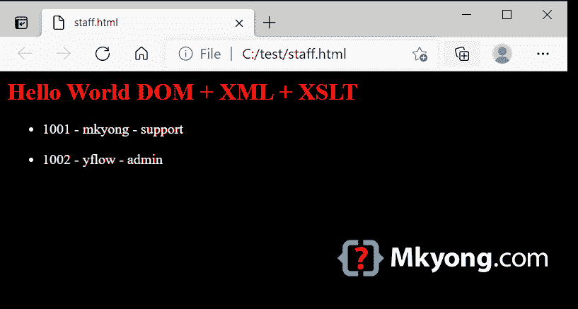

# Java DOM 解析器 XML 和 XSLT 示例

> 原文：<http://web.archive.org/web/20230101150211/https://mkyong.com/java/java-dom-parser-xml-and-xslt-examples/>

使用 [XSLT](http://web.archive.org/web/20220626054141/https://en.wikipedia.org/wiki/XSLT) (可扩展样式表语言转换)，我们可以将 XML 文档转换成其他格式，比如 HTML。

目录

*   [1。DOM 解析器和转换器](#dom-parser-and-transformer)
*   [2。DOM 示例:XML + XSLT = HTML 格式](#dom-example-xml-xslt-html-format)
*   [3。下载源代码](#download-source-code)
*   [4。参考文献](#references)

*PS 用 Java 11 测试过*

## 1。DOM 解析器和转换器

我们可以使用`TransformerFactory`来应用`XSLT`文件，将 XML 文件转换成另一种格式。

```
 TransformerFactory transformerFactory = TransformerFactory.newInstance();

  // add XSLT in Transformer
  Transformer transformer = transformerFactory.newTransformer(
          new StreamSource(new File("format.xslt")));

  transformer.transform(new DOMSource(doc), new StreamResult(output)); 
```

## 2。DOM 示例:XML + XSLT = HTML 格式

下面是一个 Java DOM 解析器示例，用于解析 XML 文件，应用 XSLT 文件并将 XML 文件转换为 HTML 文件。

2.1 一个 XML 文件。

staff-simple.xml

```
 <?xml version="1.0" encoding="utf-8"?>
<company>
    <staff id="1001">
        <name>mkyong</name>
        <role>support</role>
    </staff>
    <staff id="1002">
        <name>yflow</name>
        <role>admin</role>
    </staff>
</company> 
```

2.2 应用下面的 XSLT 文件会将 XML 文件转换成 HTML 格式。

staff-xml-html.xslt

```
 <?xml version="1.0" encoding="UTF-8"?>
<html xsl:version="1.0" xmlns:xsl="http://www.w3.org/1999/XSL/Transform">
    <body style="font-size:12pt;background-color:#EEEEEE">
        <h1 style="font-size:20pt;color:#FF0000">Hello World DOM + XML + XSLT</h1>
        <xsl:for-each select="company/staff">
            <ul>
                <li>
                    <xsl:value-of select="@id"/> -
                    <xsl:value-of select="name"/> -
                    <xsl:value-of select="role"/>
                </li>
            </ul>
        </xsl:for-each>
    </body>
</html> 
```

2.3 输出，一个 HTML 文件。

```
 <html>
  <body style="font-size:12pt;background-color:#EEEEEE">
      <h1 style="font-size:20pt;color:#FF0000">Hello World DOM + XML + XSLT</h1>
      <ul>
          <li>1001 -
                  mkyong -
                  support</li>
      </ul>
      <ul>
          <li>1002 -
                  yflow -
                  admin</li>
      </ul>
  </body>
</html> 
```

2.4 下面是做 XSLT 转换的 Java DOM 解析器。

XsltXmlToHtmlDomParser.java

```
 package com.mkyong.xml.dom;

import org.w3c.dom.Document;
import org.xml.sax.SAXException;

import javax.xml.parsers.DocumentBuilder;
import javax.xml.parsers.DocumentBuilderFactory;
import javax.xml.parsers.ParserConfigurationException;
import javax.xml.transform.Transformer;
import javax.xml.transform.TransformerException;
import javax.xml.transform.TransformerFactory;
import javax.xml.transform.dom.DOMSource;
import javax.xml.transform.stream.StreamResult;
import javax.xml.transform.stream.StreamSource;
import java.io.*;

// XML -> XSLT -> Other formats
public class XsltXmlToHtmlDomParser{

    private static final String XML_FILENAME
                          = "src/main/resources/staff-simple.xml";
    private static final String XSLT_FILENAME
                          = "src/main/resources/xslt/staff-xml-html.xslt";

    public static void main(String[] args) {

        DocumentBuilderFactory dbf = DocumentBuilderFactory.newInstance();

        try (InputStream is = new FileInputStream(XML_FILENAME)) {

            DocumentBuilder db = dbf.newDocumentBuilder();

            Document doc = db.parse(is);

            // transform xml to html via a xslt file
            try (FileOutputStream output =
                         new FileOutputStream("c:\\test\\staff.html")) {
                transform(doc, output);
            }

        } catch (IOException | ParserConfigurationException |
            SAXException | TransformerException e) {
            e.printStackTrace();
        }

    }

    private static void transform(Document doc, OutputStream output)
            throws TransformerException {

        TransformerFactory transformerFactory = TransformerFactory.newInstance();

        // add XSLT in Transformer
        Transformer transformer = transformerFactory.newTransformer(
                new StreamSource(new File(XSLT_FILENAME)));

        transformer.transform(new DOMSource(doc), new StreamResult(output));

    }

} 
```

输出-`c:\\test\\staff.html`



## 3。下载源代码

$ git 克隆[https://github.com/mkyong/core-java](http://web.archive.org/web/20220626054141/https://github.com/mkyong/core-java)

$ cd java-xml

$ CD src/main/Java/com/mkyong/XML/DOM/XSLT/

## 4。参考文献

*   [维基百科–文档对象模型](http://web.archive.org/web/20220626054141/https://en.wikipedia.org/wiki/Document_Object_Model)
*   [XML 和 XSLT](http://web.archive.org/web/20220626054141/https://www.w3schools.com/xml/xml_xslt.asp)
*   [维基百科–XSLT](http://web.archive.org/web/20220626054141/https://en.wikipedia.org/wiki/XSLT)
*   [Oracle–文档对象模型](http://web.archive.org/web/20220626054141/https://docs.oracle.com/javase/tutorial/jaxp/dom/index.html)
*   [如何在 Java 中读取 XML 文件—(DOM 解析器)](http://web.archive.org/web/20220626054141/https://mkyong.com/java/how-to-read-xml-file-in-java-dom-parser/)
*   [如何用 Java 编写 XML 文件—(DOM 解析器)](http://web.archive.org/web/20220626054141/https://mkyong.com/java/how-to-create-xml-file-in-java-dom/)

<input type="hidden" id="mkyong-current-postId" value="16769">