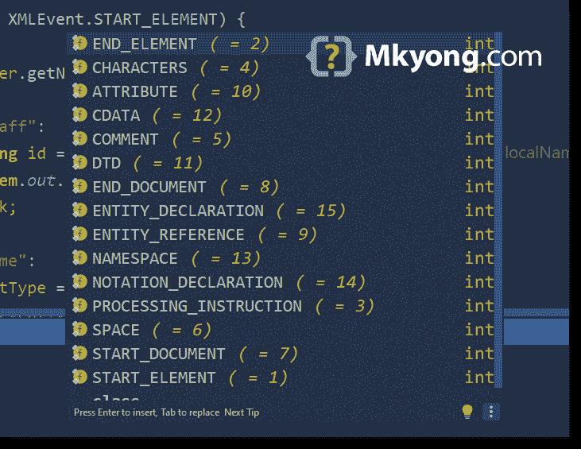

# 如何在 Java 中读取 XML 文件(StAX 解析器)

> 原文：<http://web.archive.org/web/20230101150211/https://mkyong.com/java/how-to-read-xml-file-in-java-stax-parser/>

本教程展示了如何使用 [Streaming API for XML (StAX)](http://web.archive.org/web/20220723135336/https://docs.oracle.com/javase/tutorial/jaxp/stax/index.html) 解析器来读取或解析 XML 文档。

目录

*   [1。StAX](#what-is-stax) 是什么
    *   [1.1 SAX 和 StAX 的区别？](#difference-between-sax-and-stax)
*   [2。StAX 游标 API 和迭代器 API](#stax-cursor-api-and-iterator-api)
    *   [2.1 StAX 游标 API](#stax-cursor-api)
    *   [2.2 StAX 迭代器 API](#stax-iterator-api)
    *   [2.3 哪一个？游标还是迭代器 API？](#which-one-cursor-or-iterator-apis)
*   [3。一个 XML 文件](#a-xml-file)
*   [4。StAX 游标 API 读取 XML 文件](#stax-cursor-api-to-read-a-xml-file)
*   [5。StAX 迭代器 API 读取 XML 文件](#stax-iterator-api-to-read-a-xml-file)
*   [6。将 XML 转换成 Java 对象？](#convert-xml-to-java-objects)
*   7 .[。下载源代码](#download-source-code)
*   [8。参考文献](#references)

**注**
P . S XML 的流 API(StAX)API 从 Java 1.6 开始提供，内置 JDK XML 库。

下面所有的例子都是用 Java 11 测试的。

## 1。StAX
是什么

StAX 代表`Streaming API for XML (StAX)`，一个处理 XML 文档的`pull API`。

有两种处理 XML 文档的编程模型，流式和文档对象模型(DOM)。对于 DOM 模型，我们可以使用 [DOM 解析器](http://web.archive.org/web/20220723135336/https://mkyong.com/java/how-to-read-xml-file-in-java-dom-parser/)；对于流式模型，我们可以使用 [SAX 解析器](http://web.archive.org/web/20220723135336/https://mkyong.com/java/how-to-read-xml-file-in-java-sax-parser/)或者 StAX 解析器。

### 1.1 SAX 和 StAX 的区别？

`Simple API for XML (SAX)`是一个`push API`；这个 SAX 解析器不断地向客户机发送(推送)XML 数据。在 SAX 中，客户机无法控制何时接收 XML 数据。

例如，我们注册了一个定制的`DefaultHandler`实现来处理 SAX 解析器发送的 XML 数据。阅读[完整的 SAX 示例](http://web.archive.org/web/20220723135336/https://mkyong.com/java/how-to-read-xml-file-in-java-sax-parser/)。

```
 // SAX
  SAXParser saxParser = factory.newSAXParser();

  // DefaultHandler implementation
  PrintAllHandlerSax handler = new PrintAllHandlerSax();

  saxParser.parse(FILENAME, handler); 
```

`Streaming API for XML (StAX)`是一个`pull API`；客户机调用 StAX 解析器库的方法，手动一个接一个地获取(拉取)XML 数据。在 StAX 中，控制何时获取(拉取)XML 数据的客户机。

```
 // StAX Iterator API examples
  // next event
  XMLEvent event = xmlEventReader.nextEvent();

  // moves to next event
  event = xmlEventReader.nextEvent();

  // moves to next event
  event = xmlEventReader.nextEvent(); 
```

*延伸阅读*

*   [为什么是 StAX？](http://web.archive.org/web/20220723135336/https://docs.oracle.com/javase/tutorial/jaxp/stax/why.html)

## 2。StAX 游标 API 和迭代器 API

StAX 包含两个 API 集:一个游标 API 和一个迭代器 API。

### 2.1 StAX 游标 API

StAX Cursor API 包含两个主要接口`XMLStreamReader`和`XMLStreamWriter`。`XMLStreamReader.getEventType()`将返回一个`int`，我们需要手动映射事件类型。

```
 // StAX Cursor API
  XMLStreamReader reader = xmlInputFactory.createXMLStreamReader(
      new FileInputStream(path.toFile()));

  // this is int! we need to map the eventType manually
  int eventType = reader.getEventType();

  while (reader.hasNext()) {

      eventType = reader.next();

      if (eventType == XMLEvent.START_ELEMENT) {
      }
      //...
  } 
```

### 2.2 StAX 迭代器 API

StAX 迭代器 API 包含两个主要接口`XMLEventReader`和`XMLEventWriter`，我们使用 [XMLEvent](http://web.archive.org/web/20220723135336/https://docs.oracle.com/javase/tutorial/jaxp/stax/api.html#indexterm-18) 。

```
 // StAX Iterator API
  XMLEventReader reader = xmlInputFactory.createXMLEventReader(
      new FileInputStream(path.toFile()));

  // event iterator
  while (reader.hasNext()) {

      XMLEvent event = reader.nextEvent();

      if (event.isStartElement()) {
      }
      //...
  } 
```

### 2.3 哪一个？游标还是迭代器 API？

*   与迭代器 API 相比，游标 API 的代码更小，效率更高，性能也更好。适合高性能应用程序或移动应用程序。
*   迭代器 API 提供了 XML 事件，这种事件更加灵活、可扩展、易于编码，适合企业应用程序。

*延伸阅读*

*   [Oracle doc–在游标和迭代器 API 之间选择](http://web.archive.org/web/20220723135336/https://docs.oracle.com/javase/tutorial/jaxp/stax/api.html#bnbej)

## 3。一个 XML 文件

下面是一个 XML 文档，稍后我们使用 StAX 解析器读取 XML 数据并打印出来。

src/main/resources/staff.xml

```
 <?xml version="1.0" encoding="utf-8"?>
<Company>
    <staff id="1001">
        <name>mkyong</name>
        <role>support</role>
        <salary currency="USD">5000</salary>
        <!-- for special characters like < &, need CDATA -->
        <bio><![CDATA[HTML tag <code>testing</code>]]></bio>
    </staff>
    <staff id="1002">
        <name>yflow</name>
        <role>admin</role>
        <salary currency="EUR">8000</salary>
        <bio><![CDATA[a & b]]></bio>
    </staff>
</Company> 
```

## 4。StAX 游标 API 读取 XML 文件

以下示例使用 StAX Cursor API 读取或解析上述 XML 文件，以获取 XML 元素、属性、CDATA 等。

ReadXmlStAXCursorParser.java

```
 package com.mkyong.xml.stax;

import javax.xml.stream.XMLInputFactory;
import javax.xml.stream.XMLStreamException;
import javax.xml.stream.XMLStreamReader;
import javax.xml.stream.events.XMLEvent;
import java.io.FileInputStream;
import java.io.FileNotFoundException;
import java.nio.file.Path;
import java.nio.file.Paths;

public class ReadXmlStAXCursorParser {

    private static final String FILENAME = "src/main/resources/staff.xml";

    public static void main(String[] args) {

        try {

            printXmlByXmlCursorReader(Paths.get(FILENAME));

        } catch (FileNotFoundException | XMLStreamException e) {
            e.printStackTrace();
        }

    }

    private static void printXmlByXmlCursorReader(Path path)
            throws FileNotFoundException, XMLStreamException {

        XMLInputFactory xmlInputFactory = XMLInputFactory.newInstance();
        XMLStreamReader reader = xmlInputFactory.createXMLStreamReader(
                new FileInputStream(path.toFile()));

        int eventType = reader.getEventType();
        System.out.println(eventType);   // 7, START_DOCUMENT
        System.out.println(reader);      // xerces

        while (reader.hasNext()) {

            eventType = reader.next();

            if (eventType == XMLEvent.START_ELEMENT) {

                switch (reader.getName().getLocalPart()) {

                    case "staff":
                        String id = reader.getAttributeValue(null, "id");
                        System.out.printf("Staff id : %s%n", id);
                        break;

                    case "name":
                        eventType = reader.next();
                        if (eventType == XMLEvent.CHARACTERS) {
                            System.out.printf("Name : %s%n", reader.getText());
                        }
                        break;

                    case "role":
                        eventType = reader.next();
                        if (eventType == XMLEvent.CHARACTERS) {
                            System.out.printf("Role : %s%n", reader.getText());
                        }
                        break;

                    case "salary":
                        String currency = reader.getAttributeValue(null, "currency");
                        eventType = reader.next();
                        if (eventType == XMLEvent.CHARACTERS) {
                            String salary = reader.getText();
                            System.out.printf("Salary [Currency] : %,.2f [%s]%n",
                              Float.parseFloat(salary), currency);
                        }
                        break;

                    case "bio":
                        eventType = reader.next();
                        if (eventType == XMLEvent.CHARACTERS) {
                            System.out.printf("Bio : %s%n", reader.getText());
                        }
                        break;
                }

            }

            if (eventType == XMLEvent.END_ELEMENT) {
                // if </staff>
                if (reader.getName().getLocalPart().equals("staff")) {
                    System.out.printf("%n%s%n%n", "---");
                }
            }

        }

    }

} 
```

输出

Terminal

```
 7
com.sun.org.apache.xerces.internal.impl.XMLStreamReaderImpl@18be83e4

Staff id : 1001
Name : mkyong
Role : support
Salary [Currency] : 5,000.00 [USD]
Bio : HTML tag <code>testing</code>

---

Staff id : 1002
Name : yflow
Role : admin
Salary [Currency] : 8,000.00 [EUR]
Bio : a & b

--- 
```

下面是光标 API 事件类型及其`int`的代码助手



## 5。StAX 迭代器 API 读取 XML 文件

下面的例子使用 StAX 迭代器 API 来读取或解析上面的 XML 文件，以获得 XML 元素、属性、CDATA 等。

ReadXmlStAXEventParser.java

```
 package com.mkyong.xml.stax;

import javax.xml.namespace.QName;
import javax.xml.stream.XMLEventReader;
import javax.xml.stream.XMLInputFactory;
import javax.xml.stream.XMLStreamException;
import javax.xml.stream.events.Attribute;
import javax.xml.stream.events.EndElement;
import javax.xml.stream.events.StartElement;
import javax.xml.stream.events.XMLEvent;
import java.io.FileInputStream;
import java.io.FileNotFoundException;
import java.nio.file.Path;
import java.nio.file.Paths;

public class ReadXmlStAXEventParser {

    private static final String FILENAME = "src/main/resources/staff.xml";

    public static void main(String[] args) {

        try {

            printXmlByXmlEventReader(Paths.get(FILENAME));

        } catch (FileNotFoundException | XMLStreamException e) {
            e.printStackTrace();
        }

    }

    private static void printXmlByXmlEventReader(Path path)
            throws FileNotFoundException, XMLStreamException {

        XMLInputFactory xmlInputFactory = XMLInputFactory.newInstance();
        XMLEventReader reader = xmlInputFactory.createXMLEventReader(
                new FileInputStream(path.toFile()));

        // event iterator
        while (reader.hasNext()) {

            XMLEvent event = reader.nextEvent();

            if (event.isStartElement()) {

                StartElement element = event.asStartElement();

                switch (element.getName().getLocalPart()) {
                    // if <staff>
                    case "staff":
                        // id='1001'
                        Attribute id = element.getAttributeByName(new QName("id"));
                        System.out.printf("Staff id : %s%n", id.getValue());
                        break;
                    case "name":
                        // throws StartElementEvent cannot be cast to class javax.xml.stream.events.Characters
                        // element.asCharacters().getData()

                        // this is still '<name>' tag, need move to next event for the character data
                        event = reader.nextEvent();
                        if (event.isCharacters()) {
                            System.out.printf("Name : %s%n", event.asCharacters().getData());
                        }
                        break;
                    case "role":
                        event = reader.nextEvent();
                        if (event.isCharacters()) {
                            System.out.printf("Role : %s%n", event.asCharacters().getData());
                        }
                        break;
                    case "salary":
                        // currency='USD'
                        Attribute currency = element.getAttributeByName(new QName("currency"));
                        event = reader.nextEvent();
                        if (event.isCharacters()) {
                            String salary = event.asCharacters().getData();
                            System.out.printf("Salary [Currency] : %,.2f [%s]%n",
                              Float.parseFloat(salary), currency);
                        }
                        break;
                    case "bio":
                        event = reader.nextEvent();
                        if (event.isCharacters()) {
                            // CDATA, no problem.
                            System.out.printf("Bio : %s%n", event.asCharacters().getData());
                        }
                        break;
                }
            }

            if (event.isEndElement()) {
                EndElement endElement = event.asEndElement();
                // if </staff>
                if (endElement.getName().getLocalPart().equals("staff")) {
                    System.out.printf("%n%s%n%n", "---");
                }
            }

        }

    }

} 
```

输出

Terminal

```
 Staff id : 1001
Name : mkyong
Role : support
Salary [Currency] : 5,000.00 [currency='USD']
Bio : HTML tag <code>testing</code>

---

Staff id : 1002
Name : yflow
Role : admin
Salary [Currency] : 8,000.00 [currency='EUR']
Bio : a & b

--- 
```

## 6。将 XML 转换成 Java 对象？

是的，我们可以使用 StAX API 将 XML 转换成 Java 对象。对于上面的例子，我们已经可以获得 XML 数据，创建一个类似于`Staff.java`的 POJO 并手动设置值。

Jakarta XML Binding (JAXB) 是一个推荐的库，用于将 XML 与 Java 对象相互转换。

## 7。下载源代码

$ git 克隆[https://github.com/mkyong/core-java](http://web.archive.org/web/20220723135336/https://github.com/mkyong/core-java)

$ cd java-xml

$ CD src/main/Java/com/mkyong/XML/StAX/

## 8。参考文献

*   [维基百科–用于 XML 处理的 Java API](http://web.archive.org/web/20220723135336/https://en.wikipedia.org/wiki/Java_API_for_XML_Processing)
*   [Oracle–用于 XML 处理的 Java API(JAXP)](http://web.archive.org/web/20220723135336/https://docs.oracle.com/javase/tutorial/jaxp/index.html)
*   [Oracle–StAX 示例](http://web.archive.org/web/20220723135336/https://docs.oracle.com/javase/tutorial/jaxp/stax/example.html)
*   [XML 流应用编程接口(StAX)](http://web.archive.org/web/20220723135336/https://docs.oracle.com/javase/tutorial/jaxp/stax/index.html)
*   [StAX 简介](http://web.archive.org/web/20220723135336/https://www.xml.com/pub/a/2003/09/17/stax.html)
*   [如何在 Java 中读取 XML 文件—(DOM 解析器)](http://web.archive.org/web/20220723135336/https://mkyong.com/java/how-to-read-xml-file-in-java-dom-parser/)
*   [如何在 Java 中读取 XML 文件—(SAX 解析器)](http://web.archive.org/web/20220723135336/https://mkyong.com/java/how-to-read-xml-file-in-java-sax-parser/)
*   [如何在 Java 中读取 XML 文件—(JDOM 解析器)](http://web.archive.org/web/20220723135336/https://mkyong.com/java/how-to-read-xml-file-in-java-jdom-example/)
*   [JAXB hello world 示例](http://web.archive.org/web/20220723135336/https://mkyong.com/java/jaxb-hello-world-example/)

<input type="hidden" id="mkyong-current-postId" value="16739">