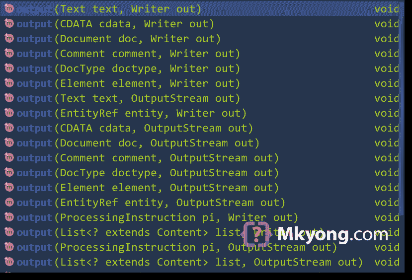

# 如何用 Java 编写 XML 文件—(JDOM)

> 原文：<http://web.archive.org/web/20230101150211/https://mkyong.com/java/how-to-create-xml-file-in-java-jdom-parser/>

本教程展示了如何使用 [JDOM](http://web.archive.org/web/20220626054141/https://github.com/hunterhacker/jdom) 将数据写入 XML 文件。

目录

*   [1。下载 JDOM 2.x](#download-jdom-2x)
*   [2。将 XML 字符串写入控制台](#write-xml-string-to-console)
*   [3。将 XML 写入文件](#write-xml-to-a-file)
*   [4。编写 XML 属性、注释、CDATA 等](#write-xml-attribute-comment-cdata-and-etc)
*   [5。更改 XML 编码](#change-xml-encoding)
*   [6。下载源代码](#download-source-code)
*   [7。参考文献](#references)

*用 JDOM 2.0.6 测试的 PS*

## 1。下载 JDOM 2.x

Maven for JDOM。

pom.xml

```
 <dependency>
      <groupId>org.jdom</groupId>
      <artifactId>jdom2</artifactId>
      <version>2.0.6</version>
  </dependency> 
```

## 2。将 XML 字符串写入控制台

以下示例使用 JDOM `XMLOutputter`将 XML 字符串写入系统控制台输出流。

WriteXmlJDom1.java

```
 package com.mkyong.xml.jdom;

import org.jdom2.Document;
import org.jdom2.JDOMException;
import org.jdom2.input.SAXBuilder;
import org.jdom2.output.Format;
import org.jdom2.output.XMLOutputter;

import java.io.IOException;
import java.io.StringReader;

public class WriteXmlJDom1 {

    public static void main(String[] args)
        throws JDOMException, IOException {

        writeSimpleXml();

    }

    private static void writeSimpleXml() throws JDOMException, IOException {

        String xml = "<root><child id=\"100\">mkyong</child></root>";
        SAXBuilder sb = new SAXBuilder();
        Document doc = sb.build(new StringReader(xml));

        // default in compact mode
        // XMLOutputter xmlOutputter = new XMLOutputter();

        // pretty print format
        XMLOutputter xmlOutputter = new XMLOutputter(Format.getPrettyFormat());

        // output to console
        xmlOutputter.output(doc, System.out);

    }

} 
```

输出

Terminal

```
 <?xml version="1.0" encoding="UTF-8"?>
<root>
  <child id="100">mkyong</child>
</root> 
```

## 3。将 XML 写入文件

JDOM `XMLOutputter`输出支持[写入器](http://web.archive.org/web/20220626054141/https://docs.oracle.com/en/java/javase/11/docs/api/java.base/java/io/Writer.html)或[输出流](http://web.archive.org/web/20220626054141/https://docs.oracle.com/en/java/javase/11/docs/api/java.base/java/io/OutputStream.html)。

3.1 以下示例通过`FileOutputStream`将 XML 写入文件。

```
 XMLOutputter xmlOutputter = new XMLOutputter();

  // output to any OutputStream
  try(FileOutputStream fileOutputStream =
              new FileOutputStream("c:\\test\\file.xml")){
      xmlOutputter.output(new Document(), fileOutputStream);
  } 
```

3.2 以下示例通过`FileWriter`将 XML 写入文件。

```
 XMLOutputter xmlOutputter = new XMLOutputter();

  // output to any Writer
  try(FileWriter fileWriter =
              new FileWriter("c:\\test\\file.xml")){
      xmlOutputter.output(new Document(), fileWriter);
  } 
```

3.3 审查`XMLOutputter.output`重载方法:



## 4。编写 XML 属性、注释、CDATA 等

以下示例使用 JDOM 将 XML 元素、属性、注释和 CDATA 写入输出流。

WriteXmlJDom3.java

```
 package com.mkyong.xml.jdom;

import org.jdom2.CDATA;
import org.jdom2.Comment;
import org.jdom2.Document;
import org.jdom2.Element;
import org.jdom2.JDOMException;
import org.jdom2.output.Format;
import org.jdom2.output.XMLOutputter;

import java.io.IOException;
import java.io.OutputStream;

public class WriteXmlJDom3 {

  public static void main(String[] args) throws IOException {

      writeXml(System.out);

  }

  private static void writeXml(OutputStream output) throws IOException {

      Document doc = new Document();
      doc.setRootElement(new Element("company"));

      Element staff = new Element("staff");
      // add xml attribute
      staff.setAttribute("id", "1001");

      staff.addContent(new Element("name").setText("mkyong"));
      staff.addContent(new Element("role").setText("support"));
      staff.addContent(new Element("salary")
              .setAttribute("curreny", "USD").setText("5000"));

      // add xml comments
      staff.addContent(new Comment("for special characters like < &, need CDATA"));

      // add xml CDATA
      staff.addContent(new Element("bio")
              .setContent(new CDATA("HTML tag <code>testing</code>")));

      // append child to root
      doc.getRootElement().addContent(staff);

      Element staff2 = new Element("staff");
      staff2.setAttribute("id", "1002");
      staff2.addContent(new Element("name").setText("yflow"));
      staff2.addContent(new Element("role").setText("admin"));
      staff2.addContent(new Element("salary")
              .setAttribute("curreny", "EUD").setText("8000"));
      // add xml CDATA
      staff2.addContent(new Element("bio")
              .setContent(new CDATA("a & b")));

      // append child to root
      doc.getRootElement().addContent(staff2);

      XMLOutputter xmlOutputter = new XMLOutputter();

      // pretty print
      xmlOutputter.setFormat(Format.getPrettyFormat());
      xmlOutputter.output(doc, output);

  }

} 
```

输出

Terminal

```
 <?xml version="1.0" encoding="UTF-8"?>
<company>
  <staff id="1001">
    <name>mkyong</name>
    <role>support</role>
    <salary curreny="USD">5000</salary>
    <!--for special characters like < &, need CDATA-->
    <bio><![CDATA[HTML tag <code>testing</code>]]></bio>
  </staff>
  <staff id="1002">
    <name>yflow</name>
    <role>admin</role>
    <salary curreny="EUD">8000</salary>
    <bio><![CDATA[a & b]]></bio>
  </staff>
</company> 
```

## 5。更改 XML 编码

这段代码片段将 XML 编码改为`ISO-8859-1`。

.java

```
 XMLOutputter xmlOutputter = new XMLOutputter();
  // change xml encoding
  xmlOutputter.setFormat(Format.getPrettyFormat().setEncoding("ISO-8859-1"));
  xmlOutputter.output(doc, output); 
```

输出

Terminal

```
 <?xml version="1.0" encoding="ISO-8859-1"?>
<root></root> 
```

**注**
更多 JDOM2 示例——[JDOM 2 入门](http://web.archive.org/web/20220626054141/https://github.com/hunterhacker/jdom/wiki/JDOM2-A-Primer)

## 6。下载源代码

$ git 克隆[https://github.com/mkyong/core-java](http://web.archive.org/web/20220626054141/https://github.com/mkyong/core-java)

$ cd java-xml

$ CD src/main/Java/com/mkyong/XML/JDOM/

## 7 .。参考文献

*   [JDOM 网站](http://web.archive.org/web/20220626054141/http://www.jdom.org/)
*   [JDOM2 文档](http://web.archive.org/web/20220626054141/https://github.com/hunterhacker/jdom/wiki/JDOM2-A-Primer)
*   [维基百科–JDOM](http://web.archive.org/web/20220626054141/https://en.wikipedia.org/wiki/JDOM)
*   [XMLOutputter JavaDoc](http://web.archive.org/web/20220626054141/http://www.jdom.org/docs/apidocs/org/jdom2/output/XMLOutputter.html)
*   作家 JavaDoc
*   [OutputStream JavaDoc](http://web.archive.org/web/20220626054141/https://docs.oracle.com/en/java/javase/11/docs/api/java.base/java/io/OutputStream.html)
*   [如何用 Java 编写 XML 文件—(DOM 解析器)](http://web.archive.org/web/20220626054141/https://mkyong.com/java/how-to-create-xml-file-in-java-dom/)
*   [如何用 Java 编写 XML 文件(StAX Writer)](http://web.archive.org/web/20220626054141/https://mkyong.com/java/how-to-write-xml-file-in-java-stax-writer/)
*   [JAXB hello world 示例](http://web.archive.org/web/20220626054141/https://mkyong.com/java/jaxb-hello-world-example/)

<input type="hidden" id="mkyong-current-postId" value="9889">