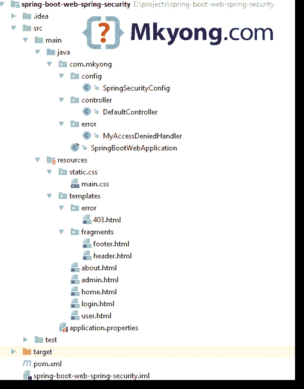
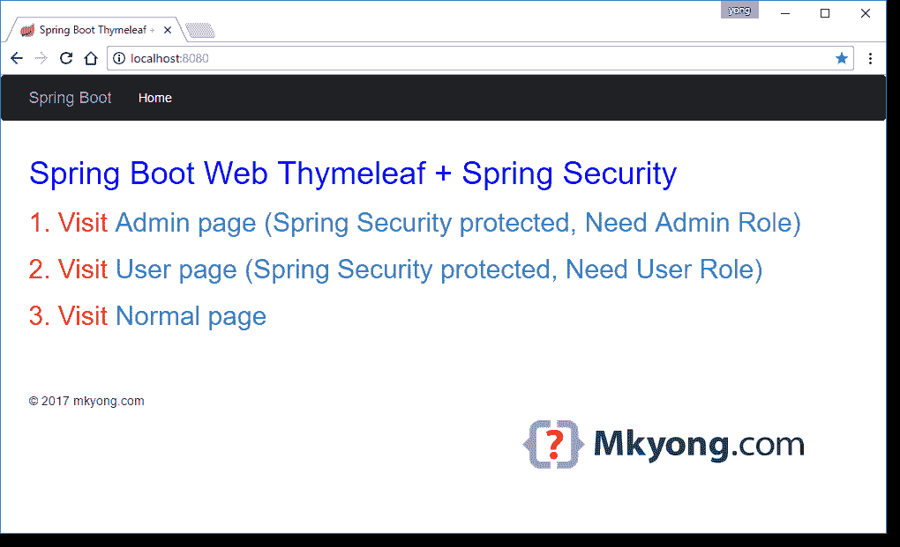
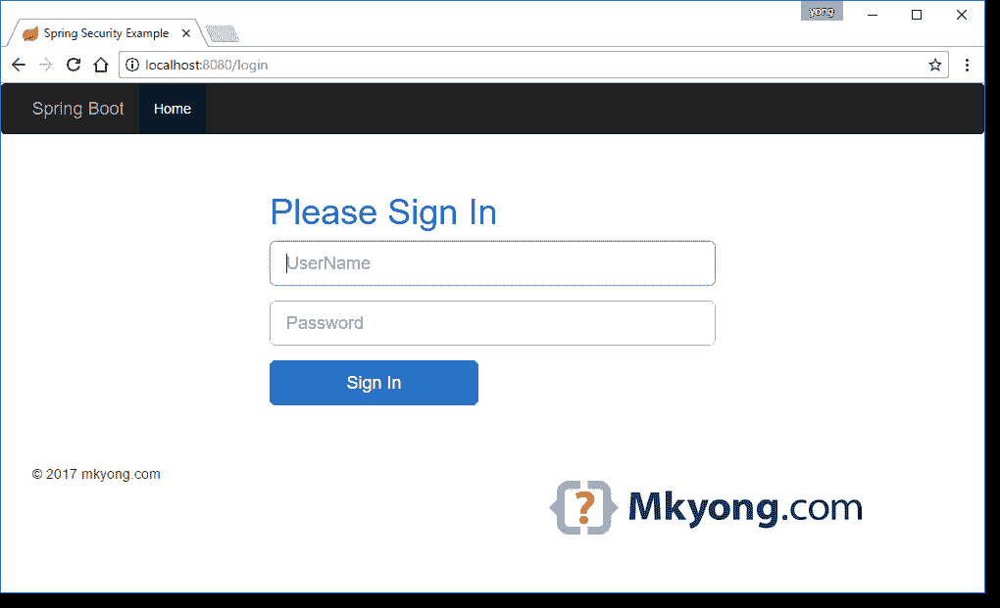
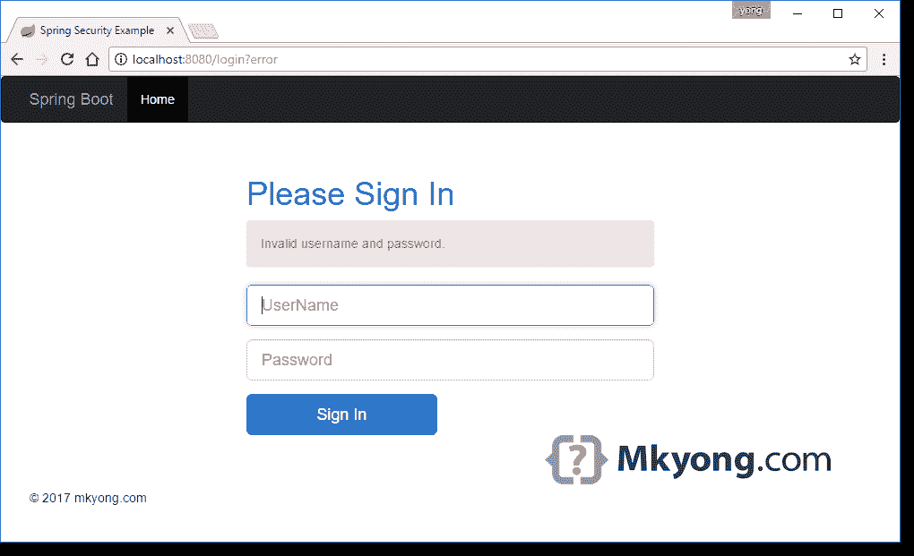
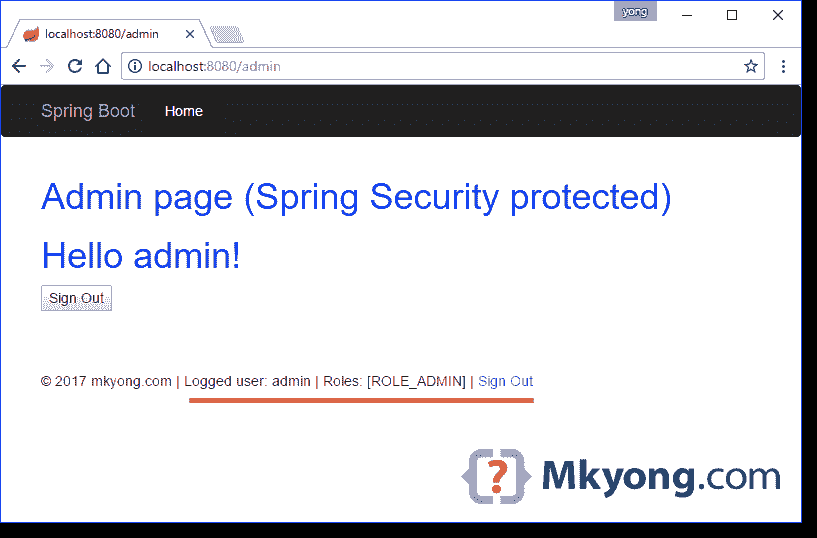
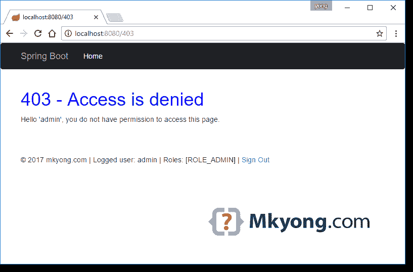
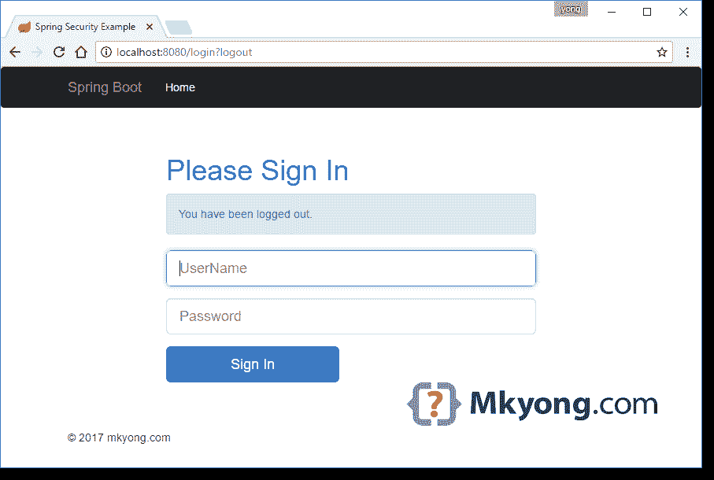

# Spring Boot +春季安全+百里香示例

> 原文：<http://web.archive.org/web/20230101150211/https://mkyong.com/spring-boot/spring-boot-spring-security-thymeleaf-example/>

一个 Spring Boot 百里香的例子，使用 Spring 安全来保护路径`/admin`和`/user`

使用的技术:

1.  Spring Boot 1.5.3 版本
2.  弹簧 4.3.8 .释放
3.  春季安全 4.2.2
4.  百里香叶
5.  百里香额外春季安全 4 2.1.3
6.  Tomcat Embed 8.5.14
7.  maven3
8.  Java 8

## 1.项目目录



## 2.项目相关性

声明`spring-boot-starter-security`，它将获得开发`Spring Boot + Spring Security` web 应用程序所需的任何东西。

pom.xml

```
 <?xml version="1.0" encoding="UTF-8"?>
<project  
	xmlns:xsi="http://www.w3.org/2001/XMLSchema-instance"
    xsi:schemaLocation="http://maven.apache.org/POM/4.0.0 
	http://maven.apache.org/xsd/maven-4.0.0.xsd">
    <modelVersion>4.0.0</modelVersion>

    <artifactId>spring-boot-web-spring-security</artifactId>
    <packaging>jar</packaging>
    <name>Spring Boot Web Spring Security</name>
    <description>Spring Boot Web Spring Security Example</description>
    <url>https://www.mkyong.com</url>
    <version>1.0</version>

    <parent>
        <groupId>org.springframework.boot</groupId>
        <artifactId>spring-boot-starter-parent</artifactId>
        <version>1.5.3.RELEASE</version>
    </parent>

    <properties>
        <java.version>1.8</java.version>
    </properties>

    <dependencies>

        <!-- Spring Security -->
        <dependency>
            <groupId>org.springframework.boot</groupId>
            <artifactId>spring-boot-starter-security</artifactId>
        </dependency>

		<!-- do you like thymeleaf? -->
		<dependency>
            <groupId>org.springframework.boot</groupId>
            <artifactId>spring-boot-starter-thymeleaf</artifactId>
        </dependency>

		<!-- optional, it brings userful tags to display spring security stuff -->
        <dependency>
            <groupId>org.thymeleaf.extras</groupId>
            <artifactId>thymeleaf-extras-springsecurity4</artifactId>
        </dependency>

        <!-- hot swapping, disable cache for template, enable live reload -->
        <dependency>
            <groupId>org.springframework.boot</groupId>
            <artifactId>spring-boot-devtools</artifactId>
            <optional>true</optional>
        </dependency>

        <!-- Optional, for bootstrap -->
        <dependency>
            <groupId>org.webjars</groupId>
            <artifactId>bootstrap</artifactId>
            <version>3.3.7</version>
        </dependency>

    </dependencies>
    <build>
        <plugins>
            <!-- Package as an executable jar/war -->
            <plugin>
                <groupId>org.springframework.boot</groupId>
                <artifactId>spring-boot-maven-plugin</artifactId>
            </plugin>
        </plugins>
    </build>
</project> 
```

显示项目相关性:

```
 $ mvn dependency:tree

[INFO] Scanning for projects...
[INFO]
[INFO] ------------------------------------------------------------------------
[INFO] Building Spring Boot Web Spring Security 1.0
[INFO] ------------------------------------------------------------------------
[INFO]
[INFO] --- maven-dependency-plugin:2.10:tree (default-cli) @ spring-boot-web-spring-security ---
[INFO] org.springframework.boot:spring-boot-web-spring-security:jar:1.0
[INFO] +- org.springframework.boot:spring-boot-starter-thymeleaf:jar:1.5.3.RELEASE:compile
[INFO] |  +- org.springframework.boot:spring-boot-starter:jar:1.5.3.RELEASE:compile
[INFO] |  |  +- org.springframework.boot:spring-boot-starter-logging:jar:1.5.3.RELEASE:compile
[INFO] |  |  |  +- ch.qos.logback:logback-classic:jar:1.1.11:compile
[INFO] |  |  |  |  \- ch.qos.logback:logback-core:jar:1.1.11:compile
[INFO] |  |  |  +- org.slf4j:jcl-over-slf4j:jar:1.7.25:compile
[INFO] |  |  |  +- org.slf4j:jul-to-slf4j:jar:1.7.25:compile
[INFO] |  |  |  \- org.slf4j:log4j-over-slf4j:jar:1.7.25:compile
[INFO] |  |  +- org.springframework:spring-core:jar:4.3.8.RELEASE:compile
[INFO] |  |  \- org.yaml:snakeyaml:jar:1.17:runtime
[INFO] |  +- org.springframework.boot:spring-boot-starter-web:jar:1.5.3.RELEASE:compile
[INFO] |  |  +- org.springframework.boot:spring-boot-starter-tomcat:jar:1.5.3.RELEASE:compile
[INFO] |  |  |  +- org.apache.tomcat.embed:tomcat-embed-core:jar:8.5.14:compile
[INFO] |  |  |  +- org.apache.tomcat.embed:tomcat-embed-el:jar:8.5.14:compile
[INFO] |  |  |  \- org.apache.tomcat.embed:tomcat-embed-websocket:jar:8.5.14:compile
[INFO] |  |  +- org.hibernate:hibernate-validator:jar:5.3.5.Final:compile
[INFO] |  |  |  +- javax.validation:validation-api:jar:1.1.0.Final:compile
[INFO] |  |  |  +- org.jboss.logging:jboss-logging:jar:3.3.1.Final:compile
[INFO] |  |  |  \- com.fasterxml:classmate:jar:1.3.3:compile
[INFO] |  |  +- com.fasterxml.jackson.core:jackson-databind:jar:2.8.8:compile
[INFO] |  |  |  +- com.fasterxml.jackson.core:jackson-annotations:jar:2.8.0:compile
[INFO] |  |  |  \- com.fasterxml.jackson.core:jackson-core:jar:2.8.8:compile
[INFO] |  |  +- org.springframework:spring-web:jar:4.3.8.RELEASE:compile
[INFO] |  |  \- org.springframework:spring-webmvc:jar:4.3.8.RELEASE:compile
[INFO] |  +- org.thymeleaf:thymeleaf-spring4:jar:2.1.5.RELEASE:compile
[INFO] |  |  \- org.thymeleaf:thymeleaf:jar:2.1.5.RELEASE:compile
[INFO] |  |     +- ognl:ognl:jar:3.0.8:compile
[INFO] |  |     +- org.javassist:javassist:jar:3.21.0-GA:compile
[INFO] |  |     \- org.unbescape:unbescape:jar:1.1.0.RELEASE:compile
[INFO] |  \- nz.net.ultraq.thymeleaf:thymeleaf-layout-dialect:jar:1.4.0:compile
[INFO] |     \- org.codehaus.groovy:groovy:jar:2.4.10:compile
[INFO] +- org.springframework.boot:spring-boot-starter-security:jar:1.5.3.RELEASE:compile
[INFO] |  +- org.springframework:spring-aop:jar:4.3.8.RELEASE:compile
[INFO] |  |  \- org.springframework:spring-beans:jar:4.3.8.RELEASE:compile
[INFO] |  +- org.springframework.security:spring-security-config:jar:4.2.2.RELEASE:compile
[INFO] |  |  +- org.springframework.security:spring-security-core:jar:4.2.2.RELEASE:compile
[INFO] |  |  \- org.springframework:spring-context:jar:4.3.8.RELEASE:compile
[INFO] |  \- org.springframework.security:spring-security-web:jar:4.2.2.RELEASE:compile
[INFO] |     \- org.springframework:spring-expression:jar:4.3.8.RELEASE:compile
[INFO] +- org.thymeleaf.extras:thymeleaf-extras-springsecurity4:jar:2.1.3.RELEASE:compile
[INFO] |  \- org.slf4j:slf4j-api:jar:1.7.25:compile
[INFO] +- org.springframework.boot:spring-boot-devtools:jar:1.5.3.RELEASE:compile
[INFO] |  +- org.springframework.boot:spring-boot:jar:1.5.3.RELEASE:compile
[INFO] |  \- org.springframework.boot:spring-boot-autoconfigure:jar:1.5.3.RELEASE:compile
[INFO] \- org.webjars:bootstrap:jar:3.3.7:compile
[INFO]    \- org.webjars:jquery:jar:1.11.1:compile
[INFO] ------------------------------------------------------------------------
[INFO] BUILD SUCCESS
[INFO] ------------------------------------------------------------------------
[INFO] Total time: 2.072 s
[INFO] Finished at: 2017-05-04T10:13:05+08:00
[INFO] Final Memory: 19M/309M
[INFO] ------------------------------------------------------------------------ 
```

## 3.春天安全

3.1 扩展了`WebSecurityConfigurerAdapter`，在`configure`方法中定义了安全规则。

**对于用户“管理员”:**

1.  能够访问`/admin`页面
2.  无法访问`/user`页面，重定向至 403 拒绝访问页面。

**对于用户“用户”:**

1.  能够访问`/user`页面
2.  无法访问`/admin`页面，重定向至 403 拒绝访问页面。

SpringSecurityConfig.java

```
 package com.mkyong.config;

import org.springframework.beans.factory.annotation.Autowired;
import org.springframework.context.annotation.Configuration;
import org.springframework.security.config.annotation.authentication.builders.AuthenticationManagerBuilder;
import org.springframework.security.config.annotation.web.builders.HttpSecurity;
import org.springframework.security.config.annotation.web.configuration.WebSecurityConfigurerAdapter;
import org.springframework.security.web.access.AccessDeniedHandler;

@Configuration
public class SpringSecurityConfig extends WebSecurityConfigurerAdapter {

    @Autowired
    private AccessDeniedHandler accessDeniedHandler;

    // roles admin allow to access /admin/**
    // roles user allow to access /user/**
    // custom 403 access denied handler
    @Override
    protected void configure(HttpSecurity http) throws Exception {

        http.csrf().disable()
                .authorizeRequests()
					.antMatchers("/", "/home", "/about").permitAll()
					.antMatchers("/admin/**").hasAnyRole("ADMIN")
					.antMatchers("/user/**").hasAnyRole("USER")
					.anyRequest().authenticated()
                .and()
                .formLogin()
					.loginPage("/login")
					.permitAll()
					.and()
                .logout()
					.permitAll()
					.and()
                .exceptionHandling().accessDeniedHandler(accessDeniedHandler);
    }

    // create two users, admin and user
    @Autowired
    public void configureGlobal(AuthenticationManagerBuilder auth) throws Exception {

        auth.inMemoryAuthentication()
                .withUser("user").password("password").roles("USER")
                .and()
                .withUser("admin").password("password").roles("ADMIN");
    }
} 
```

3.2 自定义 403 拒绝访问处理程序，记录请求并重定向至`/403`

WelcomeController.java

```
 package com.mkyong.error;

import org.slf4j.Logger;
import org.slf4j.LoggerFactory;
import org.springframework.security.access.AccessDeniedException;
import org.springframework.security.core.Authentication;
import org.springframework.security.core.context.SecurityContextHolder;
import org.springframework.security.web.access.AccessDeniedHandler;
import org.springframework.stereotype.Component;

import javax.servlet.ServletException;
import javax.servlet.http.HttpServletRequest;
import javax.servlet.http.HttpServletResponse;
import java.io.IOException;

// handle 403 page
@Component
public class MyAccessDeniedHandler implements AccessDeniedHandler {

    private static Logger logger = LoggerFactory.getLogger(MyAccessDeniedHandler.class);

    @Override
    public void handle(HttpServletRequest httpServletRequest,
                       HttpServletResponse httpServletResponse,
                       AccessDeniedException e) throws IOException, ServletException {

        Authentication auth
                = SecurityContextHolder.getContext().getAuthentication();

        if (auth != null) {
            logger.info("User '" + auth.getName()
                    + "' attempted to access the protected URL: "
                    + httpServletRequest.getRequestURI());
        }

        httpServletResponse.sendRedirect(httpServletRequest.getContextPath() + "/403");

    }
} 
```

## 4.Spring Boot

4.1 一个控制器类，用来定义 http 请求和视图名。

DefaultController.java

```
 package com.mkyong.controller;

import org.springframework.stereotype.Controller;
import org.springframework.web.bind.annotation.GetMapping;

@Controller
public class DefaultController {

    @GetMapping("/")
    public String home1() {
        return "/home";
    }

    @GetMapping("/home")
    public String home() {
        return "/home";
    }

    @GetMapping("/admin")
    public String admin() {
        return "/admin";
    }

    @GetMapping("/user")
    public String user() {
        return "/user";
    }

    @GetMapping("/about")
    public String about() {
        return "/about";
    }

    @GetMapping("/login")
    public String login() {
        return "/login";
    }

    @GetMapping("/403")
    public String error403() {
        return "/error/403";
    }

} 
```

4.2 启动 Spring Boot 应用程序。

DefaultController.java

```
 package com.mkyong;

import org.springframework.boot.SpringApplication;
import org.springframework.boot.autoconfigure.SpringBootApplication;

@SpringBootApplication
public class SpringBootWebApplication {

	public static void main(String[] args) throws Exception {
		SpringApplication.run(SpringBootWebApplication.class, args);
	}

} 
```

## 5.百里香+资源+静态文件

5.1 百里香文件放在`src/main/resources/templates/`文件夹中。

5.2 百里香叶碎片，用于模板布局-标题。

src/main/resources/templates/fragments/header.html

```
 <html xmlns:th="http://www.thymeleaf.org">
<head>
    <div th:fragment="header-css">
        <!-- this is header-css -->
        <link rel="stylesheet" type="text/css"
              href="webjars/bootstrap/3.3.7/css/bootstrap.min.css" />

        <link rel="stylesheet" th:href="@{/css/main.css}"
              href="../../css/main.css" />
    </div>
</head>
<body>
<div th:fragment="header">
    <!-- this is header -->
    <nav class="navbar navbar-inverse">
        <div class="container">
            <div class="navbar-header">
                <a class="navbar-brand" th:href="@{/}">Spring Boot</a>
            </div>
            <div id="navbar" class="collapse navbar-collapse">
                <ul class="nav navbar-nav">
                    <li class="active"><a th:href="@{/}">Home</a></li>
                </ul>
            </div>
        </div>
    </nav>
</div>

</body>
</html> 
```

5.3 百里香叶碎片，用于模板布局-页脚。查看`sec`标签，这是一个有用的标签来展示弹簧安全的东西，详情请参考这个[百里香叶加春安全](http://web.archive.org/web/20220309104940/https://github.com/thymeleaf/thymeleaf-extras-springsecurity)。

src/main/resources/templates/fragments/footer.html

```
 <html  
	  xmlns:th="http://www.thymeleaf.org"
      xmlns:sec="http://www.thymeleaf.org/thymeleaf-extras-springsecurity4">
<head>
</head>
<body>
<div th:fragment="footer">

    <div class="container">

        <footer>
        <!-- this is footer -->
        &copy; 2017 mkyong.com
            <span sec:authorize="isAuthenticated()">
                | Logged user: <span sec:authentication="name"></span> |
                Roles: <span sec:authentication="principal.authorities"></span> |
                <a th:href="@{/logout}">Sign Out</a>
            </span>

        <script type="text/javascript"
                src="webjars/bootstrap/3.3.7/js/bootstrap.min.js"></script>

        </footer>
    </div>

</div>
</body>
</html> 
```

5.4 百里香文件列表，没什么特别的，不言自明。

家~

src/main/resources/templates/home.html

```
 <!DOCTYPE HTML>
<html xmlns:th="http://www.thymeleaf.org">
<head>
    <title>Spring Boot Thymeleaf + Spring Security</title>

    <div th:replace="fragments/header :: header-css"/>

</head>
<body>

<div th:replace="fragments/header :: header"/>

<div class="container">

    <div class="starter-template">
        <h1>Spring Boot Web Thymeleaf + Spring Security</h1>
        <h2>1\. Visit <a th:href="@{/admin}">Admin page (Spring Security protected, Need Admin Role)</a></h2>
        <h2>2\. Visit <a th:href="@{/user}">User page (Spring Security protected, Need User Role)</a></h2>
        <h2>3\. Visit <a th:href="@{/about}">Normal page</a></h2>
    </div>

</div>
<!-- /.container -->

<div th:replace="fragments/footer :: footer"/>

</body>
</html> 
```

admin ~

src/main/resources/templates/admin.html

```
 <!DOCTYPE HTML>
<html xmlns:th="http://www.thymeleaf.org">
<head>
    <div th:replace="fragments/header :: header-css"/>
</head>
<body>

<div th:replace="fragments/header :: header"/>

<div class="container">

    <div class="starter-template">
        <h1>Admin page (Spring Security protected)</h1>

        <h1 th:inline="text">Hello [[${#httpServletRequest.remoteUser}]]!</h1>
        <form th:action="@{/logout}" method="post">
            <input type="submit" value="Sign Out"/>
        </form>

    </div>

</div>
<!-- /.container -->

<div th:replace="fragments/footer :: footer"/>

</body>
</html> 
```

用户~

src/main/resources/templates/user.html

```
 <!DOCTYPE HTML>
<html xmlns:th="http://www.thymeleaf.org">
<head>
    <div th:replace="fragments/header :: header-css"/>
</head>
<body>

<div th:replace="fragments/header :: header"/>

<div class="container">

    <div class="starter-template">
        <h1>User page (Spring Security protected)</h1>

        <h1 th:inline="text">Hello [[${#httpServletRequest.remoteUser}]]!</h1>
        <form th:action="@{/logout}" method="post">
            <input type="submit" value="Sign Out"/>
        </form>

    </div>

</div>
<!-- /.container -->
<div th:replace="fragments/footer :: footer"/>

</body>
</html> 
```

关于~

src/main/resources/templates/about.html

```
 <!DOCTYPE HTML>
<html xmlns:th="http://www.thymeleaf.org">
<head>
    <div th:replace="fragments/header :: header-css"/>
</head>
<body>

<div th:replace="fragments/header :: header"/>

<div class="container">

    <div class="starter-template">
        <h1>Normal page (No need login)</h1>
    </div>

</div>
<!-- /.container -->

<div th:replace="fragments/footer :: footer"/>

</body>
</html> 
```

登录~

src/main/resources/templates/login.html

```
 <!DOCTYPE html>
<html  xmlns:th="http://www.thymeleaf.org"
>
<head>
    <title>Spring Security Example </title>
    <div th:replace="fragments/header :: header-css"/>
</head>
<body>

<div th:replace="fragments/header :: header"/>

<div class="container">

    <div class="row" style="margin-top:20px">
        <div class="col-xs-12 col-sm-8 col-md-6 col-sm-offset-2 col-md-offset-3">
            <form th:action="@{/login}" method="post">
                <fieldset>
                    <h1>Please Sign In</h1>

                    <div th:if="${param.error}">
                        <div class="alert alert-danger">
                            Invalid username and password.
                        </div>
                    </div>
                    <div th:if="${param.logout}">
                        <div class="alert alert-info">
                            You have been logged out.
                        </div>
                    </div>

                    <div class="form-group">
                        <input type="text" name="username" id="username" class="form-control input-lg"
                               placeholder="UserName" required="true" autofocus="true"/>
                    </div>
                    <div class="form-group">
                        <input type="password" name="password" id="password" class="form-control input-lg"
                               placeholder="Password" required="true"/>
                    </div>

                    <div class="row">
                        <div class="col-xs-6 col-sm-6 col-md-6">
                            <input type="submit" class="btn btn-lg btn-primary btn-block" value="Sign In"/>
                        </div>
                        <div class="col-xs-6 col-sm-6 col-md-6">
                        </div>
                    </div>
                </fieldset>
            </form>
        </div>
    </div>

</div>

<div th:replace="fragments/footer :: footer"/>

</body>
</html> 
```

403 ~

src/main/resources/templates/error/403.html

```
 <!DOCTYPE HTML>
<html xmlns:th="http://www.thymeleaf.org">
<head>
    <div th:replace="fragments/header :: header-css"/>
</head>
<body>

<div th:replace="fragments/header :: header"/>

<div class="container">

    <div class="starter-template">
        <h1>403 - Access is denied</h1>
        <div th:inline="text">Hello '[[${#httpServletRequest.remoteUser}]]', 
                you do not have permission to access this page.</div>
    </div>

</div>
<!-- /.container -->

<div th:replace="fragments/footer :: footer"/>

</body>
</html> 
```

5.5 对于 CSS 或 Javascript 等静态文件，放入`/src/main/resources/static/`

/src/main/resources/static/css/main.css

```
 h1{
	color:#0000FF;
}

h2{
	color:#FF0000;
}

footer{
    margin-top:60px;
} 
```

**Note**
Read this [Spring Boot Serving static content](http://web.archive.org/web/20220309104940/https://docs.spring.io/spring-boot/docs/current/reference/htmlsingle/#boot-features-spring-mvc-static-content) to understand the resource mapping.

## 6.演示

6.1 启动 Spring Boot 网络应用程序。此`/admin/**`受保护，您需要以管理员身份登录才能访问。

Terminal

```
 $ mvn spring-boot:run

//... 
```

6.2 访问`http://localhost:8080`

[](http://web.archive.org/web/20220309104940/http://www.mkyong.com/wp-content/uploads/2017/05/spring-boot-spring-security-1.png)

6.3 访问`http://localhost:8080/admin`，重定向至`http://localhost:8080/login`

[](http://web.archive.org/web/20220309104940/http://www.mkyong.com/wp-content/uploads/2017/05/spring-boot-spring-security-2.png)

6.4 无效的用户名或密码`http://localhost:8080/login`

[](http://web.archive.org/web/20220309104940/http://www.mkyong.com/wp-content/uploads/2017/05/spring-boot-spring-security-3.png)

6.5 登录成功，重定向回管理页面`http://localhost:8080/admin`，查看页脚部分，显示用户信息。

[](http://web.archive.org/web/20220309104940/http://www.mkyong.com/wp-content/uploads/2017/05/spring-boot-spring-security-4.png)

6.6 访问`http://localhost:8080/user`，重定向至`http://localhost:8080/403`

[](http://web.archive.org/web/20220309104940/http://www.mkyong.com/wp-content/uploads/2017/05/spring-boot-spring-security-5.png)

6.7 单击页脚的注销链接，重定向至`http://localhost:8080/login?logout`

[](http://web.archive.org/web/20220309104940/http://www.mkyong.com/wp-content/uploads/2017/05/spring-boot-spring-security-6.png)

完成了。尝试用另一个用户名“user”登录并访问管理页面。

## 下载源代码

Download it – [spring-boot-spring-security-thymeleaf.zip](http://web.archive.org/web/20220309104940/http://www.mkyong.com/wp-content/uploads/2017/05/spring-boot-spring-security-thymeleaf.zip) (15 KB)

## 参考

1.  [保护网络应用](http://web.archive.org/web/20220309104940/https://spring.io/guides/gs/securing-web/)
2.  [春季安全参考](http://web.archive.org/web/20220309104940/https://docs.spring.io/spring-security/site/docs/current/reference/htmlsingle/)
3.  [Spring Boot 安全特征](http://web.archive.org/web/20220309104940/https://docs.spring.io/spring-boot/docs/current/reference/htmlsingle/#boot-features-security)
4.  [Spring Boot Hello World 示例–百里香叶](http://web.archive.org/web/20220309104940/http://www.mkyong.com/spring-boot/spring-boot-hello-world-example-thymeleaf/)
5.  [春安你好世界注释示例](http://web.archive.org/web/20220309104940/http://www.mkyong.com/spring-security/spring-security-hello-world-annotation-example/)
6.  [百里香 Spring 安全集成基础知识](http://web.archive.org/web/20220309104940/http://www.thymeleaf.org/doc/articles/springsecurity.html)
7.  [百里香叶 extra-Spring 安全集成基础知识](http://web.archive.org/web/20220309104940/https://github.com/thymeleaf/thymeleaf-extras-springsecurity)
8.  [百里香叶–标准 URL 语法](http://web.archive.org/web/20220309104940/http://www.thymeleaf.org/doc/articles/standardurlsyntax.html)
9.  [Spring Boot+Spring MVC+Spring Security+MySQL](http://web.archive.org/web/20220309104940/https://medium.com/@gustavo.ponce.ch/spring-boot-spring-mvc-spring-security-mysql-a5d8545d837d)
10.  [Spring Boot–静态内容](http://web.archive.org/web/20220309104940/https://docs.spring.io/spring-boot/docs/current/reference/htmlsingle/#boot-features-spring-mvc-static-content)
11.  [spring MVC–in ucci CSS 文件](http://web.archive.org/web/20220309104940/https://www.mkyong.com/spring-mvc/spring-mvc-how-to-include-js-or-css-files-in-a-jsp-page/)

<input type="hidden" id="mkyong-current-postId" value="14564">