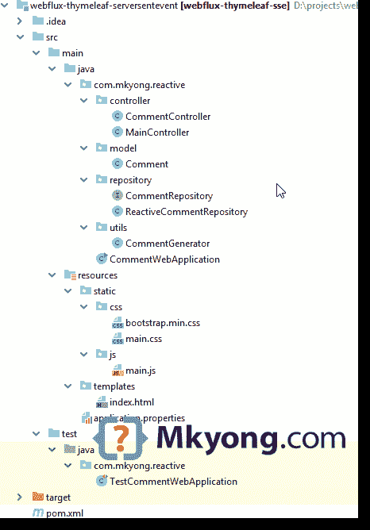
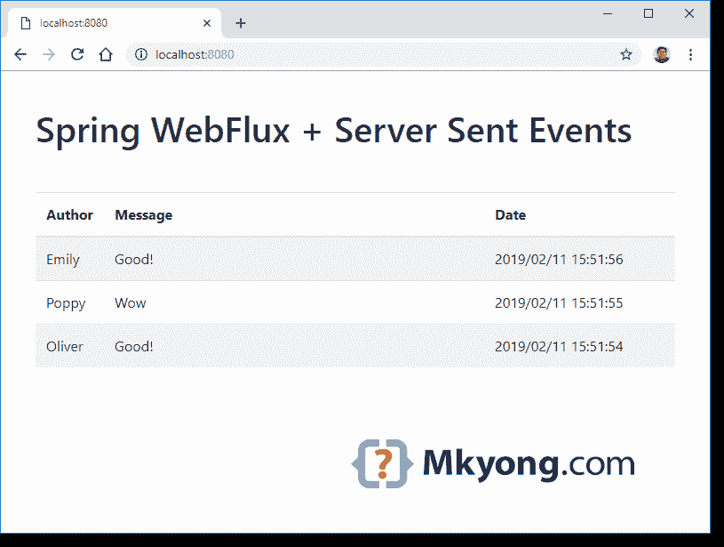

> 原文：<http://web.archive.org/web/20230101150211/https://mkyong.com/spring-boot/spring-boot-webflux-server-sent-events-example/>

# Spring Boot WebFlux +服务器发送的事件示例

在本文中，我们将向您展示如何使用[服务器发送的事件](http://web.archive.org/web/20190308020548/https://developer.mozilla.org/en-US/docs/Web/API/Server-sent_events)开发一个反应式 web 应用程序

*   Spring Boot 2.1.2 .版本
*   Spring WebFlux 5.1.4 .发行版
*   百里香叶
*   JUnit 5.3.2
*   maven3

在 Spring 中，返回 JSON 和 header `MediaType.TEXT_EVENT_STREAM_VALUE`

```
 @RestController
public class CommentController {

    @GetMapping(path = "/comment/stream", 
		produces = MediaType.TEXT_EVENT_STREAM_VALUE)
    public Flux<Comment> feed() {
        //...
    }

} 
```

在 Javascript 中，使用`EventSource`向上述端点发送请求。

```
 function loadComments () {

    this.source = null;

    this.start = function () {

        this.source = new EventSource("/comment/stream");

        this.source.addEventListener("message", function (event) {

            var comment = JSON.parse(event.data);

            //... update somewhere

        });

        this.source.onerror = function () {
            this.close();
        };

    };

    this.stop = function() {
        this.source.close();
    }

}

comment = new loadComments();

window.onload = function() {
    comment.start();
};
window.onbeforeunload = function() {
    comment.stop();
} 
```

## 1.项目目录

 <ins class="adsbygoogle" style="display:block; text-align:center;" data-ad-format="fluid" data-ad-layout="in-article" data-ad-client="ca-pub-2836379775501347" data-ad-slot="6894224149">## 2.专家

pom.xml

```
 <?xml version="1.0" encoding="UTF-8"?>
<project 
         xmlns:xsi="http://www.w3.org/2001/XMLSchema-instance"
         xsi:schemaLocation="http://maven.apache.org/POM/4.0.0 
		 http://maven.apache.org/xsd/maven-4.0.0.xsd">
    <modelVersion>4.0.0</modelVersion>

    <groupId>com.mkyong.spring.reactive</groupId>
    <artifactId>webflux-thymeleaf-sse</artifactId>
    <version>1.0</version>

    <properties>
        <java.version>1.8</java.version>
        <junit-jupiter.version>5.3.2</junit-jupiter.version>
    </properties>

    <parent>
        <groupId>org.springframework.boot</groupId>
        <artifactId>spring-boot-starter-parent</artifactId>
        <version>2.1.2.RELEASE</version>
    </parent>

    <dependencies>

        <!-- webflux reactive -->
        <dependency>
            <groupId>org.springframework.boot</groupId>
            <artifactId>spring-boot-starter-webflux</artifactId>
        </dependency>

        <!-- thymeleaf -->
        <dependency>
            <groupId>org.springframework.boot</groupId>
            <artifactId>spring-boot-starter-thymeleaf</artifactId>
        </dependency>

        <!-- exclude junit 4, prefer junit 5 -->
        <dependency>
            <groupId>org.springframework.boot</groupId>
            <artifactId>spring-boot-starter-test</artifactId>
            <scope>test</scope>
            <exclusions>
                <exclusion>
                    <groupId>junit</groupId>
                    <artifactId>junit</artifactId>
                </exclusion>
            </exclusions>
        </dependency>

        <!-- junit 5 -->
        <dependency>
            <groupId>org.junit.jupiter</groupId>
            <artifactId>junit-jupiter-engine</artifactId>
            <version>${junit-jupiter.version}</version>
            <scope>test</scope>
        </dependency>

        <dependency>
            <groupId>org.springframework.boot</groupId>
            <artifactId>spring-boot-devtools</artifactId>
            <optional>true</optional>
        </dependency>

    </dependencies>

    <build>
        <plugins>
            <plugin>
                <groupId>org.springframework.boot</groupId>
                <artifactId>spring-boot-maven-plugin</artifactId>
            </plugin>

            <plugin>
                <groupId>org.apache.maven.plugins</groupId>
                <artifactId>maven-surefire-plugin</artifactId>
                <version>2.22.0</version>
            </plugin>

        </plugins>
    </build>

</project> 
```

显示项目依赖关系。

```
 $ mvn dependency:tree

[INFO] com.mkyong.spring.reactive:webflux-thymeleaf-sse:jar:1.0
[INFO] +- org.springframework.boot:spring-boot-starter-webflux:jar:2.1.2.RELEASE:compile
[INFO] |  +- org.springframework.boot:spring-boot-starter:jar:2.1.2.RELEASE:compile
[INFO] |  |  +- org.springframework.boot:spring-boot-starter-logging:jar:2.1.2.RELEASE:compile
[INFO] |  |  |  +- ch.qos.logback:logback-classic:jar:1.2.3:compile
[INFO] |  |  |  |  \- ch.qos.logback:logback-core:jar:1.2.3:compile
[INFO] |  |  |  +- org.apache.logging.log4j:log4j-to-slf4j:jar:2.11.1:compile
[INFO] |  |  |  |  \- org.apache.logging.log4j:log4j-api:jar:2.11.1:compile
[INFO] |  |  |  \- org.slf4j:jul-to-slf4j:jar:1.7.25:compile
[INFO] |  |  +- javax.annotation:javax.annotation-api:jar:1.3.2:compile
[INFO] |  |  \- org.yaml:snakeyaml:jar:1.23:runtime
[INFO] |  +- org.springframework.boot:spring-boot-starter-json:jar:2.1.2.RELEASE:compile
[INFO] |  |  +- com.fasterxml.jackson.core:jackson-databind:jar:2.9.8:compile
[INFO] |  |  |  +- com.fasterxml.jackson.core:jackson-annotations:jar:2.9.0:compile
[INFO] |  |  |  \- com.fasterxml.jackson.core:jackson-core:jar:2.9.8:compile
[INFO] |  |  +- com.fasterxml.jackson.datatype:jackson-datatype-jdk8:jar:2.9.8:compile
[INFO] |  |  +- com.fasterxml.jackson.datatype:jackson-datatype-jsr310:jar:2.9.8:compile
[INFO] |  |  \- com.fasterxml.jackson.module:jackson-module-parameter-names:jar:2.9.8:compile
[INFO] |  +- org.springframework.boot:spring-boot-starter-reactor-netty:jar:2.1.2.RELEASE:compile
[INFO] |  |  \- io.projectreactor.netty:reactor-netty:jar:0.8.4.RELEASE:compile
[INFO] |  |     +- io.netty:netty-codec-http:jar:4.1.31.Final:compile
[INFO] |  |     |  \- io.netty:netty-codec:jar:4.1.31.Final:compile
[INFO] |  |     +- io.netty:netty-codec-http2:jar:4.1.31.Final:compile
[INFO] |  |     +- io.netty:netty-handler:jar:4.1.31.Final:compile
[INFO] |  |     |  +- io.netty:netty-buffer:jar:4.1.31.Final:compile
[INFO] |  |     |  \- io.netty:netty-transport:jar:4.1.31.Final:compile
[INFO] |  |     |     \- io.netty:netty-resolver:jar:4.1.31.Final:compile
[INFO] |  |     +- io.netty:netty-handler-proxy:jar:4.1.31.Final:compile
[INFO] |  |     |  \- io.netty:netty-codec-socks:jar:4.1.31.Final:compile
[INFO] |  |     \- io.netty:netty-transport-native-epoll:jar:linux-x86_64:4.1.31.Final:compile
[INFO] |  |        +- io.netty:netty-common:jar:4.1.31.Final:compile
[INFO] |  |        \- io.netty:netty-transport-native-unix-common:jar:4.1.31.Final:compile
[INFO] |  +- org.hibernate.validator:hibernate-validator:jar:6.0.14.Final:compile
[INFO] |  |  +- javax.validation:validation-api:jar:2.0.1.Final:compile
[INFO] |  |  +- org.jboss.logging:jboss-logging:jar:3.3.2.Final:compile
[INFO] |  |  \- com.fasterxml:classmate:jar:1.4.0:compile
[INFO] |  +- org.springframework:spring-web:jar:5.1.4.RELEASE:compile
[INFO] |  |  \- org.springframework:spring-beans:jar:5.1.4.RELEASE:compile
[INFO] |  +- org.springframework:spring-webflux:jar:5.1.4.RELEASE:compile
[INFO] |  |  \- io.projectreactor:reactor-core:jar:3.2.5.RELEASE:compile
[INFO] |  |     \- org.reactivestreams:reactive-streams:jar:1.0.2:compile
[INFO] |  \- org.synchronoss.cloud:nio-multipart-parser:jar:1.1.0:compile
[INFO] |     +- org.slf4j:slf4j-api:jar:1.7.25:compile
[INFO] |     \- org.synchronoss.cloud:nio-stream-storage:jar:1.1.3:compile
[INFO] +- org.springframework.boot:spring-boot-starter-thymeleaf:jar:2.1.2.RELEASE:compile
[INFO] |  +- org.thymeleaf:thymeleaf-spring5:jar:3.0.11.RELEASE:compile
[INFO] |  |  \- org.thymeleaf:thymeleaf:jar:3.0.11.RELEASE:compile
[INFO] |  |     +- org.attoparser:attoparser:jar:2.0.5.RELEASE:compile
[INFO] |  |     \- org.unbescape:unbescape:jar:1.1.6.RELEASE:compile
[INFO] |  \- org.thymeleaf.extras:thymeleaf-extras-java8time:jar:3.0.2.RELEASE:compile
[INFO] +- org.springframework.boot:spring-boot-starter-test:jar:2.1.2.RELEASE:test
[INFO] |  +- org.springframework.boot:spring-boot-test:jar:2.1.2.RELEASE:test
[INFO] |  +- org.springframework.boot:spring-boot-test-autoconfigure:jar:2.1.2.RELEASE:test
[INFO] |  +- com.jayway.jsonpath:json-path:jar:2.4.0:test
[INFO] |  |  \- net.minidev:json-smart:jar:2.3:test
[INFO] |  |     \- net.minidev:accessors-smart:jar:1.2:test
[INFO] |  |        \- org.ow2.asm:asm:jar:5.0.4:test
[INFO] |  +- org.assertj:assertj-core:jar:3.11.1:test
[INFO] |  +- org.mockito:mockito-core:jar:2.23.4:test
[INFO] |  |  +- net.bytebuddy:byte-buddy:jar:1.9.7:test
[INFO] |  |  +- net.bytebuddy:byte-buddy-agent:jar:1.9.7:test
[INFO] |  |  \- org.objenesis:objenesis:jar:2.6:test
[INFO] |  +- org.hamcrest:hamcrest-core:jar:1.3:test
[INFO] |  +- org.hamcrest:hamcrest-library:jar:1.3:test
[INFO] |  +- org.skyscreamer:jsonassert:jar:1.5.0:test
[INFO] |  |  \- com.vaadin.external.google:android-json:jar:0.0.20131108.vaadin1:test
[INFO] |  +- org.springframework:spring-core:jar:5.1.4.RELEASE:compile
[INFO] |  |  \- org.springframework:spring-jcl:jar:5.1.4.RELEASE:compile
[INFO] |  +- org.springframework:spring-test:jar:5.1.4.RELEASE:test
[INFO] |  \- org.xmlunit:xmlunit-core:jar:2.6.2:test
[INFO] |     \- javax.xml.bind:jaxb-api:jar:2.3.1:test
[INFO] |        \- javax.activation:javax.activation-api:jar:1.2.0:test
[INFO] +- org.junit.jupiter:junit-jupiter-engine:jar:5.3.2:test
[INFO] |  +- org.apiguardian:apiguardian-api:jar:1.0.0:test
[INFO] |  +- org.junit.platform:junit-platform-engine:jar:1.3.2:test
[INFO] |  |  +- org.junit.platform:junit-platform-commons:jar:1.3.2:test
[INFO] |  |  \- org.opentest4j:opentest4j:jar:1.1.1:test
[INFO] |  \- org.junit.jupiter:junit-jupiter-api:jar:5.3.2:test
[INFO] \- org.springframework.boot:spring-boot-devtools:jar:2.1.2.RELEASE:compile (optional)
[INFO]    +- org.springframework.boot:spring-boot:jar:2.1.2.RELEASE:compile
[INFO]    |  \- org.springframework:spring-context:jar:5.1.4.RELEASE:compile
[INFO]    |     +- org.springframework:spring-aop:jar:5.1.4.RELEASE:compile
[INFO]    |     \- org.springframework:spring-expression:jar:5.1.4.RELEASE:compile
[INFO]    \- org.springframework.boot:spring-boot-autoconfigure:jar:2.1.2.RELEASE:compile 
```

 <ins class="adsbygoogle" style="display:block" data-ad-client="ca-pub-2836379775501347" data-ad-slot="8821506761" data-ad-format="auto" data-ad-region="mkyongregion">## 3.Spring Boot +春网流量

3.1 基于 Spring WebFlux 注释的控制器。启用数据流。写`produces = MediaType.TEXT_EVENT_STREAM_VALUE`

CommentController.java

```
 package com.mkyong.reactive.controller;

import com.mkyong.reactive.model.Comment;
import com.mkyong.reactive.repository.CommentRepository;
import org.springframework.beans.factory.annotation.Autowired;
import org.springframework.http.MediaType;
import org.springframework.web.bind.annotation.GetMapping;
import org.springframework.web.bind.annotation.RestController;
import reactor.core.publisher.Flux;

@RestController
public class CommentController {

    @Autowired
    private CommentRepository commentRepository;

    @GetMapping(path = "/comment/stream", 
		produces = MediaType.TEXT_EVENT_STREAM_VALUE)
    public Flux<Comment> feed() {
        return this.commentRepository.findAll();
    }

} 
```

MainController.java

```
 package com.mkyong.reactive.controller;

import org.springframework.stereotype.Controller;
import org.springframework.ui.Model;
import org.springframework.web.bind.annotation.GetMapping;

@Controller
public class MainController {

    @GetMapping("/")
    public String index(final Model model) {
        return "index";
    }

} 
```

3.2 在`repository`中，返回一个`Flux`对象。

CommentRepository.java

```
 package com.mkyong.reactive.repository;

import com.mkyong.reactive.model.Comment;
import reactor.core.publisher.Flux;

public interface CommentRepository {

    Flux<Comment> findAll();

} 
```

ReactiveCommentRepository.java

```
 package com.mkyong.reactive.repository;

import com.mkyong.reactive.model.Comment;
import com.mkyong.reactive.utils.CommentGenerator;
import org.springframework.stereotype.Repository;
import reactor.core.publisher.Flux;

import java.time.Duration;
import java.util.Arrays;
import java.util.List;

@Repository
public class ReactiveCommentRepository implements CommentRepository {

    @Override
    public Flux<Comment> findAll() {

        //simulate data streaming every 1 second.
        return Flux.interval(Duration.ofSeconds(1))
                .onBackpressureDrop()
                .map(this::generateComment)
                .flatMapIterable(x -> x);

    }

    private List<Comment> generateComment(long interval) {

        Comment obj = new Comment(
			CommentGenerator.randomAuthor(), 
			CommentGenerator.randomMessage(), 
			CommentGenerator.getCurrentTimeStamp());
        return Arrays.asList(obj);

    }

} 
```

3.3 生成随机注释的 utils 类。

CommentGenerator.java

```
 package com.mkyong.reactive.utils;

import java.time.LocalDateTime;
import java.time.format.DateTimeFormatter;
import java.util.Arrays;
import java.util.List;
import java.util.Random;

public class CommentGenerator {

    private static final DateTimeFormatter dtf = DateTimeFormatter.ofPattern("yyyy/MM/dd HH:mm:ss");
    private static final Random RANDOM = new Random(System.currentTimeMillis());

    private static final List<String> COMMENT_AUTHOR =
            Arrays.asList(
                    "Mkyong", "Oliver", "Jack", "Harry", "Jacob",
                    "Isla", "Emily", "Poppy", "Ava", "Isabella");

    private static final List<String> COMMENT_MESSAGE =
            Arrays.asList(
                    "I Love this!",
                    "Me too!",
                    "Wow",
                    "True!",
                    "Hello everyone here?",
                    "Good!");

    public static String randomAuthor() {
        return COMMENT_AUTHOR.get(RANDOM.nextInt(COMMENT_AUTHOR.size()));
    }

    public static String randomMessage() {
        return COMMENT_MESSAGE.get(RANDOM.nextInt(COMMENT_MESSAGE.size()));
    }

    public static String getCurrentTimeStamp() {
        return dtf.format(LocalDateTime.now());
    }
} 
```

3.4 评论模式。

Movie.java

```
 package com.mkyong.reactive.model;

public class Comment {

    private String author;
    private String message;
    private String timestamp;

    //getter, setter and constructor
} 
```

3.5 开始 Spring Boot。

CommentWebApplication.java

```
 package com.mkyong.reactive;

import org.springframework.boot.SpringApplication;
import org.springframework.boot.autoconfigure.SpringBootApplication;

@SpringBootApplication
public class CommentWebApplication {

    public static void main(String[] args) {
        SpringApplication.run(CommentWebApplication.class, args);
    }

} 
```

## 4.百里香叶

百里香模板中没有特殊的反应标签，只是使用了普通的循环。

resources/templates/index.html

```
 <!DOCTYPE html>
<html>
<head>
    <meta charset="utf-8">
    <meta http-equiv="X-UA-Compatible" content="IE=edge">
    <meta name="viewport" content="width=device-width, initial-scale=1">
    <link data-th-href="@{/css/bootstrap.min.css}" rel="stylesheet">
    <link data-th-href="@{/css/main.css}" rel="stylesheet">
</head>
<body>

<div class="container">

    <div class="row">
        <div id="title">
            <h1>Spring WebFlux + Server Sent Events</h1>
        </div>

        <table id="comments" class="table table-striped">
            <thead>
            <tr>
                <th width="10%">Author</th>
                <th width="60%">Message</th>
                <th width="30%">Date</th>
            </tr>
            </thead>
            <tbody>
            <tr class="result" data-th-each="comment : ${comments}">
                <td>[[${comment.author}]]</td>
                <td>[[${comment.message}]]</td>
                <td>[[${comment.timestamp}]]</td>
            </tr>
            </tbody>
        </table>
    </div>

</div>

<script data-th-src="@{/js/main.js}"></script>

</body>

</html> 
```

## 5.JavaScript 事件源。

关键是使用 Javascript `EventSource`类发送请求并监听`message`事件，并将流数据反应性地更新到一个表中。

resources/static/js/main.js

```
 function loadComments () {

    this.source = null;

    this.start = function () {

        var commentTable = document.getElementById("comments");

        this.source = new EventSource("/comment/stream");

        this.source.addEventListener("message", function (event) {

            // These events are JSON, so parsing and DOM fiddling are needed
            var comment = JSON.parse(event.data);

            var row = commentTable.getElementsByTagName("tbody")[0].insertRow(0);
            var cell0 = row.insertCell(0);
            var cell1 = row.insertCell(1);
            var cell2 = row.insertCell(2);

            cell0.className = "author-style";
            cell0.innerHTML = comment.author;

            cell1.className = "text";
            cell1.innerHTML = comment.message;

            cell2.className = "date";
            cell2.innerHTML = comment.timestamp;

        });

        this.source.onerror = function () {
            this.close();
        };

    };

    this.stop = function() {
        this.source.close();
    }

}

comment = new loadComments();

/*
 * Register callbacks for starting and stopping the SSE controller.
 */
window.onload = function() {
    comment.start();
};
window.onbeforeunload = function() {
    comment.stop();
} 
```

## 6.单元测试

`WebTestClient`对[流响应](http://web.archive.org/web/20190308020548/https://docs.spring.io/spring/docs/current/spring-framework-reference/testing.html#webtestclient-stream)进行单元测试

TestCommentWebApplication.java

```
 package com.mkyong.reactive;

import com.mkyong.reactive.model.Comment;
import org.junit.jupiter.api.Test;
import org.springframework.beans.factory.annotation.Autowired;
import org.springframework.boot.test.context.SpringBootTest;
import org.springframework.http.MediaType;
import org.springframework.test.web.reactive.server.WebTestClient;

import java.util.List;

import static org.junit.jupiter.api.Assertions.assertEquals;

@SpringBootTest(webEnvironment = SpringBootTest.WebEnvironment.RANDOM_PORT)
public class TestCommentWebApplication {

    @Autowired
    private WebTestClient webClient;

    @Test
    public void testCommentStream() {

        List<Comment> comments = webClient
                .get().uri("/comment/stream")
                .accept(MediaType.valueOf(MediaType.TEXT_EVENT_STREAM_VALUE))
                .exchange()
                .expectStatus().isOk()
                .returnResult(Comment.class)
                .getResponseBody()
                .take(3) // take 3 comment objects
                .collectList()
                .block();

        comments.forEach(x -> System.out.println(x));

        assertEquals(3, comments.size());

    }

} 
```

## 7.演示

```
 $ mvn spring-boot:run

2019-02-11 15:41:17.657  INFO 257192 --- [  restartedMain] o.s.b.web.embedded.netty.NettyWebServer  : Netty started on port(s): 8080 
```

URL =*http://localhost:8080*
数据是流式的，每 1 秒就会显示随机评论。



## 下载源代码

$ git clone [https://github.com/mkyong/spring-boot.git](http://web.archive.org/web/20190308020548/https://github.com/mkyong/spring-boot.git)
$ cd webflux-thymeleaf-serversentevent
$ mvn spring-boot:run

## 参考

*   [事件来源](http://web.archive.org/web/20190308020548/https://developer.mozilla.org/en-US/docs/Web/API/EventSource)
*   [服务器发送的事件](http://web.archive.org/web/20190308020548/https://developer.mozilla.org/en-US/docs/Web/API/Server-sent_events)
*   [使用服务器发送的事件](http://web.archive.org/web/20190308020548/https://developer.mozilla.org/en-US/docs/Web/API/Server-sent_events/Using_server-sent_events)
*   [百里香叶与弹簧网反应](http://web.archive.org/web/20190308020548/https://github.com/thymeleaf/thymeleafsandbox-biglist-reactive)
*   [Spring WebFlux Workshop](http://web.archive.org/web/20190308020548/https://bclozel.github.io/webflux-workshop/)
*   [Spring Boot WebFlux +百里香叶反应示例](http://web.archive.org/web/20190308020548/https://www.mkyong.com/spring-boot/spring-boot-webflux-thymeleaf-reactive-example/)
*   [写作测试–流响应](http://web.archive.org/web/20190308020548/https://docs.spring.io/spring/docs/current/spring-framework-reference/testing.html#webtestclient-stream)

[junit 5](http://web.archive.org/web/20190308020548/http://www.mkyong.com/tag/junit-5/) [reactive](http://web.archive.org/web/20190308020548/http://www.mkyong.com/tag/reactive/) [spring boot](http://web.archive.org/web/20190308020548/http://www.mkyong.com/tag/spring-boot/) [sse](http://web.archive.org/web/20190308020548/http://www.mkyong.com/tag/sse/) [thymeleaf](http://web.archive.org/web/20190308020548/http://www.mkyong.com/tag/thymeleaf/) [webflux](http://web.archive.org/web/20190308020548/http://www.mkyong.com/tag/webflux/)</ins></ins> (function (i,d,s,o,m,r,c,l,w,q,y,h,g) { var e=d.getElementById(r);if(e===null){ var t = d.createElement(o); t.src = g; t.id = r; t.setAttribute(m, s);t.async = 1;var n=d.getElementsByTagName(o)[0];n.parentNode.insertBefore(t, n); var dt=new Date().getTime(); try{i[l][w+y](h,i[l][q+y](h)+'&amp;'+dt);}catch(er){i[h]=dt;} } else if(typeof i[c]!=='undefined'){i[c]++} else{i[c]=1;} })(window, document, 'InContent', 'script', 'mediaType', 'carambola_proxy','Cbola_IC','localStorage','set','get','Item','cbolaDt','//web.archive.org/web/20190308020548/http://route.carambo.la/inimage/getlayer?pid=myky82&amp;did=112239&amp;wid=0')<input type="hidden" id="mkyong-postId" value="14910">

#### 关于作者


##### mkyong

Founder of [Mkyong.com](http://web.archive.org/web/20190308020548/http://mkyong.com/), love Java and open source stuff. Follow him on [Twitter](http://web.archive.org/web/20190308020548/https://twitter.com/mkyong), or befriend him on [Facebook](http://web.archive.org/web/20190308020548/http://www.facebook.com/java.tutorial) or [Google Plus](http://web.archive.org/web/20190308020548/https://plus.google.com/110948163568945735692?rel=author). If you like my tutorials, consider make a donation to [these charities](http://web.archive.org/web/20190308020548/http://www.mkyong.com/blog/donate-to-charity/).