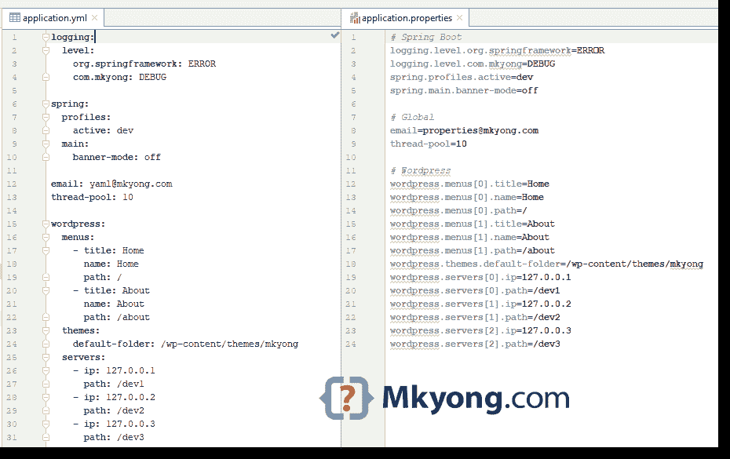
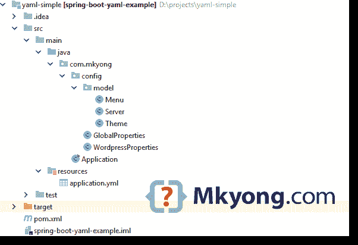

# Spring Boot YAML 的例子

> 原文：<http://web.archive.org/web/20230101150211/https://mkyong.com/spring-boot/spring-boot-yaml-example/>



在本文中，我们将向您展示如何使用 [YAML](http://web.archive.org/web/20221002151954/https://yaml.org/) 来代替 Spring Boot 中的属性文件。

测试对象:

*   Spring Boot 2.1.2 .版本
*   maven3
*   蛇瓶:1.23

简而言之，在`src/resources`文件夹中创建一个`application.yml`，Spring Boot 会自动加载并解析`.yml`文件，并将值绑定到标注有`@ConfigurationProperties`的类中

*不能使用`@PropertySource`* 加载 P.S YAML 文件

## 1.YAML 和房地产

application.yml

```
 logging:
  level:
    org.springframework: ERROR
    com.mkyong: DEBUG

spring:
  profiles:
    active: dev
  main:
    banner-mode: off

email: yaml@mkyong.com
thread-pool: 10

wordpress:
  menus:
    - title: Home
      name: Home
      path: /
    - title: About
      name: About
      path: /about
  themes:
    default-folder: /wp-content/themes/mkyong
  servers:
    - ip: 127.0.0.1
      path: /dev1
    - ip: 127.0.0.2
      path: /dev2
    - ip: 127.0.0.3
      path: /dev3 
```

application.properties

```
 # Spring Boot
logging.level.org.springframework=ERROR
logging.level.com.mkyong=DEBUG
spring.profiles.active=dev
spring.main.banner-mode=off

# Global
email=properties@mkyong.com
thread-pool=10

# WordPress
wordpress.menus[0].title=Home
wordpress.menus[0].name=Home
wordpress.menus[0].path=/
wordpress.menus[1].title=About
wordpress.menus[1].name=About
wordpress.menus[1].path=/about
wordpress.themes.default-folder=/wp-content/themes/mkyong
wordpress.servers[0].ip=127.0.0.1
wordpress.servers[0].path=/dev1
wordpress.servers[1].ip=127.0.0.2
wordpress.servers[1].path=/dev2
wordpress.servers[2].ip=127.0.0.3
wordpress.servers[2].path=/dev3 
```

## 2.项目结构



## 3.项目依赖性

Spring Boot 使用 [SnakeYAML](http://web.archive.org/web/20221002151954/http://www.snakeyaml.org/) 库解析 YAML 文件，SnakeYAML 库由`spring-boot-starter`提供

pom.xml

```
 <?xml version="1.0" encoding="UTF-8"?>
<project 
         xmlns:xsi="http://www.w3.org/2001/XMLSchema-instance"
         xsi:schemaLocation="http://maven.apache.org/POM/4.0.0
	http://maven.apache.org/xsd/maven-4.0.0.xsd">
    <modelVersion>4.0.0</modelVersion>

    <artifactId>spring-boot-yaml-example</artifactId>
    <packaging>jar</packaging>
    <name>Spring Boot YAML Example</name>
    <url>https://www.mkyong.com</url>
    <version>1.0</version>

    <parent>
        <groupId>org.springframework.boot</groupId>
        <artifactId>spring-boot-starter-parent</artifactId>
        <version>2.1.2.RELEASE</version>
    </parent>

    <properties>
        <java.version>1.8</java.version>
    </properties>

    <dependencies>
        <dependency>
            <groupId>org.springframework.boot</groupId>
            <artifactId>spring-boot-starter</artifactId>
        </dependency>
    </dependencies>

    <build>
        <plugins>
            <plugin>
                <groupId>org.springframework.boot</groupId>
                <artifactId>spring-boot-maven-plugin</artifactId>
            </plugin>

            <plugin>
                <groupId>org.apache.maven.plugins</groupId>
                <artifactId>maven-surefire-plugin</artifactId>
                <version>2.22.0</version>
            </plugin>

        </plugins>
    </build>
</project> 
```

项目依赖关系:

```
 +- org.springframework.boot:spring-boot-starter:jar:2.1.2.RELEASE:compile
[INFO] |  +- org.springframework.boot:spring-boot:jar:2.1.2.RELEASE:compile
[INFO] |  |  \- org.springframework:spring-context:jar:5.1.4.RELEASE:compile
[INFO] |  |     +- org.springframework:spring-aop:jar:5.1.4.RELEASE:compile
[INFO] |  |     +- org.springframework:spring-beans:jar:5.1.4.RELEASE:compile
[INFO] |  |     \- org.springframework:spring-expression:jar:5.1.4.RELEASE:compile
[INFO] |  +- org.springframework.boot:spring-boot-autoconfigure:jar:2.1.2.RELEASE:compile
[INFO] |  +- org.springframework.boot:spring-boot-starter-logging:jar:2.1.2.RELEASE:compile
[INFO] |  |  +- ch.qos.logback:logback-classic:jar:1.2.3:compile
[INFO] |  |  |  \- ch.qos.logback:logback-core:jar:1.2.3:compile
[INFO] |  |  +- org.apache.logging.log4j:log4j-to-slf4j:jar:2.11.1:compile
[INFO] |  |  |  \- org.apache.logging.log4j:log4j-api:jar:2.11.1:compile
[INFO] |  |  \- org.slf4j:jul-to-slf4j:jar:1.7.25:compile
[INFO] |  +- javax.annotation:javax.annotation-api:jar:1.3.2:compile
[INFO] |  +- org.springframework:spring-core:jar:5.1.4.RELEASE:compile
[INFO] |  |  \- org.springframework:spring-jcl:jar:5.1.4.RELEASE:compile
[INFO] |  \- org.yaml:snakeyaml:jar:1.23:runtime <<------------- SnakeYAML 
```

## 4.Spring Boot + YAML

4.1 Spring Boot 将加载并解析 YAML 文件，并将值绑定到下面的`@ConfigurationProperties`类中。

GlobalProperties.java

```
 package com.mkyong.config;

import org.springframework.boot.context.properties.ConfigurationProperties;
import org.springframework.stereotype.Component;

@Component
@ConfigurationProperties // no prefix, root level.
public class GlobalProperties {

    //thread-pool , relax binding
    private int threadPool;
    private String email;

    //... getters and setters, toString()
} 
```

WordPressProperties.java

```
 package com.mkyong.config;

import com.mkyong.config.model.Menu;
import com.mkyong.config.model.Server;
import com.mkyong.config.model.Theme;
import org.springframework.boot.context.properties.ConfigurationProperties;
import org.springframework.stereotype.Component;

import java.util.ArrayList;
import java.util.List;

@Component
@ConfigurationProperties("wordpress")
public class WordPressProperties {

    private List<Menu> menus = new ArrayList<>();
    private Theme themes;
    private List<Server> servers = new ArrayList<>();

    //... getters and setters, toString()
} 
```

4.2 模型，没什么特别的，就是一些标准类。

Menu.java

```
 package com.mkyong.config.model;

public class Menu {

    private String name;
    private String path;
    private String title;

    //... getters and setters, toString()
} 
```

Server.java

```
 package com.mkyong.config.model;

public class Server {

    private String ip;
    private String path;

    //... getters and setters, toString()
} 
```

Theme.java

```
 package com.mkyong.config.model;

public class Theme {

    private String defaultFolder;

    //... getters and setters, toString()
} 
```

4.3 正常启动 Spring Boot，并打印出数值。

Application.java

```
 package com.mkyong;

import com.mkyong.config.GlobalProperties;
import com.mkyong.config.WordpressProperties;
import org.springframework.beans.factory.annotation.Autowired;
import org.springframework.boot.CommandLineRunner;
import org.springframework.boot.SpringApplication;
import org.springframework.boot.autoconfigure.SpringBootApplication;

@SpringBootApplication
public class Application implements CommandLineRunner {

    @Autowired
    private WordPressProperties wpProperties;

    @Autowired
    private GlobalProperties globalProperties;

    public static void main(String[] args) {
        SpringApplication.run(Application.class, args);
    }

    @Override
    public void run(String... args) {
        System.out.println(globalProperties);
        System.out.println(wpProperties);
    }
} 
```

## 5.演示

打包并运行它。

```
 # run spring boot directly
$ mvn spring-boot:run

# or package and run it 
$ mvn package
$ java -jar target/spring-boot-yaml-example-1.0.jar 
```

输出

```
 GlobalProperties{
	threadPool=10, 
	email='properties@mkyong.com'
}

WordpressProperties{
	menus=[
		Menu{name='Home', path='/', title='Home'}, 
		Menu{name='About', path='/about', title='About'}
	], 
	themes=Theme{defaultFolder='/wp-content/themes/mkyong'}, 
	servers=[
		Server{ip='127.0.0.1', path='/dev1'}, 
		Server{ip='127.0.0.2', path='/dev2'}, 
		Server{ip='127.0.0.3', path='/dev3'}
	]
} 
```

**YAML Multi-Profiles**
Refer to this [Spring Boot + Multiple Profiles YAML example](url=https://www.mkyong.com/spring-boot/spring-boot-profile-based-properties-and-yaml-example/)

## 下载源代码

$ git clone [https://github.com/mkyong/spring-boot.git](http://web.archive.org/web/20221002151954/https://github.com/mkyong/spring-boot.git)
$ cd yaml-simple
$ mvn spring-boot:run

## 参考

*   [YAML](http://web.archive.org/web/20221002151954/https://yaml.org/)
*   [维基百科-YAML](http://web.archive.org/web/20221002151954/https://en.wikipedia.org/wiki/YAML)
*   [SnakeYAML](http://web.archive.org/web/20221002151954/http://www.snakeyaml.org/)
*   [使用 YAML 代替属性](http://web.archive.org/web/20221002151954/https://docs.spring.io/spring-boot/docs/current/reference/html/boot-features-external-config.html#boot-features-external-config-yaml)
*   [Spring Boot @配置属性示例](/web/20221002151954/https://mkyong.com/spring-boot/spring-boot-configurationproperties-example/)

<input type="hidden" id="mkyong-current-postId" value="14964">