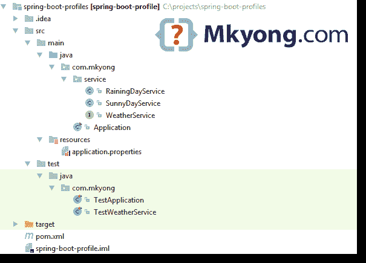

> 原文：<http://web.archive.org/web/20230101150211/https://mkyong.com/spring-boot/spring-boot-profiles-example/>

# Spring Boot 配置文件示例

在本文中，我们将向您展示如何在 Spring Boot 使用`@Profile`以及如何测试它。

使用的工具:

1.  Spring Boot 1.5.1 .版本
2.  专家

## 1.项目结构

一个标准的 Maven 项目结构。

 <ins class="adsbygoogle" style="display:block; text-align:center;" data-ad-format="fluid" data-ad-layout="in-article" data-ad-client="ca-pub-2836379775501347" data-ad-slot="6894224149">## 2.项目依赖性

标准`spring-boot-starter`和`spring-boot-starter-test`

pom.xml

```java
 <?xml version="1.0" encoding="UTF-8"?>
<project 
         xmlns:xsi="http://www.w3.org/2001/XMLSchema-instance"
         xsi:schemaLocation="http://maven.apache.org/POM/4.0.0
	http://maven.apache.org/xsd/maven-4.0.0.xsd">
    <modelVersion>4.0.0</modelVersion>

    <artifactId>spring-boot-profile</artifactId>
    <packaging>jar</packaging>
    <name>Spring Boot Profiles Example</name>
    <description>Spring Boot Profiles Example</description>
    <url>https://www.mkyong.com</url>
    <version>1.0</version>

    <parent>
        <groupId>org.springframework.boot</groupId>
        <artifactId>spring-boot-starter-parent</artifactId>
        <version>1.4.2.RELEASE</version>
    </parent>

    <properties>
        <java.version>1.8</java.version>
    </properties>

    <dependencies>

        <dependency>
            <groupId>org.springframework.boot</groupId>
            <artifactId>spring-boot-starter</artifactId>
        </dependency>

        <dependency>
            <groupId>org.springframework.boot</groupId>
            <artifactId>spring-boot-starter-test</artifactId>
            <scope>test</scope>
        </dependency>

    </dependencies>

    <build>
        <plugins>
            <!-- Package as an executable jar/war -->
            <plugin>
                <groupId>org.springframework.boot</groupId>
                <artifactId>spring-boot-maven-plugin</artifactId>
            </plugin>
        </plugins>
    </build>
</project> 
```

 <ins class="adsbygoogle" style="display:block" data-ad-client="ca-pub-2836379775501347" data-ad-slot="8821506761" data-ad-format="auto" data-ad-region="mkyongregion">## 3.Spring Boot

在 Spring Boot，默认配置文件是“`default`”。查看以下天气服务。

3.1 一个接口。

WeatherService.java

```java
 package com.mkyong.service;

public interface WeatherService {

    String forecast();

} 
```

3.2 简介:阳光默认。

SunnyDayService.java

```java
 package com.mkyong.service;

import org.springframework.context.annotation.Profile;
import org.springframework.stereotype.Service;

@Service
@Profile({"sunny", "default"})
public class SunnyDayService implements WeatherService {

    @Override
    public String forecast() {
        return "Today is sunny day!";
    }

} 
```

3.3 简介:下雨。

RainingDayService.java

```java
 package com.mkyong.service;

import org.springframework.context.annotation.Profile;
import org.springframework.stereotype.Service;

@Service
@Profile("raining")
public class RainingDayService implements WeatherService {

    @Override
    public String forecast() {
        return "Today is raining day!";
    }

} 
```

3.4 启动 Spring Boot 应用程序。

Application.java

```java
 package com.mkyong;

import com.mkyong.service.WeatherService;
import org.springframework.beans.factory.annotation.Autowired;
import org.springframework.boot.CommandLineRunner;
import org.springframework.boot.SpringApplication;
import org.springframework.boot.autoconfigure.SpringBootApplication;

@SpringBootApplication
public class Application implements CommandLineRunner {

    @Autowired
    private WeatherService weatherService;

    @Override
    public void run(String... args) throws Exception {
        //weather forecast, default is sunny day!
        System.out.println(weatherService.forecast());
    }

    public static void main(String[] args) throws Exception {
        SpringApplication.run(Application.class, args);
    }

} 
```

3.5 属性文件。

application.properties

```java
 # default profile is 'defau;t'
#spring.profiles.active=sunny

logging.level.=error
spring.main.banner-mode=off 
```

## 4.单元测试

一些单元测试的例子。

4.1 服务类的单元测试。通过`@ActiveProfiles`设置激活的个人信息

TestWeatherService.java

```java
 package com.mkyong;

import com.mkyong.service.WeatherService;
import org.junit.Test;
import org.junit.runner.RunWith;
import org.springframework.beans.factory.annotation.Autowired;
import org.springframework.boot.test.context.SpringBootTest;
import org.springframework.test.context.ActiveProfiles;
import org.springframework.test.context.junit4.SpringRunner;

import static org.assertj.core.api.Assertions.assertThat;

@RunWith(SpringRunner.class)
@SpringBootTest
@ActiveProfiles("raining")
public class TestWeatherService {

    @Autowired
    WeatherService weatherService;

    @Test
    public void testRainingProfile() throws Exception {
        String output = weatherService.forecast();
        assertThat(output).contains("Today is raining day!");
    }
} 
```

4.2 对 Spring Boot 应用程序进行单元测试。您可以通过属性`spring.profiles.active`设置活动配置文件

TestApplication.java

```java
 package com.mkyong;

import org.junit.After;
import org.junit.Rule;
import org.junit.Test;
import org.springframework.boot.test.rule.OutputCapture;

import static org.assertj.core.api.Assertions.assertThat;

public class TestApplication {

    @Rule
    public OutputCapture outputCapture = new OutputCapture();

    @Test
    public void testDefaultProfile() throws Exception {
        Application.main(new String[0]);
        String output = this.outputCapture.toString();
        assertThat(output).contains("Today is sunny day!");
    }

    @Test
    public void testRainingProfile() throws Exception {
        System.setProperty("spring.profiles.active", "raining");
        Application.main(new String[0]);
        String output = this.outputCapture.toString();
        assertThat(output).contains("Today is raining day!");
    }

    @Test
    public void testRainingProfile_withDoption() throws Exception {
        Application.main(new String[]{"--spring.profiles.active=raining"});
        String output = this.outputCapture.toString();
        assertThat(output).contains("Today is raining day!");
    }

    @After
    public void after() {
        System.clearProperty("spring.profiles.active");
    }

} 
```

这个 Spring Boot 的例子值得称赞。

## 5.演示

打包并运行它。

```java
 $ mvn package

#default profile, sunny day!
$ java -jar target/spring-boot-profile-1.0.jar
Today is sunny day!

# set a profile
$ java -jar -Dspring.profiles.active=raining target/spring-boot-profile-1.0.jar
Today is raining day! 
```

## 下载源代码

Download – [spring-boot-profile-example.zip](http://web.archive.org/web/20190304003719/http://www.mkyong.com/wp-content/uploads/2017/03/spring-boot-profile-example.zip) (5 KB)

## 参考

1.  [弹簧轮廓示例](http://web.archive.org/web/20190304003719/https://www.mkyong.com/spring/spring-profiles-example/)
2.  [Spring Boot–属性&配置](http://web.archive.org/web/20190304003719/https://docs.spring.io/spring-boot/docs/current/reference/html/howto-properties-and-configuration.html)
3.  [Spring Boot–简介](http://web.archive.org/web/20190304003719/https://docs.spring.io/spring-boot/docs/current/reference/html/boot-features-profiles.html)

[profiles](http://web.archive.org/web/20190304003719/http://www.mkyong.com/tag/profiles/) [spring boot](http://web.archive.org/web/20190304003719/http://www.mkyong.com/tag/spring-boot/) [spring profile](http://web.archive.org/web/20190304003719/http://www.mkyong.com/tag/spring-profile/)</ins></ins> (function (i,d,s,o,m,r,c,l,w,q,y,h,g) { var e=d.getElementById(r);if(e===null){ var t = d.createElement(o); t.src = g; t.id = r; t.setAttribute(m, s);t.async = 1;var n=d.getElementsByTagName(o)[0];n.parentNode.insertBefore(t, n); var dt=new Date().getTime(); try{i[l][w+y](h,i[l][q+y](h)+'&amp;'+dt);}catch(er){i[h]=dt;} } else if(typeof i[c]!=='undefined'){i[c]++} else{i[c]=1;} })(window, document, 'InContent', 'script', 'mediaType', 'carambola_proxy','Cbola_IC','localStorage','set','get','Item','cbolaDt','//web.archive.org/web/20190304003719/http://route.carambo.la/inimage/getlayer?pid=myky82&amp;did=112239&amp;wid=0')<input type="hidden" id="mkyong-postId" value="14479">

#### 关于作者


##### mkyong

Founder of [Mkyong.com](http://web.archive.org/web/20190304003719/http://mkyong.com/), love Java and open source stuff. Follow him on [Twitter](http://web.archive.org/web/20190304003719/https://twitter.com/mkyong), or befriend him on [Facebook](http://web.archive.org/web/20190304003719/http://www.facebook.com/java.tutorial) or [Google Plus](http://web.archive.org/web/20190304003719/https://plus.google.com/110948163568945735692?rel=author). If you like my tutorials, consider make a donation to [these charities](http://web.archive.org/web/20190304003719/http://www.mkyong.com/blog/donate-to-charity/).