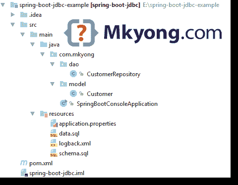
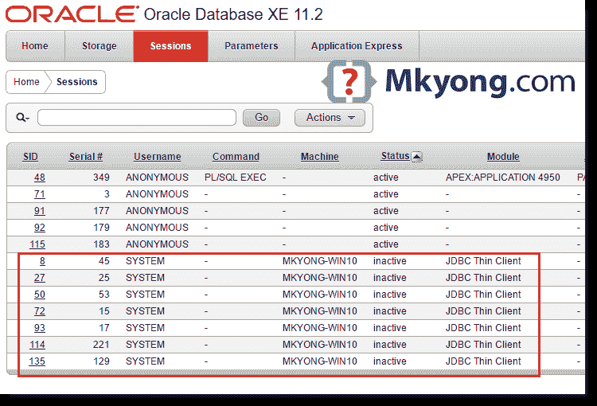

> 原文：<http://web.archive.org/web/20230101150211/https://mkyong.com/spring-boot/spring-boot-jdbc-oracle-database-commons-dbcp2-example/>

# Spring Boot JDBC + Oracle 数据库+ Commons DBCP2 示例

在本文中，我们将向您展示如何创建一个 Spring Boot JDBC 应用程序+ Oracle 数据库+ Commons DBCP2 连接池。

本文中使用的工具:

1.  Spring Boot 1.5.1 .版本
2.  Oracle 数据库 11g 快速版
3.  Oracle JDBC 驱动程序 ojdbc7.jar
4.  通用 DBCP2 2.1.1
5.  专家
6.  Java 8

**Note**
Related – [Spring Boot JDBC + MySQL + HikariCP example](http://web.archive.org/web/20190303233325/http://www.mkyong.com/spring-boot/spring-boot-jdbc-mysql-hikaricp-example/)

## 1.项目结构

一个标准的 Maven 项目结构。

 <ins class="adsbygoogle" style="display:block; text-align:center;" data-ad-format="fluid" data-ad-layout="in-article" data-ad-client="ca-pub-2836379775501347" data-ad-slot="6894224149">## 2.项目依赖性

**Download and Install Oracle JDBC driver.**
Oracle license restriction, you can’t get the Oracle JDBC driver from the public Maven repository. Instead, you need to go the Oracle website to download the driver and [install into the Local Maven repository manually](http://web.archive.org/web/20190303233325/https://www.mkyong.com/maven/how-to-add-oracle-jdbc-driver-in-your-maven-local-repository/).

声明 Spring Boot JDBC `spring-boot-starter-jdbc`、Oracle JDBC 驱动程序(手动安装)`ojdbc7`和公共 DBCP2 连接池。

pom.xml

```
 <project 
         xmlns:xsi="http://www.w3.org/2001/XMLSchema-instance"
         xsi:schemaLocation="http://maven.apache.org/POM/4.0.0
  http://maven.apache.org/maven-v4_0_0.xsd">
    <modelVersion>4.0.0</modelVersion>

    <groupId>com.mkyong</groupId>
    <artifactId>spring-boot-jdbc</artifactId>
    <packaging>jar</packaging>
    <version>1.0</version>

    <parent>
        <groupId>org.springframework.boot</groupId>
        <artifactId>spring-boot-starter-parent</artifactId>
        <version>1.5.1.RELEASE</version>
    </parent>

    <properties>
        <java.version>1.8</java.version>
    </properties>

    <dependencies>

        <dependency>
            <groupId>org.springframework.boot</groupId>
            <artifactId>spring-boot-starter</artifactId>
        </dependency>

		<!-- Exclude teh default Tomcat connection pool -->
        <dependency>
            <groupId>org.springframework.boot</groupId>
            <artifactId>spring-boot-starter-jdbc</artifactId>
            <exclusions>
                <exclusion>
                    <groupId>org.apache.tomcat</groupId>
                    <artifactId>tomcat-jdbc</artifactId>
                </exclusion>
            </exclusions>
        </dependency>

        <!-- Oracle JDBC driver -->
        <dependency>
            <groupId>com.oracle</groupId>
            <artifactId>ojdbc7</artifactId>
            <version>12.1.0</version>
        </dependency>

        <!-- Common DBCP2 connection pool -->
        <dependency>
            <groupId>org.apache.commons</groupId>
            <artifactId>commons-dbcp2</artifactId>
            <version>2.1.1</version>
        </dependency>

    </dependencies>

    <build>
        <plugins>
            <!-- Package as an executable jar/war -->
            <plugin>
                <groupId>org.springframework.boot</groupId>
                <artifactId>spring-boot-maven-plugin</artifactId>
            </plugin>

        </plugins>
    </build>

</project> 
```

Terminal

```
 $ mvn dependency:tree
[INFO] Scanning for projects...
[INFO]
[INFO] ------------------------------------------------------------------------
[INFO] Building spring-boot-jdbc 1.0
[INFO] ------------------------------------------------------------------------
[INFO]
[INFO] --- maven-dependency-plugin:2.10:tree (default-cli) @ spring-boot-jdbc ---
[INFO] com.mkyong:spring-boot-jdbc:jar:1.0
[INFO] +- org.springframework.boot:spring-boot-starter:jar:1.5.1.RELEASE:compile
[INFO] |  +- org.springframework.boot:spring-boot:jar:1.5.1.RELEASE:compile
[INFO] |  |  \- org.springframework:spring-context:jar:4.3.6.RELEASE:compile
[INFO] |  |     +- org.springframework:spring-aop:jar:4.3.6.RELEASE:compile
[INFO] |  |     \- org.springframework:spring-expression:jar:4.3.6.RELEASE:compile
[INFO] |  +- org.springframework.boot:spring-boot-autoconfigure:jar:1.5.1.RELEASE:compile
[INFO] |  +- org.springframework.boot:spring-boot-starter-logging:jar:1.5.1.RELEASE:compile
[INFO] |  |  +- ch.qos.logback:logback-classic:jar:1.1.9:compile
[INFO] |  |  |  +- ch.qos.logback:logback-core:jar:1.1.9:compile
[INFO] |  |  |  \- org.slf4j:slf4j-api:jar:1.7.22:compile
[INFO] |  |  +- org.slf4j:jcl-over-slf4j:jar:1.7.22:compile
[INFO] |  |  +- org.slf4j:jul-to-slf4j:jar:1.7.22:compile
[INFO] |  |  \- org.slf4j:log4j-over-slf4j:jar:1.7.22:compile
[INFO] |  +- org.springframework:spring-core:jar:4.3.6.RELEASE:compile
[INFO] |  \- org.yaml:snakeyaml:jar:1.17:runtime
[INFO] +- org.springframework.boot:spring-boot-starter-jdbc:jar:1.5.1.RELEASE:compile
[INFO] |  \- org.springframework:spring-jdbc:jar:4.3.6.RELEASE:compile
[INFO] |     +- org.springframework:spring-beans:jar:4.3.6.RELEASE:compile
[INFO] |     \- org.springframework:spring-tx:jar:4.3.6.RELEASE:compile
[INFO] +- com.oracle:ojdbc7:jar:12.1.0:compile
[INFO] \- org.apache.commons:commons-dbcp2:jar:2.1.1:compile
[INFO]    +- org.apache.commons:commons-pool2:jar:2.4.2:compile
[INFO]    \- commons-logging:commons-logging:jar:1.2:compile
[INFO] ------------------------------------------------------------------------ 
```

**Database Connection Pooling**
Spring Boot uses Tomcat pooling `tomcat-jdbc` by default, and follow this sequence to find the connection pool :

```
 Tomcat pool -->> - HikariCP -->>  Commons DBCP -->>  Commons DBCP2 
```

阅读 Spring Boot 官方文档—[连接到生产数据库](http://web.archive.org/web/20190303233325/https://docs.spring.io/spring-boot/docs/current/reference/html/boot-features-sql.html#boot-features-connect-to-production-database)

 <ins class="adsbygoogle" style="display:block" data-ad-client="ca-pub-2836379775501347" data-ad-slot="8821506761" data-ad-format="auto" data-ad-region="mkyongregion">## 3.JDBC 模板

3.1 Spring Boot 会自动注册一个`JdbcTemplate` bean，只需将它注入你的 bean 中。

CustomerRepository.java

```
 package com.mkyong.dao;

import com.mkyong.model.Customer;
import org.springframework.beans.factory.annotation.Autowired;
import org.springframework.jdbc.core.JdbcTemplate;
import org.springframework.stereotype.Repository;

import java.util.List;

@Repository
public class CustomerRepository {

    @Autowired
    private JdbcTemplate jdbcTemplate;

	// thanks Java 8, look the custom RowMapper
    public List<Customer> findAll() {

        List<Customer> result = jdbcTemplate.query(
                "SELECT id, name, email, created_date FROM customer",
                (rs, rowNum) -> new Customer(rs.getInt("id"),
                        rs.getString("name"), rs.getString("email"), rs.getDate("created_date"))
        );

        return result;

    }

} 
```

3.2 客户模型。

Customer.java

```
 package com.mkyong.model;

import java.util.Date;

public class Customer {

    int id;
    String name;
    String email;
    Date date;

    public Customer(int id, String name, String email, Date date) {
        this.id = id;
        this.name = name;
        this.email = email;
        this.date = date;
    }

    //getters and setters and toString...
} 
```

## 4.数据库初始化

默认情况下，Spring boot 启用数据源初始化器，并从类路径的根加载 SQL 脚本–`schema.sql`和`data.sql`。

4.1 创建`customer`表的 SQL 脚本。

schema.sql

```
 CREATE TABLE CUSTOMER(
ID NUMBER(10) NOT NULL,
NAME VARCHAR2(100) NOT NULL,
EMAIL VARCHAR2(100) NOT NULL,
CREATED_DATE DATE NOT NULL,
CONSTRAINT CUSTOMER_PK PRIMARY KEY (ID)
); 
```

4.2 向`customer`表中插入 3 行的 SQL 脚本。

data.sql

```
 INSERT INTO "CUSTOMER" (ID, NAME, EMAIL, CREATED_DATE) VALUES(1, 'mkyong','111@yahoo.com', TO_DATE('2017-02-11', 'yyyy-mm-dd'));
INSERT INTO "CUSTOMER" (ID, NAME, EMAIL, CREATED_DATE) VALUES(2, 'yflow','222@yahoo.com', TO_DATE('2017-02-12', 'yyyy-mm-dd'));
INSERT INTO "CUSTOMER" (ID, NAME, EMAIL, CREATED_DATE) VALUES(3, 'zilap','333@yahoo.com', TO_DATE('2017-02-13', 'yyyy-mm-dd')); 
```

**Note**
Read this – [Spring Database initialization](http://web.archive.org/web/20190303233325/https://docs.spring.io/spring-boot/docs/current/reference/html/howto-database-initialization.html)

## 5.配置

配置 Oracle 和 [dbcp2 设置](http://web.archive.org/web/20190303233325/https://commons.apache.org/proper/commons-dbcp/configuration.html)。

application.properties

```
 spring.main.banner-mode=off

# Set true for first time db initialization.
spring.datasource.initialize=true

spring.datasource.url=jdbc:oracle:thin:@localhost:1521:xe
spring.datasource.username=system
spring.datasource.password=password
spring.datasource.driver-class-oracle.jdbc.driver.OracleDriver

# dbcp2 settings
# spring.datasource.dbcp2.*

spring.datasource.dbcp2.initial-size=7
spring.datasource.dbcp2.max-total=20
spring.datasource.dbcp2.pool-prepared-statements=true 
```

## 6.@SpringBootApplication

Spring Boot 命令行应用程序

SpringBootConsoleApplication.java

```
 package com.mkyong;

import com.mkyong.dao.CustomerRepository;
import com.mkyong.model.Customer;
import org.springframework.beans.factory.annotation.Autowired;
import org.springframework.boot.CommandLineRunner;
import org.springframework.boot.SpringApplication;
import org.springframework.boot.autoconfigure.SpringBootApplication;

import javax.sql.DataSource;
import java.util.List;

import static java.lang.System.exit;

@SpringBootApplication
public class SpringBootConsoleApplication implements CommandLineRunner {

    @Autowired
    DataSource dataSource;

    @Autowired
    CustomerRepository customerRepository;

    public static void main(String[] args) throws Exception {
        SpringApplication.run(SpringBootConsoleApplication.class, args);
    }

    @Override
    public void run(String... args) throws Exception {

        System.out.println("DATASOURCE = " + dataSource);

        /// Get dbcp2 datasource settings
        // BasicDataSource newds = (BasicDataSource) dataSource;
        // System.out.println("BasicDataSource = " + newds.getInitialSize());

        System.out.println("Display all customers...");
        List<Customer> list = customerRepository.findAll();
        list.forEach(x -> System.out.println(x));

        System.out.println("Done!");

        exit(0);
    }
} 
```

## 7.演示

运行它，Spring Boot 自动加载`schema.sql`和`data.sql`脚本，并显示结果。

Terminal

```
 DATASOURCE = org.apache.commons.dbcp2.BasicDataSource@4eb386df
Display all customers...
Customer{id=1, name='mkyong', email='111@yahoo.com', date=2017-02-11}
Customer{id=2, name='yflow', email='222@yahoo.com', date=2017-02-12}
Customer{id=3, name='zilap', email='333@yahoo.com', date=2017-02-13}
Done! 
```

如果在调试会话中设置了断点，请查看 Oracle web admin 会话页。



## 下载源代码

Download – [spring-boot-jdbc-oracle-example.zip](http://web.archive.org/web/20190303233325/http://www.mkyong.com/wp-content/uploads/2017/02/spring-boot-jdbc-oracle-example.zip) (7 KB)

## 参考

1.  [Maven 安装甲骨文 JDBC 驱动](http://web.archive.org/web/20190303233325/https://www.mkyong.com/maven/how-to-add-oracle-jdbc-driver-in-your-maven-local-repository/)
2.  [通过 JDBC 驱动程序连接到 Oracle 数据库](http://web.archive.org/web/20190303233325/http://www.mkyong.com/jdbc/connect-to-oracle-db-via-jdbc-driver-java/)
3.  [Spring Boot——使用 SQL 数据库](http://web.archive.org/web/20190303233325/https://docs.spring.io/spring-boot/docs/current/reference/html/boot-features-sql.html)
4.  [Spring Boot–数据库初始化](http://web.archive.org/web/20190303233325/https://docs.spring.io/spring-boot/docs/current/reference/html/howto-database-initialization.html)
5.  [Spring Boot 常用应用属性](http://web.archive.org/web/20190303233325/http://docs.spring.io/spring-boot/docs/current/reference/html/common-application-properties.html)
6.  [OracleDriver 文档](http://web.archive.org/web/20190303233325/http://docs.oracle.com/cd/E11882_01/appdev.112/e13995/oracle/jdbc/OracleDriver.html)
7.  [Oracle 数据库 12.1.0.2 JDBC 驱动& UCP 下载](http://web.archive.org/web/20190303233325/http://www.oracle.com/technetwork/database/features/jdbc/default-2280470.html)
8.  [在 Oracle 数据库中使用 Java】](http://web.archive.org/web/20190303233325/https://docs.oracle.com/cd/E11882_01/appdev.112/e12137/introduction.htm#TDPJD102)
9.  [Commons DBCP2 配置参数](http://web.archive.org/web/20190303233325/https://commons.apache.org/proper/commons-dbcp/configuration.html)

[connection pool](http://web.archive.org/web/20190303233325/http://www.mkyong.com/tag/connection-pool/) [dbcp2](http://web.archive.org/web/20190303233325/http://www.mkyong.com/tag/dbcp2/) [jdbc](http://web.archive.org/web/20190303233325/http://www.mkyong.com/tag/jdbc/) [oracle](http://web.archive.org/web/20190303233325/http://www.mkyong.com/tag/oracle/) [spring boot](http://web.archive.org/web/20190303233325/http://www.mkyong.com/tag/spring-boot/) [spring jdbc](http://web.archive.org/web/20190303233325/http://www.mkyong.com/tag/spring-jdbc/)</ins></ins> (function (i,d,s,o,m,r,c,l,w,q,y,h,g) { var e=d.getElementById(r);if(e===null){ var t = d.createElement(o); t.src = g; t.id = r; t.setAttribute(m, s);t.async = 1;var n=d.getElementsByTagName(o)[0];n.parentNode.insertBefore(t, n); var dt=new Date().getTime(); try{i[l][w+y](h,i[l][q+y](h)+'&amp;'+dt);}catch(er){i[h]=dt;} } else if(typeof i[c]!=='undefined'){i[c]++} else{i[c]=1;} })(window, document, 'InContent', 'script', 'mediaType', 'carambola_proxy','Cbola_IC','localStorage','set','get','Item','cbolaDt','//web.archive.org/web/20190303233325/http://route.carambo.la/inimage/getlayer?pid=myky82&amp;did=112239&amp;wid=0')<input type="hidden" id="mkyong-postId" value="14450">

#### 关于作者


##### mkyong

Founder of [Mkyong.com](http://web.archive.org/web/20190303233325/http://mkyong.com/), love Java and open source stuff. Follow him on [Twitter](http://web.archive.org/web/20190303233325/https://twitter.com/mkyong), or befriend him on [Facebook](http://web.archive.org/web/20190303233325/http://www.facebook.com/java.tutorial) or [Google Plus](http://web.archive.org/web/20190303233325/https://plus.google.com/110948163568945735692?rel=author). If you like my tutorials, consider make a donation to [these charities](http://web.archive.org/web/20190303233325/http://www.mkyong.com/blog/donate-to-charity/).