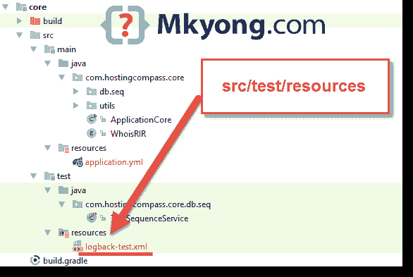

# Spring Boot 测试–如何禁用调试和信息日志

> 原文：<http://web.archive.org/web/20230101150211/https://mkyong.com/spring-boot/spring-boot-test-how-to-stop-debug-logs/>

运行 Spring Boot 集成测试或单元测试，许多恼人的调试和信息日志显示在控制台中。

用 Spring Boot 2 号进行了测试

Console

```
 2019-03-04 13:15:25.151  INFO   --- [           main] .b.t.c.SpringBootTestContextBootstrapper : 
2019-03-04 13:15:25.157  INFO   --- [           main] o.s.t.c.support.AbstractContextLoader    : 
2019-03-04 13:15:25.158  INFO   --- [           main] t.c.s.AnnotationConfigContextLoaderUtils : 
2019-03-04 13:15:25.298  INFO   --- [           main] .b.t.c.SpringBootTestContextBootstrapper : 
2019-03-04 13:15:25.401  INFO   --- [           main] .b.t.c.SpringBootTestContextBootstrapper : 
2019-03-04 13:15:25.430  INFO   --- [           main] .b.t.c.SpringBootTestContextBootstrapper : 

  .   ____          _            __ _ _
 /\\ / ___'_ __ _ _(_)_ __  __ _ \ \ \ \
( ( )\___ | '_ | '_| | '_ \/ _` | \ \ \ \
 \\/  ___)| |_)| | | | | || (_| |  ) ) ) )
  '  |____| .__|_| |_|_| |_\__, | / / / /
 =========|_|==============|___/=/_/_/_/
 :: Spring Boot ::        (v2.1.2.RELEASE)

2019-03-04 13:15:25.886 DEBUG 7484 --- [           main] o.s.boot.SpringApplication               : 
2019-03-04 13:15:25.903 DEBUG 7484 --- [           main] o.s.b.c.c.ConfigFileApplicationListener  : 
2019-03-04 13:15:25.904 DEBUG 7484 --- [           main] o.s.b.c.c.ConfigFileApplicationListener  : 
2019-03-04 13:15:25.904 DEBUG 7484 --- [           main] o.s.b.c.c.ConfigFileApplicationListener  : 
2019-03-04 13:15:25.905 DEBUG 7484 --- [           main] o.s.w.c.s.GenericWebApplicationContext   : 
2019-03-04 13:15:25.922 DEBUG 7484 --- [           main] o.s.b.f.s.DefaultListableBeanFactory     : 
2019-03-04 13:15:25.937 DEBUG 7484 --- [           main] o.s.b.f.s.DefaultListableBeanFactory     : 
2019-03-04 13:15:26.004 DEBUG 7484 --- [           main] o.s.c.a.ClassPathBeanDefinitionScanner   : 
```

## 解决办法

要禁用日志，关闭`application.properties`和`logback-test.xml`中的`logging.level`

1.1 在`application.properties`中关闭记录

application.properties

```
 logging.level.org.springframework=OFF
logging.level.root=OFF 
```

Spring 横幅下面的调试或信息日志现在关闭了。

Console

```
 2019-03-04 13:15:25.151  INFO   --- [           main] .b.t.c.SpringBootTestContextBootstrapper : 
2019-03-04 13:15:25.157  INFO   --- [           main] o.s.t.c.support.AbstractContextLoader    : 
2019-03-04 13:15:25.158  INFO   --- [           main] t.c.s.AnnotationConfigContextLoaderUtils : 
2019-03-04 13:15:25.298  INFO   --- [           main] .b.t.c.SpringBootTestContextBootstrapper : 
2019-03-04 13:15:25.401  INFO   --- [           main] .b.t.c.SpringBootTestContextBootstrapper : 
2019-03-04 13:15:25.430  INFO   --- [           main] .b.t.c.SpringBootTestContextBootstrapper : 

  .   ____          _            __ _ _
 /\\ / ___'_ __ _ _(_)_ __  __ _ \ \ \ \
( ( )\___ | '_ | '_| | '_ \/ _` | \ \ \ \
 \\/  ___)| |_)| | | | | || (_| |  ) ) ) )
  '  |____| .__|_| |_|_| |_\__, | / / / /
 =========|_|==============|___/=/_/_/_/
 :: Spring Boot ::        (v2.1.2.RELEASE) 
```

1.2 在`src/test/resources`中创建一个`logback-test.xml`。同样，在这里关闭日志记录。

logback-test.xml

```
 <?xml version="1.0" encoding="UTF-8"?>
<configuration>
    <include resource="org/springframework/boot/logging/logback/base.xml" />
    <logger name="org.springframework" level="OFF"/>
</configuration> 
```

好，就留下春横幅。

Console

```
 .   ____          _            __ _ _
 /\\ / ___'_ __ _ _(_)_ __  __ _ \ \ \ \
( ( )\___ | '_ | '_| | '_ \/ _` | \ \ \ \
 \\/  ___)| |_)| | | | | || (_| |  ) ) ) )
  '  |____| .__|_| |_|_| |_\__, | / / / /
 =========|_|==============|___/=/_/_/_/
 :: Spring Boot ::        (v2.1.2.RELEASE) 
```

1.3 关闭弹簧横幅。

application.properties

```
 logging.level.org.springframework=OFF
logging.level.root=OFF
spring.main.banner-mode=off 
```

完成，控制台现在应该是空的。

## 参考

*   [Spring Boot——伐木](http://web.archive.org/web/20221004081031/https://docs.spring.io/spring-boot/docs/current/reference/html/howto-logging.html)
*   [测试 Spring Boot 应用](http://web.archive.org/web/20221004081031/https://docs.spring.io/spring-boot/docs/current/reference/html/boot-features-testing.html#boot-features-testing-spring-boot-applications)
*   [logback.xml 示例](/web/20221004081031/https://mkyong.com/logging/logback-xml-example/)
*   [log back–在单元测试中禁用日志记录](/web/20221004081031/https://mkyong.com/logging/logback-disable-logging-in-unit-test/)

<input type="hidden" id="mkyong-current-postId" value="14477">