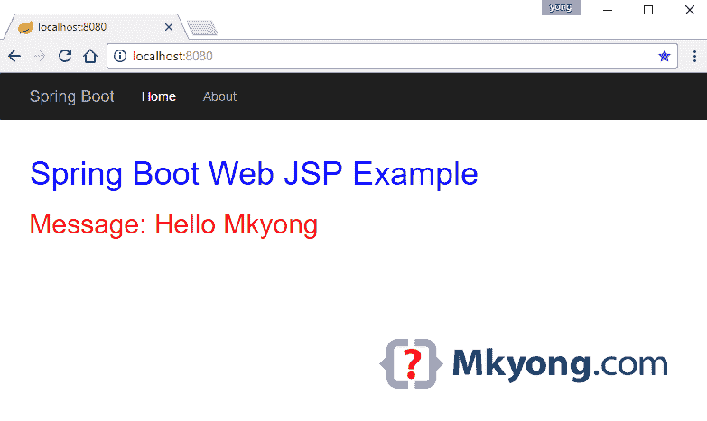

# Spring Boot Hello World 示例 JSP

> 原文：<http://web.archive.org/web/20230101150211/https://mkyong.com/spring-boot/spring-boot-hello-world-example-jsp/>

一个 [Spring Boot](http://web.archive.org/web/20220815221140/https://projects.spring.io/spring-boot/) 的 web 应用例子，使用`embedded Tomcat + JSP template`，并打包成一个可执行的 WAR 文件。

使用的技术:

1.  Spring Boot 1.4.2 版本
2.  弹簧 4.3.4 释放
3.  Tomcat Embed 8.5.6
4.  maven3
5.  Java 8

## 1.项目目录

手动创建以下文件夹:


## 2.项目相关性

Maven 例子。阅读注释，了解更多信息。

pom.xml

```
 <?xml version="1.0" encoding="UTF-8"?>
<project  
	xmlns:xsi="http://www.w3.org/2001/XMLSchema-instance"
	xsi:schemaLocation="http://maven.apache.org/POM/4.0.0 
	http://maven.apache.org/xsd/maven-4.0.0.xsd">
	<modelVersion>4.0.0</modelVersion>

	<artifactId>spring-boot-web-jsp</artifactId>
	<packaging>war</packaging>
	<name>Spring Boot Web JSP Example</name>
	<description>Spring Boot Web JSP Example</description>
	<url>https://www.mkyong.com</url>
	<version>1.0</version>

	<parent>
		<groupId>org.springframework.boot</groupId>
		<artifactId>spring-boot-starter-parent</artifactId>
		<version>1.4.2.RELEASE</version>
	</parent>

	<properties>
		<java.version>1.8</java.version>
	</properties>

	<dependencies>

		<!-- This is a web application -->
		<dependency>
			<groupId>org.springframework.boot</groupId>
			<artifactId>spring-boot-starter-web</artifactId>
		</dependency>

		<!-- Tomcat embedded container-->
		<dependency>
			<groupId>org.springframework.boot</groupId>
			<artifactId>spring-boot-starter-tomcat</artifactId>
			<scope>provided</scope>
		</dependency>

		<!-- JSTL for JSP -->
		<dependency>
			<groupId>javax.servlet</groupId>
			<artifactId>jstl</artifactId>
		</dependency>

		<!-- Need this to compile JSP -->
		<dependency>
			<groupId>org.apache.tomcat.embed</groupId>
			<artifactId>tomcat-embed-jasper</artifactId>
			<scope>provided</scope>
		</dependency>

		<!-- Need this to compile JSP, 
			tomcat-embed-jasper version is not working, no idea why -->
		<dependency>
			<groupId>org.eclipse.jdt.core.compiler</groupId>
			<artifactId>ecj</artifactId>
			<version>4.6.1</version>
			<scope>provided</scope>
		</dependency>

		<!-- Optional, test for static content, bootstrap CSS-->
		<dependency>
			<groupId>org.webjars</groupId>
			<artifactId>bootstrap</artifactId>
			<version>3.3.7</version>
		</dependency>

	</dependencies>
	<build>
		<plugins>
			<!-- Package as an executable jar/war -->
			<plugin>
				<groupId>org.springframework.boot</groupId>
				<artifactId>spring-boot-maven-plugin</artifactId>
			</plugin>
		</plugins>
	</build>
</project> 
```

显示项目部门:

```
 $ mvn dependency:tree

[INFO] Scanning for projects...
[INFO]
[INFO] ------------------------------------------------------------------------
[INFO] Building Spring Boot Web JSP Example 1.0
[INFO] ------------------------------------------------------------------------
[INFO]
[INFO] --- maven-dependency-plugin:2.10:tree (default-cli) @ spring-boot-web-jsp ---
[INFO] org.springframework.boot:spring-boot-web-jsp:war:1.0
[INFO] +- org.springframework.boot:spring-boot-starter-web:jar:1.4.2.RELEASE:compile
[INFO] |  +- org.springframework.boot:spring-boot-starter:jar:1.4.2.RELEASE:compile
[INFO] |  |  +- org.springframework.boot:spring-boot:jar:1.4.2.RELEASE:compile
[INFO] |  |  +- org.springframework.boot:spring-boot-autoconfigure:jar:1.4.2.RELEASE:compile
[INFO] |  |  +- org.springframework.boot:spring-boot-starter-logging:jar:1.4.2.RELEASE:compile
[INFO] |  |  |  +- ch.qos.logback:logback-classic:jar:1.1.7:compile
[INFO] |  |  |  |  +- ch.qos.logback:logback-core:jar:1.1.7:compile
[INFO] |  |  |  |  \- org.slf4j:slf4j-api:jar:1.7.21:compile
[INFO] |  |  |  +- org.slf4j:jcl-over-slf4j:jar:1.7.21:compile
[INFO] |  |  |  +- org.slf4j:jul-to-slf4j:jar:1.7.21:compile
[INFO] |  |  |  \- org.slf4j:log4j-over-slf4j:jar:1.7.21:compile
[INFO] |  |  +- org.springframework:spring-core:jar:4.3.4.RELEASE:compile
[INFO] |  |  \- org.yaml:snakeyaml:jar:1.17:runtime
[INFO] |  +- org.hibernate:hibernate-validator:jar:5.2.4.Final:compile
[INFO] |  |  +- javax.validation:validation-api:jar:1.1.0.Final:compile
[INFO] |  |  +- org.jboss.logging:jboss-logging:jar:3.3.0.Final:compile
[INFO] |  |  \- com.fasterxml:classmate:jar:1.3.3:compile
[INFO] |  +- com.fasterxml.jackson.core:jackson-databind:jar:2.8.4:compile
[INFO] |  |  +- com.fasterxml.jackson.core:jackson-annotations:jar:2.8.4:compile
[INFO] |  |  \- com.fasterxml.jackson.core:jackson-core:jar:2.8.4:compile
[INFO] |  +- org.springframework:spring-web:jar:4.3.4.RELEASE:compile
[INFO] |  |  +- org.springframework:spring-aop:jar:4.3.4.RELEASE:compile
[INFO] |  |  +- org.springframework:spring-beans:jar:4.3.4.RELEASE:compile
[INFO] |  |  \- org.springframework:spring-context:jar:4.3.4.RELEASE:compile
[INFO] |  \- org.springframework:spring-webmvc:jar:4.3.4.RELEASE:compile
[INFO] |     \- org.springframework:spring-expression:jar:4.3.4.RELEASE:compile
[INFO] +- org.springframework.boot:spring-boot-starter-tomcat:jar:1.4.2.RELEASE:provided
[INFO] |  +- org.apache.tomcat.embed:tomcat-embed-core:jar:8.5.6:provided
[INFO] |  +- org.apache.tomcat.embed:tomcat-embed-el:jar:8.5.6:provided
[INFO] |  \- org.apache.tomcat.embed:tomcat-embed-websocket:jar:8.5.6:provided
[INFO] +- javax.servlet:jstl:jar:1.2:compile
[INFO] +- org.apache.tomcat.embed:tomcat-embed-jasper:jar:8.5.6:provided
[INFO] +- org.eclipse.jdt.core.compiler:ecj:jar:4.6.1:provided
[INFO] \- org.webjars:bootstrap:jar:3.3.7:compile
[INFO]    \- org.webjars:jquery:jar:1.11.1:compile
[INFO] ------------------------------------------------------------------------
[INFO] BUILD SUCCESS
[INFO] ------------------------------------------------------------------------
[INFO] Total time: 1.327 s
[INFO] Finished at: 2016-11-28T16:57:00+08:00
[INFO] Final Memory: 20M/309M
[INFO] ------------------------------------------------------------------------ 
```

## 3.弹簧弹簧

3.1 这个`SpringBootServletInitializer`运行一个来自传统战争部署的`SpringApplication`

SpringBootWebApplication.java

```
 package com.mkyong;

import org.springframework.boot.SpringApplication;
import org.springframework.boot.autoconfigure.SpringBootApplication;
import org.springframework.boot.builder.SpringApplicationBuilder;
import org.springframework.boot.web.support.SpringBootServletInitializer;

@SpringBootApplication
public class SpringBootWebApplication extends SpringBootServletInitializer {

	@Override
	protected SpringApplicationBuilder configure(SpringApplicationBuilder application) {
		return application.sources(SpringBootWebApplication.class);
	}

	public static void main(String[] args) throws Exception {
		SpringApplication.run(SpringBootWebApplication.class, args);
	}

} 
```

3.2 一个简单的 Spring 控制器类。

WelcomeController.java

```
 package com.mkyong;

import java.util.Map;

import org.springframework.beans.factory.annotation.Value;
import org.springframework.stereotype.Controller;
import org.springframework.web.bind.annotation.RequestMapping;

@Controller
public class WelcomeController {

	// inject via application.properties
	@Value("${welcome.message:test}")
	private String message = "Hello World";

	@RequestMapping("/")
	public String welcome(Map<String, Object> model) {
		model.put("message", this.message);
		return "welcome";
	}

} 
```

## 4.JSP +资源+静态文件

4.1 对于 JSP 文件，放入`src/main/webapp/WEB-INF/jsp/`

src/main/webapp/WEB-INF/jsp/welcome.jsp

```
 <!DOCTYPE html>
<%@ taglib prefix="spring" uri="http://www.springframework.org/tags"%>
<%@ taglib prefix="c" uri="http://java.sun.com/jsp/jstl/core"%>
<html lang="en">
<head>

	<!-- Access the bootstrap Css like this, 
		Spring boot will handle the resource mapping automcatically -->
	<link rel="stylesheet" type="text/css" href="webjars/bootstrap/3.3.7/css/bootstrap.min.css" />

	<!-- 
	<spring:url value="/css/main.css" var="springCss" />
	<link href="${springCss}" rel="stylesheet" />
	 -->
	<c:url value="/css/main.css" var="jstlCss" />
	<link href="${jstlCss}" rel="stylesheet" />

</head>
<body>

	<nav class="navbar navbar-inverse">
		<div class="container">
			<div class="navbar-header">
				<a class="navbar-brand" href="#">Spring Boot</a>
			</div>
			<div id="navbar" class="collapse navbar-collapse">
				<ul class="nav navbar-nav">
					<li class="active"><a href="#">Home</a></li>
					<li><a href="#about">About</a></li>
				</ul>
			</div>
		</div>
	</nav>

	<div class="container">

		<div class="starter-template">
			<h1>Spring Boot Web JSP Example</h1>
			<h2>Message: ${message}</h2>
		</div>

	</div>

	<script type="text/javascript" src="webjars/bootstrap/3.3.7/js/bootstrap.min.js"></script>

</body>

</html> 
```

4.2 对于 CSS 或 Javascript 等静态文件，放入`/src/main/resources/static/`

/src/main/resources/static/css/main.css

```
 h1{
	color:#0000FF;
}

h2{
	color:#FF0000;
} 
```

4.3 对于属性文件，输入`/src/main/resources/`

/src/main/resources/application.properties

```
 spring.mvc.view.prefix: /WEB-INF/jsp/
spring.mvc.view.suffix: .jsp

welcome.message: Hello Mkyong 
```

**Note**
Spring Boot, convention over configuration, no need to declare the resource mapping like [this](http://web.archive.org/web/20220815221140/https://www.mkyong.com/spring-mvc/spring-mvc-how-to-include-js-or-css-files-in-a-jsp-page/). The resource mapping just handles automatically – Read this article – [Spring Boot Serving static content](http://web.archive.org/web/20220815221140/https://docs.spring.io/spring-boot/docs/current/reference/htmlsingle/#boot-features-spring-mvc-static-content)

## 5.演示

5.1 启动 Spring Boot 网络应用程序。

```
 project$ mvn spring-boot:run

//...
  .   ____          _            __ _ _
 /\\ / ___'_ __ _ _(_)_ __  __ _ \ \ \ \
( ( )\___ | '_ | '_| | '_ \/ _` | \ \ \ \
 \\/  ___)| |_)| | | | | || (_| |  ) ) ) )
  '  |____| .__|_| |_|_| |_\__, | / / / /
 =========|_|==============|___/=/_/_/_/
 :: Spring Boot ::        (v1.4.2.RELEASE)

2016-11-28 17:25:24.809  INFO 4696 --- [           main] com.mkyong.SpringBootWebApplication      : Starting SpringBootWebApplication on MKYONG-WIN10 with PID 4696 (C:\spring-boot\spring-boot-examples\spring-boot-web-jsp\target\classes started by mkyong in C:\spring-boot\spring-boot-examples\spring-boot-web-jsp)
2016-11-28 17:25:24.812  INFO 4696 --- [           main] com.mkyong.SpringBootWebApplication      : No active profile set, falling back to default profiles: default
2016-11-28 17:25:24.861  INFO 4696 --- [           main] ationConfigEmbeddedWebApplicationContext : Refreshing org.springframework.boot.context.embedded.AnnotationConfigEmbeddedWebApplicationContext@69410cd3: startup date [Mon Nov 28 17:25:24 SGT 2016]; root of context hierarchy
2016-11-28 17:25:25.950  INFO 4696 --- [           main] s.b.c.e.t.TomcatEmbeddedServletContainer : Tomcat initialized with port(s): 8080 (http)
2016-11-28 17:25:25.965  INFO 4696 --- [           main] o.apache.catalina.core.StandardService   : Starting service Tomcat
2016-11-28 17:25:25.966  INFO 4696 --- [           main] org.apache.catalina.core.StandardEngine  : Starting Servlet Engine: Apache Tomcat/8.5.6
2016-11-28 17:25:26.171  INFO 4696 --- [ost-startStop-1] org.apache.jasper.servlet.TldScanner     : At least one JAR was scanned for TLDs yet contained no TLDs. Enable debug logging for this logger for a complete list of JARs that were scanned but no TLDs were found in them. Skipping unneeded JARs during scanning can improve startup time and JSP compilation time.
2016-11-28 17:25:26.180  INFO 4696 --- [ost-startStop-1] o.a.c.c.C.[Tomcat].[localhost].[/]       : Initializing Spring embedded WebApplicationContext
2016-11-28 17:25:26.180  INFO 4696 --- [ost-startStop-1] o.s.web.context.ContextLoader            : Root WebApplicationContext: initialization completed in 1322 ms
2016-11-28 17:25:26.304  INFO 4696 --- [ost-startStop-1] o.s.b.w.servlet.ServletRegistrationBean  : Mapping servlet: 'dispatcherServlet' to [/]
2016-11-28 17:25:26.312  INFO 4696 --- [ost-startStop-1] o.s.b.w.servlet.FilterRegistrationBean   : Mapping filter: 'characterEncodingFilter' to: [/*]
2016-11-28 17:25:26.313  INFO 4696 --- [ost-startStop-1] o.s.b.w.servlet.FilterRegistrationBean   : Mapping filter: 'hiddenHttpMethodFilter' to: [/*]
2016-11-28 17:25:26.313  INFO 4696 --- [ost-startStop-1] o.s.b.w.servlet.FilterRegistrationBean   : Mapping filter: 'httpPutFormContentFilter' to: [/*]
2016-11-28 17:25:26.314  INFO 4696 --- [ost-startStop-1] o.s.b.w.servlet.FilterRegistrationBean   : Mapping filter: 'requestContextFilter' to: [/*]

//...

2016-11-28 17:25:26.841  INFO 4696 --- [           main] s.b.c.e.t.TomcatEmbeddedServletContainer : Tomcat started on port(s): 8080 (http)
2016-11-28 17:25:26.846  INFO 4696 --- [           main] com.mkyong.SpringBootWebApplication      : Started SpringBootWebApplication in 2.403 seconds (JVM running for 5.08) 
```

5.2 访问 *http://localhost:8080*



5.3 Maven 将项目打包成可执行的`WAR`文件。在`target`文件夹中会生成一个 18M++的`WAR`文件。

```
 project$ mvn clean package

...
[INFO] Building war: ...\spring-boot-web-jsp\target\spring-boot-web-jsp-1.0.war
[INFO]
[INFO] --- spring-boot-maven-plugin:1.4.2.RELEASE:repackage (default) @ spring-boot-web-jsp ---
[INFO] ------------------------------------------------------------------------
[INFO] BUILD SUCCESS
[INFO] ------------------------------------------------------------------------ 
```

运行它，再次访问 *http://localhost:8080* 。

```
 project$ java -jar target/spring-boot-web-jsp-1.0.war 
```

**JSP limitations**
You can’t create an executable `jar` to run this embedded Tomcat + JSP web example, because of a hard coded file pattern in Tomcat. Read this [Spring Boot – JSP limitation](http://web.archive.org/web/20220815221140/https://docs.spring.io/spring-boot/docs/current/reference/html/boot-features-developing-web-applications.html#boot-features-jsp-limitations).

## 下载源代码

Download it – [spring-boot-web-jsp.zip (8KB)](http://web.archive.org/web/20220815221140/http://www.mkyong.com/wp-content/uploads/2016/11/spring-boot-web-jsp.zip)

## 参考

1.  [Spring Boot–静态内容](http://web.archive.org/web/20220815221140/https://docs.spring.io/spring-boot/docs/current/reference/htmlsingle/#boot-features-spring-mvc-static-content)
2.  [SpringBootServletInitializer JavaDoc](http://web.archive.org/web/20220815221140/https://docs.spring.io/spring-boot/docs/current/api/org/springframework/boot/context/web/SpringBootServletInitializer.html)
3.  [部署 Spring Boot 应用](http://web.archive.org/web/20220815221140/https://spring.io/blog/2014/03/07/deploying-spring-boot-applications)
4.  [Spring Boot–JSP 限制](http://web.archive.org/web/20220815221140/https://docs.spring.io/spring-boot/docs/current/reference/html/boot-features-developing-web-applications.html#boot-features-jsp-limitations)
5.  [spring MVC–in ucci CSS 文件](http://web.archive.org/web/20220815221140/https://www.mkyong.com/spring-mvc/spring-mvc-how-to-include-js-or-css-files-in-a-jsp-page/)

<input type="hidden" id="mkyong-current-postId" value="14132">