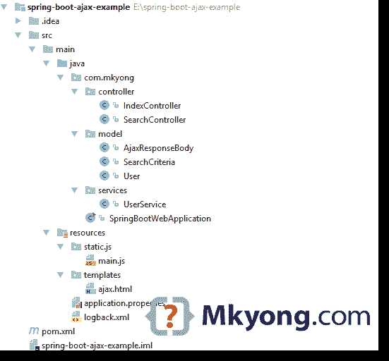
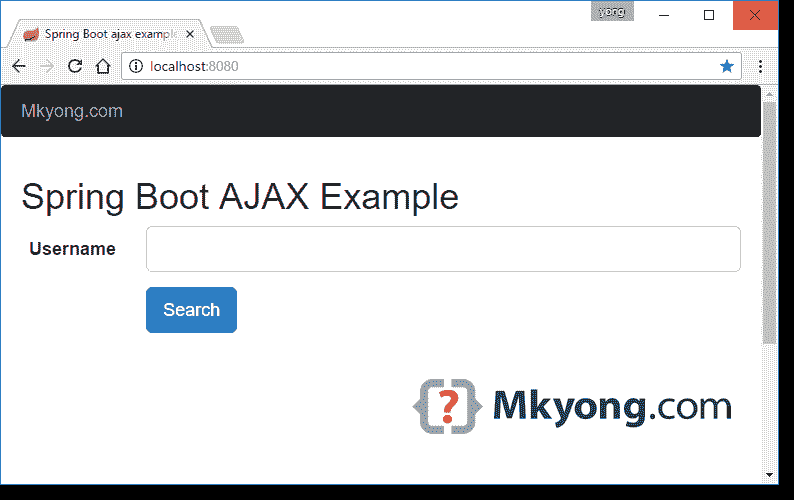
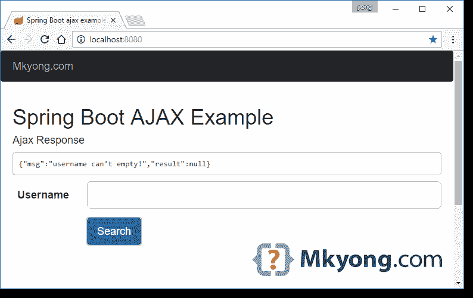
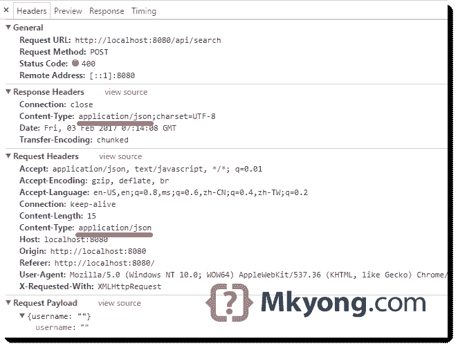
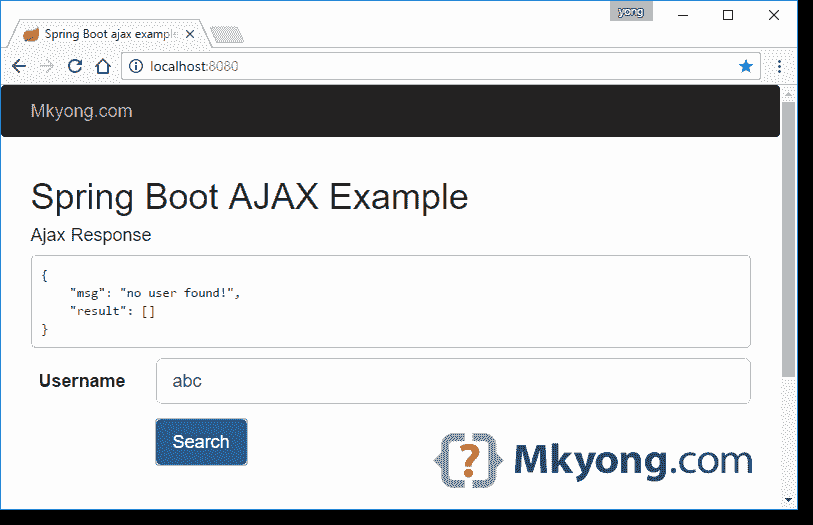
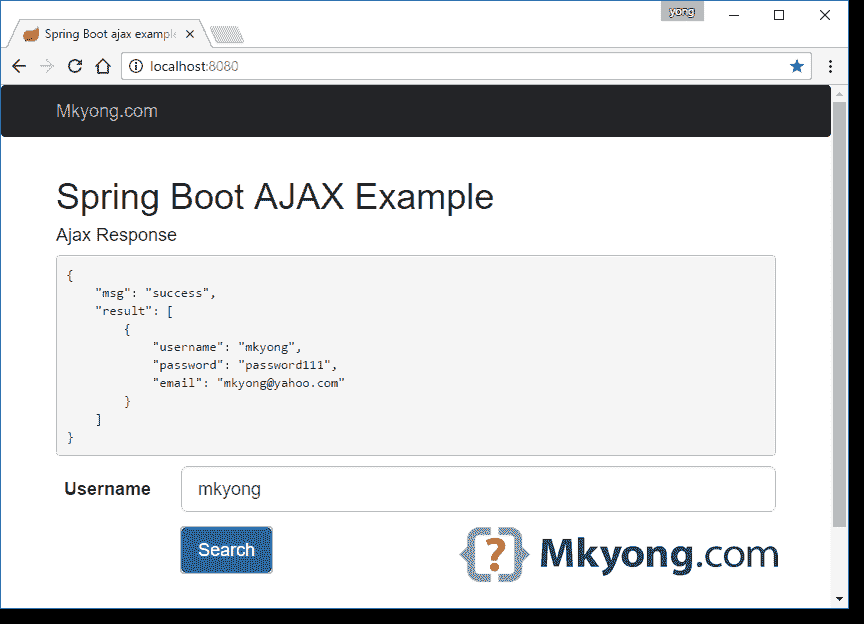
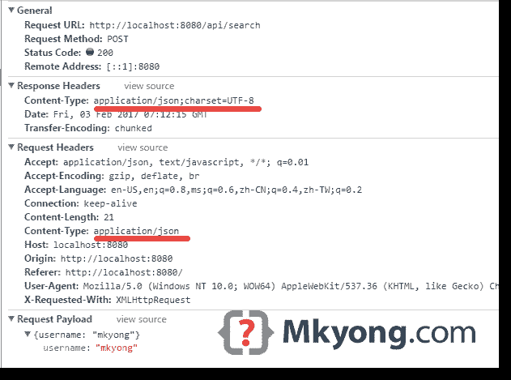

# Spring Boot Ajax 示例

> 原文：<http://web.archive.org/web/20230101150211/https://mkyong.com/spring-boot/spring-boot-ajax-example/>

本文将向您展示如何使用`jQuery.ajax`向`Spring REST API`发送 HTML 表单请求并返回 JSON 响应。

使用的工具:

1.  Spring Boot 1.5.1 .版本
2.  弹簧 4.3.6 释放
3.  maven3
4.  jQuery
5.  自举 3

**Note**
You may interest at this classic [Spring MVC Ajax example](http://web.archive.org/web/20221008082838/http://www.mkyong.com/spring-mvc/spring-4-mvc-ajax-hello-world-example/)

## 1.项目结构

一个标准的 Maven 项目结构。



## 2.项目依赖性

一个正常的 Spring Boot 依赖和一些`webjars`资源。

pom.xml

```
 <project 
         xmlns:xsi="http://www.w3.org/2001/XMLSchema-instance"
         xsi:schemaLocation="http://maven.apache.org/POM/4.0.0
	http://maven.apache.org/maven-v4_0_0.xsd">
    <modelVersion>4.0.0</modelVersion>

    <groupId>com.mkyong</groupId>
    <artifactId>spring-boot-ajax-example</artifactId>
    <packaging>jar</packaging>
    <version>1.0</version>

    <parent>
        <groupId>org.springframework.boot</groupId>
        <artifactId>spring-boot-starter-parent</artifactId>
        <version>1.5.1.RELEASE</version>
    </parent>

    <properties>
        <java.version>1.8</java.version>
    </properties>

    <dependencies>

        <dependency>
            <groupId>org.springframework.boot</groupId>
            <artifactId>spring-boot-starter-thymeleaf</artifactId>
        </dependency>

        <dependency>
            <groupId>org.springframework.boot</groupId>
            <artifactId>spring-boot-devtools</artifactId>
            <optional>true</optional>
        </dependency>

        <dependency>
            <groupId>org.webjars</groupId>
            <artifactId>jquery</artifactId>
            <version>2.2.4</version>
        </dependency>

        <dependency>
            <groupId>org.webjars</groupId>
            <artifactId>bootstrap</artifactId>
            <version>3.3.7</version>
        </dependency>

    </dependencies>

    <build>
        <plugins>
            <!-- Package as an executable jar/war -->
            <plugin>
                <groupId>org.springframework.boot</groupId>
                <artifactId>spring-boot-maven-plugin</artifactId>
            </plugin>
        </plugins>
    </build>

</project> 
```

## 3.Spring REST API

3.1 一个休息控制器，接受一个`SearchCriteria`并返回一个`ResponseEntity`

SearchController.java

```
 package com.mkyong.controller;

import com.mkyong.model.AjaxResponseBody;
import com.mkyong.model.SearchCriteria;
import com.mkyong.model.User;
import com.mkyong.services.UserService;
import org.springframework.beans.factory.annotation.Autowired;
import org.springframework.http.ResponseEntity;
import org.springframework.validation.Errors;
import org.springframework.web.bind.annotation.PostMapping;
import org.springframework.web.bind.annotation.RequestBody;
import org.springframework.web.bind.annotation.RestController;

import javax.validation.Valid;
import java.util.List;
import java.util.stream.Collectors;

@RestController
public class SearchController {

    UserService userService;

    @Autowired
    public void setUserService(UserService userService) {
        this.userService = userService;
    }

    @PostMapping("/api/search")
    public ResponseEntity<?> getSearchResultViaAjax(
            @Valid @RequestBody SearchCriteria search, Errors errors) {

        AjaxResponseBody result = new AjaxResponseBody();

        //If error, just return a 400 bad request, along with the error message
        if (errors.hasErrors()) {

            result.setMsg(errors.getAllErrors()
                        .stream().map(x -> x.getDefaultMessage())
                        .collect(Collectors.joining(",")));

            return ResponseEntity.badRequest().body(result);

        }

        List<User> users = userService.findByUserNameOrEmail(search.getUsername());
        if (users.isEmpty()) {
            result.setMsg("no user found!");
        } else {
            result.setMsg("success");
        }
        result.setResult(users);

        return ResponseEntity.ok(result);

    }

} 
```

3.2 一些 POJO。

AjaxResponseBody.java

```
 package com.mkyong.model;

import java.util.List;

public class AjaxResponseBody {

    String msg;
    List<User> result;

    //getters and setters

} 
```

User.java

```
 package com.mkyong.model;

public class User {

    String username;
    String password;
    String email;

    public User(String username, String password, String email) {
        this.username = username;
        this.password = password;
        this.email = email;
    }

    //getters and setters
} 
```

3.3 验证。

SearchCriteria.java

```
 package com.mkyong.model;

import org.hibernate.validator.constraints.NotBlank;

public class SearchCriteria {

    @NotBlank(message = "username can't empty!")
    String username;

    public String getUsername() {
        return username;
    }

    public void setUsername(String username) {
        this.username = username;
    }
} 
```

3.4 初始化一些用户进行搜索的服务。

UserService.java

```
 package com.mkyong.services;

import com.mkyong.model.User;
import org.springframework.stereotype.Service;

import javax.annotation.PostConstruct;
import java.util.ArrayList;
import java.util.List;
import java.util.stream.Collectors;

@Service
public class UserService {

    private List<User> users;

    // Love Java 8
    public List<User> findByUserNameOrEmail(String username) {

        List<User> result = users.stream()
            .filter(x -> x.getUsername().equalsIgnoreCase(username))
            .collect(Collectors.toList());

        return result;

    }

    // Init some users for testing
    @PostConstruct
    private void iniDataForTesting() {

        users = new ArrayList<User>();

        User user1 = new User("mkyong", "password111", "mkyong@yahoo.com");
        User user2 = new User("yflow", "password222", "yflow@yahoo.com");
        User user3 = new User("laplap", "password333", "mkyong@yahoo.com");

        users.add(user1);
        users.add(user2);
        users.add(user3);

    }

} 
```

3.5 Spring Boot 起动机。

UserService.java

```
 package com.mkyong;

import org.springframework.boot.SpringApplication;
import org.springframework.boot.autoconfigure.SpringBootApplication;

@SpringBootApplication
public class SpringBootWebApplication {

    public static void main(String[] args) throws Exception {
        SpringApplication.run(SpringBootWebApplication.class, args);
    }

} 
```

## 4.HTML 表单+ jQuery Ajax

4.1 一个简单的 HTML 表单，用 bootstrap 装饰。

ajax.html

```
 <!DOCTYPE html>
<html xmlns:th="http://www.thymeleaf.org">

<head>
    <title>Spring Boot ajax example</title>
    <meta http-equiv="Content-Type" content="text/html; charset=UTF-8"/>

    <link rel="stylesheet" type="text/css"
          href="webjars/bootstrap/3.3.7/css/bootstrap.min.css"/>
</head>
<body>

<nav class="navbar navbar-inverse">
    <div class="container">
        <div class="navbar-header">
            <a class="navbar-brand" href="#">Mkyong.com</a>
        </div>
    </div>
</nav>

<div class="container" style="min-height: 500px">

    <div class="starter-template">
        <h1>Spring Boot AJAX Example</h1>

        <div id="feedback"></div>

        <form class="form-horizontal" id="search-form">
            <div class="form-group form-group-lg">
                <label class="col-sm-2 control-label">Username</label>
                <div class="col-sm-10">
                    <input type="text" class="form-control" id="username"/>
                </div>
            </div>

            <div class="form-group">
                <div class="col-sm-offset-2 col-sm-10">
                    <button type="submit" id="bth-search"
                            class="btn btn-primary btn-lg">Search
                    </button>
                </div>
            </div>
        </form>

    </div>

</div>

<div class="container">
    <footer>
        <p>
            © <a href="http://www.mkyong.com">Mkyong.com</a> 2017
        </p>
    </footer>
</div>

<script type="text/javascript"
        src="webjars/jquery/2.2.4/jquery.min.js"></script>

<script type="text/javascript" src="js/main.js"></script>

</body>
</html> 
```

4.2 获取 HTML 表单，通过`JSON.stringify`将搜索条件转换成 JSON 格式，通过`jQuery.ajax`发送 POST 请求

main.js

```
 $(document).ready(function () {

    $("#search-form").submit(function (event) {

        //stop submit the form, we will post it manually.
        event.preventDefault();

        fire_ajax_submit();

    });

});

function fire_ajax_submit() {

    var search = {}
    search["username"] = $("#username").val();

    $("#btn-search").prop("disabled", true);

    $.ajax({
        type: "POST",
        contentType: "application/json",
        url: "/api/search",
        data: JSON.stringify(search),
        dataType: 'json',
        cache: false,
        timeout: 600000,
        success: function (data) {

            var json = "<h4>Ajax Response</h4>&lt;pre&gt;"
                + JSON.stringify(data, null, 4) + "&lt;/pre&gt;";
            $('#feedback').html(json);

            console.log("SUCCESS : ", data);
            $("#btn-search").prop("disabled", false);

        },
        error: function (e) {

            var json = "<h4>Ajax Response</h4>&lt;pre&gt;"
                + e.responseText + "&lt;/pre&gt;";
            $('#feedback').html(json);

            console.log("ERROR : ", e);
            $("#btn-search").prop("disabled", false);

        }
    });

} 
```

完成了。

## 5.演示

5.1 启动 Spring Boot

Terminal

```
 $ mvn spring-boot:run

  .   ____          _            __ _ _
 /\\ / ___'_ __ _ _(_)_ __  __ _ \ \ \ \
( ( )\___ | '_ | '_| | '_ \/ _` | \ \ \ \
 \\/  ___)| |_)| | | | | || (_| |  ) ) ) )
  '  |____| .__|_| |_|_| |_\__, | / / / /
 =========|_|==============|___/=/_/_/_/
 :: Spring Boot ::        (v1.5.1.RELEASE)

2017-02-03 14:56:36 DEBUG com.mkyong.SpringBootWebApplication - Running with Spring Boot v1.5.1.RELEASE, Spring v4.3.6.RELEASE
2017-02-03 14:56:36 INFO  com.mkyong.SpringBootWebApplication - No active profile set, falling back to default profiles: default
2017-02-03 14:56:39 INFO  com.mkyong.SpringBootWebApplication - Started SpringBootWebApplication in 2.828 seconds (JVM running for 3.295) 
```

5.2 访问 *http://localhost:8080/*



5.3 如果用户名为空！



5.4 如果找不到用户名！



5.5 如果找到用户名！



## 6.下载源代码

Download – [spring-boot-ajax-example.zip](http://web.archive.org/web/20221008082838/http://www.mkyong.com/wp-content/uploads/2017/02/spring-boot-ajax-example.zip) (10 KB)

## 参考

1.  [Spring IO——构建 RESTful Web 服务](http://web.archive.org/web/20221008082838/https://spring.io/guides/gs/rest-service/)
2.  [MDN–JSON . stringify()](http://web.archive.org/web/20221008082838/https://developer.mozilla.org/en/docs/Web/JavaScript/Reference/Global_Objects/JSON/stringify)
3.  [Spring 4 MVC Ajax Hello World 示例](http://web.archive.org/web/20221008082838/http://www.mkyong.com/spring-mvc/spring-4-mvc-ajax-hello-world-example/)

<input type="hidden" id="mkyong-current-postId" value="14398">