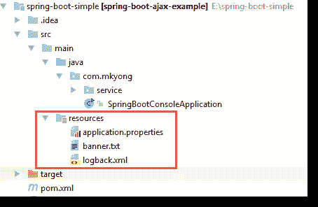
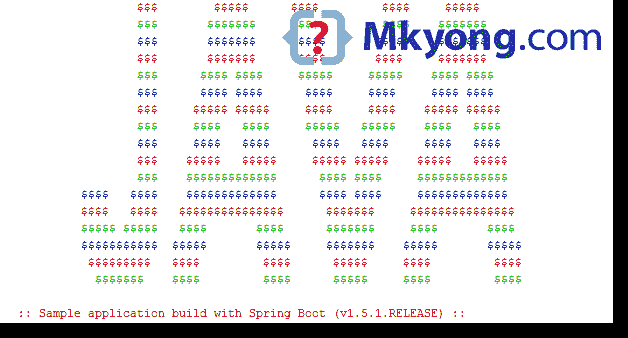

# Spring Boot–自定义横幅示例

> 原文：<http://web.archive.org/web/20230101150211/https://mkyong.com/spring-boot/spring-boot-custom-banner-example/>

这篇文章向你展示了如何用你的自定义横幅替换下面默认的 Spring 横幅。

```java
 .   ____          _            __ _ _
 /\\ / ___'_ __ _ _(_)_ __  __ _ \ \ \ \
( ( )\___ | '_ | '_| | '_ \/ _` | \ \ \ \
 \\/  ___)| |_)| | | | | || (_| |  ) ) ) )
  '  |____| .__|_| |_|_| |_\__, | / / / /
 =========|_|==============|___/=/_/_/_/
 :: Spring Boot ::        (v1.5.1.RELEASE) 
```

## 解决办法

1.要在 Spring Boot 应用程序中添加自定义横幅，请创建一个`banner.txt`文件，并将其放入`resources`文件夹。



2.回顾一下`banner.txt`的内容，这个 ASCII Art 是由这个 [ASCII Art Java 示例](http://web.archive.org/web/20220216054725/https://www.mkyong.com/java/ascii-art-java-example/)创建的，ANSI 颜色是手动添加的。

src/main/resources/banner.txt

```java
 ${Ansi.RED}                  $$$        $$$$$      $$$$         $$$$     $$$$$
${Ansi.GREEN}                  $$$       $$$$$$$     $$$$         $$$$    $$$$$$$
${Ansi.BLUE}                  $$$       $$$$$$$     $$$$$       $$$$$    $$$$$$$
${Ansi.RED}                  $$$       $$$$$$$      $$$$       $$$$     $$$$$$$
${Ansi.GREEN}                  $$$      $$$$ $$$$     $$$$$     $$$$$    $$$$ $$$$
${Ansi.BLUE}                  $$$      $$$$ $$$$      $$$$     $$$$     $$$$ $$$$
${Ansi.RED}                  $$$     $$$$$ $$$$$     $$$$     $$$$    $$$$$ $$$$$
${Ansi.GREEN}                  $$$     $$$$   $$$$     $$$$$   $$$$$    $$$$   $$$$
${Ansi.BLUE}                  $$$     $$$$   $$$$      $$$$   $$$$     $$$$   $$$$
${Ansi.RED}                  $$$    $$$$$   $$$$$     $$$$$ $$$$$    $$$$$   $$$$$
${Ansi.GREEN}                  $$$    $$$$$$$$$$$$$      $$$$ $$$$     $$$$$$$$$$$$$
${Ansi.BLUE}          $$$$   $$$$    $$$$$$$$$$$$$      $$$$ $$$$     $$$$$$$$$$$$$
${Ansi.RED}          $$$$   $$$$   $$$$$$$$$$$$$$$      $$$$$$$     $$$$$$$$$$$$$$$
${Ansi.GREEN}          $$$$$ $$$$$   $$$$       $$$$      $$$$$$$     $$$$       $$$$
${Ansi.BLUE}          $$$$$$$$$$$  $$$$$       $$$$$     $$$$$$$    $$$$$       $$$$$
${Ansi.RED}           $$$$$$$$$   $$$$         $$$$      $$$$$     $$$$         $$$$
${Ansi.GREEN}            $$$$$$$    $$$$         $$$$      $$$$$     $$$$         $$$$

${Ansi.RED} :: Spring Boot${spring-boot.formatted-version} :: ${Ansi.DEFAULT} 
```

3.启动 Spring Boot，将显示以下输出:



## 参考

1.  [Spring Boot——定制横幅](http://web.archive.org/web/20220216054725/https://docs.spring.io/spring-boot/docs/current-SNAPSHOT/reference/htmlsingle/#boot-features-banner)
2.  [ASCII Art Java 示例](http://web.archive.org/web/20220216054725/https://www.mkyong.com/java/ascii-art-java-example/)

<input type="hidden" id="mkyong-current-postId" value="14434">