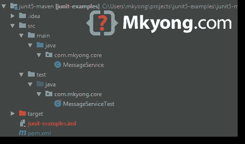
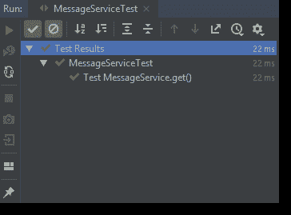
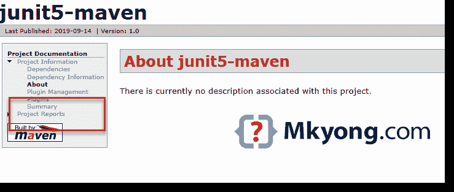
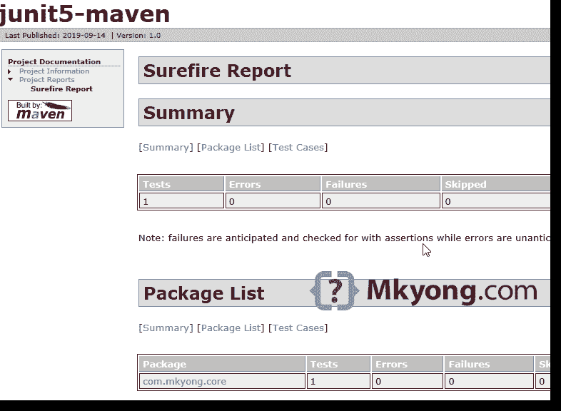

# JUnit 5 + Maven 示例

> 原文：<http://web.archive.org/web/20230101150211/https://mkyong.com/junit5/junit-5-maven-examples/>


这篇文章向你展示了如何在一个 Maven 项目中添加 JUnit 5，没什么特别的，只是添加 JUnit 5 `junit-jupiter-engine`库并确保`maven-surefire-plugin`至少是版本`2.22.0`

使用的技术:

*   Maven 3.6
*   Java 8
*   JUnit 5.5.2

## 1.腹部+6 月 5 日

1.添加 JUni 5 jupiter 引擎。

pom.xml

```java
 <dependency>
		<groupId>org.junit.jupiter</groupId>
		<artifactId>junit-jupiter-engine</artifactId>
		<version>5.5.2</version>
		<scope>test</scope>
	</dependency> 
```

2.要在 Maven 中运行测试，`maven-surefire-plugin`必须至少是版本`2.22.0`

pom.xml

```java
 <?xml version="1.0" encoding="UTF-8"?>
<project 
         xmlns:xsi="http://www.w3.org/2001/XMLSchema-instance"
         xsi:schemaLocation="http://maven.apache.org/POM/4.0.0
         http://maven.apache.org/xsd/maven-4.0.0.xsd">
    <modelVersion>4.0.0</modelVersion>

    <groupId>com.mkyong.core</groupId>
    <artifactId>junit5-maven</artifactId>
    <version>1.0</version>

    <properties>
        <java.version>1.8</java.version>
        <junit-jupiter.version>5.5.2</junit-jupiter.version>
        <project.build.sourceEncoding>UTF-8</project.build.sourceEncoding>
    </properties>

    <dependencies>

        <!-- junit 5 -->
        <dependency>
            <groupId>org.junit.jupiter</groupId>
            <artifactId>junit-jupiter-engine</artifactId>
            <version>${junit-jupiter.version}</version>
            <scope>test</scope>
        </dependency>

    </dependencies>

    <build>
        <plugins>

            <!-- Need at least 2.22.0 to support JUnit 5 -->
            <plugin>
                <groupId>org.apache.maven.plugins</groupId>
                <artifactId>maven-surefire-plugin</artifactId>
                <version>3.0.0-M3</version>
            </plugin>

            <plugin>
                <groupId>org.apache.maven.plugins</groupId>
                <artifactId>maven-compiler-plugin</artifactId>
                <version>3.8.1</version>
                <configuration>
                    <source>1.8</source>
                    <target>1.8</target>
                </configuration>
            </plugin>

        </plugins>
    </build>

</project> 
```

## 2.Maven 项目

一个简单的 Maven 项目结构。



## 3.JUnit 5

3.1 一个简单的单元测试例子。

MessageService.java

```java
 package com.mkyong.core;

public class MessageService {

    public static String get() {
        return "Hello JUnit 5";
    }

} 
```

3.2 JUnit 5 简单`Assertions`测试。

MessageServiceTest.java

```java
 package com.mkyong.core;

import org.junit.jupiter.api.DisplayName;
import org.junit.jupiter.api.Test;

import static org.junit.jupiter.api.Assertions.assertEquals;

public class MessageServiceTest {

    @DisplayName("Test MessageService.get()")
    @Test
    void testGet() {
        assertEquals("Hello JUnit 5", MessageService.get());
    }

} 
```

3.3 在 IntelliJ IDEA 中运行，输出:



## 4.mvn 试验

4.1`Maven Surefire Plugin`将扫描并运行以下测试类:

```java
 **/Test*.java
**/*Test.java
**/*Tests.java
**/*TestCase.java 
```

Terminal

```java
 $ cd project 
$ mvn test 

[INFO] -------------------------------------------------------
[INFO]  T E S T S
[INFO] -------------------------------------------------------
[INFO] Running com.mkyong.core.MessageServiceTest
[INFO] Tests run: 1, Failures: 0, Errors: 0, Skipped: 0, 
	Time elapsed: 0.02 s - in com.mkyong.core.MessageServiceTest
[INFO]
[INFO] Results:
[INFO]
[INFO] Tests run: 1, Failures: 0, Errors: 0, Skipped: 0
[INFO]
[INFO] ------------------------------------------------------------------------
[INFO] BUILD SUCCESS
[INFO] ------------------------------------------------------------------------
[INFO] Total time:  7.488 s
[INFO] Finished at: 2019-09-14T10:27:01+08:00
[INFO] ------------------------------------------------------------------------ 
```

测试结果将在`project\target\surefire-reports`以`.txt`和`.xml`两种格式生成。

## 5.mvn 站点

5.1 最好生成一个项目站点，以 HTML 格式查看单元测试结果。要将 surefire 单元测试报告添加到站点中，请添加以下`reporting`部分。

pom.xml

```java
 <build>
        <plugins>

            <plugin>
                <groupId>org.apache.maven.plugins</groupId>
                <artifactId>maven-surefire-plugin</artifactId>
                <version>3.0.0-M3</version>
            </plugin>

            <plugin>
                <groupId>org.apache.maven.plugins</groupId>
                <artifactId>maven-site-plugin</artifactId>
                <version>3.8.2</version>
            </plugin>

        </plugins>
    </build>

    <reporting>
        <plugins>
            <plugin>
                <groupId>org.apache.maven.plugins</groupId>
                <artifactId>maven-surefire-report-plugin</artifactId>
            </plugin>
        </plugins>
    </reporting> 
```

Terminal

```java
 $ cd project 
$ mvn site 
```

项目网站将在`project\target\site`生成，点击`index.html`



点击`project reports`->-`surefire report`



完成了。

## 下载源代码

$ git clone [https://github.com/mkyong/junit-examples](http://web.archive.org/web/20221212193803/https://github.com/mkyong/junit-examples)
$ cd junit5-maven
$ mvn test

# 参考

*   [JUnit 5 官方网站](http://web.archive.org/web/20221212193803/https://junit.org/junit5/)
*   [Spring Boot +朱尼特 5 +莫奇托](http://web.archive.org/web/20221212193803/https://www.mkyong.com/spring-boot/spring-boot-junit-5-mockito/)
*   [Maven Surefire 插件](http://web.archive.org/web/20221212193803/https://maven.apache.org/surefire/maven-surefire-plugin/)
*   [使用 JUnit 5 平台](http://web.archive.org/web/20221212193803/https://maven.apache.org/surefire/maven-surefire-plugin/examples/junit-platform.html)
*   [阿帕奇 Maven 网站](http://web.archive.org/web/20221212193803/https://maven.apache.org/plugins/maven-site-plugin/)

<input type="hidden" id="mkyong-current-postId" value="15175">