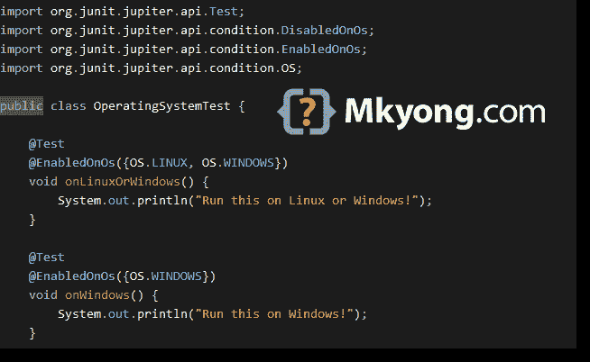

# JUnit 5 条件测试示例

> 原文：<http://web.archive.org/web/20230101150211/https://mkyong.com/junit5/junit-5-conditional-test-examples/>



本文向您展示了如何使用 JUnit 5 来基于条件启用或禁用测试。

*用 JUnit 5.5.2 测试的 PS*

## 1.操作系统

1.1 通过`@EnabledOnOs`和`@DisabledOnOs`注释基于特定操作系统启用或禁用测试。

OperatingSystemTest.java

```java
 package com.mkyong.conditional;

import org.junit.jupiter.api.Test;
import org.junit.jupiter.api.condition.DisabledOnOs;
import org.junit.jupiter.api.condition.EnabledOnOs;
import org.junit.jupiter.api.condition.OS;

public class OperatingSystemTest {

    @Test
    @EnabledOnOs({OS.LINUX, OS.WINDOWS})
    void onLinuxOrWindows() {
        System.out.println("Run this on Linux or Windows!");
    }

    @Test
    @EnabledOnOs({OS.WINDOWS})
    void onWindows() {
        System.out.println("Run this on Windows!");
    }

    @Test
    @DisabledOnOs(OS.WINDOWS)
    void notOnWindows() {
        System.out.println("Do not run this on Windows!");
    }

    @Test
    @DisabledOnOs({OS.WINDOWS, OS.AIX, OS.SOLARIS, OS.MAC})
    void notOnWindowsOrAixOrSolarisOrMac() {
        System.out.println("Do not run this on Windows, AIX, Solaris or MAC!");
    }

} 
```

输出–使用 Windows 操作系统进行测试。


## 2.Java 运行时环境

2.1 通过`@EnabledOnJre`和`@DisabledOnJre`注释基于特定的 Java 运行时环境(JRE)启用或禁用测试。

JreTest.java

```java
 package com.mkyong.conditional;

import org.junit.jupiter.api.Test;
import org.junit.jupiter.api.condition.DisabledOnJre;
import org.junit.jupiter.api.condition.EnabledOnJre;
import org.junit.jupiter.api.condition.JRE;

public class JreTest {

    @Test
    @EnabledOnJre(JRE.JAVA_9)
    void onJava9() {
        System.out.println("Run this on Java 9");
    }

    @Test
    @EnabledOnJre({JRE.JAVA_12, JRE.JAVA_13})
    void onJava12OrJava13() {
        System.out.println("Run this on Java 12 or Java 13");
    }

    @Test
    @DisabledOnJre(JRE.JAVA_9)
    void notOnJava9() {
        System.out.println("Do not run this on Java 9");
    }

} 
```

输出–用 Java 13 测试


## 3.系统属性

3.1 通过`@EnabledIfSystemProperty`和`@DisabledIfSystemProperty`注释，根据 JVM 系统属性中`named`的值启用或禁用测试。

SystemPropertyTest.java

```java
 package com.mkyong.conditional;

import org.junit.jupiter.api.Test;
import org.junit.jupiter.api.condition.DisabledIfSystemProperty;
import org.junit.jupiter.api.condition.EnabledIfSystemProperty;

import java.util.Properties;

public class SystemPropertyTest {

    @Test
    @EnabledIfSystemProperty(named = "java.vm.name", matches = ".*OpenJDK.*")
    void onOpenJDK() {
        System.out.println("Run this on OpenJDK!");
    }

    @Test
    @DisabledIfSystemProperty(named = "user.country", matches = "MY")
    void notOnCountryMalaysia() {
        System.out.println("Do not run this on country code MY");
    }

    @Test
    void printSystemProperties() {
        Properties properties = System.getProperties();
        properties.forEach((k, v) -> System.out.println(k + ":" + v));
    }

} 
```

阅读此–[如何用 Java 打印所有系统属性](http://web.archive.org/web/20221212193803/https://www.mkyong.com/java/how-to-list-all-system-properties-key-and-value-in-java/)

## 4.环境变量

4.1 通过`@EnabledIfEnvironmentVariable`和`@DisabledIfEnvironmentVariable`注释，根据环境属性中`named`的值启用或禁用测试。

EnvVariableTest.java

```java
 package com.mkyong.conditional;

import org.junit.jupiter.api.Test;
import org.junit.jupiter.api.condition.DisabledIfEnvironmentVariable;
import org.junit.jupiter.api.condition.EnabledIfEnvironmentVariable;

import java.util.Map;

public class EnvVariableTest {

    @Test
    @EnabledIfEnvironmentVariable(named = "PROCESSOR_IDENTIFIER", matches = ".*Intel64 Family 6.*")
    void onIntel64() {
        System.out.println("Run this on Intel6 Family 6 only.");
    }

    @Test
    @EnabledIfEnvironmentVariable(named = "NUMBER_OF_PROCESSORS", matches = "8")
    void onProcessor8() {
        System.out.println("Run this if it has 8 processors.");
    }

    @Test
    @DisabledIfEnvironmentVariable(named = "CURRENT_ENV", matches = ".*development.*")
    void notOnDeveloperPC() {
        System.out.println("Do not run this if env variables 'CURRENT_ENV' matches .*development.* ");
    }

    @Test
    void printEnvironmentProperties() {
        Map<String, String> env = System.getenv();
        env.forEach((k, v) -> System.out.println(k + ":" + v));
    }

} 
```

## 下载源代码

$ git clone [https://github.com/mkyong/junit-examples](http://web.archive.org/web/20221212193803/https://github.com/mkyong/junit-examples)
$ cd junit5-examples
$ check src/test/java/com/mkyong/conditional/*.java

# 参考

*   [JUnit 5 条件测试执行](http://web.archive.org/web/20221212193803/https://junit.org/junit5/docs/current/user-guide/#writing-tests-conditional-execution)
*   [Java–如何显示所有系统属性](/web/20221212193803/https://mkyong.com/java/how-to-list-all-system-properties-key-and-value-in-java/)
*   [Java–如何显示所有环境变量](/web/20221212193803/https://mkyong.com/java/java-how-to-display-all-environment-variable/)

<input type="hidden" id="mkyong-current-postId" value="15235">