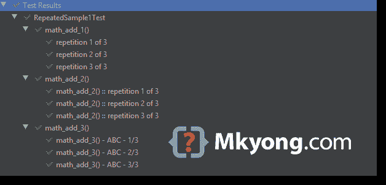

# JUnit 5 重复测试

> 原文：<http://web.archive.org/web/20230101150211/https://mkyong.com/junit5/junit-5-repeated-tests/>


本文向您展示了如何使用 JUnit 5 `@RepeatedTest`来重复测试指定的次数。

*用 JUnit 5.5.2 测试的 PS*

## 1.@重复测试

1.1`@RepeatedTest`测试方法就像常规的`@Test`方法一样，相同的生命周期。

RepeatedSample1Test.java

```
 package com.mkyong.repeated;

import org.junit.jupiter.api.*;

import static org.junit.jupiter.api.Assertions.assertEquals;

public class RepeatedSample1Test {

    @BeforeAll
    static void beforeAll() {
        System.out.println("beforeAll");
    }

    @AfterAll
    static void afterAll() {
        System.out.println("afterAll");
    }

    @BeforeEach
    void beforeEach() {
        System.out.println("beforeEach");
    }

    @AfterEach
    void afterEach() {
        System.out.println("afterEach");
    }

    // Repeat this test 3 times
    @RepeatedTest(3)
    void math_add_1() {
        System.out.println("Run math_add_1()");
        assertEquals(2, 1 + 1);
    }

    @RepeatedTest(3)
    void math_add_2() {
        System.out.println("Run math_add_2()");
        assertEquals(2, 1 + 1);
    }

} 
```

IDE 中的输出。


控制台中的输出。

```
 beforeAll

beforeEach
Run math_add_1()
afterEach

beforeEach
Run math_add_1()
afterEach

beforeEach
Run math_add_1()
afterEach

beforeEach
Run math_add_2()
afterEach

beforeEach
Run math_add_2()
afterEach

beforeEach
Run math_add_2()
afterEach

afterAll 
```

## 2.自定义测试名称

2.1 我们可以配置`@RepeatedTest`方法的名称。

RepeatedSample2Test.java

```
 package com.mkyong.repeated;

import org.junit.jupiter.api.RepeatedTest;

import static org.junit.jupiter.api.Assertions.assertEquals;

public class RepeatedSample2Test {

    @RepeatedTest(3)
    void math_add_1() {
        System.out.println("Run math_add_1()");
        assertEquals(2, 1 + 1);
    }

    @RepeatedTest(value = 3, name = RepeatedTest.LONG_DISPLAY_NAME)
    void math_add_2() {
        System.out.println("Run math_add_2()");
        assertEquals(2, 1 + 1);
    }

    @RepeatedTest(value = 3, name = "{displayName} - ABC - {currentRepetition}/{totalRepetitions}")
    void math_add_3() {
        System.out.println("Run math_add_3()");
        assertEquals(2, 1 + 1);
    }

} 
```

IDE 中的输出。



注意

*   `{displayName}`:测试方法的名称。
*   `{currentRepetition}`:当前重复次数。
*   `{totalRepetitions}`:总重复次数。

## 3.重复信息

3.1 我们也可以将`RepetitionInfo`作为参数注入，并访问`@RepeatedTest`的元数据。

@RepeatedTest.java

```
 package com.mkyong.repeated;

import org.junit.jupiter.api.RepeatedTest;
import org.junit.jupiter.api.RepetitionInfo;

import static org.junit.jupiter.api.Assertions.assertEquals;

public class RepeatedSample3Test {

    @RepeatedTest(3)
    void math_add_4(RepetitionInfo repetitionInfo) {
        System.out.println("Repetition #" + repetitionInfo.getCurrentRepetition());
        assertEquals(3, repetitionInfo.getTotalRepetitions());
    }

} 
```

控制台中的输出。

```
 Repetition #1

Repetition #2

Repetition #3 
```

## 下载源代码

$ git clone [https://github.com/mkyong/junit-examples](http://web.archive.org/web/20221225035521/https://github.com/mkyong/junit-examples)
$ cd junit5-examples
$ check src/test/java/com/mkyong/repeated/*.java

# 参考

*   [JUnit 5 重复测试](http://web.archive.org/web/20221225035521/https://junit.org/junit5/docs/current/user-guide/#writing-tests-repeated-tests)
*   [重复测试的原因](http://web.archive.org/web/20221225035521/https://www.satisfice.com/reasons-to-repeat-tests)

<input type="hidden" id="mkyong-current-postId" value="15253">