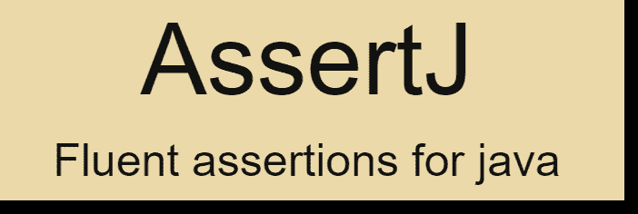

# JUnit 5 + AssertJ 示例

> 原文：<http://web.archive.org/web/20230101150211/https://mkyong.com/junit5/junit-5-assertj-examples/>



在本文中，我们将向您展示如何用 [AssertJ](http://web.archive.org/web/20221225035521/https://assertj.github.io/doc/) 编写测试断言。

*P.S 使用 JUnit 5.5.2 和 AssertJ 3.14.0 测试*

pom.xml

```java
 <dependency>
		<groupId>org.junit.jupiter</groupId>
		<artifactId>junit-jupiter-engine</artifactId>
		<version>5.5.2</version>
		<scope>test</scope>
	</dependency>

	<dependency>
		<groupId>org.assertj</groupId>
		<artifactId>assertj-core</artifactId>
		<version>3.14.0</version>
		<scope>test</scope>
	</dependency> 
```

## 1.JUnit 5 对 AssertJ 的断言

将 JUnit 5 断言转换为 AssetJ 很容易，请参见以下语法:

JUnit 5

```java
 assertEquals(expected, actual);

assertEquals(expected, actual, "assertion desc"); 
```

AssertJ

```java
 assertThat(actual).isEqualTo(expected);

assertThat(actual).as("assertion desc").isEqualTo(expected); 
```

## 2.AssertJ

2.1 一些带有 AssertJ 的典型测试断言—`String`、`List`、`Map`和`Exception`。

AssertjTest.java

```java
 package com.mkyong.assertions.assertj;

import org.assertj.core.api.InstanceOfAssertFactories;
import org.assertj.core.data.Index;
import org.junit.jupiter.api.Test;

import java.util.Arrays;
import java.util.HashMap;
import java.util.List;
import java.util.Map;

import static org.assertj.core.api.Assertions.as;
import static org.assertj.core.api.Assertions.assertThat;
import static org.assertj.core.api.AssertionsForClassTypes.assertThatThrownBy;

public class AssertjTest {

    // assert string
    @Test
    void test_string_ok() {

        String name = "I am Mkyong!";

        assertThat(name)
                .as("if failed display this msg!")
                .isEqualTo("I am Mkyong!")
                .isEqualToIgnoringCase("I AM mkyong!")
                .startsWith("I")
                .endsWith("!")
                .containsIgnoringCase("mkyong");

    }

    // assert list
    @Test
    void test_list_ok() {

        List<String> list = Arrays.asList("Java", "Rust", "Clojure");

        assertThat(list)
                .hasSize(3)
                .contains("Java", "Clojure")
                .contains("Java", Index.atIndex(0))
                .contains("Rust", Index.atIndex(1))
                .contains("Clojure", Index.atIndex(2))
                .doesNotContain("Node JS");

    }

    // assert map
    @Test
    void test_map_ok() {

        Map<String, Object> map = new HashMap<>();
        map.put("name", "mkyong");

        assertThat(map)
                .hasSize(1)
                .extractingByKey("name", as(InstanceOfAssertFactories.STRING))
                .isEqualToIgnoringCase("mkyong")
                .startsWith("mkyong");

        assertThat(map).extracting("name")
                .isEqualTo("mkyong");

        Map<String, Object> map2 = new HashMap<>();
        map2.put("number", 999);

        assertThat(map2)
                .hasSize(1)
                .extractingByKey("number", as(InstanceOfAssertFactories.INTEGER))
                .isEqualTo(999);

    }

    // assert exception
    @Test
    void test_exception_ok() {

        assertThatThrownBy(() -> divide(1, 0))
                .isInstanceOf(ArithmeticException.class)
                .hasMessageContaining("zero")
                .hasMessage("/ by zero");

        assertThatThrownBy(() -> {
            List<String> list = Arrays.asList("one", "two");
            list.get(2);
        })
                .isInstanceOf(IndexOutOfBoundsException.class)
                .hasMessageContaining("Index 2 out of bounds");

    }

    int divide(int input, int divide) {
        return input / divide;
    }

} 
```

## 下载源代码

$ git clone [https://github.com/mkyong/junit-examples](http://web.archive.org/web/20221225035521/https://github.com/mkyong/junit-examples)
$ cd junit5-examples
$ check src/test/java/com/mkyong/assertions/assertj/*.java

# 参考

*   [AssertJ–流畅断言 java 库](http://web.archive.org/web/20221225035521/https://assertj.github.io/doc/)
*   [将您的 JUnit 5 断言转换为 AssertJ](http://web.archive.org/web/20221225035521/https://joel-costigliola.github.io/assertj/assertj-core-converting-junit5-assertions-to-assertj.html)
*   [JUnit 5 断言](http://web.archive.org/web/20221225035521/https://junit.org/junit5/docs/current/user-guide/#writing-tests-assertions)

<input type="hidden" id="mkyong-current-postId" value="15273">