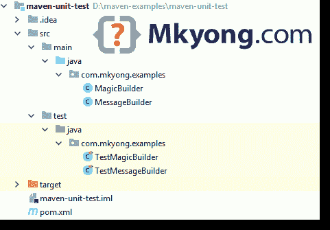

# 如何用 Maven 运行单元测试

> 原文：<http://web.archive.org/web/20230101150211/https://www.mkyong.com/maven/how-to-run-unit-test-with-maven/>

你可以使用`mvn test`在 Maven 中运行单元测试。几个例子:

```
 # Run all the unit test classes.
$ mvn test

# Run a single test class.
$ mvn -Dtest=TestApp1 test

# Run multiple test classes.
$ mvn -Dtest=TestApp1,TestApp2 test

# Run a single test method from a test class.
$ mvn -Dtest=TestApp1#methodname test

# Run all test methods that match pattern 'testHello*' from a test class.
$ mvn -Dtest=TestApp1#testHello* test

# Run all test methods match pattern 'testHello*' and 'testMagic*' from a test class.
$ mvn -Dtest=TestApp1#testHello*+testMagic* test 
```

默认的`maven-surefire-plugin`已经过时，请确保更新到最新版本以支持新功能，如模式匹配或运行单一测试方法等。

pom.xml

```
 <build>
        <plugins>

            <plugin>
                <groupId>org.apache.maven.plugins</groupId>
                <artifactId>maven-surefire-plugin</artifactId>
                <version>2.22.0</version>
            </plugin>

        </plugins>
    </build> 
```

## 1.Maven Java 项目

回顾一个简单的 Java 项目如何在 Maven 中运行单元测试类。

1.1 目录结构。



1.2 Maven + JUnit 5 个例子。

pom.xml

```
 <?xml version="1.0" encoding="UTF-8"?>
<project 
         xmlns:xsi="http://www.w3.org/2001/XMLSchema-instance"
         xsi:schemaLocation="http://maven.apache.org/POM/4.0.0 
		 http://maven.apache.org/xsd/maven-4.0.0.xsd">

    <modelVersion>4.0.0</modelVersion>
    <groupId>com.mkyong.examples</groupId>
    <artifactId>maven-unit-test</artifactId>
    <packaging>jar</packaging>
    <version>1.0-SNAPSHOT</version>

    <properties>
        <!-- https://maven.apache.org/general.html#encoding-warning -->
        <project.build.sourceEncoding>UTF-8</project.build.sourceEncoding>
        <maven.compiler.source>1.8</maven.compiler.source>
        <maven.compiler.target>1.8</maven.compiler.target>
    </properties>

    <dependencies>

        <!-- junit 5, unit test -->
        <dependency>
            <groupId>org.junit.jupiter</groupId>
            <artifactId>junit-jupiter-engine</artifactId>
            <version>5.3.1</version>
            <scope>test</scope>
        </dependency>

    </dependencies>
    <build>
        <finalName>maven-unit-test</finalName>
        <plugins>

            <plugin>
                <groupId>org.apache.maven.plugins</groupId>
                <artifactId>maven-surefire-plugin</artifactId>
                <version>2.22.0</version>
            </plugin>

        </plugins>
    </build>

</project> 
```

1.3 两个 Java 类，稍后我们将为它创建单元测试类。

MagicBuilder.java

```
 package com.mkyong.examples;

public class MagicBuilder {

    public static int getLucky() {
        return 7;
    }

} 
```

MessageBuilder.java

```
 package com.mkyong.examples;

public class MessageBuilder {

    public static String getHelloWorld(){
        return "hello world";
    }

    public static int getNumber10(){
        return 10;
    }

} 
```

1.4`MagicBuilder`的测试类

TestMagicBuilder.java

```
 package com.mkyong.examples;

import org.junit.jupiter.api.Test;

import static org.junit.jupiter.api.Assertions.assertEquals;

public class TestMagicBuilder {

    @Test
    public void testLucky() {
        assertEquals(7, MagicBuilder.getLucky());
    }

} 
```

1.5`MessageBuilder`的测试类

pom.xml

```
 package com.mkyong.examples;

import org.junit.jupiter.api.Test;

import static org.junit.jupiter.api.Assertions.assertEquals;

public class TestMessageBuilder {

    @Test
    public void testHelloWorld() {
        assertEquals("hello world", MessageBuilder.getHelloWorld());
    }

    @Test
    public void testNumber10() {
        assertEquals(10, MessageBuilder.getNumber10());
    }

} 
```

## 2.Maven 测试

2.1 运行所有测试类。

Terminal

```
 $ mvn test

[INFO] -------------------------------------------------------
[INFO]  T E S T S
[INFO] -------------------------------------------------------
[INFO] Running com.mkyong.examples.TestMagicBuilder
[INFO] Tests run: 1, Failures: 0, Errors: 0, Skipped: 0, Time elapsed: 0.004 s - in com.mkyong.examples.TestMagicBuilder
[INFO] Running com.mkyong.examples.TestMessageBuilder
[INFO] Tests run: 2, Failures: 0, Errors: 0, Skipped: 0, Time elapsed: 0.001 s - in com.mkyong.examples.TestMessageBuilder
[INFO] 
```

2.2 运行单个测试类`TestMessageBuilder`

Terminal

```
 $ mvn -Dtest=TestMessageBuilder test

[INFO] -------------------------------------------------------
[INFO]  T E S T S
[INFO] -------------------------------------------------------
[INFO] Running com.mkyong.examples.TestMessageBuilder
[INFO] Tests run: 2, Failures: 0, Errors: 0, Skipped: 0, Time elapsed: 0.004 s - in com.mkyong.examples.TestMessageBuilder
[INFO] 
```

2.3 运行测试类`TestMessageBuilder`中的单一测试方法`testHelloWorld()`

Terminal

```
 $ mvn -Dtest=TestMessageBuilder#testHelloWorld test

[INFO] -------------------------------------------------------
[INFO]  T E S T S
[INFO] -------------------------------------------------------
[INFO] Running com.mkyong.examples.TestMessageBuilder
[INFO] Tests run: 1, Failures: 0, Errors: 0, Skipped: 0, Time elapsed: 0.004 s - in com.mkyong.examples.TestMessageBuilder
[INFO] 
```

## 下载源代码

$ git clone [https://github.com/mkyong/maven-examples.git](http://web.archive.org/web/20221223054817/https://github.com/mkyong/maven-examples.git)
$ cd maven-unit-test
$ mvn test
$ mvn -Dtest=TestMessageBuilder test
$ mvn -Dtest=TestMessageBuilder#testHelloWorld test

## 参考

1.  [JUnit 5](http://web.archive.org/web/20221223054817/https://junit.org/junit5/)
2.  [运行单一测试](http://web.archive.org/web/20221223054817/https://maven.apache.org/surefire/maven-surefire-plugin/examples/single-test.html)

<input type="hidden" id="mkyong-current-postId" value="8472">