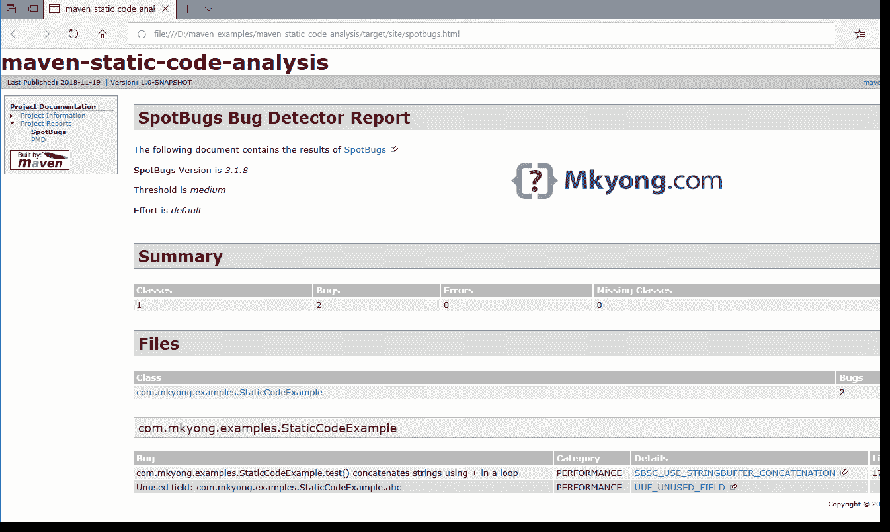

# maven–spot bugs 示例

> 原文：<http://web.archive.org/web/20230101150211/https://www.mkyong.com/maven/maven-spotbugs-example/>


在本文中，我们将向您展示如何使用 [SpotBugs Maven 插件](http://web.archive.org/web/20220304181450/https://spotbugs.github.io/spotbugs-maven-plugin/)来查找 Java 代码中的 bug。

**Note**
[Findbugs is no longer maintained](http://web.archive.org/web/20220304181450/https://gleclaire.github.io/findbugs-maven-plugin/), and thus SpotBugs is the spiritual successor of FindBugs

*P.S SpotBugs 需要 JDK 1.8*

## 1.Maven SpotBugs 插件

在`reporting`标签中定义`spotbugs-maven-plugin`。这样`mvn site`将生成 SpotBugs 报告。

pom.xml

```java
 <reporting>
        <plugins>
            <plugin>
                <groupId>com.github.spotbugs</groupId>
                <artifactId>spotbugs-maven-plugin</artifactId>
                <version>3.1.8</version>
            </plugin>
        </plugins>
    </reporting> 
```

## 2.Java 代码

一个简单的 Java 代码，带有一个未使用的字段“abc”和一个“+ string”循环中的性能问题。稍后，SpotBugs 将能够检测到它并在报告中显示出来。

```java
 package com.mkyong.examples;

public class StaticCodeExample {

    //Unused field
    private int abc;

    private String ip = "127.0.0.1";

    public void test() {

        String[] field = {"a", "b", "c", "s", "e"};

        //concatenates strings using + in a loop
        String s = "";
        for (int i = 0; i < field.length; ++i) {
            s = s + field[i];
        }

        System.out.println(ip);

    }

} 
```

## 3.Maven 站点

为了生成 Java 项目的 Maven 站点，SpotBugs 报告将被自动生成并集成到 Maven 站点中。

```java
 $ mvn compile site

[INFO] Generating "SpotBugs" report      --- spotbugs-maven-plugin:3.1.8:spotbugs
[INFO] Generating "Dependency Information" report --- maven-project-info-reports-plugin:3.0.0:dependency-info
[INFO] Generating "About" report         --- maven-project-info-reports-plugin:3.0.0:index
[INFO] Generating "Plugin Management" report --- maven-project-info-reports-plugin:3.0.0:plugin-management
[INFO] Generating "Plugins" report       --- maven-project-info-reports-plugin:3.0.0:plugins
[INFO] Generating "Summary" report       --- maven-project-info-reports-plugin:3.0.0:summary
[INFO] ------------------------------------------------------------------------
[INFO] BUILD SUCCESS
[INFO] ------------------------------------------------------------------------
[INFO] Total time:  7.732 s
[INFO] Finished at: 2018-11-19T15:38:56+08:00
[INFO] ------------------------------------------------------------------------ 
```

## 4.SpotBugs 报告

在`target/site/spotbugs.html`查看报告

[](http://web.archive.org/web/20220304181450/http://www.mkyong.com/wp-content/uploads/2018/11/maven-spotbugs-static-code.png)

## 5.常见问题

5.1 在此查看 [SpotBugs 400 错误模式。](http://web.archive.org/web/20220304181450/https://spotbugs.readthedocs.io/en/latest/bugDescriptions.html)

5.2 更多 [Maven SpotBugs 插件配方在此](http://web.archive.org/web/20220304181450/https://spotbugs.github.io/spotbugs-maven-plugin/usage.html)

## 下载源代码

$ git 克隆[https://github.com/mkyong/maven-examples.git](http://web.archive.org/web/20220304181450/https://github.com/mkyong/maven-examples.git)
$ CD maven-静态代码分析
$ mvn 编译站点

#在 target/site/spotbugs.html 查看报告

## 参考

1.  [SpotBugs 官方网站](http://web.archive.org/web/20220304181450/https://spotbugs.github.io/)
2.  [SpotBugs Maven 插件](http://web.archive.org/web/20220304181450/https://spotbugs.github.io/spotbugs-maven-plugin/index.html)
3.  [使用 SpotBugs Maven 插件](http://web.archive.org/web/20220304181450/https://spotbugs.readthedocs.io/en/latest/maven.html)
4.  [静态代码分析工具列表](http://web.archive.org/web/20220304181450/https://en.wikipedia.org/wiki/List_of_tools_for_static_code_analysis#Java)

<input type="hidden" id="mkyong-current-postId" value="14812">