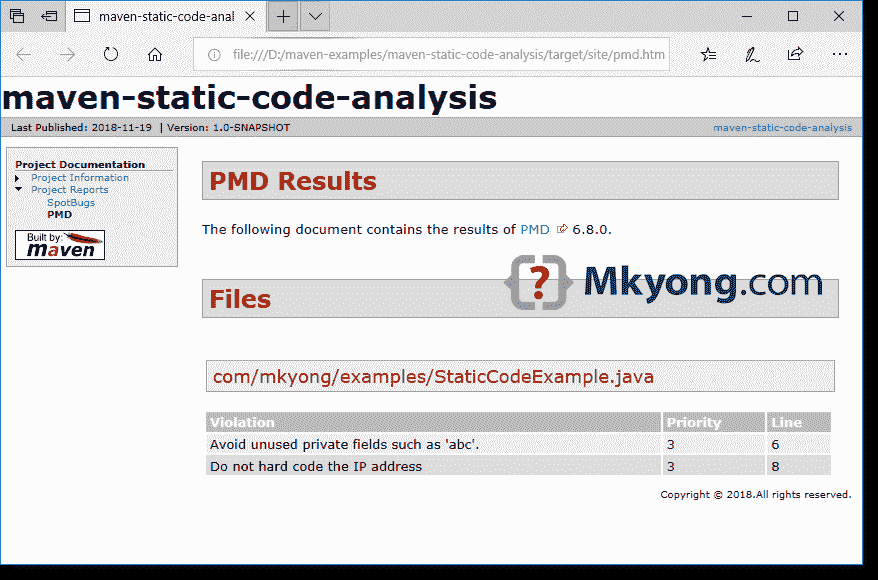

# maven–PMD 示例

> 原文：<http://web.archive.org/web/20230101150211/https://www.mkyong.com/maven/maven-pmd-example/>


在本文中，我们将向您展示如何使用 [Maven PMD 插件](http://web.archive.org/web/20210815010028/https://maven.apache.org/plugins/maven-pmd-plugin/)来分析 Java 代码。

PMD 需要 Java 1.7

## 1.玛文 PMD 插件

在`reporting`标签中定义`maven-pmd-plugin`，这样`mvn site`将生成 PMD 报告。

pom.xml

```
 <reporting>
        <plugins>

            <plugin>
                <groupId>org.apache.maven.plugins</groupId>
                <artifactId>maven-pmd-plugin</artifactId>
                <version>3.11.0</version>
            </plugin>

        </plugins>
    </reporting> 
```

## 2.Java 代码

一个简单的 Java 代码。我们将使用 Maven PMD 插件来分析这些代码，并在报告中显示这些问题。

```
 package com.mkyong.examples;

public class StaticCodeExample {

    //Unused field
    private int abc;

    private String ip = "127.0.0.1";

    public void test() {

        String[] field = {"a", "b", "c", "s", "e"};

        String s = "";
        for (int i = 0; i < field.length; ++i) {
            s = s + field[i];
        }

        System.out.println(ip);

    }

} 
```

## 3.Maven 站点

为了生成 Java 项目的 Maven 站点，PMD 报告将被自动生成并集成到 Maven 站点中。

```
 $ mvn compile site

[INFO] Generating "PMD" report           --- maven-pmd-plugin:3.11.0:pmd
[INFO] Generating "Dependency Information" report --- maven-project-info-reports-plugin:3.0.0:dependency-info
[INFO] Generating "About" report         --- maven-project-info-reports-plugin:3.0.0:index
[INFO] Generating "Plugin Management" report --- maven-project-info-reports-plugin:3.0.0:plugin-management
[INFO] Generating "Plugins" report       --- maven-project-info-reports-plugin:3.0.0:plugins
[INFO] Generating "Summary" report       --- maven-project-info-reports-plugin:3.0.0:summary
[INFO] ------------------------------------------------------------------------
[INFO] BUILD SUCCESS
[INFO] ------------------------------------------------------------------------
[INFO] Total time:  7.732 s
[INFO] Finished at: 2018-11-19T15:38:56+08:00
[INFO] ------------------------------------------------------------------------ 
```

## 4.PMD 报告

在`target/site/pmd.html`查看报告

[](http://web.archive.org/web/20210815010028/http://www.mkyong.com/wp-content/uploads/2018/11/maven-pmd-static-code.png)

## 5.常见问题

5.1 在此回顾所有 [PMD 内置的 Java 规则。](http://web.archive.org/web/20210815010028/https://pmd.github.io/pmd-6.9.0/pmd_rules_java.html)

## 下载源代码

$ git 克隆[https://github.com/mkyong/maven-examples.git](http://web.archive.org/web/20210815010028/https://github.com/mkyong/maven-examples.git)
$ CD maven-静态代码分析
$ mvn 编译站点

#在 target/site/pmd.html 查看报告

## 参考

1.  [PMD 官方网站](http://web.archive.org/web/20210815010028/https://pmd.github.io/)
2.  [玛文 PMD 插件](http://web.archive.org/web/20210815010028/https://maven.apache.org/plugins/maven-pmd-plugin/)
3.  [静态代码分析工具列表](http://web.archive.org/web/20210815010028/https://en.wikipedia.org/wiki/List_of_tools_for_static_code_analysis#Java)

Tags : [maven](http://web.archive.org/web/20210815010028/https://mkyong.com/tag/maven/) [pmd](http://web.archive.org/web/20210815010028/https://mkyong.com/tag/pmd/) [static code analysis](http://web.archive.org/web/20210815010028/https://mkyong.com/tag/static-code-analysis/)<input type="hidden" id="mkyong-current-postId" value="14815">