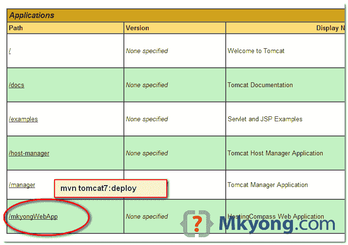

# 如何将基于 Maven 的 war 文件部署到 Tomcat

> 原文：<http://web.archive.org/web/20230101150211/http://www.mkyong.com/maven/how-to-deploy-maven-based-war-file-to-tomcat/>

在本教程中，我们将向您展示如何在 Tomcat 6 和 7 中使用 [Maven-Tomcat 插件](http://web.archive.org/web/20221021105138/https://tomcat.apache.org/maven-plugin.html)将 WAR 文件打包并部署到 Tomcat。

使用的库:

1.  maven3
2.  Tomcat 6.0.37
3.  Tomcat 7.0.53

**Tomcat 7**
Deploy URL = *http://localhost:8080/manager/text*
Command = `mvn tomcat7:deploy`

**Tomcat 6**
部署 URL =*http://localhost:8080/manager/*
命令= `mvn tomcat6:deploy`

## 1.Tomcat 7 示例

这个例子向您展示了如何在 Tomcat 7 上打包和部署 WAR 文件。

**1.1 Tomcat 认证**
添加一个角色为`manager-gui`和`manager-script`的用户。

%TOMCAT7_PATH%/conf/tomcat-users.xml

```
 <?xml version='1.0' encoding='utf-8'?>
<tomcat-users>

	<role rolename="manager-gui"/>
	<role rolename="manager-script"/>
	<user username="admin" password="password" roles="manager-gui,manager-script" />

</tomcat-users> 
```

**1.2 Maven 认证**
在 Maven 设置文件中添加上面 Tomcat 的用户，以后 Maven 将使用这个用户登录 Tomcat 服务器。

%MAVEN_PATH%/conf/settings.xml

```
 <?xml version="1.0" encoding="UTF-8"?>
<settings ...>
	<servers>

		<server>
			<id>TomcatServer</id>
			<username>admin</username>
			<password>password</password>
		</server>

	</servers>
</settings> 
```

**1.3 Tomcat7 Maven 插件**
声明一个 Maven Tomcat 插件。

pom.xml

```
 <plugin>
		<groupId>org.apache.tomcat.maven</groupId>
		<artifactId>tomcat7-maven-plugin</artifactId>
		<version>2.2</version>
		<configuration>
			<url>http://localhost:8080/manager/text</url>
			<server>TomcatServer</server>
			<path>/mkyongWebApp</path>
		</configuration>
	</plugin> 
```

它是如何工作的？
在部署过程中，它告诉 Maven 通过“http://localhost:8080/manager/text”，在路径“/mkyongWebApp”上，使用“Tomcat server”(在 settings.xml 中)用户名和密码进行认证，将 WAR 文件部署到 Tomcat 服务器上。

**1.4 部署到 Tomcat**
命令来操作 Tomcat 上的 WAR 文件。

```
 mvn tomcat7:deploy 
mvn tomcat7:undeploy 
mvn tomcat7:redeploy 
```

例子

```
 > mvn tomcat7:deploy

...
[INFO] Deploying war to http://localhost:8080/mkyongWebApp
Uploading: http://localhost:8080/manager/text/deploy?path=%2FmkyongWebApp&update=true
Uploaded: http://localhost:8080/manager/text/deploy?path=%2FmkyongWebApp&update=true (13925 KB at 35250.9 KB/sec)

[INFO] tomcatManager status code:200, ReasonPhrase:OK
[INFO] OK - Deployed application at context path /mkyongWebApp
[INFO] ------------------------------------------------------------------------
[INFO] BUILD SUCCESS
[INFO] ------------------------------------------------------------------------
[INFO] Total time: 8.507 s
[INFO] Finished at: 2014-08-05T11:35:25+08:00
[INFO] Final Memory: 28M/308M
[INFO] ------------------------------------------------------------------------ 
```



## 2.Tomcat 6 示例

这个例子向您展示了如何在 Tomcat 6 上打包和部署 WAR 文件。步骤与 Tomcat 7 相同，只是部署 url 和命令名不同。

2.1 Tomcat 身份验证

%TOMCAT6_PATH%/conf/tomcat-users.xml

```
 <?xml version='1.0' encoding='utf-8'?>
<tomcat-users>

	<role rolename="manager-gui"/>
	<role rolename="manager-script"/>
	<user username="admin" password="password" roles="manager-gui,manager-script" />

</tomcat-users> 
```

2.2 Maven 认证

%MAVEN_PATH%/conf/settings.xml

```
 <?xml version="1.0" encoding="UTF-8"?>
<settings ...>
	<servers>

		<server>
			<id>TomcatServer</id>
			<username>admin</username>
			<password>password</password>
		</server>

	</servers>
</settings> 
```

2.3 Tomcat6 Maven 插件

pom.xml

```
 <plugin>
		<groupId>org.apache.tomcat.maven</groupId>
		<artifactId>tomcat6-maven-plugin</artifactId>
		<version>2.2</version>
		<configuration>
			<url>http://localhost:8080/manager</url>
			<server>TomcatServer</server>
			<path>/mkyongWebApp</path>
		</configuration>
	</plugin> 
```

2.4 部署到 Tomcat

```
 mvn tomcat6:deploy 
mvn tomcat6:undeploy 
mvn tomcat6:redeploy 
```

例子

```
 > mvn tomcat6:deploy

...
[INFO] Deploying war to http://localhost:8080/mkyongWebApp
Uploading: http://localhost:8080/manager/deploy?path=%2FmkyongWebApp
Uploaded: http://localhost:8080/manager/deploy?path=%2FmkyongWebApp (13925 KB at 32995.5 KB/sec)

[INFO] ------------------------------------------------------------------------
[INFO] BUILD SUCCESS
[INFO] ------------------------------------------------------------------------
[INFO] Total time: 22.652 s
[INFO] Finished at: 2014-08-05T12:18:54+08:00
[INFO] Final Memory: 30M/308M
[INFO] ------------------------------------------------------------------------ 
```

## 参考

1.  [Apache Tomcat 7 管理器应用指南](http://web.archive.org/web/20221021105138/https://tomcat.apache.org/tomcat-7.0-doc/manager-howto.html)
2.  [Apache Tomcat 6 管理器应用指南](http://web.archive.org/web/20221021105138/https://tomcat.apache.org/tomcat-6.0-doc/manager-howto.html)
3.  [Tomcat Maven 插件](http://web.archive.org/web/20221021105138/https://tomcat.apache.org/maven-plugin.html)
4.  [Tomcat Maven 插件–上下文目标](http://web.archive.org/web/20221021105138/https://tomcat.apache.org/maven-plugin-trunk/context-goals.html)

<input type="hidden" id="mkyong-current-postId" value="8539">