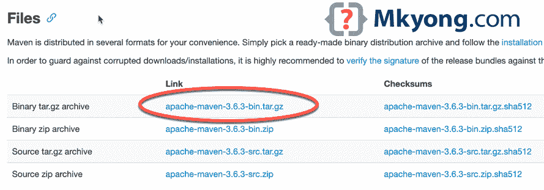

# 如何在 macOS 上安装 Maven

> 原文：<http://web.archive.org/web/20230101150211/https://mkyong.com/maven/install-maven-on-mac-osx/>

本文展示了如何在 macOS Big Sur(版本 11.1)上安装 Maven (3.6.3)。

主题

1.  [自制安装 Maven](#homebrew-install-maven-on-macos)
2.  [手动安装 Maven](#install-maven-manually)

**相关文章**

*   [如何在 macOS 上安装 Java JDK](/web/20221225035442/https://mkyong.com/java/how-to-install-java-on-mac-osx/)
*   [如何在 macOS 上设置$JAVA_HOME 环境变量](/web/20221225035442/https://mkyong.com/java/how-to-set-java_home-environment-variable-on-mac-os-x/)

## 1。自制在 macOS 上安装 Maven

1.1 安装 [Homebrew](http://web.archive.org/web/20221225035442/https://docs.brew.sh/Installation) ，macOS 上的一个包管理器。

1.2 命令`brew install maven`将安装最新的 Maven。

Terminal

```java
 % brew install maven 
```

1.3 搞定。Maven 安装在 macOS 上。

Terminal

```java
 % mvn -version

Apache Maven 3.6.3 (cecedd343002696d0abb50b32b541b8a6ba2883f)
Maven home: /usr/local/Cellar/maven/3.6.3_1/libexec
Java version: 15.0.1, vendor: N/A, runtime: /usr/local/Cellar/openjdk/15.0.1/libexec/openjdk.jdk/Contents/Home
Default locale: en_MY, platform encoding: UTF-8
OS name: "mac os x", version: "10.16", arch: "x86_64", family: "mac" 
```

*P.S 在撰写本文时，最新的 Maven 版本是 3.6.3*

1.4 家酿在哪里安装了 Maven？
`brew`将在`/usr/local/Cellar/maven/${version}`安装 Maven 包

Terminal

```java
 % ls -lsa /usr/local/Cellar/maven/3.6.3_1
total 72
0 drwxr-xr-x  9 mkyong  admin    288 Jan 11 11:10 .
0 drwxr-xr-x  3 mkyong  admin     96 Jan 11 11:10 ..
0 drwxr-xr-x  3 mkyong  admin     96 Jan 11 11:10 .brew
8 -rw-r--r--  1 mkyong  admin    756 Jan 11 11:10 INSTALL_RECEIPT.json
40 -rw-r--r--  1 mkyong  admin  17504 Nov  7  2019 LICENSE
16 -rw-r--r--  1 mkyong  admin   5141 Nov  7  2019 NOTICE
8 -rw-r--r--  1 mkyong  admin   2612 Nov  7  2019 README.txt
0 drwxr-xr-x  5 mkyong  admin    160 Jan 11 11:10 bin
0 drwxr-xr-x  6 mkyong  admin    192 Jan 11 11:10 libexec 
```

`brew`也在`/usr/local/opt/maven/`创建快捷方式或符号链接

Terminal

```java
 % ls -lsa /usr/local/opt/ | grep maven

0 lrwxr-xr-x   1 mkyong  admin    23 Jan 11 11:10 maven -> ../Cellar/maven/3.6.3_1 
```

1.5 家酿把 Maven 配置文件`settings.xml`放在哪里？
`settings.xml`在`/usr/local/opt/maven/libexec/conf`有售

Terminal

```java
 # real path
/usr/local/Cellar/maven/3.6.3_1/libexec/conf

# symbolic links to the above path
/usr/local/opt/maven/libexec/conf 
```

Terminal

```java
 % ls -lsa /usr/local/opt/maven/libexec/conf
total 32
 0 drwxr-xr-x  5 mkyong  admin    160 Jan 14 07:02 .
 0 drwxr-xr-x  6 mkyong  admin    192 Jan 11 11:10 ..
 0 drwxr-xr-x  3 mkyong  admin     96 Nov  7  2019 logging
24 -rw-r--r--  1 mkyong  admin  10468 Nov  7  2019 settings.xml
 8 -rw-r--r--  1 mkyong  admin   3747 Nov  7  2019 toolchains.xml 
```

1.6 家酿把核心`mvn`可执行文件放在哪里？
`mvn`在`/usr/local/bin/`

Terminal

```java
 % ls -lsah /usr/local/bin/mvn

0 lrwxr-xr-x  1 mkyong  admin    31B Jan 11 11:10 /usr/local/bin/mvn -> ../Cellar/maven/3.6.3_1/bin/mvn 
```

1.7 `brew info maven`显示 Maven 包的细节。

Terminal

```java
 % brew info maven   

maven: stable 3.6.3
Java-based project management
https://maven.apache.org/
Conflicts with:
  mvnvm (because also installs a 'mvn' executable)
/usr/local/Cellar/maven/3.6.3_1 (87 files, 10.7MB) *
  Built from source on 2021-01-11 at 11:10:48
From: https://github.com/Homebrew/homebrew-core/blob/HEAD/Formula/maven.rb
License: Apache-2.0
==> Dependencies
Required: openjdk ✔ 
```

1.8 `brew list maven`

Terminal

```java
 % brew list maven
/usr/local/Cellar/maven/3.6.3_1/bin/mvn
/usr/local/Cellar/maven/3.6.3_1/bin/mvnDebug
/usr/local/Cellar/maven/3.6.3_1/bin/mvnyjp
/usr/local/Cellar/maven/3.6.3_1/libexec/bin/ (4 files)
/usr/local/Cellar/maven/3.6.3_1/libexec/boot/ (2 files)
/usr/local/Cellar/maven/3.6.3_1/libexec/conf/ (3 files)
/usr/local/Cellar/maven/3.6.3_1/libexec/lib/ (70 files) 
```

1.9 有用的命令:

*   `brew upgrade maven`升级 Maven。
*   `brew uninstall maven`卸载 Maven。

## 2。手动安装 Maven】

如果家酿失败了，或者你不想要黑盒魔术，尝试手动安装 Maven。

2.1 下载 [Maven](http://web.archive.org/web/20221225035442/https://maven.apache.org/download.cgi) ，例如`apache-maven-3.6.3-bin.tar.gz`



2.2 下面的命令将下载的`.tar.gz`文件解压到当前用户的主目录`~`

Terminal

```java
 % pwd

# In this example, the ${username} is mkyong
/Users/${username}/Downloads

% tar -xvzf apache-maven-3.6.3-bin.tar.gz -C ~        

x apache-maven-3.6.3/README.txt
x apache-maven-3.6.3/LICENSE
x apache-maven-3.6.3/NOTICE
x apache-maven-3.6.3/lib/
#... 
```

2.3 现在，Maven 文件夹在这个路径`/Users/mkyong/apache-maven-3.6.3`

Terminal

```java
 % ls -lsa ~/apache-maven-3.6.3

total 64
0 drwxr-xr-x   9 mkyong  staff    288 Jan 14 11:08 .
0 drwxr-xr-x+ 29 mkyong  staff    928 Jan 14 11:08 ..
40 -rw-r--r--   1 mkyong  staff  17504 Nov  7  2019 LICENSE
16 -rw-r--r--   1 mkyong  staff   5141 Nov  7  2019 NOTICE
8 -rw-r--r--   1 mkyong  staff   2612 Nov  7  2019 README.txt
0 drwxr-xr-x   8 mkyong  staff    256 Jan 14 11:08 bin
0 drwxr-xr-x   4 mkyong  staff    128 Nov  7  2019 boot
0 drwxr-xr-x   5 mkyong  staff    160 Nov  7  2019 conf
0 drwxr-xr-x  65 mkyong  staff   2080 Nov  7  2019 lib

% cd ~/apache-maven-3.6.3
% pwd
/Users/mkyong/apache-maven-3.6.3 
```

2.4 在 macOS 10.5 Catalina 或更高版本上，[默认 shell 是 zsh](http://web.archive.org/web/20221225035442/https://www.theverge.com/2019/6/4/18651872/apple-macos-catalina-zsh-bash-shell-replacement-features) ，我们可以创建环境变量`MAVEN_HOME`并更新`~/.zshenv`中的`PATH`。

打开`~/.zshenv`，追加以下内容。

~/.zshenv

```java
 export MAVEN_HOME=~/apache-maven-3.6.3
export PATH=$PATH:$MAVEN_HOME/bin 
```

**注意**
对于 macOS 10.14 Mojave 及之前的版本，默认的终端 shell 是`bash`，我们可以在`~/.bash_profile`中创建环境变量。

打开`~/.bash_profile`，追加以下内容。

~/.bash_profile

```java
 export MAVEN_HOME=~/apache-maven-3.6.3
export PATH=$PATH:$MAVEN_HOME/bin 
```

*P.S 阅读此 [Zsh 启动文件](http://web.archive.org/web/20221225035442/http://zsh.sourceforge.net/Intro/intro_3.html)。*

2.5 生成`~/.zshenv`以反映变化。

Terminal

```java
 % source ~/.zshenv 
```

2.6 验证。

Terminal

```java
 % mvn -version

Apache Maven 3.6.3 (cecedd343002696d0abb50b32b541b8a6ba2883f)
Maven home: /Users/mkyong/apache-maven-3.6.3
Java version: 14, vendor: Oracle Corporation, runtime: /Library/Java/JavaVirtualMachines/jdk-14.jdk/Contents/Home
Default locale: en_MY, platform encoding: UTF-8
OS name: "mac os x", version: "10.16", arch: "x86_64", family: "mac" 
```

完成了。

## 参考文献

*   [Apache 胃](http://web.archive.org/web/20221225035442/https://maven.apache.org/)
*   [Zsh 启动文件](http://web.archive.org/web/20221225035442/http://zsh.sourceforge.net/Intro/intro_3.html)
*   [苹果将 bash 替换为 zsh 作为 macOS Catalina 的默认 shell](http://web.archive.org/web/20221225035442/https://www.theverge.com/2019/6/4/18651872/apple-macos-catalina-zsh-bash-shell-replacement-features)
*   [在 Mac OS X Lion 上设置环境变量](http://web.archive.org/web/20221225035442/https://stackoverflow.com/questions/7501678/set-environment-variables-on-mac-os-x-lion)
*   [家酿在 Mac 上哪里安装包](/web/20221225035442/https://mkyong.com/mac/where-does-homebrew-install-packages-on-mac/)

<input type="hidden" id="mkyong-current-postId" value="11106">