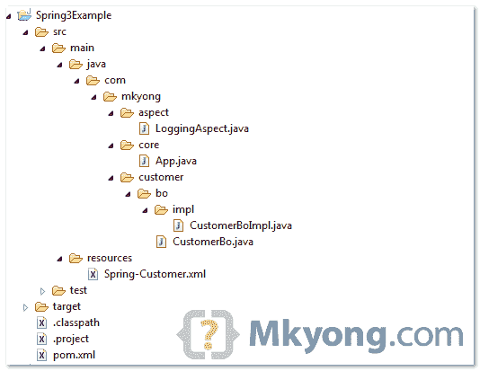

# Spring AOP + AspectJ 注释示例

> 原文：<http://web.archive.org/web/20230101150211/http://www.mkyong.com/spring3/spring-aop-aspectj-annotation-example/>

在本教程中，我们将向您展示如何将 AspectJ 注释与 Spring AOP 框架集成。简单地说，Spring AOP + AspectJ 允许您轻松地拦截方法。

常见的 AspectJ 注释:

1.  **@ Before**–在方法执行前运行
2.  **@ After**–在方法返回结果后运行
3.  **@ after returning**–在方法返回结果后运行，同样截取返回结果。
4.  **@ after throwing**–在方法抛出异常后运行
5.  **@ Around**–围绕方法执行运行，结合以上三个建议。

**Note**
For Spring AOP without AspectJ support, read this [build-in Spring AOP examples](http://web.archive.org/web/20221024211801/http://www.mkyong.com/spring/spring-aop-examples-advice).

## 1.目录结构

请参见本示例的目录结构。



## 2.项目相关性

要启用 AspectJ，需要 **aspectjrt.jar** 、 **aspectjweaver.jar** 和 **spring-aop.jar** 。参见下面的 Maven `pom.xml`文件。

**AspectJ supported since Spring 2.0**
This example is using Spring 3, but the AspectJ features are supported since Spring 2.0.

*文件:pom.xml*

```
 <project ...>

	<properties>
		<spring.version>3.0.5.RELEASE</spring.version>
	</properties>

	<dependencies>

		<dependency>
			<groupId>org.springframework</groupId>
			<artifactId>spring-core</artifactId>
			<version>${spring.version}</version>
		</dependency>

		<dependency>
			<groupId>org.springframework</groupId>
			<artifactId>spring-context</artifactId>
			<version>${spring.version}</version>
		</dependency>

		<!-- Spring AOP + AspectJ -->
		<dependency>
			<groupId>org.springframework</groupId>
			<artifactId>spring-aop</artifactId>
			<version>${spring.version}</version>
		</dependency>

		<dependency>
			<groupId>org.aspectj</groupId>
			<artifactId>aspectjrt</artifactId>
			<version>1.6.11</version>
		</dependency>

		<dependency>
			<groupId>org.aspectj</groupId>
			<artifactId>aspectjweaver</artifactId>
			<version>1.6.11</version>
		</dependency>

	</dependencies>
</project> 
```

## 3.春豆

普通 bean 使用很少的方法，稍后通过 AspectJ 注释拦截它。

```
 package com.mkyong.customer.bo;

public interface CustomerBo {

	void addCustomer();

	String addCustomerReturnValue();

	void addCustomerThrowException() throws Exception;

	void addCustomerAround(String name);
} 
```

```
 package com.mkyong.customer.bo.impl;

import com.mkyong.customer.bo.CustomerBo;

public class CustomerBoImpl implements CustomerBo {

	public void addCustomer(){
		System.out.println("addCustomer() is running ");
	}

	public String addCustomerReturnValue(){
		System.out.println("addCustomerReturnValue() is running ");
		return "abc";
	}

	public void addCustomerThrowException() throws Exception {
		System.out.println("addCustomerThrowException() is running ");
		throw new Exception("Generic Error");
	}

	public void addCustomerAround(String name){
		System.out.println("addCustomerAround() is running, args : " + name);
	}
} 
```

## 4.启用 AspectJ

在 Spring 配置文件中，放入“`<aop:aspectj-autoproxy />`”，定义你的方面(拦截器)和普通 bean。

*文件:Spring-Customer.xml*

```
 <beans 
	xmlns:xsi="http://www.w3.org/2001/XMLSchema-instance" 
	xmlns:aop="http://www.springframework.org/schema/aop"
	xsi:schemaLocation="http://www.springframework.org/schema/beans
	http://www.springframework.org/schema/beans/spring-beans-3.0.xsd 
	http://www.springframework.org/schema/aop 
	http://www.springframework.org/schema/aop/spring-aop-3.0.xsd ">

	<aop:aspectj-autoproxy />

	<bean id="customerBo" class="com.mkyong.customer.bo.impl.CustomerBoImpl" />

	<!-- Aspect -->
	<bean id="logAspect" class="com.mkyong.aspect.LoggingAspect" />

</beans> 
```

## 4.AspectJ @Before

在下面的例子中，`logBefore()`方法将在 customerBo 接口`addCustomer()`方法执行之前执行。

**Note**
AspectJ “pointcuts” is used to declare which method is going to intercept, and you should refer to this [Spring AOP pointcuts guide](http://web.archive.org/web/20221024211801/http://static.springsource.org/spring/docs/3.0.x/spring-framework-reference/html/aop.html#aop-pointcuts) for full list of supported pointcuts expressions.

*文件:LoggingAspect.java*

```
 package com.mkyong.aspect;

import org.aspectj.lang.JoinPoint;
import org.aspectj.lang.annotation.Aspect;
import org.aspectj.lang.annotation.Before;

@Aspect
public class LoggingAspect {

	@Before("execution(* com.mkyong.customer.bo.CustomerBo.addCustomer(..))")
	public void logBefore(JoinPoint joinPoint) {

		System.out.println("logBefore() is running!");
		System.out.println("hijacked : " + joinPoint.getSignature().getName());
		System.out.println("******");
	}

} 
```

运行它

```
 CustomerBo customer = (CustomerBo) appContext.getBean("customerBo");
	customer.addCustomer(); 
```

输出

```
 logBefore() is running!
hijacked : addCustomer
******
addCustomer() is running 
```

## 5.AspectJ @After

在下面的例子中，`logAfter()`方法将在 customerBo 接口`addCustomer()`方法执行之后执行。

*文件:LoggingAspect.java*

```
 package com.mkyong.aspect;

import org.aspectj.lang.JoinPoint;
import org.aspectj.lang.annotation.Aspect;
import org.aspectj.lang.annotation.After;

@Aspect
public class LoggingAspect {

	@After("execution(* com.mkyong.customer.bo.CustomerBo.addCustomer(..))")
	public void logAfter(JoinPoint joinPoint) {

		System.out.println("logAfter() is running!");
		System.out.println("hijacked : " + joinPoint.getSignature().getName());
		System.out.println("******");

	}

} 
```

运行它

```
 CustomerBo customer = (CustomerBo) appContext.getBean("customerBo");
	customer.addCustomer(); 
```

输出

```
 addCustomer() is running 
logAfter() is running!
hijacked : addCustomer
****** 
```

## 6.AspectJ @AfterReturning

在下面的例子中，`logAfterReturning()`方法将在 customerBo 接口`addCustomerReturnValue()`方法执行之后执行。此外，可以用“**返回**属性拦截返回值。

要截取返回值,“returning”属性(result)的值需要与方法参数(result)相同。

*文件:LoggingAspect.java*

```
 package com.mkyong.aspect;

import org.aspectj.lang.JoinPoint;
import org.aspectj.lang.annotation.Aspect;
import org.aspectj.lang.annotation.AfterReturning;

@Aspect
public class LoggingAspect {

   @AfterReturning(
      pointcut = "execution(* com.mkyong.customer.bo.CustomerBo.addCustomerReturnValue(..))",
      returning= "result")
   public void logAfterReturning(JoinPoint joinPoint, Object result) {

	System.out.println("logAfterReturning() is running!");
	System.out.println("hijacked : " + joinPoint.getSignature().getName());
	System.out.println("Method returned value is : " + result);
	System.out.println("******");

   }

} 
```

运行它

```
 CustomerBo customer = (CustomerBo) appContext.getBean("customerBo");
	customer.addCustomerReturnValue(); 
```

输出

```
 addCustomerReturnValue() is running 
logAfterReturning() is running!
hijacked : addCustomerReturnValue
Method returned value is : abc
****** 
```

## 7.AspectJ @AfterReturning

在下面的例子中，如果 customerBo 接口，`addCustomerThrowException()`方法抛出异常，将执行`logAfterThrowing()`方法。

*文件:LoggingAspect.java*

```
 package com.mkyong.aspect;

import org.aspectj.lang.JoinPoint;
import org.aspectj.lang.annotation.Aspect;
import org.aspectj.lang.annotation.AfterThrowing;

@Aspect
public class LoggingAspect {

   @AfterThrowing(
      pointcut = "execution(* com.mkyong.customer.bo.CustomerBo.addCustomerThrowException(..))",
      throwing= "error")
    public void logAfterThrowing(JoinPoint joinPoint, Throwable error) {

	System.out.println("logAfterThrowing() is running!");
	System.out.println("hijacked : " + joinPoint.getSignature().getName());
	System.out.println("Exception : " + error);
	System.out.println("******");

    }
} 
```

运行它

```
 CustomerBo customer = (CustomerBo) appContext.getBean("customerBo");
	customer.addCustomerThrowException(); 
```

输出

```
 addCustomerThrowException() is running 
logAfterThrowing() is running!
hijacked : addCustomerThrowException
Exception : java.lang.Exception: Generic Error
******
Exception in thread "main" java.lang.Exception: Generic Error
	//... 
```

## 8.AspectJ @Around

在下面的例子中，`logAround()`方法将在 customerBo 接口,`addCustomerAround()`方法之前执行，您必须定义“`joinPoint.proceed();`”来控制拦截器何时将控制返回给原始的`addCustomerAround()`方法。

*文件:LoggingAspect.java*

```
 package com.mkyong.aspect;

import org.aspectj.lang.ProceedingJoinPoint;
import org.aspectj.lang.annotation.Aspect;
import org.aspectj.lang.annotation.Around;

@Aspect
public class LoggingAspect {

   @Around("execution(* com.mkyong.customer.bo.CustomerBo.addCustomerAround(..))")
   public void logAround(ProceedingJoinPoint joinPoint) throws Throwable {

	System.out.println("logAround() is running!");
	System.out.println("hijacked method : " + joinPoint.getSignature().getName());
	System.out.println("hijacked arguments : " + Arrays.toString(joinPoint.getArgs()));

	System.out.println("Around before is running!");
	joinPoint.proceed(); //continue on the intercepted method
	System.out.println("Around after is running!");

	System.out.println("******");

   }

} 
```

运行它

```
 CustomerBo customer = (CustomerBo) appContext.getBean("customerBo");
	customer.addCustomerAround("mkyong"); 
```

输出

```
 logAround() is running!
hijacked method : addCustomerAround
hijacked arguments : [mkyong]
Around before is running!
addCustomerAround() is running, args : mkyong
Around after is running!
****** 
```

## 结论

总是建议应用最小功率的 AsjectJ 注释。这是一篇关于春天的 AspectJ 的相当长的文章。有关进一步的解释和示例，请访问下面的参考链接。

**Anti annotation or using JDK 1.4 ?**
No worry, AspectJ supported XML configuration also, read this [Spring AOP + AspectJ XML example](http://web.archive.org/web/20221024211801/http://www.mkyong.com/spring3/spring-aop-aspectj-in-xml-configuration-example/).

## 下载源代码

Download it – [Spring3-AOP-AspectJ-Example.zip](http://web.archive.org/web/20221024211801/http://www.mkyong.com/wp-content/uploads/2011/06/Spring3-AOP-AspectJ-Examples.zip) (8 KB)

## 参考

1.  [AspectJ 编程指南](http://web.archive.org/web/20221024211801/https://www.eclipse.org/aspectj/doc/released/progguide/index.html)
2.  [Spring AOP + AspectJ 引用](http://web.archive.org/web/20221024211801/http://static.springsource.org/spring/docs/3.0.x/spring-framework-reference/html/aop.html)

<input type="hidden" id="mkyong-current-postId" value="9356">