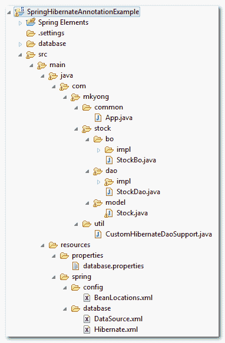

# Maven + (Spring + Hibernate)注释+ MySql 示例

> 原文：<http://web.archive.org/web/20230101150211/http://www.mkyong.com/spring/maven-spring-hibernate-annotation-mysql-example/>

Download It – [Spring-Hibernate-Annotation-Example.zip](http://web.archive.org/web/20200617010932/http://www.mkyong.com/wp-content/uploads/2010/03/Spring-Hibernate-Annotation-Example.zip)

在[上一篇教程](http://web.archive.org/web/20200617010932/http://www.mkyong.com/spring/maven-spring-hibernate-mysql-example/)中，您使用 Maven 创建了一个简单的 Java 项目结构，并演示了如何在 Spring framework 中使用 Hibernate 来完成 MySQL 数据库中的数据操作工作(插入、选择、更新和删除)。在本教程中，您将学习如何以 Spring 和 Hibernate 注释方式做同样的事情。

## 先决条件

–安装并配置了 Maven、MySQL 和 Eclipse IDE。

The **javaee.jar** library is required as well, you can get it from j2ee SDK, and include it manually, there is no full version of **javaee.jar** available in any of the Maven repository yet.

## 最终项目结构

您的最终项目文件结构应该看起来完全像下面这样，如果您在创建文件夹结构时迷失了方向，请在这里查看这个文件夹结构。

<noscript></noscript>


## 1.表格创建

在 MySQL 数据库中创建一个“股票”表。SQL 语句如下:

```
 CREATE TABLE  `mkyong`.`stock` (
  `STOCK_ID` int(10) unsigned NOT NULL AUTO_INCREMENT,
  `STOCK_CODE` varchar(10) NOT NULL,
  `STOCK_NAME` varchar(20) NOT NULL,
  PRIMARY KEY (`STOCK_ID`) USING BTREE,
  UNIQUE KEY `UNI_STOCK_NAME` (`STOCK_NAME`),
  UNIQUE KEY `UNI_STOCK_ID` (`STOCK_CODE`) USING BTREE
) ENGINE=InnoDB AUTO_INCREMENT=11 DEFAULT CHARSET=utf8; 
```

## 2.项目文件结构

用 Maven 命令' **mvn 原型创建一个快速的项目文件结构:生成**'，[参见这里的例子](http://web.archive.org/web/20200617010932/http://www.mkyong.com/maven/how-to-create-a-project-with-maven-template/)。将其转换为 Eclipse 项目( **mvn eclipse:eclipse** )并导入 Eclipse IDE。

```
 E:\workspace>mvn archetype:generate
[INFO] Scanning for projects...
...
Choose a number:  
(1/2/3....) 15: : 15
...
Define value for groupId: : com.mkyong.common
Define value for artifactId: : HibernateExample
Define value for version:  1.0-SNAPSHOT: :
Define value for package:  com.mkyong.common: : com.mkyong.common
[INFO] OldArchetype created in dir: E:\workspace\HibernateExample
[INFO] ------------------------------------------------------------------------
[INFO] BUILD SUCCESSFUL
[INFO] ------------------------------------------------------------------------ 
```

## 3.Pom.xml 文件配置

在 Maven 的 pom.xml 文件中添加 Spring、Hibernate、Annotation 和 MySQL 以及它们的依赖关系。

```
 <project  
  xmlns:xsi="http://www.w3.org/2001/XMLSchema-instance"
  xsi:schemaLocation="http://maven.apache.org/POM/4.0.0 
  http://maven.apache.org/maven-v4_0_0.xsd">
  <modelVersion>4.0.0</modelVersion>
  <groupId>com.mkyong.common</groupId>
  <artifactId>SpringExample</artifactId>
  <packaging>jar</packaging>
  <version>1.0-SNAPSHOT</version>
  <name>SpringExample</name>
  <url>http://maven.apache.org</url>

  <repositories>
    <repository>
      <id>JBoss repository</id>
      <url>http://repository.jboss.com/maven2/</url>
    </repository>
  </repositories>

  <dependencies>

        <!-- JUnit testing framework -->
        <dependency>
                <groupId>junit</groupId>
                <artifactId>junit</artifactId>
                <version>3.8.1</version>
                <scope>test</scope>
        </dependency>

        <!-- Spring framework -->
	<dependency>
		<groupId>org.springframework</groupId>
		<artifactId>spring</artifactId>
		<version>2.5.6</version>
	</dependency>

        <!-- Spring AOP dependency -->
        <dependency>
    	        <groupId>cglib</groupId>
		<artifactId>cglib</artifactId>
		<version>2.2</version>
	</dependency>

        <!-- MySQL database driver -->
	<dependency>
		<groupId>mysql</groupId>
		<artifactId>mysql-connector-java</artifactId>
		<version>5.1.9</version>
	</dependency>

	<!-- Hibernate framework -->
	<dependency>
		<groupId>hibernate</groupId>
		<artifactId>hibernate3</artifactId>
		<version>3.2.3.GA</version>
	</dependency>

	<!-- Hibernate annotation -->
	<dependency>
		<groupId>hibernate-annotations</groupId>
		<artifactId>hibernate-annotations</artifactId>
		<version>3.3.0.GA</version>
	</dependency>

	<dependency>
		<groupId>hibernate-commons-annotations</groupId>
		<artifactId>hibernate-commons-annotations</artifactId>
		<version>3.0.0.GA</version>
	</dependency>

	<!-- Hibernate library dependecy start -->
	<dependency>
		<groupId>dom4j</groupId>
		<artifactId>dom4j</artifactId>
		<version>1.6.1</version>
	</dependency>

	<dependency>
		<groupId>commons-logging</groupId>
		<artifactId>commons-logging</artifactId>
		<version>1.1.1</version>
	</dependency>

	<dependency>
		<groupId>commons-collections</groupId>
		<artifactId>commons-collections</artifactId>
		<version>3.2.1</version>
	</dependency>

	<dependency>
		<groupId>antlr</groupId>
		<artifactId>antlr</artifactId>
		<version>2.7.7</version>
	</dependency>
	<!-- Hibernate library dependecy end -->

  </dependencies>
</project> 
```

## 4.模型&博&道

**模型**、**业务对象** (BO)和**数据访问对象** (DAO)模式有助于清楚地识别层，避免弄乱项目结构。

##### 股票模型(注释)

存储股票数据的股票模型注释类。

```
 package com.mkyong.stock.model;

import javax.persistence.Column;
import javax.persistence.Entity;
import javax.persistence.GeneratedValue;
import static javax.persistence.GenerationType.IDENTITY;
import javax.persistence.Id;
import javax.persistence.Table;
import javax.persistence.UniqueConstraint;

@Entity
@Table(name = "stock", catalog = "mkyong", uniqueConstraints = {
		@UniqueConstraint(columnNames = "STOCK_NAME"),
		@UniqueConstraint(columnNames = "STOCK_CODE") })
public class Stock implements java.io.Serializable {

	private Integer stockId;
	private String stockCode;
	private String stockName;

	public Stock() {
	}

	public Stock(String stockCode, String stockName) {
		this.stockCode = stockCode;
		this.stockName = stockName;
	}

	@Id
	@GeneratedValue(strategy = IDENTITY)
	@Column(name = "STOCK_ID", unique = true, nullable = false)
	public Integer getStockId() {
		return this.stockId;
	}

	public void setStockId(Integer stockId) {
		this.stockId = stockId;
	}

	@Column(name = "STOCK_CODE", unique = true, nullable = false, length = 10)
	public String getStockCode() {
		return this.stockCode;
	}

	public void setStockCode(String stockCode) {
		this.stockCode = stockCode;
	}

	@Column(name = "STOCK_NAME", unique = true, nullable = false, length = 20)
	public String getStockName() {
		return this.stockName;
	}

	public void setStockName(String stockName) {
		this.stockName = stockName;
	}

	@Override
	public String toString() {
		return "Stock [stockCode=" + stockCode + ", stockId=" + stockId
				+ ", stockName=" + stockName + "]";
	}
} 
```

##### 库存业务对象(BO))

股票业务对象(BO)接口和实现，它用来存储项目的业务功能，真正的数据库操作(CRUD)工作不应该涉及这个类，相反它有一个 DAO (StockDao)类来做。

```
 package com.mkyong.stock.bo;

import com.mkyong.stock.model.Stock;

public interface StockBo {

	void save(Stock stock);
	void update(Stock stock);
	void delete(Stock stock);
	Stock findByStockCode(String stockCode);
} 
```

使这个类成为 Spring Ioc 容器中的 bean“stock bo ”,并自动连接 stock dao 类。

```
 package com.mkyong.stock.bo.impl;

import org.springframework.beans.factory.annotation.Autowired;
import org.springframework.stereotype.Service;

import com.mkyong.stock.bo.StockBo;
import com.mkyong.stock.dao.StockDao;
import com.mkyong.stock.model.Stock;

@Service("stockBo")
public class StockBoImpl implements StockBo{

	@Autowired
	StockDao stockDao;

	public void setStockDao(StockDao stockDao) {
		this.stockDao = stockDao;
	}

	public void save(Stock stock){
		stockDao.save(stock);
	}

	public void update(Stock stock){
		stockDao.update(stock);
	}

	public void delete(Stock stock){
		stockDao.delete(stock);
	}

	public Stock findByStockCode(String stockCode){
		return stockDao.findByStockCode(stockCode);
	}
} 
```

##### 股票数据访问对象

一个股票 DAO 接口及其实现。在上一篇教程中，您的 DAO 类直接扩展了" **HibernateDaoSupport** "，但是在注释模式下这是不可能的，因为您无法从您的 DAO 类自动连接会话工厂 bean。解决方法是创建一个自定义类(**CustomHibernateDaoSupport**)并扩展“ **HibernateDaoSupport** ”并自动连接会话工厂，您的 DAO 类扩展了这个类。

```
 package com.mkyong.stock.dao;

import com.mkyong.stock.model.Stock;

public interface StockDao {

	void save(Stock stock);
	void update(Stock stock);
	void delete(Stock stock);
	Stock findByStockCode(String stockCode);

} 
```

```
 package com.mkyong.util;

import org.hibernate.SessionFactory;
import org.springframework.beans.factory.annotation.Autowired;
import org.springframework.orm.hibernate3.support.HibernateDaoSupport;

public abstract class CustomHibernateDaoSupport extends HibernateDaoSupport
{    
    @Autowired
    public void anyMethodName(SessionFactory sessionFactory)
    {
        setSessionFactory(sessionFactory);
    }
} 
```

```
 package com.mkyong.stock.dao.impl;

import java.util.List;

import org.springframework.stereotype.Repository;

import com.mkyong.stock.dao.StockDao;
import com.mkyong.stock.model.Stock;
import com.mkyong.util.CustomHibernateDaoSupport;

@Repository("stockDao")
public class StockDaoImpl extends CustomHibernateDaoSupport implements StockDao{

	public void save(Stock stock){
		getHibernateTemplate().save(stock);
	}

	public void update(Stock stock){
		getHibernateTemplate().update(stock);
	}

	public void delete(Stock stock){
		getHibernateTemplate().delete(stock);
	}

	public Stock findByStockCode(String stockCode){
		List list = getHibernateTemplate().find(
                     "from Stock where stockCode=?",stockCode
                );
		return (Stock)list.get(0);
	}

} 
```

## 5.资源配置

在**‘project _ name/main/Java/**’下创建一个“ **resources** ”文件夹，Maven 会将该文件夹下的所有文件视为资源文件。它将用于存储 Spring、Hibernate 和其他配置文件。

##### 弹簧配置

数据库相关…

为数据库细节创建一个属性文件 **(database.properties** )，放入“**资源/属性**文件夹。将数据库细节和 Spring bean 配置分散到不同的文件中是一种很好的做法。

**数据库.属性**

```
 jdbc.driverClassName=com.mysql.jdbc.Driver
jdbc.url=jdbc:mysql://localhost:3306/mkyong
jdbc.username=root
jdbc.password=password 
```

为您的数据库创建一个“data source”bean 配置文件( **DataSource.xml** )，从 database.properties 导入属性，放入**的“资源/数据库**文件夹中。

**DataSource.xml**

```
 <beans 
xmlns:xsi="http://www.w3.org/2001/XMLSchema-instance"
xsi:schemaLocation="http://www.springframework.org/schema/beans
http://www.springframework.org/schema/beans/spring-beans-2.5.xsd">

<bean 
class="org.springframework.beans.factory.config.PropertyPlaceholderConfigurer">
	<property name="location">
		<value>properties/database.properties</value>
	</property>
</bean>

<bean id="dataSource" 
         class="org.springframework.jdbc.datasource.DriverManagerDataSource">
	<property name="driverClassName" value="${jdbc.driverClassName}" />
	<property name="url" value="${jdbc.url}" />
	<property name="username" value="${jdbc.username}" />
	<property name="password" value="${jdbc.password}" />
</bean>

</beans> 
```

冬眠相关的…

创建一个会话工厂 bean 配置文件 **(Hibernate.xml** ，放入**“资源/数据库**文件夹。在批注中，您必须使用**AnnotationSessionFactoryBean**，而不是 **LocalSessionFactoryBean** ，并在“ **annotatedClasses** ”属性中指定您的批注模型类，而不是“ **mappingResources** ”属性。

**Hibernate.xml**

```
 <?xml version="1.0" encoding="UTF-8"?>
<beans 
xmlns:xsi="http://www.w3.org/2001/XMLSchema-instance"
xsi:schemaLocation="http://www.springframework.org/schema/beans
http://www.springframework.org/schema/beans/spring-beans-2.5.xsd">

<!-- Hibernate session factory -->
<bean id="sessionFactory" 
class="org.springframework.orm.hibernate3.annotation.AnnotationSessionFactoryBean">

    <property name="dataSource">
      <ref bean="dataSource"/>
    </property>

    <property name="hibernateProperties">
       <props>
         <prop key="hibernate.dialect">org.hibernate.dialect.MySQLDialect</prop>
         <prop key="hibernate.show_sql">true</prop>
       </props>
    </property>

    <property name="annotatedClasses">
	<list>
		<value>com.mkyong.stock.model.Stock</value>
	</list>
    </property>

    </bean>
</beans> 
```

将所有 Spring 的 beans 配置文件导入到一个文件(BeanLocations.xml)中，将其放入“ **resources/config** 文件夹中。

**BeanLocations.xml**
导入 Spring 数据库配置并启用 Spring 的自动扫描特性。

```
 <beans 
xmlns:xsi="http://www.w3.org/2001/XMLSchema-instance"
xmlns:context="http://www.springframework.org/schema/context"
xsi:schemaLocation="http://www.springframework.org/schema/beans
http://www.springframework.org/schema/beans/spring-beans-2.5.xsd
http://www.springframework.org/schema/context
http://www.springframework.org/schema/context/spring-context-2.5.xsd">

	<!-- Database Configuration -->
	<import resource="../database/DataSource.xml"/>
	<import resource="../database/Hibernate.xml"/>

	<!-- Auto scan the components -->
	<context:component-scan 
		base-package="com.mkyong.stock" />

</beans> 
```

## 6.运行它

你有所有的文件和配置，运行它。

```
 package com.mkyong.common;

import org.springframework.context.ApplicationContext;
import org.springframework.context.support.ClassPathXmlApplicationContext;

import com.mkyong.stock.bo.StockBo;
import com.mkyong.stock.model.Stock;

public class App 
{
    public static void main( String[] args )
    {
    	ApplicationContext appContext = 
    	  new ClassPathXmlApplicationContext("spring/config/BeanLocations.xml");

    	StockBo stockBo = (StockBo)appContext.getBean("stockBo");

    	/** insert **/
    	Stock stock = new Stock();
    	stock.setStockCode("7668");
    	stock.setStockName("HAIO");
    	stockBo.save(stock);

    	/** select **/
    	Stock stock2 = stockBo.findByStockCode("7668");
    	System.out.println(stock2);

    	/** update **/
    	stock2.setStockName("HAIO-1");
    	stockBo.update(stock2);

    	/** delete **/
    	stockBo.delete(stock2);

    	System.out.println("Done");
    }
} 
```

输出

```
 Hibernate: insert into mkyong.stock (STOCK_CODE, STOCK_NAME) values (?, ?)
Hibernate: select stock0_.STOCK_ID as STOCK1_0_, 
stock0_.STOCK_CODE as STOCK2_0_, stock0_.STOCK_NAME as STOCK3_0_ 
from mkyong.stock stock0_ where stock0_.STOCK_CODE=?
Stock [stockCode=7668, stockId=11, stockName=HAIO]
Hibernate: update mkyong.stock set STOCK_CODE=?, STOCK_NAME=? where STOCK_ID=?
Hibernate: delete from mkyong.stock where STOCK_ID=?
Done 
```

## 结论

所有与 Spring、Hibernate 相关的类和配置文件都被注释了，它只是把数据库细节留在 XML 文件中。如果你知道如何注释数据库配置细节，请告诉我。就我个人而言，我很少使用注释特性，因为在某些情况下，你可能需要一些变通方法，比如上面的‘CustomHibernateDaoSupport’扩展了‘HibernateDaoSupport’。Spring 和 Hibernate 中成熟开发的 XML 文件。是更优选的。

Tags : [annotation](http://web.archive.org/web/20200617010932/https://mkyong.com/tag/annotation/) [hibernate](http://web.archive.org/web/20200617010932/https://mkyong.com/tag/hibernate/) [maven](http://web.archive.org/web/20200617010932/https://mkyong.com/tag/maven/) [mysql](http://web.archive.org/web/20200617010932/https://mkyong.com/tag/mysql/) [spring](http://web.archive.org/web/20200617010932/https://mkyong.com/tag/spring/)<input type="hidden" id="mkyong-current-postId" value="4049">