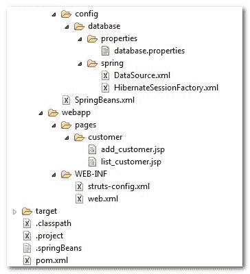
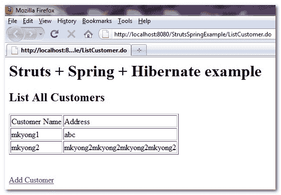
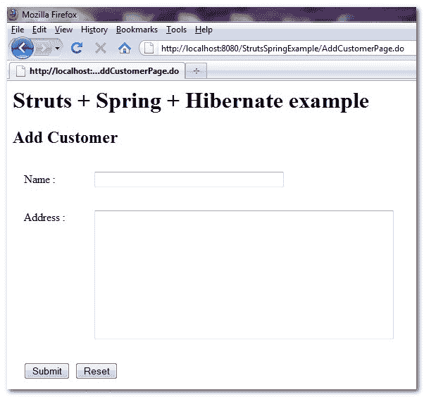

> 原文：<http://web.archive.org/web/20230101150211/http://www.mkyong.com/struts/struts-spring-hibernate-integration-example/>

# Struts + Spring + Hibernate 集成示例

Download this Struts 1.x + Spring + Hibernate example – [Struts-Spring-Hibernate-Example.zip](http://web.archive.org/web/20190215000825/http://www.mkyong.com/wp-content/uploads/2010/04/Struts-Spring-Hibernate-Example.zip)

在本教程中，您将学习如何创建一个简单的客户管理(添加和选择)web 应用程序，Maven 作为项目管理工具，Struts 1.x 作为 web 框架，Spring 作为依赖注入框架，Hibernate 作为数据库 ORM 框架。

整体集成架构如下所示:

```
 Struts (Web page) <---> Spring DI <--> Hibernate (DAO) <---> Database 
```

要将所有这些技术集成在一起，您应该..

1.  用 Spring 的" **LocalSessionFactoryBean** "类集成 Spring 和 Hibernate。
2.  通过 Spring 的 ready make Struts 插件将 Spring 与 Struts 集成起来。

## 1.项目结构

这是最终的项目结构。

 <ins class="adsbygoogle" style="display:block; text-align:center;" data-ad-format="fluid" data-ad-layout="in-article" data-ad-client="ca-pub-2836379775501347" data-ad-slot="6894224149">## 2.表格脚本

创建一个客户表来存储客户详细信息。

```
 DROP TABLE IF EXISTS `mkyong`.`customer`;
CREATE TABLE  `mkyong`.`customer` (
  `CUSTOMER_ID` bigint(20) unsigned NOT NULL AUTO_INCREMENT,
  `NAME` varchar(45) NOT NULL,
  `ADDRESS` varchar(255) NOT NULL,
  `CREATED_DATE` datetime NOT NULL,
  PRIMARY KEY (`CUSTOMER_ID`)
) ENGINE=InnoDB AUTO_INCREMENT=10 DEFAULT CHARSET=utf8; 
```

 <ins class="adsbygoogle" style="display:block" data-ad-client="ca-pub-2836379775501347" data-ad-slot="8821506761" data-ad-format="auto" data-ad-region="mkyongregion">## 3.Maven 详细信息

在 pom.xml.
**pom.xml** 中定义所有的 Struts、Spring 和 Hibernate 依赖库

```
 <project  
  xmlns:xsi="http://www.w3.org/2001/XMLSchema-instance"
  xsi:schemaLocation="http://maven.apache.org/POM/4.0.0 
  http://maven.apache.org/maven-v4_0_0.xsd">
  <modelVersion>4.0.0</modelVersion>
  <groupId>com.mkyong.common</groupId>
  <artifactId>StrutsSpringExample</artifactId>
  <packaging>war</packaging>
  <version>1.0-SNAPSHOT</version>
  <name>StrutsExample Maven Webapp</name>
  <url>http://maven.apache.org</url>

  <repositories>
  	<repository>
  		<id>Java.Net</id>
  		<url>http://download.java.net/maven/2/</url>
  	</repository>

	<repository>
		<id>JBoss repository</id>
		<url>http://repository.jboss.com/maven2/</url>
	</repository>

  </repositories>

  <dependencies>

        <!-- Spring framework --> 
	<dependency>
	  <groupId>org.springframework</groupId>
	  <artifactId>spring</artifactId>
	  <version>2.5.6</version>
	</dependency>

        <dependency>
	  <groupId>org.springframework</groupId>
	  <artifactId>spring-web</artifactId>
	  <version>2.5.6</version>
	</dependency>

	<dependency>
	  <groupId>org.springframework</groupId>
	  <artifactId>spring-struts</artifactId>
	  <version>2.0.8</version>
	</dependency>

        <!-- J2EE library -->
	<dependency>
	  <groupId>javax</groupId>
	  <artifactId>javaee-api</artifactId>
	  <version>6.0</version>
	</dependency>

        <!-- Unit Test -->
        <dependency>
          <groupId>junit</groupId>
          <artifactId>junit</artifactId>
          <version>3.8.1</version>
          <scope>test</scope>
        </dependency>

        <!-- Struts 1.3 framework -->
        <dependency>
          <groupId>org.apache.struts</groupId>
	  <artifactId>struts-core</artifactId>
          <version>1.3.10</version>
        </dependency>

        <dependency>
          <groupId>org.apache.struts</groupId>
	  <artifactId>struts-taglib</artifactId>
          <version>1.3.10</version>
        </dependency>

        <dependency>
          <groupId>org.apache.struts</groupId>
	  <artifactId>struts-extras</artifactId>
          <version>1.3.10</version>
        </dependency>

        <!-- MySQL database driver -->
	<dependency>
	  <groupId>mysql</groupId>
	  <artifactId>mysql-connector-java</artifactId>
	  <version>5.1.9</version>
	</dependency>

	<!-- Hibernate core -->
	<dependency>
	  <groupId>org.hibernate</groupId>
	  <artifactId>hibernate</artifactId>
	  <version>3.2.7.ga</version>
	</dependency>

	<!-- Hibernate core library dependecy start -->
	<dependency>
	  <groupId>dom4j</groupId>
	  <artifactId>dom4j</artifactId>
	  <version>1.6.1</version>
	</dependency>

	<dependency>
	  <groupId>commons-logging</groupId>
	  <artifactId>commons-logging</artifactId>
	  <version>1.1.1</version>
	</dependency>

	<dependency>
	  <groupId>commons-collections</groupId>
	  <artifactId>commons-collections</artifactId>
	  <version>3.2.1</version>
	</dependency>

	<dependency>
	  <groupId>cglib</groupId>
	  <artifactId>cglib</artifactId>
	  <version>2.2</version>
	</dependency>
	<!-- Hibernate core library dependecy end -->

	<!-- Hibernate query library dependecy start -->
	<dependency>
	  <groupId>antlr</groupId>
	  <artifactId>antlr</artifactId>
	  <version>2.7.7</version>
	</dependency>
	<!-- Hibernate query library dependecy end -->

  </dependencies>
  <build>
    <finalName>StrutsExample</finalName>
  </build>
</project> 
```

## 4.冬眠

在 Hibernate 中不需要太多的配置，只需要声明一个客户 XML 映射文件和模型。
**Customer.hbm.xml**

```
 <?xml version="1.0"?>
<!DOCTYPE hibernate-mapping PUBLIC 
"-//Hibernate/Hibernate Mapping DTD 3.0//EN"
"http://hibernate.sourceforge.net/hibernate-mapping-3.0.dtd">
<hibernate-mapping>
    <class name="com.mkyong.customer.model.Customer" 
        table="customer" catalog="mkyong">

        <id name="customerId" type="long">
            <column name="CUSTOMER_ID" />
            <generator class="identity" />
        </id>
        <property name="name" type="string">
            <column name="NAME" length="45" not-null="true" />
        </property>
        <property name="address" type="string">
            <column name="ADDRESS" not-null="true" />
        </property>
        <property name="createdDate" type="timestamp">
            <column name="CREATED_DATE" length="19" not-null="true" />
        </property>
    </class>
</hibernate-mapping> 
```

**Customer.java**

```
 package com.mkyong.customer.model;

import java.util.Date;

public class Customer implements java.io.Serializable {

	private long customerId;
	private String name;
	private String address;
	private Date createdDate;

	//getter and setter methods

} 
```

## 5.春天

Spring 的业务对象(BO)和数据访问对象(DAO)的 beans 声明。DAO 类(CustomerDaoImpl.java)是扩展 Spring 的" **HibernateDaoSupport** "类来方便地访问休眠功能。
customer bean . XML

```
 <?xml version="1.0" encoding="UTF-8"?>
<beans 
	xmlns:xsi="http://www.w3.org/2001/XMLSchema-instance"
	xsi:schemaLocation="http://www.springframework.org/schema/beans 
	http://www.springframework.org/schema/beans/spring-beans-2.5.xsd">

   	<bean id="customerBo" 
                class="com.mkyong.customer.bo.impl.CustomerBoImpl" >
   		<property name="customerDao" ref="customerDao" />
   	</bean>

   	<bean id="customerDao" 
                class="com.mkyong.customer.dao.impl.CustomerDaoImpl" >
   		<property name="sessionFactory" ref="sessionFactory"></property>
   	</bean>

</beans> 
```

**CustomerBo.java**

```
 package com.mkyong.customer.bo;

import java.util.List;

import com.mkyong.customer.model.Customer;

public interface CustomerBo{

	void addCustomer(Customer customer);

	List<Customer> findAllCustomer();

} 
```

**CustomerBoImpl.java**

```
 package com.mkyong.customer.bo.impl;

import java.util.List;

import com.mkyong.customer.bo.CustomerBo;
import com.mkyong.customer.dao.CustomerDao;
import com.mkyong.customer.model.Customer;

public class CustomerBoImpl implements CustomerBo{

	CustomerDao customerDao;

	public void setCustomerDao(CustomerDao customerDao) {
		this.customerDao = customerDao;
	}

	public void addCustomer(Customer customer){

		customerDao.addCustomer(customer);

	}

	public List<Customer> findAllCustomer(){

		return customerDao.findAllCustomer();
	}
} 
```

**CustomerDao.java**

```
 package com.mkyong.customer.dao;

import java.util.List;

import com.mkyong.customer.model.Customer;

public interface CustomerDao{

	void addCustomer(Customer customer);

	List<Customer> findAllCustomer();

} 
```

**CustomerDaoImpl.java**

```
 package com.mkyong.customer.dao.impl;

import java.util.Date;
import java.util.List;

import com.mkyong.customer.dao.CustomerDao;
import com.mkyong.customer.model.Customer;
import org.springframework.orm.hibernate3.support.HibernateDaoSupport;

public class CustomerDaoImpl extends 
       HibernateDaoSupport implements CustomerDao{

	public void addCustomer(Customer customer){

		customer.setCreatedDate(new Date());
		getHibernateTemplate().save(customer);

	}

	public List<Customer> findAllCustomer(){

		return getHibernateTemplate().find("from Customer");

	}
} 
```

## 6.春天+冬眠

声明数据库细节，并通过“ **LocalSessionFactoryBean** ”将 Spring 和 Hibernate 集成在一起。
T3

```
 jdbc.driverClassName=com.mysql.jdbc.Driver
jdbc.url=jdbc:mysql://localhost:3306/mkyong
jdbc.username=root
jdbc.password=password 
```

**DataSource.xml**

```
 <beans 
xmlns:xsi="http://www.w3.org/2001/XMLSchema-instance"
xsi:schemaLocation="http://www.springframework.org/schema/beans
http://www.springframework.org/schema/beans/spring-beans-2.5.xsd">

 <bean 
   class="org.springframework.beans.factory.config.PropertyPlaceholderConfigurer">
   <property name="location">
     <value>WEB-INF/classes/config/database/properties/database.properties</value>
   </property>
</bean>

  <bean id="dataSource" 
         class="org.springframework.jdbc.datasource.DriverManagerDataSource">
	<property name="driverClassName" value="${jdbc.driverClassName}" />
	<property name="url" value="${jdbc.url}" />
	<property name="username" value="${jdbc.username}" />
	<property name="password" value="${jdbc.password}" />
  </bean>

</beans> 
```

hibernate session factory . XML

```
 <?xml version="1.0" encoding="UTF-8"?>
<beans 
xmlns:xsi="http://www.w3.org/2001/XMLSchema-instance"
xsi:schemaLocation="http://www.springframework.org/schema/beans
http://www.springframework.org/schema/beans/spring-beans-2.5.xsd">

<!-- Hibernate session factory -->
<bean id="sessionFactory" 
     class="org.springframework.orm.hibernate3.LocalSessionFactoryBean">

    <property name="dataSource">
      <ref bean="dataSource"/>
    </property>

    <property name="hibernateProperties">
       <props>
         <prop key="hibernate.dialect">org.hibernate.dialect.MySQLDialect</prop>
         <prop key="hibernate.show_sql">true</prop>
       </props>
    </property>

    <property name="mappingResources">
	<list>
          <value>com/mkyong/customer/hibernate/Customer.hbm.xml</value>
	</list>
     </property>	

</bean>
</beans> 
```

**SpringBeans.xml**

```
 <beans 
xmlns:xsi="http://www.w3.org/2001/XMLSchema-instance"
xsi:schemaLocation="http://www.springframework.org/schema/beans
http://www.springframework.org/schema/beans/spring-beans-2.5.xsd">

	<!-- Database Configuration -->
	<import resource="config/database/spring/DataSource.xml"/>
	<import resource="config/database/spring/HibernateSessionFactory.xml"/>

	<!-- Beans Declaration -->
	<import resource="com/mkyong/customer/spring/CustomerBean.xml"/>

</beans> 
```

## 7.支柱+弹簧

要集成 Spring 和 Struts，需要在 struts-config.xml 文件中注册一个 Spring 的内置 Struts 插件" **ContextLoaderPlugIn** "。在 Action 类中，它必须扩展 Spring 的“ **ActionSupport** ”类，您可以通过**getWebApplicationContext()**获得 Spring bean。

**AddCustomerAction.java**

```
 package com.mkyong.customer.action;

import javax.servlet.http.HttpServletRequest;
import javax.servlet.http.HttpServletResponse;

import org.apache.commons.beanutils.BeanUtils;
import org.apache.struts.action.ActionForm;
import org.apache.struts.action.ActionForward;
import org.apache.struts.action.ActionMapping;
import org.springframework.web.struts.ActionSupport;

import com.mkyong.customer.bo.CustomerBo;
import com.mkyong.customer.form.CustomerForm;
import com.mkyong.customer.model.Customer;

public class AddCustomerAction extends ActionSupport{

public ActionForward execute(ActionMapping mapping,ActionForm form,
	HttpServletRequest request,HttpServletResponse response) 
        throws Exception {

	CustomerBo customerBo =
 	  (CustomerBo) getWebApplicationContext().getBean("customerBo");

	CustomerForm customerForm = (CustomerForm)form;
	Customer customer = new Customer();

	//copy customerform to model
	BeanUtils.copyProperties(customer, customerForm);

	//save it
	customerBo.addCustomer(customer);

	return mapping.findForward("success");

  }
} 
```

**ListCustomerAction.java**

```
 package com.mkyong.customer.action;

import java.util.List;

import javax.servlet.http.HttpServletRequest;
import javax.servlet.http.HttpServletResponse;

import org.apache.struts.action.ActionForm;
import org.apache.struts.action.ActionForward;
import org.apache.struts.action.ActionMapping;
import org.apache.struts.action.DynaActionForm;
import org.springframework.web.struts.ActionSupport;

import com.mkyong.customer.bo.CustomerBo;
import com.mkyong.customer.model.Customer;

public class ListCustomerAction extends ActionSupport{

  public ActionForward execute(ActionMapping mapping,ActionForm form,
	HttpServletRequest request,HttpServletResponse response) 
        throws Exception {

	CustomerBo customerBo =
	  (CustomerBo) getWebApplicationContext().getBean("customerBo");

	DynaActionForm dynaCustomerListForm = (DynaActionForm)form;

	List<Customer> list = customerBo.findAllCustomer();

	dynaCustomerListForm.set("customerList", list);

	return mapping.findForward("success");

  }
} 
```

**CustomerForm.java**

```
 package com.mkyong.customer.form;

import javax.servlet.http.HttpServletRequest;

import org.apache.struts.action.ActionErrors;
import org.apache.struts.action.ActionForm;
import org.apache.struts.action.ActionMapping;
import org.apache.struts.action.ActionMessage;

public class CustomerForm extends ActionForm {

	private String name;
	private String address;

	//getter and setter, basic validation

} 
```

**客户属性**

```
 #customer module label message
customer.label.name = Name
customer.label.address = Address

customer.label.button.submit = Submit
customer.label.button.reset = Reset

#customer module error message
customer.err.name.required = Name is required
customer.err.address.required = Address is required 
```

**add_customer.jsp**

```
<%@taglib uri="http://struts.apache.org/tags-html" prefix="html"%>
<%@taglib uri="http://struts.apache.org/tags-bean" prefix="bean"%>

Struts + Spring + Hibernate 示例

添加客户

```

<form action="/AddCustomer.do"><message key="customer.label.name">:</message><message key="customer.label.address">:</message><textarea property="address" cols="50" rows="10"></div> <div style="padding:16px"> <div style="float:left;padding-right:8px;"> <submit> <message key="customer.label.button.submit"/> </submit> </div> <reset> <message key="customer.label.button.reset"/> </reset> </div> </form> <p><strong> list_customer.jsp </strong></p> <pre lang="html"> <%@taglib uri="http://struts.apache.org/tags-html" prefix="html"%> <%@taglib uri="http://struts.apache.org/tags-bean" prefix="bean"%> <%@taglib uri="http://struts.apache.org/tags-logic" prefix="logic"%> <h1>Struts + Spring + Hibernate 示例</h1> <h2>列出所有客户</h2> </pre><table border="1"> <tr><td>用户姓名</td><td>地址</td></tr> <iterate id="customer" name="dynaCustomerListForm" property="customerList"> <tr> <td><write name="customer" property="name"/></td> <td><write name="customer" property="address"/></td> </tr> </iterate> </table> <br/> <br/> <link action="/AddCustomerPage.do"/>Add Customer <p><strong> struts-config.xml </strong></p> <pre><code class="language-markup"> <?xml version="1.0" encoding="UTF-8"?> <!DOCTYPE struts-config PUBLIC "-//Apache Software Foundation//DTD Struts Configuration 1.3//EN" "http://jakarta.apache.org/struts/dtds/struts-config_1_3.dtd"> <struts-config> <form-beans> <form-bean name="customerForm" type="com.mkyong.customer.form.CustomerForm" /> <form-bean name="dynaCustomerListForm" type="org.apache.struts.action.DynaActionForm"> <form-property name="customerList" type="java.util.List"/> </form-bean> </form-beans> <action-mappings> <action path="/AddCustomerPage" type="org.apache.struts.actions.ForwardAction" parameter="/pages/customer/add_customer.jsp"/> <action path="/AddCustomer" type="com.mkyong.customer.action.AddCustomerAction" name="customerForm" validate="true" input="/pages/customer/add_customer.jsp" > <forward name="success" redirect="true" path="/ListCustomer.do"/> </action> <action path="/ListCustomer" type="com.mkyong.customer.action.ListCustomerAction" name="dynaCustomerListForm" > <forward name="success" path="/pages/customer/list_customer.jsp"/> </action> </action-mappings> <message-resources parameter="com.mkyong.customer.properties.Customer" /> <!-- Spring Struts plugin --> <plug-in className="org.springframework.web.struts.ContextLoaderPlugIn"> <set-property property="contextConfigLocation" value="/WEB-INF/classes/SpringBeans.xml" /> </plug-in> </struts-config> </code></pre> <p><strong> web.xml </strong></p> <pre><code class="language-markup"> <!DOCTYPE web-app PUBLIC "-//Sun Microsystems, Inc.//DTD Web Application 2.3//EN" "http://java.sun.com/dtd/web-app_2_3.dtd" > <web-app> <display-name>Struts Hibernate Examples</display-name> <servlet> <servlet-name>action</servlet-name> <servlet-class> org.apache.struts.action.ActionServlet </servlet-class> <init-param> <param-name>config</param-name> <param-value> /WEB-INF/struts-config.xml </param-value> </init-param> <load-on-startup>1</load-on-startup> </servlet> <servlet-mapping> <servlet-name>action</servlet-name> <url-pattern>*.do</url-pattern> </servlet-mapping> </web-app> </code></pre> <h2>8.示范</h2> <p><strong> 1。</strong> <br/>列出客户页面从数据库中列出所有客户。<br/><em>http://localhost:8080/struts string example/list customer . do</em></p> <div class="pic">  </div> <p><strong> 2。添加客户页面</strong> <br/>将客户详细信息添加到数据库中。<br/><em>http://localhost:8080/struts string example/add customer page . do</em></p> <div class="pic">  </div> <h2>参考</h2> <ol> <li><a href="http://web.archive.org/web/20190215000825/http://www.mkyong.com/struts/struts-spring-integration-example/" target="_blank">支柱+弹簧示例</a></li> <li><a href="http://web.archive.org/web/20190215000825/http://www.mkyong.com/struts/struts-hibernate-integration-example/" target="_blank"> Struts + Hibernate 示例</a></li> <li><a href="http://web.archive.org/web/20190215000825/http://www.mkyong.com/spring/maven-spring-hibernate-mysql-example/" target="_blank">春天+冬眠的例子</a></li> </ol> <div class="row"> <div class="col"> <div class="post-tag"><a href="http://web.archive.org/web/20190215000825/http://www.mkyong.com/tag/hibernate/" rel="tag">hibernate</a> <a href="http://web.archive.org/web/20190215000825/http://www.mkyong.com/tag/integration/" rel="tag">integration</a> <a href="http://web.archive.org/web/20190215000825/http://www.mkyong.com/tag/spring/" rel="tag">spring</a> <a href="http://web.archive.org/web/20190215000825/http://www.mkyong.com/tag/struts/" rel="tag">struts</a></div> </div> </div> </div> <!-- /.post-content --> <div class="ads-box"> <!--Carambola Script -->  (function (i,d,s,o,m,r,c,l,w,q,y,h,g) { var e=d.getElementById(r);if(e===null){ var t = d.createElement(o); t.src = g; t.id = r; t.setAttribute(m, s);t.async = 1;var n=d.getElementsByTagName(o)[0];n.parentNode.insertBefore(t, n); var dt=new Date().getTime(); try{i[l][w+y](h,i[l][q+y](h)+'&amp;'+dt);}catch(er){i[h]=dt;} } else if(typeof i[c]!=='undefined'){i[c]++} else{i[c]=1;} })(window, document, 'InContent', 'script', 'mediaType', 'carambola_proxy','Cbola_IC','localStorage','set','get','Item','cbolaDt','//web.archive.org/web/20190215000825/http://route.carambo.la/inimage/getlayer?pid=myky82&amp;did=112239&amp;wid=0') </div> <input type="hidden" id="mkyong-postId" value="4665"/> <h4>关于作者</h4> <div id="author-info" class="media rounded">  <div class="media-body"> <h5 class="mt-0">mkyong</h5> Founder of <a href="http://web.archive.org/web/20190215000825/http://mkyong.com/" rel="nofollow">Mkyong.com</a>, love Java and open source stuff. Follow him on <a href="http://web.archive.org/web/20190215000825/https://twitter.com/mkyong">Twitter</a>, or befriend him on <a href="http://web.archive.org/web/20190215000825/http://www.facebook.com/java.tutorial">Facebook</a> or <a href="http://web.archive.org/web/20190215000825/https://plus.google.com/110948163568945735692?rel=author">Google Plus</a>. If you like my tutorials, consider make a donation to <a href="http://web.archive.org/web/20190215000825/http://www.mkyong.com/blog/donate-to-charity/">these charities</a>. </div> </div> <!-- Google recommend --> <div class="ads-box"> <!-- google recommend --> <ins class="adsbygoogle" style="display:block" data-ad-format="autorelaxed" data-ad-client="ca-pub-2836379775501347" data-ad-slot="3110889791"/> <script> (adsbygoogle = window.adsbygoogle || []).push({}); </script> </div> <!-- <div class="d-none d-md-block"> <div id="mk-related-post"></div> <div id="mk-popular-post"></div> </div> --> <div id="comment"> <div class="wpdiscuz_top_clearing"/> <div id="wpdiscuz-loading-bar" class="wpdiscuz-loading-bar wpdiscuz-loading-bar-unauth"/> </div> <!-- /#comment --> </body> </html></textarea></form></ins></ins>