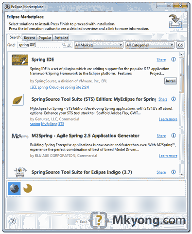

> 原文：<http://web.archive.org/web/20230101150211/http://www.mkyong.com/spring/how-to-install-spring-ide-in-eclipse/>

# 如何在 Eclipse 中安装 Spring IDE

Spring IDE 是一个非常有用的图形用户界面工具，增加了对 Spring 框架的支持。在本教程中，我们将向您展示在 Eclipse 中安装 Spring IDE 的两种方法。

本教程中使用的版本:

1.  Spring IDE 2.9
2.  Eclipse 3.7

**Spring IDE or SpringSource Tool Suite (STS)?**
Refer to this [Spring IDE vs STS pdf file](http://web.archive.org/web/20190210101641/http://download.springsource.com/release/STS/doc/STS-feature_comparison.pdf) for feature comparison. Personally, I go for Spring IDE for one reason – just can’t let go my existing Eclipse, too many plugins installed.

## 1.安装新软件

经典方式，Eclipse IDE，点击**帮助**->-**安装新软件** …。键入“【http://springide.org/updatesite】”访问 Spring IDE 更新站点。

选择您想要安装的所有 Spring IDE 特性。

完成后需要很长时间来安装和重启 Eclipse。

 <ins class="adsbygoogle" style="display:block; text-align:center;" data-ad-format="fluid" data-ad-layout="in-article" data-ad-client="ca-pub-2836379775501347" data-ad-slot="6894224149">## 2.Eclipse 市场

这是更好的方法，因为你不需要记住很长的 Spring ide 更新 URL。在 Eclipse IDE 中，点击“**帮助**”->”**Eclipse market place**，输入“ **Spring IDE** ，按照向导完成安装。

同样，安装和重启 Eclipse 需要很长时间。

 <ins class="adsbygoogle" style="display:block" data-ad-client="ca-pub-2836379775501347" data-ad-slot="8821506761" data-ad-format="auto" data-ad-region="mkyongregion">## 参考

1.  [http://www.springsource.com/developer/sts](http://web.archive.org/web/20190210101641/http://www.springsource.com/developer/sts)
2.  [http://marketplace.eclipse.org/content/spring-ide](http://web.archive.org/web/20190210101641/http://marketplace.eclipse.org/content/spring-ide)
3.  [http://download . springsource . com/release/STS/doc/STS-feature _ comparison . pdf](http://web.archive.org/web/20190210101641/http://download.springsource.com/release/STS/doc/STS-feature_comparison.pdf)

[eclipse](http://web.archive.org/web/20190210101641/http://www.mkyong.com/tag/eclipse/) [spring](http://web.archive.org/web/20190210101641/http://www.mkyong.com/tag/spring/) [spring ide](http://web.archive.org/web/20190210101641/http://www.mkyong.com/tag/spring-ide/)</ins></ins> (function (i,d,s,o,m,r,c,l,w,q,y,h,g) { var e=d.getElementById(r);if(e===null){ var t = d.createElement(o); t.src = g; t.id = r; t.setAttribute(m, s);t.async = 1;var n=d.getElementsByTagName(o)[0];n.parentNode.insertBefore(t, n); var dt=new Date().getTime(); try{i[l][w+y](h,i[l][q+y](h)+'&amp;'+dt);}catch(er){i[h]=dt;} } else if(typeof i[c]!=='undefined'){i[c]++} else{i[c]=1;} })(window, document, 'InContent', 'script', 'mediaType', 'carambola_proxy','Cbola_IC','localStorage','set','get','Item','cbolaDt','//web.archive.org/web/20190210101641/http://route.carambo.la/inimage/getlayer?pid=myky82&amp;did=112239&amp;wid=0')<input type="hidden" id="mkyong-postId" value="3629">

#### 关于作者

##### mkyong

Founder of [Mkyong.com](http://web.archive.org/web/20190210101641/http://mkyong.com/), love Java and open source stuff. Follow him on [Twitter](http://web.archive.org/web/20190210101641/https://twitter.com/mkyong), or befriend him on [Facebook](http://web.archive.org/web/20190210101641/http://www.facebook.com/java.tutorial) or [Google Plus](http://web.archive.org/web/20190210101641/https://plus.google.com/110948163568945735692?rel=author). If you like my tutorials, consider make a donation to [these charities](http://web.archive.org/web/20190210101641/http://www.mkyong.com/blog/donate-to-charity/).