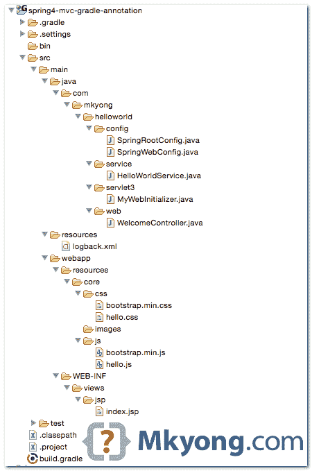
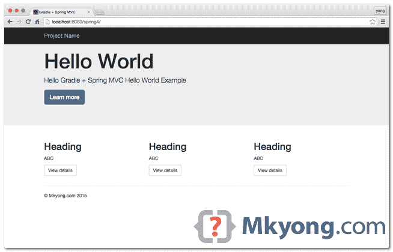
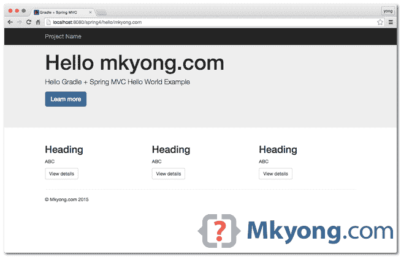

> 原文：<http://web.archive.org/web/20230101150211/http://www.mkyong.com/spring-mvc/gradle-spring-4-mvc-hello-world-example-annotation/>

# gradle–Spring 4 MVC Hello World 示例–注释


在本教程中，我们将以之前的 [Gradle + Spring MVC XML 示例](http://web.archive.org/web/20190228093437/http://www.mkyong.com/spring-mvc/gradle-spring-mvc-web-project-example/)为例，将其重写为支持@JavaConfig 注释配置，不再需要 XML 文件。

这个例子只能在 Servlet 3.0+容器中运行，比如 Tomcat 7 或 Jetty 9。

使用的技术:

1.  Gradle 2.0
2.  弹簧 4.1.6 释放
3.  Tomcat 7 或 Jetty 9
4.  Eclipse 4.4
5.  JDK 1.7
6.  回溯 1.1.3
7.  助推器 3

## 1.项目结构

下载项目[源代码](#download)并查看项目文件夹结构:



*P.S 不再有类似`web.xml`或 Spring XML 配置文件的 XML 文件。*

 <ins class="adsbygoogle" style="display:block; text-align:center;" data-ad-format="fluid" data-ad-layout="in-article" data-ad-client="ca-pub-2836379775501347" data-ad-slot="6894224149">## 2\. Gradle

2.1 查看`build.gradle`文件，这应该是不言自明的。

build.gradle

```java
 apply plugin: 'java'
apply plugin: 'war'
apply plugin: 'eclipse-wtp'
//apply plugin: 'jetty' //too old, Jetty 6, use gretty plugin
apply plugin: 'org.akhikhl.gretty'

// JDK 7
sourceCompatibility = 1.7
targetCompatibility = 1.7

repositories {
    mavenLocal()
    mavenCentral()
}

dependencies {
    compile 'ch.qos.logback:logback-classic:1.1.3'
    compile 'org.springframework:spring-webmvc:4.1.6.RELEASE'
    compile 'javax.servlet:jstl:1.2'

    //include in compile only, exclude in the war
    providedCompile 'javax.servlet:servlet-api:2.5'
}

//Gretty Embedded Jetty
buildscript {
  repositories {
    jcenter()
  }

  dependencies {
    classpath 'org.akhikhl.gretty:gretty:+'
  }
}

// Don't use Jetty8, even it's a servlet 3.0+ container, 
// but not support non-jar WebApplicationInitializer scanning.
// It will cause "No Spring WebApplicationInitializer types detected on classpath"
gretty {
  port = 8080
  contextPath = 'spring4'
  servletContainer = 'jetty9' //tomcat7 or tomcat8
}

//For Eclipse IDE only
eclipse {

  wtp {
    component {

      //define context path, default to project folder name
      contextPath = 'spring4'

    }

  }
} 
```

2.2 使这个项目支持 Eclipse IDE。现在，您可以将项目导入到 Eclipse IDE 中。

```java
 your-project$ gradle eclipse 
```

 <ins class="adsbygoogle" style="display:block" data-ad-client="ca-pub-2836379775501347" data-ad-slot="8821506761" data-ad-format="auto" data-ad-region="mkyongregion">## 3.弹簧@配置

Spring @Configuration 及其 XML 等价物。

3.1 Spring annotation 配置扫描服务类。

SpringRootConfig.java

```java
 package com.mkyong.helloworld.config;

import org.springframework.context.annotation.ComponentScan;
import org.springframework.context.annotation.Configuration;

@Configuration
@ComponentScan({ "com.mkyong.helloworld.service" })
public class SpringRootConfig {
} 
```

XML 等价物。

spring-core-config.xml

```java
 <beans 
	xmlns:context="http://www.springframework.org/schema/context"
	xmlns:xsi="http://www.w3.org/2001/XMLSchema-instance"
	xmlns:mvc="http://www.springframework.org/schema/mvc"
	xsi:schemaLocation="
        http://www.springframework.org/schema/beans     
        http://www.springframework.org/schema/beans/spring-beans.xsd
        http://www.springframework.org/schema/context 
        http://www.springframework.org/schema/context/spring-context.xsd ">

	<context:component-scan base-package="com.mkyong.helloworld.service" />

</beans> 
```

3.2 扩展抽象类`WebMvcConfigurerAdapter`。

SpringWebConfig.java

```java
 package com.mkyong.helloworld.config;

import org.springframework.context.annotation.Bean;
import org.springframework.context.annotation.ComponentScan;
import org.springframework.context.annotation.Configuration;
import org.springframework.web.servlet.config.annotation.EnableWebMvc;
import org.springframework.web.servlet.config.annotation.ResourceHandlerRegistry;
import org.springframework.web.servlet.config.annotation.WebMvcConfigurerAdapter;
import org.springframework.web.servlet.view.InternalResourceViewResolver;
import org.springframework.web.servlet.view.JstlView;

@EnableWebMvc //<mvc:annotation-driven />
@Configuration
@ComponentScan({ "com.mkyong.helloworld.web" })
public class SpringWebConfig extends WebMvcConfigurerAdapter {

	@Override
	public void addResourceHandlers(ResourceHandlerRegistry registry) {
		registry.addResourceHandler("/resources/**")
                        .addResourceLocations("/resources/");
	}

	@Bean
	public InternalResourceViewResolver viewResolver() {
		InternalResourceViewResolver viewResolver 
                         = new InternalResourceViewResolver();
		viewResolver.setViewClass(JstlView.class);
		viewResolver.setPrefix("/WEB-INF/views/jsp/");
		viewResolver.setSuffix(".jsp");
		return viewResolver;
	}

} 
```

XML 等价物。

spring-web-config.xml

```java
 <beans 
	xmlns:context="http://www.springframework.org/schema/context"
	xmlns:xsi="http://www.w3.org/2001/XMLSchema-instance"
	xmlns:mvc="http://www.springframework.org/schema/mvc"
	xsi:schemaLocation="
        http://www.springframework.org/schema/beans     
        http://www.springframework.org/schema/beans/spring-beans.xsd
        http://www.springframework.org/schema/mvc 
        http://www.springframework.org/schema/mvc/spring-mvc.xsd
        http://www.springframework.org/schema/context 
        http://www.springframework.org/schema/context/spring-context.xsd ">

	<context:component-scan base-package="com.mkyong.helloworld.web" />

	<bean class="org.springframework.web.servlet.view.InternalResourceViewResolver">
		<property name="viewClass" value="org.springframework.web.servlet.view.JstlView"/>
		<property name="prefix" value="/WEB-INF/views/jsp/" />
		<property name="suffix" value=".jsp" />
	</bean>

	<mvc:resources mapping="/resources/**" location="/resources/" />

	<mvc:annotation-driven />

</beans> 
```

## 4.Servlet 3.0+容器

创建一个`ServletInitializer`类，Servlet 3.0+容器会自动拾取这个类并运行它。这是`web.xml`的替代类

```java
 package com.mkyong.helloworld.servlet3;

import org.springframework.web.servlet.support.AbstractAnnotationConfigDispatcherServletInitializer;

import com.mkyong.helloworld.config.SpringRootConfig;
import com.mkyong.helloworld.config.SpringWebConfig;

public class MyWebInitializer extends
		AbstractAnnotationConfigDispatcherServletInitializer {

	@Override
	protected Class<?>[] getRootConfigClasses() {
		return new Class[] { SpringRootConfig.class };
	}

	@Override
	protected Class<?>[] getServletConfigClasses() {
		return new Class[] { SpringWebConfig.class };
	}

	@Override
	protected String[] getServletMappings() {
		return new String[] { "/" };
	}

} 
```

XML 等价物。

web.xml

```java
 <web-app  
	xmlns:xsi="http://www.w3.org/2001/XMLSchema-instance"
	xsi:schemaLocation="http://java.sun.com/xml/ns/javaee 
	http://java.sun.com/xml/ns/javaee/web-app_2_5.xsd"
	version="2.5">

	<display-name>Gradle + Spring MVC Hello World</display-name>
	<description>Spring MVC web application</description>

	<!-- For web context -->
	<servlet>
		<servlet-name>hello-dispatcher</servlet-name>
		<servlet-class>
			org.springframework.web.servlet.DispatcherServlet
		</servlet-class>
		<init-param>
			<param-name>contextConfigLocation</param-name>
			<param-value>/WEB-INF/spring-mvc-config.xml</param-value>
		</init-param>
		<load-on-startup>1</load-on-startup>
	</servlet>

	<servlet-mapping>
		<servlet-name>hello-dispatcher</servlet-name>
		<url-pattern>/</url-pattern>
	</servlet-mapping>

	<!-- For root context -->
	<listener>
		<listener-class>
			org.springframework.web.context.ContextLoaderListener
		</listener-class>
	</listener>

	<context-param>
		<param-name>contextConfigLocation</param-name>
		<param-value>/WEB-INF/spring-core-config.xml</param-value>
	</context-param>

</web-app> 
```

**Note**
There is no change in the Spring controller, logback and JSP files, so, the source code will not repeat here, please refer to the previous [Gradle + Spring MVC XML example](http://web.archive.org/web/20190228093437/http://www.mkyong.com/spring-mvc/gradle-spring-mvc-web-project-example/) for complete source code.

## 5.演示

5.1 运行本项目。启动嵌入式 Jetty 容器的问题。

Terminal

```java
 your-project$ gradle jettyRun

21:56:34 INFO  Jetty 9.2.10.v20150310 started and listening on port 8080
21:56:34 INFO  spring4 runs at:
21:56:34 INFO    http://localhost:8080/spring4
Press any key to stop the server.
> Building 87% > :jettyRun 
```

5.2 http://localhost:8080/spring 4/



5.3 http://localhost:8080/spring 4/hello/mkyong . com



## 下载源代码

Download It – [spring4-mvc-gradle-annotation-hello-world.zip](http://web.archive.org/web/20190228093437/http://www.mkyong.com/wp-content/uploads/2015/06/spring4-mvc-gradle-annotation-hello-world.zip) (39 KB)GitHub link – [spring4-mvc-gradle-annotation-hello-world.git](http://web.archive.org/web/20190228093437/https://github.com/mkyong/spring4-mvc-gradle-annotation-hello-world)

## 参考

1.  [维基百科–Java servlet](http://web.archive.org/web/20190228093437/http://en.wikipedia.org/wiki/Java_servlet)
2.  [Spring Web MVC 参考资料](http://web.archive.org/web/20190228093437/http://docs.spring.io/spring/docs/current/spring-framework-reference/html/mvc.html)
3.  [Gradle–eclipse WTP](http://web.archive.org/web/20190228093437/https://docs.gradle.org/current/dsl/org.gradle.plugins.ide.eclipse.model.EclipseWtp.html)
4.  [Gradle–Eclipse 插件](http://web.archive.org/web/20190228093437/https://docs.gradle.org/current/userguide/eclipse_plugin.html)
5.  [Gradle–Jetty 插件](http://web.archive.org/web/20190228093437/https://docs.gradle.org/current/userguide/jetty_plugin.html)
6.  [Gradle–Gretty 插件](http://web.archive.org/web/20190228093437/http://akhikhl.github.io/gretty-doc/index.html)
7.  [格雷迪–格雷迪配置](http://web.archive.org/web/20190228093437/http://akhikhl.github.io/gretty-doc/Gretty-configuration.html)

[gradle](http://web.archive.org/web/20190228093437/http://www.mkyong.com/tag/gradle/) [hello world](http://web.archive.org/web/20190228093437/http://www.mkyong.com/tag/hello-world/) [servlet 3](http://web.archive.org/web/20190228093437/http://www.mkyong.com/tag/servlet-3/) [spring config](http://web.archive.org/web/20190228093437/http://www.mkyong.com/tag/spring-config/) [spring mvc](http://web.archive.org/web/20190228093437/http://www.mkyong.com/tag/spring-mvc/)</ins></ins> (function (i,d,s,o,m,r,c,l,w,q,y,h,g) { var e=d.getElementById(r);if(e===null){ var t = d.createElement(o); t.src = g; t.id = r; t.setAttribute(m, s);t.async = 1;var n=d.getElementsByTagName(o)[0];n.parentNode.insertBefore(t, n); var dt=new Date().getTime(); try{i[l][w+y](h,i[l][q+y](h)+'&amp;'+dt);}catch(er){i[h]=dt;} } else if(typeof i[c]!=='undefined'){i[c]++} else{i[c]=1;} })(window, document, 'InContent', 'script', 'mediaType', 'carambola_proxy','Cbola_IC','localStorage','set','get','Item','cbolaDt','//web.archive.org/web/20190228093437/http://route.carambo.la/inimage/getlayer?pid=myky82&amp;did=112239&amp;wid=0')<input type="hidden" id="mkyong-postId" value="13722">


