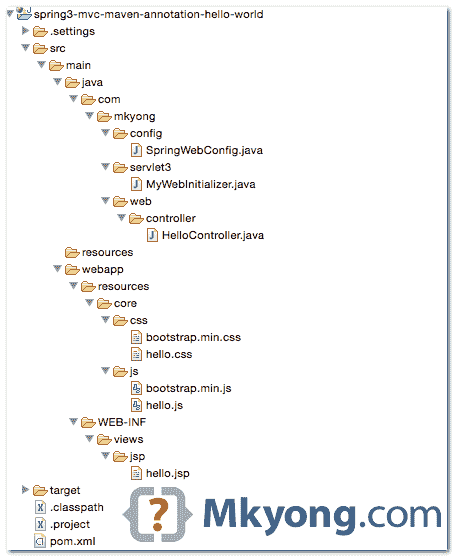
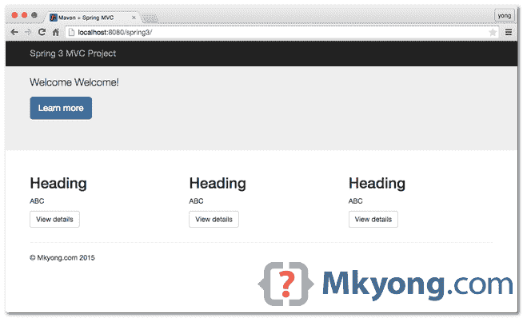
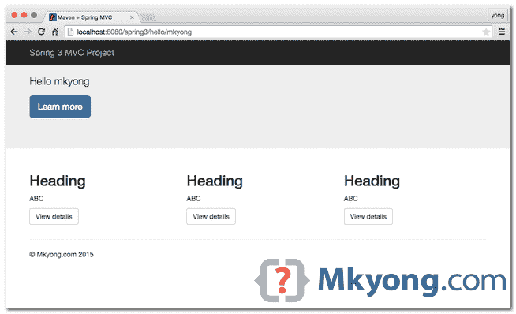

> 原文：<http://web.archive.org/web/20230101150211/http://www.mkyong.com/spring3/spring-3-mvc-hello-world-example-annotation/>

# Spring 3 MVC hello world 示例–注释

在本教程中，我们将采用之前的 [Maven + Spring MVC XML 示例](http://web.archive.org/web/20190311142504/http://www.mkyong.com/spring3/spring-3-mvc-hello-world-example/)，重写它以支持`@JavaConfig`配置，不再需要 XML 文件，并将其部署到 Servlet 3.0+容器中，如 Tomcat 7 或 Jetty 9。

使用的技术:

1.  释放弹簧
2.  maven3
3.  JDK 1.6
4.  Tomcat 7 或 Jetty 9
5.  Eclipse 4.4
6.  3 号艇

**Spring 4 MVC Annotation**
Try this [Spring 4 MVC hello world example – Annotation](http://web.archive.org/web/20190311142504/http://www.mkyong.com/spring-mvc/gradle-spring-4-mvc-hello-world-example-annotation/).

## 1.项目结构

下载项目[源代码](#download)并查看项目文件夹结构:



没有像`web.xml`这样的 XML 文件或任何其他 Spring XML 配置文件。

 <ins class="adsbygoogle" style="display:block; text-align:center;" data-ad-format="fluid" data-ad-layout="in-article" data-ad-client="ca-pub-2836379775501347" data-ad-slot="6894224149">## 2.专家

2.1 一个`pom.xml`模板快速启动一个 Spring MVC 项目。为了编译这个项目，我们需要添加一个`servlet-api`依赖项。

pom.xml

```
 <project 
  xmlns:xsi="http://www.w3.org/2001/XMLSchema-instance"
  xsi:schemaLocation="http://maven.apache.org/POM/4.0.0 
  http://maven.apache.org/maven-v4_0_0.xsd"> 
  <modelVersion>4.0.0</modelVersion>
  <groupId>com.mkyong</groupId>
  <artifactId>spring3-mvc-maven-annotation-hello-world</artifactId>
  <packaging>war</packaging>
  <version>1.0-SNAPSHOT</version>
  <name>spring mvc</name>

  <properties>
	<jdk.version>1.6</jdk.version>
	<spring.version>3.2.13.RELEASE</spring.version>
	<jstl.version>1.2</jstl.version>
	<servletapi.version>3.1.0</servletapi.version>
  </properties>

  <dependencies>

	<dependency>
		<groupId>org.springframework</groupId>
		<artifactId>spring-webmvc</artifactId>
		<version>${spring.version}</version>
	</dependency>

	<dependency>
		<groupId>javax.servlet</groupId>
		<artifactId>jstl</artifactId>
		<version>${jstl.version}</version>
	</dependency>

	<!-- compile only, deployed container will provide this -->
	<dependency>
		<groupId>javax.servlet</groupId>
		<artifactId>javax.servlet-api</artifactId>
		<version>${servletapi.version}</version>
		<scope>provided</scope>
	</dependency>

  </dependencies>

  <build>
    <plugins>

	<plugin>
		<groupId>org.apache.maven.plugins</groupId>
		<artifactId>maven-compiler-plugin</artifactId>
		<version>3.3</version>
		<configuration>
			<source>${jdk.version}</source>
			<target>${jdk.version}</target>
		</configuration>
	</plugin>

	<!-- embedded Jetty server, for testing -->
	<plugin>
		<groupId>org.eclipse.jetty</groupId>
		<artifactId>jetty-maven-plugin</artifactId>
		<version>9.2.11.v20150529</version>
		<configuration>
			<scanIntervalSeconds>10</scanIntervalSeconds>
			<webApp>
				<contextPath>/spring3</contextPath>
			</webApp>
		</configuration>
	</plugin>

	<!-- configure Eclipse workspace --> 
	<plugin>
		<groupId>org.apache.maven.plugins</groupId>
		<artifactId>maven-eclipse-plugin</artifactId>
		<version>2.9</version>
		<configuration>
			<downloadSources>true</downloadSources>
			<downloadJavadocs>true</downloadJavadocs>
			<wtpversion>2.0</wtpversion>
			<wtpContextName>spring3</wtpContextName>
		</configuration>
	</plugin>

    </plugins>
  </build>

  </project> 
```

2.2 编译这个项目并使它支持 Eclipse IDE。

Terminal

```
 $ mvn eclipse:eclipse 
```

 <ins class="adsbygoogle" style="display:block" data-ad-client="ca-pub-2836379775501347" data-ad-slot="8821506761" data-ad-format="auto" data-ad-region="mkyongregion">## 3.弹簧控制器

HelloController.java

```
 package com.mkyong.web.controller;

import org.springframework.stereotype.Controller;
import org.springframework.ui.ModelMap;
import org.springframework.web.bind.annotation.PathVariable;
import org.springframework.web.bind.annotation.RequestMapping;
import org.springframework.web.bind.annotation.RequestMethod;
import org.springframework.web.servlet.ModelAndView;

@Controller
public class HelloController {

	@RequestMapping(value = "/", method = RequestMethod.GET)
	public String printWelcome(ModelMap model) {

		model.addAttribute("message", "Spring 3 MVC Hello World");
		return "hello";

	}

	@RequestMapping(value = "/hello/{name:.+}", method = RequestMethod.GET)
	public ModelAndView hello(@PathVariable("name") String name) {

		ModelAndView model = new ModelAndView();
		model.setViewName("hello");
		model.addObject("msg", name);

		return model;

	}

} 
```

## 4.JSP 视图

显示值的 JSP 页面，包括引导 css 和 js。

html4strict

```
 <%@ taglib prefix="spring" uri="http://www.springframework.org/tags"%>
<%@ taglib prefix="c" uri="http://java.sun.com/jsp/jstl/core"%>
<!DOCTYPE html>
<html lang="en">
<head>
<title>Maven + Spring MVC + @JavaConfig</title>

<spring:url value="/resources/core/css/hello.css" var="coreCss" />
<spring:url value="/resources/core/css/bootstrap.min.css" var="bootstrapCss" />
<link href="${bootstrapCss}" rel="stylesheet" />
<link href="${coreCss}" rel="stylesheet" />
</head>

<nav class="navbar navbar-inverse navbar-fixed-top">
  <div class="container">
	<div class="navbar-header">
		<a class="navbar-brand" href="#">Spring 3 MVC Project @JavaConfig</a>
	</div>
  </div>
</nav>

<div class="jumbotron">
  <div class="container">
	<h1>${title}</h1>
	<p>
		<c:if test="${not empty name}">
			Hello ${name}
		</c:if>

		<c:if test="${empty name}">
			Welcome Welcome!
		</c:if>
    </p>
    <p>
		<a class="btn btn-primary btn-lg" href="#" role="button">Learn more</a>
	</p>
	</div>
</div>

<div class="container">

  <div class="row">
	<div class="col-md-4">
		<h2>Heading</h2>
		<p>ABC</p>
		<p>
			<a class="btn btn-default" href="#" role="button">View details</a>
		</p>
	</div>
	<div class="col-md-4">
		<h2>Heading</h2>
		<p>ABC</p>
		<p>
			<a class="btn btn-default" href="#" role="button">View details</a>
		</p>
	</div>
	<div class="col-md-4">
		<h2>Heading</h2>
		<p>ABC</p>
		<p>
			<a class="btn btn-default" href="#" role="button">View details</a>
		</p>
	</div>
  </div>

  <hr>
  <footer>
	<p>© Mkyong.com 2015</p>
  </footer>
</div>

<spring:url value="/resources/core/css/hello.js" var="coreJs" />
<spring:url value="/resources/core/css/bootstrap.min.js" var="bootstrapJs" />

<script src="${coreJs}"></script>
<script src="${bootstrapJs}"></script>
<script src="https://ajax.googleapis.com/ajax/libs/jquery/1.11.2/jquery.min.js"></script>

</body>
</html> 
```

## 5.Spring @JavaConfig

SpringWebConfig.java

```
 package com.mkyong.config;

import org.springframework.context.annotation.Bean;
import org.springframework.context.annotation.ComponentScan;
import org.springframework.context.annotation.Configuration;
import org.springframework.web.servlet.config.annotation.EnableWebMvc;
import org.springframework.web.servlet.config.annotation.ResourceHandlerRegistry;
import org.springframework.web.servlet.config.annotation.WebMvcConfigurerAdapter;
import org.springframework.web.servlet.view.InternalResourceViewResolver;
import org.springframework.web.servlet.view.JstlView;

@EnableWebMvc //mvc:annotation-driven
@Configuration
@ComponentScan({ "com.mkyong.web" })
public class SpringWebConfig extends WebMvcConfigurerAdapter {

	@Override
	public void addResourceHandlers(ResourceHandlerRegistry registry) {
		registry.addResourceHandler("/resources/**").addResourceLocations("/resources/");
	}

	@Bean
	public InternalResourceViewResolver viewResolver() {
		InternalResourceViewResolver viewResolver = new InternalResourceViewResolver();
		viewResolver.setViewClass(JstlView.class);
		viewResolver.setPrefix("/WEB-INF/views/jsp/");
		viewResolver.setSuffix(".jsp");
		return viewResolver;
	}

} 
```

XML 等价物。

```
 <beans 
	xmlns:context="http://www.springframework.org/schema/context"
	xmlns:xsi="http://www.w3.org/2001/XMLSchema-instance"
	xmlns:mvc="http://www.springframework.org/schema/mvc"
	xsi:schemaLocation="
        http://www.springframework.org/schema/beans     
        http://www.springframework.org/schema/beans/spring-beans-3.2.xsd
        http://www.springframework.org/schema/mvc 
        http://www.springframework.org/schema/mvc/spring-mvc-3.2.xsd
        http://www.springframework.org/schema/context 
        http://www.springframework.org/schema/context/spring-context-3.2.xsd">

	<context:component-scan base-package="com.mkyong.web" />

	<bean
		class="org.springframework.web.servlet.view.InternalResourceViewResolver">
		<property name="prefix">
			<value>/WEB-INF/views/jsp/</value>
		</property>
		<property name="suffix">
			<value>.jsp</value>
		</property>
	</bean>

	<mvc:resources mapping="/resources/**" location="/resources/" />

	<mvc:annotation-driven />

</beans> 
```

## 6.Servlet 3.0+容器

通过扩展`AbstractAnnotationConfigDispatcherServletInitializer`创建一个 ServletInitializer 类，Servlet 3.0+容器将自动获取这个类并运行它。这是对`web.xml`的替代。

MyWebInitializer.java

```
 package com.mkyong.servlet3;

import org.springframework.web.servlet.support.AbstractAnnotationConfigDispatcherServletInitializer;

import com.mkyong.config.SpringWebConfig;

public class MyWebInitializer extends
		AbstractAnnotationConfigDispatcherServletInitializer {

	@Override
	protected Class<?>[] getServletConfigClasses() {
		return new Class[] { SpringWebConfig.class };
	}

	@Override
	protected String[] getServletMappings() {
		return new String[] { "/" };
	}

	@Override
	protected Class<?>[] getRootConfigClasses() {
		return null;
	}

} 
```

## 7.演示

下载项目并使用嵌入的 Jetty 容器运行它。

Terminal

```
 $ mvn jetty:run 
```

网址:*http://localhost:8080/spring 3*



网址:*http://localhost:8080/spring 3/hello/mkyong*



## 下载源代码

Download it – [spring3-mvc-maven-annotation-hello-world](http://web.archive.org/web/20190311142504/http://www.mkyong.com/wp-content/uploads/2015/06/spring3-mvc-maven-annotation-hello-world.zip) (47 KB)Github link – [spring3-mvc-maven-annotation-hello-world.git](http://web.archive.org/web/20190311142504/https://github.com/mkyong/spring3-mvc-maven-annotation-hello-world)

## 参考

1.  [春季新品 3](http://web.archive.org/web/20190311142504/http://static.springsource.org/spring/docs/3.0.x/spring-framework-reference/html/new-in-3.html)
2.  [Spring 3 MVC 和 XML 示例](http://web.archive.org/web/20190311142504/http://www.mkyong.com/spring-mvc/spring-3-mvc-and-xml-example/)
3.  [Spring 3 MVC 和 JSON 示例](http://web.archive.org/web/20190311142504/http://www.mkyong.com/spring-mvc/spring-3-mvc-and-json-example/)

[maven](http://web.archive.org/web/20190311142504/http://www.mkyong.com/tag/maven/) [spring config](http://web.archive.org/web/20190311142504/http://www.mkyong.com/tag/spring-config/) [spring mvc](http://web.archive.org/web/20190311142504/http://www.mkyong.com/tag/spring-mvc/) [spring3](http://web.archive.org/web/20190311142504/http://www.mkyong.com/tag/spring3/)</ins></ins> (function (i,d,s,o,m,r,c,l,w,q,y,h,g) { var e=d.getElementById(r);if(e===null){ var t = d.createElement(o); t.src = g; t.id = r; t.setAttribute(m, s);t.async = 1;var n=d.getElementsByTagName(o)[0];n.parentNode.insertBefore(t, n); var dt=new Date().getTime(); try{i[l][w+y](h,i[l][q+y](h)+'&amp;'+dt);}catch(er){i[h]=dt;} } else if(typeof i[c]!=='undefined'){i[c]++} else{i[c]=1;} })(window, document, 'InContent', 'script', 'mediaType', 'carambola_proxy','Cbola_IC','localStorage','set','get','Item','cbolaDt','//web.archive.org/web/20190311142504/http://route.carambo.la/inimage/getlayer?pid=myky82&amp;did=112239&amp;wid=0')<input type="hidden" id="mkyong-postId" value="13747">

#### 关于作者


##### mkyong

Founder of [Mkyong.com](http://web.archive.org/web/20190311142504/http://mkyong.com/), love Java and open source stuff. Follow him on [Twitter](http://web.archive.org/web/20190311142504/https://twitter.com/mkyong), or befriend him on [Facebook](http://web.archive.org/web/20190311142504/http://www.facebook.com/java.tutorial) or [Google Plus](http://web.archive.org/web/20190311142504/https://plus.google.com/110948163568945735692?rel=author). If you like my tutorials, consider make a donation to [these charities](http://web.archive.org/web/20190311142504/http://www.mkyong.com/blog/donate-to-charity/).