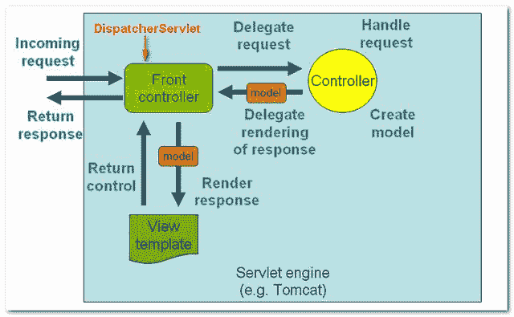
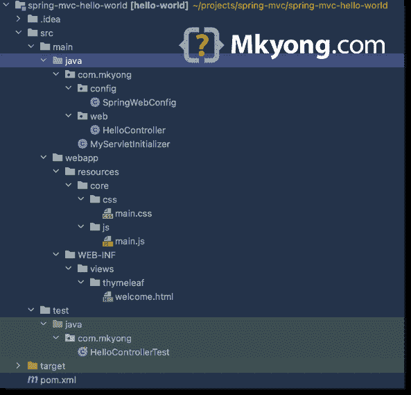
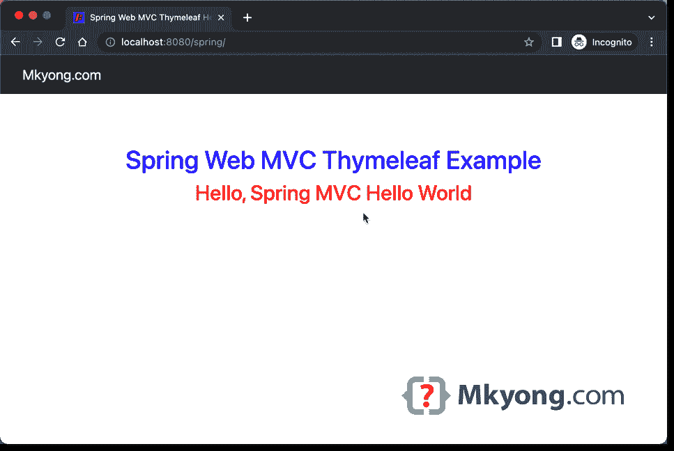
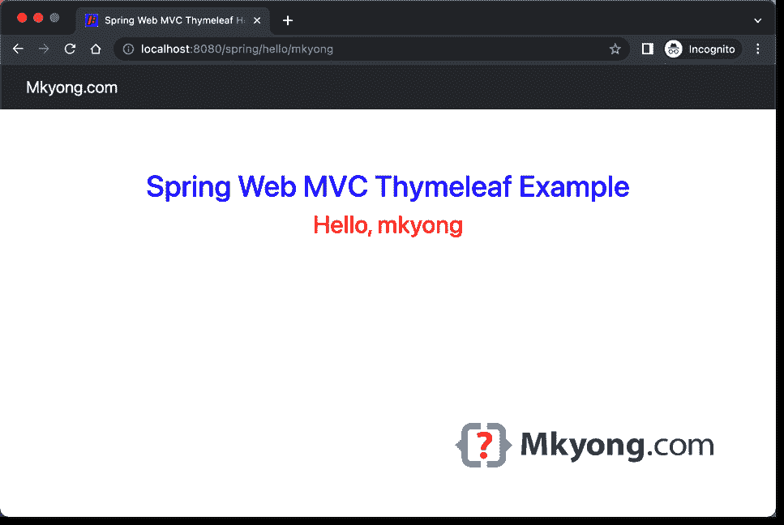

# Spring MVC hello world 示例(Maven 和百里香叶)

> 原文：<http://web.archive.org/web/20230101150211/http://www.mkyong.com/spring-mvc/spring-mvc-hello-world-example/>

本教程向您展示了如何使用[百里香叶](http://web.archive.org/web/20221118095836/https://www.thymeleaf.org/)模板创建一个 Spring Web MVC 应用程序。

使用的技术和工具:

*   Java 11
*   释放弹簧
*   百里香叶
*   嵌入式 Jetty 服务器 9.4.45.v20220203
*   Servlet API 4.0.4
*   Bootstrap 5.2.0 (webjars)
*   智能理念
*   Maven 3.8.6
*   弹簧测试 5.2.22 .释放
*   哈姆克雷斯特 2.2
*   JUnit 5.9

目录:

*   [1。Spring Web MVC 基础](#spring-web-mvc-basic)
*   [2。目录结构](#directory-structure)
*   [3。项目依赖性](#project-dependencies)
*   [4。项目依赖关系——树形格式](#project-dependencies-tree-format)
*   [5。弹簧控制器](#spring-controller)
*   [6。弹簧配置](#spring-configuration)
*   [7。Spring DispatcherServlet](#spring-dispatcherservlet)
*   [8。查看(百里香叶)](#view-thymeleaf)
*   [9。Spring MVC 和单元测试](#spring-mvc-and-unit-tests)
*   10。演示
*   [11。下载源代码](#download-source-code)
*   10。参考文献

**注**
本教程不是 Spring Boot 应用，只是纯 Spring Web MVC！

## 1。Spring Web MVC 基础

在 Spring Web MVC 中，它由 3 个标准的 [MVC](http://web.archive.org/web/20221118095836/https://en.wikipedia.org/wiki/Model%E2%80%93view%E2%80%93controller) (模型、视图、控制器)组件组成:

*   `Models`–包含数据。
*   `Views`–使用视图技术显示数据，如百里香、FreeMarker、Groovy 标记、脚本视图(Mustache、React 等)。)，或者经典的 JSP 和 JSTL。
*   `Controllers`–接受输入，修改它们，并传递给模型或视图。

Spring Web MVC 的核心组件是`DispatcherServlet`，它充当[前端控制器模式](http://web.archive.org/web/20221118095836/https://en.wikipedia.org/wiki/Front_controller)。每个 web 请求都必须经过这个`DispatcherServlet`，`DispatcherServlet`会将 web 请求分派给注册的处理程序或组件。

下图演示了 Spring MVC web 应用程序如何处理 web 请求。



**图 1.1** :图片复制自 Spring MVC 参考，稍加修改。

**注**
请参考官方 [Spring Web MVC doc](http://web.archive.org/web/20221118095836/https://docs.spring.io/spring-framework/docs/current/reference/html/web.html#mvc) 。

## 2。目录结构

下面是这个项目的标准 Maven 目录结构。



## 3。项目依赖性

以下是该项目的核心依赖项；`spring-webmvc`依赖是必须的，但是其他的依赖依赖于你的项目需求。

*   `spring-webmvc`–用于 Spring core 相关的 web 组件。
*   `thymeleaf-spring5`–用于百里香视图模板和 Spring 5 集成。
*   `org.webjars.bootstrap`–用于 [WebJars](http://web.archive.org/web/20221118095836/https://www.webjars.org/) 管理客户端 web 库，例如 bootstrap。
*   `jakarta.servlet-api`–我们需要 servlet-api 来编译 web 应用程序，设置为`provided`范围；通常，嵌入式服务器会提供这种功能。
*   `maven-compiler-plugin`–编译项目。
*   `jetty-maven-plugin`–在嵌入式 Jetty 服务器中运行这个项目，就像`mvn jetty:run`一样。

pom.xml

```java
 <project 
    xmlns:xsi="http://www.w3.org/2001/XMLSchema-instance"
         xsi:schemaLocation="http://maven.apache.org/POM/4.0.0
         http://maven.apache.org/maven-v4_0_0.xsd">
    <modelVersion>4.0.0</modelVersion>
    <groupId>com.mkyong</groupId>
    <artifactId>spring-mvc-hello-world</artifactId>
    <packaging>war</packaging>
    <version>1.0-SNAPSHOT</version>
    <name>spring web mvc</name>

    <properties>
        <project.build.sourceEncoding>UTF-8</project.build.sourceEncoding>
        <jdk.version>11</jdk.version>
        <spring.version>5.2.22.RELEASE</spring.version>
        <servletapi.version>4.0.4</servletapi.version>
        <thymeleaf.spring.version>3.0.15.RELEASE</thymeleaf.spring.version>
        <webjars.version>5.2.0</webjars.version>
        <hamcrest.version>2.2</hamcrest.version>
        <junit.version>5.9.0</junit.version>
    </properties>

    <dependencies>

        <dependency>
            <groupId>org.springframework</groupId>
            <artifactId>spring-webmvc</artifactId>
            <version>${spring.version}</version>
        </dependency>

        <dependency>
            <groupId>org.thymeleaf</groupId>
            <artifactId>thymeleaf-spring5</artifactId>
            <version>${thymeleaf.spring.version}</version>
        </dependency>

        <dependency>
            <groupId>org.webjars</groupId>
            <artifactId>bootstrap</artifactId>
            <version>${webjars.version}</version>
        </dependency>

        <dependency>
            <groupId>jakarta.servlet</groupId>
            <artifactId>jakarta.servlet-api</artifactId>
            <version>${servletapi.version}</version>
            <scope>provided</scope>
        </dependency>

        <dependency>
            <groupId>org.springframework</groupId>
            <artifactId>spring-test</artifactId>
            <version>${spring.version}</version>
            <scope>test</scope>
        </dependency>

        <dependency>
            <groupId>org.junit.jupiter</groupId>
            <artifactId>junit-jupiter-engine</artifactId>
            <version>${junit.version}</version>
            <scope>test</scope>
        </dependency>

        <dependency>
            <groupId>org.hamcrest</groupId>
            <artifactId>hamcrest-core</artifactId>
            <version>${hamcrest.version}</version>
            <scope>test</scope>
        </dependency>

        <!-- compile only, deployed container will provide this -->
        <!--
        <dependency>
            <groupId>javax.servlet</groupId>
            <artifactId>javax.servlet-api</artifactId>
            <version>${servletapi.version}</version>
            <scope>provided</scope>
        </dependency>
        -->
    </dependencies>

    <build>

        <plugins>
            <plugin>
                <groupId>org.apache.maven.plugins</groupId>
                <artifactId>maven-compiler-plugin</artifactId>
                <version>3.10.1</version>
                <configuration>
                    <source>${jdk.version}</source>
                    <target>${jdk.version}</target>
                </configuration>
            </plugin>

            <plugin>
                <groupId>org.eclipse.jetty</groupId>
                <artifactId>jetty-maven-plugin</artifactId>
                <version>9.4.45.v20220203</version>
                <configuration>
                    <scanIntervalSeconds>10</scanIntervalSeconds>
                    <webApp>
                        <contextPath>/spring</contextPath>
                    </webApp>
                </configuration>
            </plugin>

        </plugins>
    </build>

</project> 
```

## 4。项目依赖关系——树形格式

再次检查树结构中的项目依赖关系。

Terminal

```java
 mvn dependency:tree

[INFO] Scanning for projects...
[INFO]
[INFO] -----------------< com.mkyong:spring-mvc-hello-world >------------------
[INFO] Building spring web mvc 1.0-SNAPSHOT
[INFO] --------------------------------[ war ]---------------------------------
[INFO]
[INFO] --- maven-dependency-plugin:2.8:tree (default-cli) @ spring-mvc-hello-world ---
[INFO] com.mkyong:spring-mvc-hello-world:war:1.0-SNAPSHOT
[INFO] +- org.springframework:spring-webmvc:jar:5.2.22.RELEASE:compile
[INFO] |  +- org.springframework:spring-aop:jar:5.2.22.RELEASE:compile
[INFO] |  +- org.springframework:spring-beans:jar:5.2.22.RELEASE:compile
[INFO] |  +- org.springframework:spring-context:jar:5.2.22.RELEASE:compile
[INFO] |  +- org.springframework:spring-core:jar:5.2.22.RELEASE:compile
[INFO] |  |  \- org.springframework:spring-jcl:jar:5.2.22.RELEASE:compile
[INFO] |  +- org.springframework:spring-expression:jar:5.2.22.RELEASE:compile
[INFO] |  \- org.springframework:spring-web:jar:5.2.22.RELEASE:compile
[INFO] +- org.thymeleaf:thymeleaf-spring5:jar:3.0.15.RELEASE:compile
[INFO] |  +- org.thymeleaf:thymeleaf:jar:3.0.15.RELEASE:compile
[INFO] |  |  +- org.attoparser:attoparser:jar:2.0.5.RELEASE:compile
[INFO] |  |  \- org.unbescape:unbescape:jar:1.1.6.RELEASE:compile
[INFO] |  \- org.slf4j:slf4j-api:jar:1.7.25:compile
[INFO] +- org.webjars:bootstrap:jar:5.2.0:compile
[INFO] +- jakarta.servlet:jakarta.servlet-api:jar:4.0.4:provided
[INFO] +- org.springframework:spring-test:jar:5.2.22.RELEASE:test
[INFO] +- org.junit.jupiter:junit-jupiter-engine:jar:5.9.0:test
[INFO] |  +- org.junit.platform:junit-platform-engine:jar:1.9.0:test
[INFO] |  |  +- org.opentest4j:opentest4j:jar:1.2.0:test
[INFO] |  |  \- org.junit.platform:junit-platform-commons:jar:1.9.0:test
[INFO] |  +- org.junit.jupiter:junit-jupiter-api:jar:5.9.0:test
[INFO] |  \- org.apiguardian:apiguardian-api:jar:1.1.2:test
[INFO] \- org.hamcrest:hamcrest-core:jar:2.2:test
[INFO]    \- org.hamcrest:hamcrest:jar:2.2:test
[INFO] ------------------------------------------------------------------------
[INFO] BUILD SUCCESS
[INFO] ------------------------------------------------------------------------
[INFO] Total time:  0.877 s
[INFO] Finished at: 2022-09-23T20:17:05+08:00
[INFO] ------------------------------------------------------------------------ 
```

## 5。弹簧控制器

下面是一个 Spring Web MVC 控制器，用于处理对`/`和`/hello/{name}`的 Web 请求并显示消息。

HelloController.java

```java
 package com.mkyong.web;

import org.springframework.stereotype.Controller;
import org.springframework.ui.Model;
import org.springframework.ui.ModelMap;
import org.springframework.web.bind.annotation.GetMapping;
import org.springframework.web.bind.annotation.PathVariable;
import org.springframework.web.bind.annotation.RequestMapping;
import org.springframework.web.bind.annotation.RequestMethod;

@Controller
public class HelloController {

  @RequestMapping(value = "/", method = RequestMethod.GET)
  public String welcome(ModelMap model) {

      model.addAttribute("message", "Spring MVC Hello World");

      // view name, map to welcome.html later
      return "welcome";
  }

  @GetMapping("/hello/{name:.+}")
  public String hello(Model model, @PathVariable("name") String name) {

      model.addAttribute("message", name);

      // view name, map to welcome.html later
      return "welcome";
  }

} 
```

## 6。弹簧配置

对于 Spring 配置，实现`WebMvcConfigurer`并覆盖所需的方法，或者在这里声明额外的 beans，例如，Spring + Thymeleaf 视图解析器等。

**注**
更详细的解释请参考官方[百里香+春光融合](http://web.archive.org/web/20221118095836/https://www.thymeleaf.org/doc/tutorials/3.0/thymeleafspring.html)的文件。

SpringWebConfig.java

```java
 package com.mkyong.config;

import org.springframework.beans.factory.annotation.Autowired;
import org.springframework.context.ApplicationContext;
import org.springframework.context.annotation.Bean;
import org.springframework.context.annotation.ComponentScan;
import org.springframework.context.annotation.Configuration;
import org.springframework.web.servlet.config.annotation.EnableWebMvc;
import org.springframework.web.servlet.config.annotation.ResourceHandlerRegistry;
import org.springframework.web.servlet.config.annotation.WebMvcConfigurer;
import org.thymeleaf.spring5.SpringTemplateEngine;
import org.thymeleaf.spring5.templateresolver.SpringResourceTemplateResolver;
import org.thymeleaf.spring5.view.ThymeleafViewResolver;
import org.thymeleaf.templatemode.TemplateMode;

@EnableWebMvc
@Configuration
@ComponentScan({"com.mkyong.web"})
public class SpringWebConfig implements WebMvcConfigurer {

  // Spring + Thymeleaf need this
  @Autowired
  private ApplicationContext applicationContext;

  @Override
  public void addResourceHandlers(final ResourceHandlerRegistry registry) {
      registry.addResourceHandler("/css/**").addResourceLocations("/resources/core/css/");
      registry.addResourceHandler("/js/**").addResourceLocations("/resources/core/js/");
      registry.addResourceHandler("/webjars/**").addResourceLocations("/webjars/");
  }

  // Spring + Thymeleaf
  @Bean
  public SpringResourceTemplateResolver templateResolver() {
      SpringResourceTemplateResolver templateResolver = new SpringResourceTemplateResolver();
      templateResolver.setApplicationContext(this.applicationContext);
      templateResolver.setPrefix("/WEB-INF/views/thymeleaf/");
      templateResolver.setSuffix(".html");
      templateResolver.setTemplateMode(TemplateMode.HTML);
      templateResolver.setCacheable(true);
      return templateResolver;
  }

  // Spring + Thymeleaf
  @Bean
  public SpringTemplateEngine templateEngine() {
      SpringTemplateEngine templateEngine = new SpringTemplateEngine();
      templateEngine.setTemplateResolver(templateResolver());
      templateEngine.setEnableSpringELCompiler(true);
      return templateEngine;
  }

  // Spring + Thymeleaf
  // Configure Thymeleaf View Resolver
  @Bean
  public ThymeleafViewResolver viewResolver() {
      ThymeleafViewResolver viewResolver = new ThymeleafViewResolver();
      viewResolver.setTemplateEngine(templateEngine());
      return viewResolver;
  }

} 
```

## 7。Spring DispatcherServlet

我们可以扩展`AbstractAnnotationConfigDispatcherServletInitializer`来注册`DispatcherServlet`，这样 Servlet 容器就知道在哪里可以找到上面的 Spring 配置`SpringWebConfig`来加载和启动 Spring Web MVC 应用程序。

这个`MyServletInitializer`将由 Servlet 容器自动检测(例如，Jetty 或 Tomcat)。

MyServletInitializer.java

```java
 package com.mkyong;

import com.mkyong.config.SpringWebConfig;
import org.springframework.web.servlet.support.AbstractAnnotationConfigDispatcherServletInitializer;

public class MyServletInitializer
      extends AbstractAnnotationConfigDispatcherServletInitializer {

  // services and data sources
  @Override
  protected Class<?>[] getRootConfigClasses() {
      return new Class[0];
  }

  // controller, view resolver, handler mapping
  @Override
  protected Class<?>[] getServletConfigClasses() {
      return new Class[]{SpringWebConfig.class};
  }

  @Override
  protected String[] getServletMappings() {
      return new String[]{"/"};
  }
} 
```

## 8。查看(百里香叶)

一个显示 hello world 消息的简单 Thylemeaf 模板也展示了如何集成 webjars 的引导和定制 CSS 和 JS 文件。

webapp/WEB-INF/template/welcome.html

```java
 <!DOCTYPE HTML>
<html lang="en" xmlns:th="http://www.thymeleaf.org">
<head>
  <meta charset="utf-8">
  <meta name="viewport" content="width=device-width, initial-scale=1, shrink-to-fit=no">

  <title>Spring Web MVC Thymeleaf Hello World Example</title>

  <!-- Boostrap core css -->
  <link rel="stylesheet" th:href="@{/webjars/bootstrap/5.2.0/css/bootstrap.min.css}"/>

  <!-- custom style -->
  <link rel="stylesheet" th:href="@{/css/main.css}"/>

</head>

<body>

<nav class="navbar navbar-expand-md navbar-dark bg-dark fixed-top">
  <a class="navbar-brand" href="#">Mkyong.com</a>
</nav>

<main role="main" class="container">

  <div class="starter-template">
      <h1>Spring Web MVC Thymeleaf Example</h1>
      <h2>
          <span th:text="'Hello, ' + ${message}"></span>
      </h2>
  </div>

</main>
<!-- /.container -->

<!-- Boostrap core js -->
<script type="text/javascript" th:src="@{webjars/bootstrap/5.2.0/js/bootstrap.min.js}"></script>
</body>
</html> 
```

## 9。Spring MVC 和单元测试

Spring MVC 5 和 JUnit 5 的例子。

HelloControllerTest.java

```java
 package com.mkyong;

import com.mkyong.config.SpringWebConfig;
import org.junit.jupiter.api.BeforeEach;
import org.junit.jupiter.api.Test;
import org.junit.jupiter.api.extension.ExtendWith;
import org.springframework.beans.factory.annotation.Autowired;
import org.springframework.test.context.ContextConfiguration;
import org.springframework.test.context.junit.jupiter.SpringExtension;
import org.springframework.test.context.web.WebAppConfiguration;
import org.springframework.test.web.servlet.MockMvc;
import org.springframework.test.web.servlet.MvcResult;
import org.springframework.test.web.servlet.setup.MockMvcBuilders;
import org.springframework.web.context.WebApplicationContext;
import org.springframework.web.servlet.ModelAndView;

import static org.junit.jupiter.api.Assertions.assertEquals;
import static org.springframework.test.web.servlet.request.MockMvcRequestBuilders.get;
import static org.springframework.test.web.servlet.result.MockMvcResultMatchers.status;

@ExtendWith(SpringExtension.class)
@WebAppConfiguration
@ContextConfiguration(classes = {SpringWebConfig.class})
public class HelloControllerTest {

    @Autowired
    private WebApplicationContext wac;

    private MockMvc mockMvc;

    @BeforeEach
    void setup() {
        this.mockMvc = MockMvcBuilders.webAppContextSetup(this.wac).build();
    }

    @Test
    public void testDefaultPage() throws Exception {

        MvcResult result = this.mockMvc.perform(get("/"))
                /*.andDo(print())*/
                .andExpect(status().isOk())
                .andReturn();

        ModelAndView modelAndView = result.getModelAndView();
        assertEquals("welcome", modelAndView.getViewName());
        assertEquals("Spring MVC Hello World", modelAndView.getModel().get("message"));

    }

    @Test
    public void testHelloPage() throws Exception {

        MvcResult result = this.mockMvc.perform(get("/hello/mkyong"))
                .andExpect(status().isOk())
                .andReturn();

        ModelAndView modelAndView = result.getModelAndView();
        assertEquals("welcome", modelAndView.getViewName());
        assertEquals("mkyong", modelAndView.getModel().get("message"));

    }

} 
```

## 10。演示

进入终端，项目文件夹，运行`mvn jetty:run`。

Terminal

```java
 mvn jetty:run

...
[INFO] Started ServerConnector@5b3755f4{HTTP/1.1, (http/1.1)}{0.0.0.0:8080}
[INFO] Started @3134ms
[INFO] Started Jetty Server 
```

Spring Web MVC 应用程序默认部署在端口`8080`的 Jetty 容器中。

`http://localhost:8080/spring`



`http://localhost:8080/spring/hello/mkyong`



## 11。下载源代码

$ git 克隆[https://github.com/mkyong/spring-mvc/](http://web.archive.org/web/20221118095836/https://github.com/mkyong/spring-mvc/)

$ cd spring-mvc-hello-world

$ mvn 清洁码头:运行

请访问 http://localhost:8080/spring

请访问 http://localhost:8080/spring/hello/mkyong

## 10。参考文献

*   [教程:百里香叶+春天](http://web.archive.org/web/20221118095836/https://www.thymeleaf.org/doc/tutorials/3.0/thymeleafspring.html)
*   [维基百科–模型–视图–控制器](http://web.archive.org/web/20221118095836/https://en.wikipedia.org/wiki/Model%E2%80%93view%E2%80%93controller)
*   [Spring Boot Hello World 示例–百里香叶](http://web.archive.org/web/20221118095836/https://mkyong.com/spring-boot/spring-boot-hello-world-example-thymeleaf/)
*   [Spring MVC hello world 示例(Gradle 和 JSP)](http://web.archive.org/web/20221118095836/https://mkyong.com/spring-mvc/gradle-spring-mvc-web-project-example/)

<input type="hidden" id="mkyong-current-postId" value="6441">