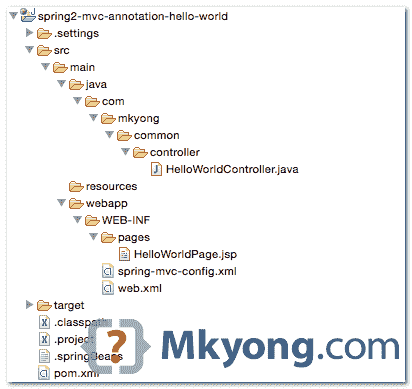
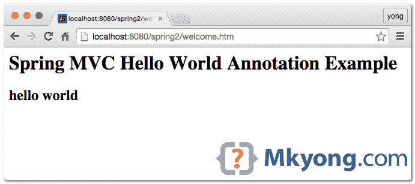

# Spring MVC hello world 注释示例

> 原文：<http://web.archive.org/web/20230101150211/http://www.mkyong.com/spring-mvc/spring-mvc-hello-world-annotation-example/>

**Note**
This tutorial is based on Spring 2.5.6, quite outdated. Try considering the new tutorials :

1.  [Gradle+Spring 4 MVC Hello World](http://web.archive.org/web/20220724200804/http://www.mkyong.com/spring-mvc/gradle-spring-mvc-web-project-example/)
2.  [Maven+Spring 3 MVC Hello World](http://web.archive.org/web/20220724200804/http://www.mkyong.com/spring3/spring-3-mvc-hello-world-example/)

在本教程中，我们将采用之前的 [Spring MVC hello world 基于 XML 的](http://web.archive.org/web/20220724200804/http://www.mkyong.com/spring-mvc/spring-mvc-hello-world-example/)，并将其转换为基于**注释的**项目。

使用的技术:

1.  弹簧 2.5.6
2.  JDK 1.6
3.  maven3
4.  Eclipse 3.6

## 1.目录结构



## 2.专家

Spring 的注释被捆绑在同一个`spring-webmvc.jar`中。

pom.xml

```
 <project  
	xmlns:xsi="http://www.w3.org/2001/XMLSchema-instance"
	xsi:schemaLocation="http://maven.apache.org/POM/4.0.0 
	http://maven.apache.org/maven-v4_0_0.xsd">
	<modelVersion>4.0.0</modelVersion>
	<groupId>com.mkyong.common</groupId>
	<artifactId>spring2-mvc-annotation-hello-world</artifactId>
	<packaging>war</packaging>
	<version>1.0-SNAPSHOT</version>
	<name>Spring 2 MVC</name>

	<properties>
		<jdk.version>1.6</jdk.version>
		<spring.version>2.5.6</spring.version>
		<jstl.version>1.2</jstl.version>
		<servletapi.version>2.5</servletapi.version>
	</properties>

	<dependencies>

		<!-- Spring MVC framework -->
		<dependency>
			<groupId>org.springframework</groupId>
			<artifactId>spring-webmvc</artifactId>
			<version>${spring.version}</version>
		</dependency>

		<!-- JSTL -->
		<dependency>
			<groupId>javax.servlet</groupId>
			<artifactId>jstl</artifactId>
			<version>${jstl.version}</version>
		</dependency>

		<!-- for compile only, your container should have this -->
		<dependency>
			<groupId>javax.servlet</groupId>
			<artifactId>servlet-api</artifactId>
			<version>${servletapi.version}</version>
			<scope>provided</scope>
		</dependency>

	</dependencies>

	<build>

	  <plugins>
		<plugin>
			<groupId>org.apache.maven.plugins</groupId>
			<artifactId>maven-compiler-plugin</artifactId>
			<version>3.3</version>
			<configuration>
				<source>${jdk.version}</source>
				<target>${jdk.version}</target>
			</configuration>
		</plugin>

		<plugin>
			<groupId>org.eclipse.jetty</groupId>
			<artifactId>jetty-maven-plugin</artifactId>
			<version>9.2.11.v20150529</version>
			<configuration>
				<scanIntervalSeconds>10</scanIntervalSeconds>
				<webApp>
					<contextPath>/spring2</contextPath>
				</webApp>
			</configuration>
		</plugin>

		<plugin>
			<groupId>org.apache.maven.plugins</groupId>
			<artifactId>maven-eclipse-plugin</artifactId>
			<version>2.9</version>
			<configuration>
				<downloadSources>true</downloadSources>
				<downloadJavadocs>true</downloadJavadocs>
				<wtpversion>2.0</wtpversion>
				<wtpContextName>spring2</wtpContextName>
			</configuration>
		</plugin>

	  </plugins>

	</build>

</project> 
```

## 3.控制器和处理器映射

现在，您可以使用`@Controller`和`@RequestMapping`来替换 XML 配置。

1.  **控制器**——控制器类不再需要像 **AbstractController** 或者**SimpleFormController**那样扩展基础控制器，只需要简单的用 [@Controller](http://web.archive.org/web/20220724200804/http://static.springsource.org/spring/docs/2.5.x/api/org/springframework/stereotype/Controller.html) 注释对类进行注释即可。
2.  **处理程序映射**——不再声明类似**[BeanNameUrlHandlerMapping](http://web.archive.org/web/20220724200804/http://www.mkyong.com/spring-mvc/spring-mvc-beannameurlhandlermapping-example/)**，**[ControllerClassNameHandlerMapping](http://web.archive.org/web/20220724200804/http://www.mkyong.com/spring-mvc/spring-mvc-controllerclassnamehandlermapping-example/)**或**[SimpleUrlHandlerMapping](http://web.archive.org/web/20220724200804/http://www.mkyong.com/spring-mvc/spring-mvc-simpleurlhandlermapping-example/)**的处理程序映射，全部替换为标准的**[@ request Mapping](http://web.archive.org/web/20220724200804/http://static.springsource.org/spring/docs/2.5.x/api/org/springframework/web/bind/annotation/RequestMapping.html)**注释。

HelloWorldController.java

```
 package com.mkyong.common.controller;

import org.springframework.stereotype.Controller;
import org.springframework.web.bind.annotation.RequestMapping;
import org.springframework.web.bind.annotation.RequestMethod;
import org.springframework.web.servlet.ModelAndView;

@Controller
@RequestMapping("/welcome")
public class HelloWorldController{

	@RequestMapping(method = RequestMethod.GET)
	public ModelAndView helloWorld(){

		ModelAndView model = new ModelAndView("HelloWorldPage");
		model.addObject("msg", "hello world");

		return model;
	}
} 
```

如果在类级别应用`@RequestMapping`(可以用[多动作控制器](http://web.archive.org/web/20220724200804/http://www.mkyong.com/spring-mvc/spring-mvc-multiactioncontroller-annotation-example/)在方法级别应用)，它需要放一个 **RequestMethod** 来指示哪个方法处理映射请求。

在这种情况下，如果一个 URI 模式`/welcome`被请求，它将映射到这个`HelloWorldController`，并用 **helloWorld()** 方法处理请求。

## 4.Spring XML 配置

您仍然需要在 XML 文件中配置视图解析器和组件扫描。

/WEB-INF/spring-mvc-config.xml

```
 <beans 
	xmlns:xsi="http://www.w3.org/2001/XMLSchema-instance" 
	xmlns:context="http://www.springframework.org/schema/context"
	xsi:schemaLocation="http://www.springframework.org/schema/beans 
	http://www.springframework.org/schema/beans/spring-beans-2.5.xsd
	http://www.springframework.org/schema/context
	http://www.springframework.org/schema/context/spring-context-2.5.xsd">

	<bean id="viewResolver"
		class="org.springframework.web.servlet.view.InternalResourceViewResolver">
		<property name="prefix">
			<value>/WEB-INF/pages/</value>
		</property>
		<property name="suffix">
			<value>.jsp</value>
		</property>
	</bean>

	<context:component-scan base-package="com.mkyong.common.controller" />

</beans> 
```

## 5.JSP 页面

用于演示的简单 JSP 页面。

HelloWorldPage.jsp.

```
 <%@ taglib prefix="c" uri="http://java.sun.com/jsp/jstl/core"%>
<html>
<body>
	<h1>Spring MVC Hello World Annotation Example</h1>

	<h2>${msg}</h2>
</body>
</html> 
```

## 6.web.xml

web.xml

```
 <web-app id="WebApp_ID" version="2.4"

	xmlns:xsi="http://www.w3.org/2001/XMLSchema-instance"
	xsi:schemaLocation="http://java.sun.com/xml/ns/j2ee 
	http://java.sun.com/xml/ns/j2ee/web-app_2_4.xsd">

	<display-name>Spring Web MVC Application</display-name>

	<servlet>
		<servlet-name>mvc-dispatcher</servlet-name>
		<servlet-class>org.springframework.web.servlet.DispatcherServlet</servlet-class>
		<init-param>
			<param-name>contextConfigLocation</param-name>
			<param-value>/WEB-INF/spring-mvc-config.xml</param-value>
		</init-param>
		<load-on-startup>1</load-on-startup>
	</servlet>

	<servlet-mapping>
		<servlet-name>mvc-dispatcher</servlet-name>
		<url-pattern>*.htm</url-pattern>
	</servlet-mapping>

</web-app> 
```

## 7.演示

6.1 要运行嵌入式 Jetty，请键入:

```
 $ mvn jetty:run 
```

网址:http://localhost:8080/spring 2/welcome . htm



6.2 导入到 Eclipse IDE 中。

```
 $ mvn eclipse:eclipse 
```

**Note**
If you compare this Spring MVC annotation-based hello world example with previously [XML-based example](http://web.archive.org/web/20220724200804/http://www.mkyong.com/spring-mvc/spring-mvc-hello-world-example/), you can see that this annotation approach is easier and flexible in wiring the controller class and URL handler mapping, because you do not need to declare the controller class explicitly or extends any particular class.

## 下载源代码

Download it – [spring2-mvc-annotation.zip](http://web.archive.org/web/20220724200804/http://www.mkyong.com/wp-content/uploads/2010/08/spring2-mvc-annotation.zip) (15 KB)

## 参考

1.  控制器 Javadoc
2.  [请求映射 Javadoc](http://web.archive.org/web/20220724200804/https://docs.spring.io/spring/docs/2.5.x/api/org/springframework/web/bind/annotation/RequestMapping.html)
3.  [Spring MVC hello world 基于 XML 的例子](http://web.archive.org/web/20220724200804/http://www.mkyong.com/spring-mvc/spring-mvc-hello-world-example/)
4.  [弹簧自动扫描组件](http://web.archive.org/web/20220724200804/http://www.mkyong.com/spring/spring-auto-scanning-components/)

<input type="hidden" id="mkyong-current-postId" value="6763">