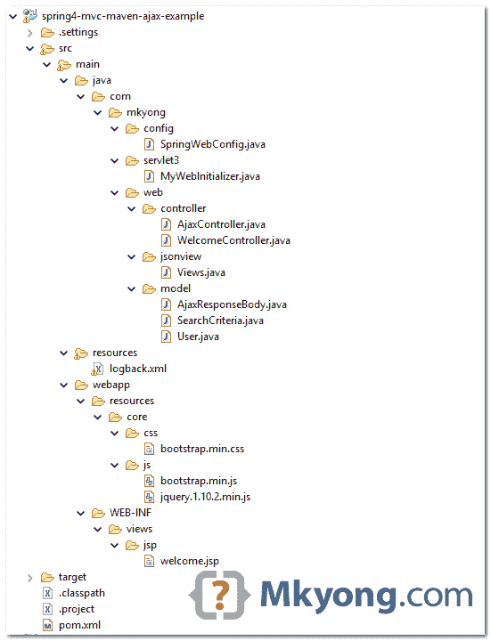
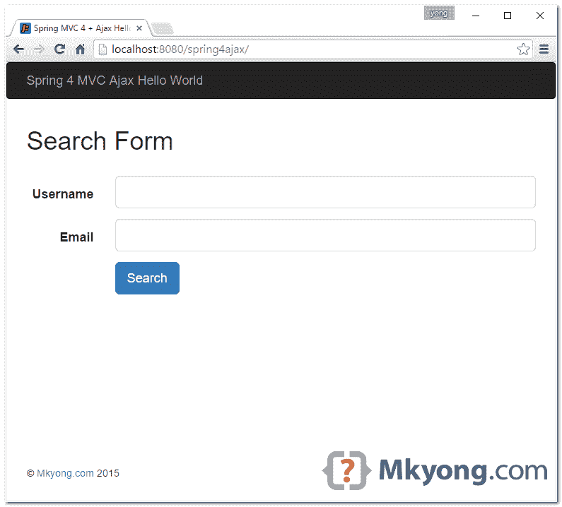
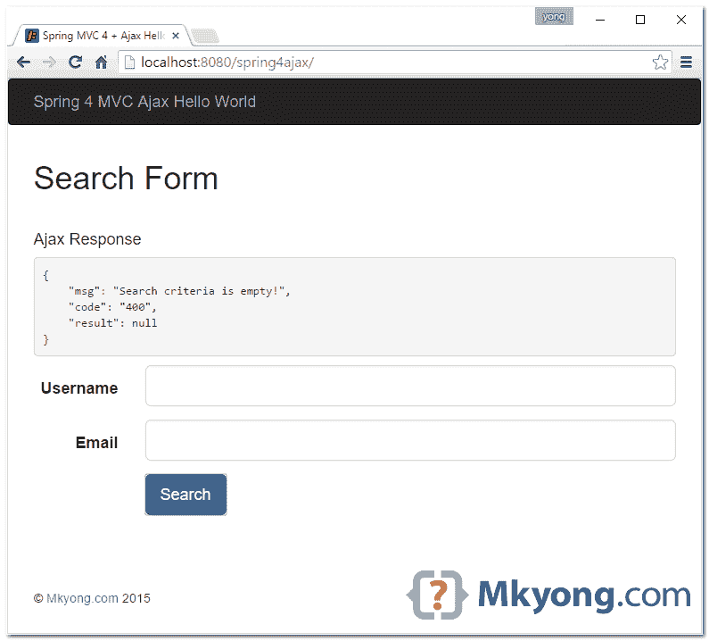
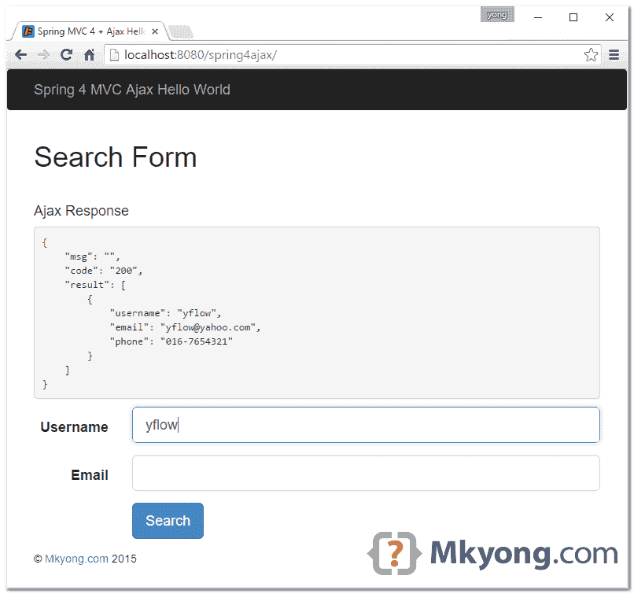
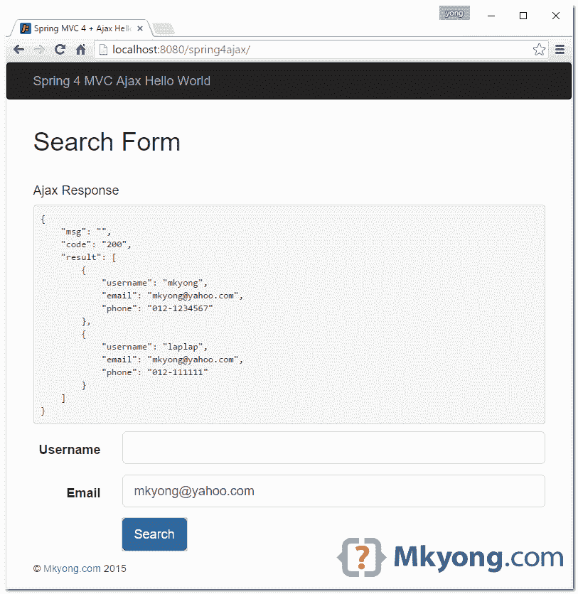
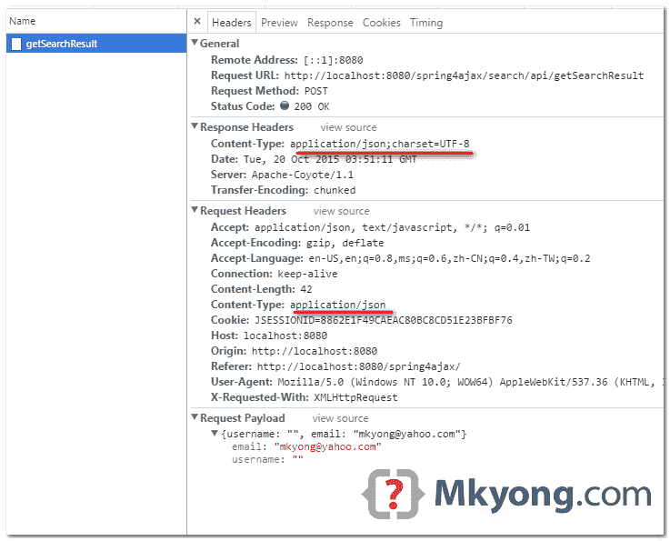

> 原文：<http://web.archive.org/web/20230101150211/http://www.mkyong.com/spring-mvc/spring-4-mvc-ajax-hello-world-example/>

# Spring 4 MVC Ajax Hello World 示例

在本教程中，我们将向您展示如何创建一个 Spring MVC web 项目并通过 Ajax 提交表单。

使用的技术:

1.  弹簧 4.2.2 释放
2.  杰克逊 2.6.3
3.  回溯 1.1.3
4.  jQuery 1.10
5.  maven3
6.  JDK 1.8
7.  Tomcat 8 或 Jetty 9
8.  Eclipse 4.5
9.  3 号艇

如果在项目类路径中找到了 Jackson 库，Spring 将使用 Jackson 自动处理 json 数据与对象之间的转换。

**Note**
Try this – [Spring Boot Ajax example](http://web.archive.org/web/20190215000820/http://www.mkyong.com/spring-boot/spring-boot-ajax-example/)

## 1.快速参考

1.1 在 HTML 中，使用 jQuery `[$.ajax()](http://web.archive.org/web/20190215000820/http://api.jquery.com/jquery.ajax/)`发送表单请求。

```java
 jQuery(document).ready(function($) {
		$("#search-form").submit(function(event) {

			// Prevent the form from submitting via the browser.
			event.preventDefault();
			searchViaAjax();

		});
	});

	function searchAjax() {
		var data = {}
		data["query"] = $("#query").val();

		$.ajax({
			type : "POST",
			contentType : "application/json",
			url : "${home}search/api/getSearchResult",
			data : JSON.stringify(data),
			dataType : 'json',
			timeout : 100000,
			success : function(data) {
				console.log("SUCCESS: ", data);
				display(data);
			},
			error : function(e) {
				console.log("ERROR: ", e);
				display(e);
			},
			done : function(e) {
				console.log("DONE");
			}
		});
	} 
```

1.2 Spring 控制器处理 Ajax 请求。

```java
 @Controller
public class AjaxController {

	@ResponseBody
	@RequestMapping(value = "/search/api/getSearchResult")
	public AjaxResponseBody getSearchResultViaAjax(@RequestBody SearchCriteria search) {

		AjaxResponseBody result = new AjaxResponseBody();
		//logic
		return result;

	}

} 
```

 <ins class="adsbygoogle" style="display:block; text-align:center;" data-ad-format="fluid" data-ad-layout="in-article" data-ad-client="ca-pub-2836379775501347" data-ad-slot="6894224149">## 2.项目目录

查看项目目录，这是一个标准的 Maven 项目目录结构。

[](http://web.archive.org/web/20190215000820/http://www.mkyong.com/wp-content/uploads/2015/10/spring-mvc-ajax-example-1.png) <ins class="adsbygoogle" style="display:block" data-ad-client="ca-pub-2836379775501347" data-ad-slot="8821506761" data-ad-format="auto" data-ad-region="mkyongregion">## 3.项目相关性

pom.xml

```java
 <project  
	xmlns:xsi="http://www.w3.org/2001/XMLSchema-instance"
	xsi:schemaLocation="http://maven.apache.org/POM/4.0.0 
	http://maven.apache.org/maven-v4_0_0.xsd">
	<modelVersion>4.0.0</modelVersion>
	<groupId>com.mkyong</groupId>
	<artifactId>spring4-mvc-maven-ajax-example</artifactId>
	<packaging>war</packaging>
	<version>1.0-SNAPSHOT</version>
	<name>spring4 mvc maven ajax example</name>

	<properties>
		<jdk.version>1.8</jdk.version>
		<spring.version>4.2.2.RELEASE</spring.version>
		<jackson.version>2.6.3</jackson.version>
		<logback.version>1.1.3</logback.version>
		<jcl.slf4j.version>1.7.12</jcl.slf4j.version>
		<jstl.version>1.2</jstl.version>
		<servletapi.version>3.1.0</servletapi.version>
	</properties>

	<dependencies>

		<dependency>
			<groupId>org.springframework</groupId>
			<artifactId>spring-webmvc</artifactId>
			<version>${spring.version}</version>
			<exclusions>
				<exclusion>
					<groupId>commons-logging</groupId>
					<artifactId>commons-logging</artifactId>
				</exclusion>
			</exclusions>
		</dependency>

		<!-- Need this for json to/from object -->
		<dependency>
			<groupId>com.fasterxml.jackson.core</groupId>
			<artifactId>jackson-core</artifactId>
			<version>${jackson.version}</version>
		</dependency>

		<dependency>
			<groupId>com.fasterxml.jackson.core</groupId>
			<artifactId>jackson-databind</artifactId>
			<version>${jackson.version}</version>
		</dependency>

		<!-- JSTL for views -->
		<dependency>
			<groupId>javax.servlet</groupId>
			<artifactId>jstl</artifactId>
			<version>${jstl.version}</version>
		</dependency>

		<!-- Logging -->
		<dependency>
			<groupId>org.slf4j</groupId>
			<artifactId>jcl-over-slf4j</artifactId>
			<version>${jcl.slf4j.version}</version>
		</dependency>

		<dependency>
			<groupId>ch.qos.logback</groupId>
			<artifactId>logback-classic</artifactId>
			<version>${logback.version}</version>
		</dependency>

		<!-- compile only, runtime container will provide this -->
		<!-- Need this for config annotation -->
		<dependency>
			<groupId>javax.servlet</groupId>
			<artifactId>javax.servlet-api</artifactId>
			<version>${servletapi.version}</version>
			<scope>provided</scope>
		</dependency>

	</dependencies>

	<build>

		<plugins>
			<plugin>
				<groupId>org.apache.maven.plugins</groupId>
				<artifactId>maven-compiler-plugin</artifactId>
				<version>3.3</version>
				<configuration>
					<source>${jdk.version}</source>
					<target>${jdk.version}</target>
				</configuration>
			</plugin>

			<plugin>
				<groupId>org.eclipse.jetty</groupId>
				<artifactId>jetty-maven-plugin</artifactId>
				<version>9.2.11.v20150529</version>
				<configuration>
					<scanIntervalSeconds>10</scanIntervalSeconds>
					<webApp>
						<contextPath>/spring4ajax</contextPath>
					</webApp>
				</configuration>
			</plugin>

			<plugin>
				<groupId>org.apache.maven.plugins</groupId>
				<artifactId>maven-eclipse-plugin</artifactId>
				<version>2.10</version>
				<configuration>
					<downloadSources>true</downloadSources>
					<downloadJavadocs>true</downloadJavadocs>
					<wtpversion>2.0</wtpversion>
					<wtpContextName>spring4ajax</wtpContextName>
				</configuration>
			</plugin>

			<plugin>
				<groupId>org.apache.maven.plugins</groupId>
				<artifactId>maven-war-plugin</artifactId>
				<version>2.6</version>
				<configuration>
					<failOnMissingWebXml>false</failOnMissingWebXml>
				</configuration>
			</plugin>

			<!-- Deploy to WildFly -->
			<plugin>
				<groupId>org.wildfly.plugins</groupId>
				<artifactId>wildfly-maven-plugin</artifactId>
				<version>1.1.0.Alpha5</version>
				<configuration>
					<hostname>127.0.0.1</hostname>
					<port>9990</port>
					<username>admin</username>
					<password>admin</password>
					<name>spring4ajax.war</name>
				</configuration>
			</plugin>
		</plugins>
	</build>

</project> 
```

## 4.弹簧组件

只会显示重要的类。

4.1 `@RestController`处理 Ajax 请求。阅读评论，不言自明。

AjaxController.java

```java
 package com.mkyong.web.controller;

import java.util.ArrayList;
import java.util.List;

import javax.annotation.PostConstruct;

import org.springframework.util.StringUtils;
import org.springframework.web.bind.annotation.RequestBody;
import org.springframework.web.bind.annotation.RequestMapping;
import org.springframework.web.bind.annotation.RestController;

import com.fasterxml.jackson.annotation.JsonView;
import com.mkyong.web.jsonview.Views;
import com.mkyong.web.model.AjaxResponseBody;
import com.mkyong.web.model.SearchCriteria;
import com.mkyong.web.model.User;

@RestController
public class AjaxController {

	List<User> users;

	// @ResponseBody, not necessary, since class is annotated with @RestController
	// @RequestBody - Convert the json data into object (SearchCriteria) mapped by field name.
	// @JsonView(Views.Public.class) - Optional, filters json data to display.
	@JsonView(Views.Public.class)
	@RequestMapping(value = "/search/api/getSearchResult")
	public AjaxResponseBody getSearchResultViaAjax(@RequestBody SearchCriteria search) {

		AjaxResponseBody result = new AjaxResponseBody();

		if (isValidSearchCriteria(search)) {
			List<User> users = findByUserNameOrEmail(search.getUsername(), search.getEmail());

			if (users.size() > 0) {
				result.setCode("200");
				result.setMsg("");
				result.setResult(users);
			} else {
				result.setCode("204");
				result.setMsg("No user!");
			}

		} else {
			result.setCode("400");
			result.setMsg("Search criteria is empty!");
		}

		//AjaxResponseBody will be converted into json format and send back to the request.
		return result;

	}

	private boolean isValidSearchCriteria(SearchCriteria search) {

		boolean valid = true;

		if (search == null) {
			valid = false;
		}

		if ((StringUtils.isEmpty(search.getUsername())) && (StringUtils.isEmpty(search.getEmail()))) {
			valid = false;
		}

		return valid;
	}

	// Init some users for testing
	@PostConstruct
	private void iniDataForTesting() {
		users = new ArrayList<User>();

		User user1 = new User("mkyong", "pass123", "mkyong@yahoo.com", "012-1234567", "address 123");
		User user2 = new User("yflow", "pass456", "yflow@yahoo.com", "016-7654321", "address 456");
		User user3 = new User("laplap", "pass789", "mkyong@yahoo.com", "012-111111", "address 789");
		users.add(user1);
		users.add(user2);
		users.add(user3);

	}

	// Simulate the search function
	private List<User> findByUserNameOrEmail(String username, String email) {

		List<User> result = new ArrayList<User>();

		for (User user : users) {

			if ((!StringUtils.isEmpty(username)) && (!StringUtils.isEmpty(email))) {

				if (username.equals(user.getUsername()) && email.equals(user.getEmail())) {
					result.add(user);
					continue;
				} else {
					continue;
				}

			}
			if (!StringUtils.isEmpty(username)) {
				if (username.equals(user.getUsername())) {
					result.add(user);
					continue;
				}
			}

			if (!StringUtils.isEmpty(email)) {
				if (email.equals(user.getEmail())) {
					result.add(user);
					continue;
				}
			}

		}

		return result;

	}
} 
```

4.2“JSON 数据”将通过`@RequestBody`转换成该对象。

SearchCriteria.java

```java
 package com.mkyong.web.model;

public class SearchCriteria {

	String username;
	String email;

	//getters and setters
} 
```

4.2 为`@JsonView`创建一个虚拟类，以控制应该返回给请求的内容。

Views.java

```java
 package com.mkyong.web.jsonview;

public class Views {
    public static class Public {}
} 
```

4.3 搜索功能的用户对象。将显示标注有`@JsonView`的字段。

User.java

```java
 package com.mkyong.web.model;

import com.fasterxml.jackson.annotation.JsonView;
import com.mkyong.web.jsonview.Views;

public class User {

	@JsonView(Views.Public.class)
	String username;

	String password;

	@JsonView(Views.Public.class)
	String email;

	@JsonView(Views.Public.class)
	String phone;

	String address;

	//getters, setters and contructors
} 
```

4.4 这个对象将被转换成 json 格式并返回给请求。

AjaxResponseBody.java

```java
 package com.mkyong.web.model;

import java.util.List;
import com.fasterxml.jackson.annotation.JsonView;
import com.mkyong.web.jsonview.Views;

public class AjaxResponseBody {

	@JsonView(Views.Public.class)
	String msg;

	@JsonView(Views.Public.class)
	String code;

	@JsonView(Views.Public.class)
	List<User> result;

	//getters and setters
} 
```

**Note**
The `@JsonView` belongs to Jackson library, not Spring framework.

## 5.jQuery Ajax

在 JSP 中，创建一个简单的搜索表单，并用 jQuery `$.ajax`发送表单请求。

welcome.jsp

```java
 <%@page session="false"%>
<%@taglib prefix="spring" uri="http://www.springframework.org/tags"%>
<%@taglib prefix="c" uri="http://java.sun.com/jsp/jstl/core"%>
<!DOCTYPE html>
<html lang="en">
<head>
<c:url var="home" value="/" scope="request" />

<spring:url value="/resources/core/css/hello.css" var="coreCss" />
<spring:url value="/resources/core/css/bootstrap.min.css"
	var="bootstrapCss" />
<link href="${bootstrapCss}" rel="stylesheet" />
<link href="${coreCss}" rel="stylesheet" />

<spring:url value="/resources/core/js/jquery.1.10.2.min.js"
	var="jqueryJs" />
<script src="${jqueryJs}"></script>
</head>

<nav class="navbar navbar-inverse">
	<div class="container">
		<div class="navbar-header">
			<a class="navbar-brand" href="#">Spring 4 MVC Ajax Hello World</a>
		</div>
	</div>
</nav>

<div class="container" style="min-height: 500px">

	<div class="starter-template">
		<h1>Search Form</h1>
		<br>

		<div id="feedback"></div>

		<form class="form-horizontal" id="search-form">
			<div class="form-group form-group-lg">
				<label class="col-sm-2 control-label">Username</label>
				<div class="col-sm-10">
					<input type=text class="form-control" id="username">
				</div>
			</div>
			<div class="form-group form-group-lg">
				<label class="col-sm-2 control-label">Email</label>
				<div class="col-sm-10">
					<input type="text" class="form-control" id="email">
				</div>
			</div>

			<div class="form-group">
				<div class="col-sm-offset-2 col-sm-10">
					<button type="submit" id="bth-search"
						class="btn btn-primary btn-lg">Search</button>
				</div>
			</div>
		</form>

	</div>

</div>

<div class="container">
	<footer>
		<p>
			© <a href="http://www.mkyong.com">Mkyong.com</a> 2015
		</p>
	</footer>
</div>

<script>
	jQuery(document).ready(function($) {

		$("#search-form").submit(function(event) {

			// Disble the search button
			enableSearchButton(false);

			// Prevent the form from submitting via the browser.
			event.preventDefault();

			searchViaAjax();

		});

	});

	function searchViaAjax() {

		var search = {}
		search["username"] = $("#username").val();
		search["email"] = $("#email").val();

		$.ajax({
			type : "POST",
			contentType : "application/json",
			url : "${home}search/api/getSearchResult",
			data : JSON.stringify(search),
			dataType : 'json',
			timeout : 100000,
			success : function(data) {
				console.log("SUCCESS: ", data);
				display(data);
			},
			error : function(e) {
				console.log("ERROR: ", e);
				display(e);
			},
			done : function(e) {
				console.log("DONE");
				enableSearchButton(true);
			}
		});

	}

	function enableSearchButton(flag) {
		$("#btn-search").prop("disabled", flag);
	}

	function display(data) {
		var json = "<h4>Ajax Response</h4><pre>"
				+ JSON.stringify(data, null, 4) + "</pre>";
		$('#feedback').html(json);
	}
</script>

</body>
</html> 
```

## 6.演示

6.1*http://localhost:8080/spring 4 Ajax/*

[](http://web.archive.org/web/20190215000820/http://www.mkyong.com/wp-content/uploads/2015/10/spring-mvc-ajax-example-demo-1.png)

6.2 空字段验证。

[](http://web.archive.org/web/20190215000820/http://www.mkyong.com/wp-content/uploads/2015/10/spring-mvc-ajax-example-demo-2.png)

6.3 按用户名搜索。

[](http://web.archive.org/web/20190215000820/http://www.mkyong.com/wp-content/uploads/2015/10/spring-mvc-ajax-example-demo-3.png)

6.4.通过电子邮件搜索。

[](http://web.archive.org/web/20190215000820/http://www.mkyong.com/wp-content/uploads/2015/10/spring-mvc-ajax-example-demo-4.png)

5.Chrome 浏览器，inspect 元素，网络标签。

[](http://web.archive.org/web/20190215000820/http://www.mkyong.com/wp-content/uploads/2015/10/spring-mvc-ajax-example-demo-5.png)

## 7.这个项目怎么跑？

7.1 从 Github 克隆源代码

```java
 $ git clone https://github.com/mkyong/spring4-mvc-ajax-example 
```

7.2 运行嵌入式码头容器。

```java
 $ mvn jetty:run 
```

7.3 访问此 URL-*http://localhost:8080/spring 4 Ajax/*

## 下载源代码

Github link – [spring4-mvc-maven-ajax-example.git](http://web.archive.org/web/20190215000820/https://github.com/mkyong/spring4-mvc-ajax-example)

#### 参考文献

1.  [jQuery.ajax()](http://web.archive.org/web/20190215000820/http://api.jquery.com/jquery.ajax/)
2.  [杰克逊专题:JSON 浏览量](http://web.archive.org/web/20190215000820/http://wiki.fasterxml.com/JacksonJsonViews)
3.  [通过 Spring MVC 使用@ JSON 视图](http://web.archive.org/web/20190215000820/http://stackoverflow.com/questions/5772304/using-jsonview-with-spring-mvc)
4.  [春天](http://web.archive.org/web/20190215000820/https://spring.io/blog/2014/12/02/latest-jackson-integration-improvements-in-spring)
5.  [ HTTP: status code definition
6.  [Spring—@请求体](http://web.archive.org/web/20190215000820/https://docs.spring.io/spring/docs/current/javadoc-api/org/springframework/web/bind/annotation/RequestBody.html)
7.  [Spring—@ response body](http://web.archive.org/web/20190215000820/https://docs.spring.io/spring/docs/current/javadoc-api/org/springframework/web/bind/annotation/ResponseBody.html)
8.  [春天———](http://web.archive.org/web/20190215000820/https://docs.spring.io/spring/docs/current/javadoc-api/org/springframework/web/bind/annotation/RestController.html)</ins></ins>  (function (i,d,s,o,m,r,c,l,w,q,y,h,g) { var e=d.getElementById(r);if(e===null){ var t = d.createElement(o); t.src = g; t.id = r; t.setAttribute(m, s);t.async = 1;var n=d.getElementsByTagName(o)[0];n.parentNode.insertBefore(t, n); var dt=new Date().getTime(); try{i[l][w+y](h,i[l][q+y](h)+'&amp;'+dt);}catch(er){i[h]=dt;} } else if(typeof i[c]!=='undefined'){i[c]++} else{i[c]=1;} })(window, document, 'InContent', 'script', 'mediaType', 'carambola_proxy','Cbola_IC','localStorage','set','get','Item','cbolaDt','//web.archive.org/web/20190215000820/http://route.carambo.la/inimage/getlayer?pid=myky82&amp;did=112239&amp;wid=0')<input type="hidden" id="mkyong-postId" value="13873">

#### 关于作者


##### mkyong

Founder of [Mkyong.com](http://web.archive.org/web/20190215000820/http://mkyong.com/), love Java and open source stuff. Follow him on [Twitter](http://web.archive.org/web/20190215000820/https://twitter.com/mkyong), or befriend him on [Facebook](http://web.archive.org/web/20190215000820/http://www.facebook.com/java.tutorial) or [Google Plus](http://web.archive.org/web/20190215000820/https://plus.google.com/110948163568945735692?rel=author). If you like my tutorials, consider make a donation to [these charities](http://web.archive.org/web/20190215000820/http://www.mkyong.com/blog/donate-to-charity/).