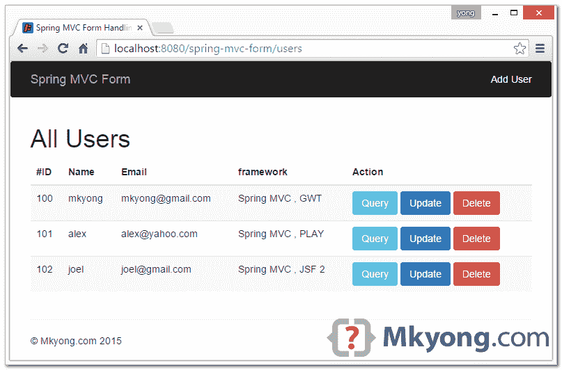

> 原文：<http://web.archive.org/web/20230101150211/http://www.mkyong.com/spring-mvc/spring-mvc-form-handling-example/>

# Spring MVC 表单处理示例



在本教程中，我们将向您展示一个 Spring MVC 表单处理项目来完成以下工作:

1.  表单值绑定 JSP 和模型。
2.  表单验证并显示错误消息。
3.  形成 POST/REDIRECT/GET 模式，并将消息添加到 flash 属性。
4.  CRUD 操作，用一个 HTML 表单添加、获取、更新和删除。

**使用的技术:**

1.  弹簧 4.1.6 释放
2.  maven3
3.  自举 3
4.  HSQLDB 驱动程序 2.3.2
5.  回溯 1.1.3
6.  JDK 1.7
7.  JSTL 1.2
8.  Eclipse IDE

一个简单的用户管理项目，你可以通过 HTML 表单列出、创建、更新和删除一个用户。您还将看到如何执行表单验证并有条件地显示错误消息。该项目使用 Bootstrap 3 进行设计，数据存储在 HSQL 嵌入式数据库中。

**URI 结构:**

| 上呼吸道感染 | 方法 | 行动 |
| /用户 | 得到 | 列表，显示所有用户 |
| /用户 | 邮政 | 保存或更新用户 |
| /users/{id} | 得到 | 显示用户{id} |
| /用户/添加 | 得到 | 显示添加用户表单 |
| /users/{id}/update | 得到 | 显示{id}的更新用户表单 |
| /users/{id}/delete | 邮政 | 删除用户{id} |

**Note**
In the old days, before Spring 3.0, we use `[SimpleFormController](http://web.archive.org/web/20190303052227/http://docs.spring.io/spring/docs/3.0.x/api/org/springframework/web/portlet/mvc/SimpleFormController.html)` to do the form handling. As Spring 3.0, this class is deprecated in favor of Spring annotated @Controller.

## Spring MVC 表单绑定

在开始本教程之前，您需要了解 Spring MVC 表单绑定是如何工作的。

1.1 在 controller 中，将对象添加到模型属性中。

```
 @RequestMapping(value = "/users/add", method = RequestMethod.GET)
	public String showAddUserForm(Model model) {

		User user = new User();
		model.addAttribute("userForm", user);
		//...
	} 
```

1.2 在 HTML 表单中，你使用`spring:form`标签，通过`modelAttribute`绑定控制器对象。

```
 <%@ taglib prefix="spring" uri="http://www.springframework.org/tags"%>
<%@ taglib prefix="form" uri="http://www.springframework.org/tags/form"%>

	<form:form method="post" modelAttribute="userForm" action="${userActionUrl}">
		<form:input path="name" type="text" /> <!-- bind to user.name-->
		<form:errors path="name" />
	</form:form> 
```

1.3 当 HTML 表单为“POST”时，通过`@ModelAttribute`获取值。

```
 @RequestMapping(value = "/users", method = RequestMethod.POST)
public String saveOrUpdateUser(@ModelAttribute("userForm") User user,
		BindingResult result, Model model) {
	//...
} 
```

完成了。让我们开始教程。

 <ins class="adsbygoogle" style="display:block; text-align:center;" data-ad-format="fluid" data-ad-layout="in-article" data-ad-client="ca-pub-2836379775501347" data-ad-slot="6894224149">## 1.项目目录

这是最终的项目目录结构。标准的 Maven 项目。

[](http://web.archive.org/web/20190303052227/http://www.mkyong.com/wp-content/uploads/2010/08/spring-mvc-form-handling-directory.png) <ins class="adsbygoogle" style="display:block" data-ad-client="ca-pub-2836379775501347" data-ad-slot="8821506761" data-ad-format="auto" data-ad-region="mkyongregion">## 2.项目相关性

开发一个 Spring MVC 项目，需要`spring-webmvc`。

pom.xml

```
 <project  
	xmlns:xsi="http://www.w3.org/2001/XMLSchema-instance"
	xsi:schemaLocation="http://maven.apache.org/POM/4.0.0 
	http://maven.apache.org/maven-v4_0_0.xsd">
	<modelVersion>4.0.0</modelVersion>
	<groupId>com.mkyong.form</groupId>
	<artifactId>spring-mvc-form</artifactId>
	<packaging>war</packaging>
	<version>1.0-SNAPSHOT</version>
	<name>SpringMVC + Form Handling Example</name>

	<properties>
		<jdk.version>1.7</jdk.version>
		<spring.version>4.1.6.RELEASE</spring.version>
		<hsqldb.version>2.3.2</hsqldb.version>
		<logback.version>1.1.3</logback.version>
		<jcl.slf4j.version>1.7.12</jcl.slf4j.version>
		<jstl.version>1.2</jstl.version>
		<servletapi.version>3.1.0</servletapi.version>
	</properties>

	<dependencies>

		<!-- Spring Core -->
		<dependency>
			<groupId>org.springframework</groupId>
			<artifactId>spring-core</artifactId>
			<version>${spring.version}</version>
			<exclusions>
			   <exclusion>
				<groupId>commons-logging</groupId>
				<artifactId>commons-logging</artifactId>
			    </exclusion>
			</exclusions>
		</dependency>

		<!-- Spring Web -->
		<dependency>
			<groupId>org.springframework</groupId>
			<artifactId>spring-webmvc</artifactId>
			<version>${spring.version}</version>
		</dependency>

		<!-- Spring JDBC -->
		<dependency>
			<groupId>org.springframework</groupId>
			<artifactId>spring-jdbc</artifactId>
			<version>${spring.version}</version>
		</dependency>

		<!-- HyperSQL DB -->
		<dependency>
			<groupId>org.hsqldb</groupId>
			<artifactId>hsqldb</artifactId>
			<version>${hsqldb.version}</version>
		</dependency>

		<!-- logging -->
		<dependency>
			<groupId>org.slf4j</groupId>
			<artifactId>jcl-over-slf4j</artifactId>
			<version>${jcl.slf4j.version}</version>
		</dependency>

		<dependency>
			<groupId>ch.qos.logback</groupId>
			<artifactId>logback-classic</artifactId>
			<version>${logback.version}</version>
		</dependency>

		<!-- jstl -->
		<dependency>
			<groupId>jstl</groupId>
			<artifactId>jstl</artifactId>
			<version>${jstl.version}</version>
		</dependency>

		<dependency>
			<groupId>javax.servlet</groupId>
			<artifactId>javax.servlet-api</artifactId>
			<version>${servletapi.version}</version>
			<scope>provided</scope>
		</dependency>

	</dependencies>

	<build>
		<plugins>

			<plugin>
				<groupId>org.apache.maven.plugins</groupId>
				<artifactId>maven-compiler-plugin</artifactId>
				<version>3.3</version>
				<configuration>
					<source>${jdk.version}</source>
					<target>${jdk.version}</target>
				</configuration>
			</plugin>

			<!-- embedded Jetty server, for testing -->
			<plugin>
				<groupId>org.eclipse.jetty</groupId>
				<artifactId>jetty-maven-plugin</artifactId>
				<version>9.2.11.v20150529</version>
				<configuration>
				  <scanIntervalSeconds>10</scanIntervalSeconds>
				  <webApp>
					<contextPath>/spring-mvc-form</contextPath>
				  </webApp>
				</configuration>
			</plugin>

			<!-- configure Eclipse workspace -->
			<plugin>
				<groupId>org.apache.maven.plugins</groupId>
				<artifactId>maven-eclipse-plugin</artifactId>
				<version>2.9</version>
				<configuration>
					<downloadSources>true</downloadSources>
					<downloadJavadocs>true</downloadJavadocs>
					<wtpversion>2.0</wtpversion>
					<wtpContextName>spring-mvc-form</wtpContextName>
				</configuration>
			</plugin>

		</plugins>
	</build>
</project> 
```

## 3.控制器

Spring `@Controller`类向你展示如何通过`@ModelAttribute`绑定表单值，添加表单验证器，将消息添加到 flash 属性中，填充下拉列表和复选框的值等等。阅读评论，不言自明。

UserController.java

```
 package com.mkyong.form.web;

import java.util.ArrayList;
import java.util.Arrays;
import java.util.LinkedHashMap;
import java.util.List;
import java.util.Map;

import javax.servlet.http.HttpServletRequest;

import org.slf4j.Logger;
import org.slf4j.LoggerFactory;
import org.springframework.beans.factory.annotation.Autowired;
import org.springframework.dao.EmptyResultDataAccessException;
import org.springframework.stereotype.Controller;
import org.springframework.ui.Model;
import org.springframework.validation.BindingResult;
import org.springframework.validation.annotation.Validated;
import org.springframework.web.bind.WebDataBinder;
import org.springframework.web.bind.annotation.ExceptionHandler;
import org.springframework.web.bind.annotation.InitBinder;
import org.springframework.web.bind.annotation.ModelAttribute;
import org.springframework.web.bind.annotation.PathVariable;
import org.springframework.web.bind.annotation.RequestMapping;
import org.springframework.web.bind.annotation.RequestMethod;
import org.springframework.web.servlet.ModelAndView;
import org.springframework.web.servlet.mvc.support.RedirectAttributes;

import com.mkyong.form.model.User;
import com.mkyong.form.service.UserService;
import com.mkyong.form.validator.UserFormValidator;

@Controller
public class UserController {

	private final Logger logger = LoggerFactory.getLogger(UserController.class);

	@Autowired
	private UserService userService;

	@Autowired
	UserFormValidator userFormValidator;

	//Set a form validator
	@InitBinder
	protected void initBinder(WebDataBinder binder) {
		binder.setValidator(userFormValidator);
	}

	@RequestMapping(value = "/", method = RequestMethod.GET)
	public String index(Model model) {
		logger.debug("index()");
		return "redirect:/users";
	}

	// list page
	@RequestMapping(value = "/users", method = RequestMethod.GET)
	public String showAllUsers(Model model) {

		logger.debug("showAllUsers()");
		model.addAttribute("users", userService.findAll());
		return "users/list";

	}

	// save or update user
	// 1\. @ModelAttribute bind form value
	// 2\. @Validated form validator
	// 3\. RedirectAttributes for flash value
	@RequestMapping(value = "/users", method = RequestMethod.POST)
	public String saveOrUpdateUser(@ModelAttribute("userForm") @Validated User user,
			BindingResult result, Model model, 
			final RedirectAttributes redirectAttributes) {

		logger.debug("saveOrUpdateUser() : {}", user);

		if (result.hasErrors()) {
			populateDefaultModel(model);
			return "users/userform";
		} else {

			// Add message to flash scope
			redirectAttributes.addFlashAttribute("css", "success");
			if(user.isNew()){
			  redirectAttributes.addFlashAttribute("msg", "User added successfully!");
			}else{
			  redirectAttributes.addFlashAttribute("msg", "User updated successfully!");
			}

			userService.saveOrUpdate(user);

			// POST/REDIRECT/GET
			return "redirect:/users/" + user.getId();

			// POST/FORWARD/GET
			// return "user/list";

		}

	}

	// show add user form
	@RequestMapping(value = "/users/add", method = RequestMethod.GET)
	public String showAddUserForm(Model model) {

		logger.debug("showAddUserForm()");

		User user = new User();

		// set default value
		user.setName("mkyong123");
		user.setEmail("test@gmail.com");
		user.setAddress("abc 88");
		user.setNewsletter(true);
		user.setSex("M");
		user.setFramework(new ArrayList<String>(Arrays.asList("Spring MVC", "GWT")));
		user.setSkill(new ArrayList<String>(Arrays.asList("Spring", "Grails", "Groovy")));
		user.setCountry("SG");
		user.setNumber(2);
		model.addAttribute("userForm", user);

		populateDefaultModel(model);

		return "users/userform";

	}

	// show update form
	@RequestMapping(value = "/users/{id}/update", method = RequestMethod.GET)
	public String showUpdateUserForm(@PathVariable("id") int id, Model model) {

		logger.debug("showUpdateUserForm() : {}", id);

		User user = userService.findById(id);
		model.addAttribute("userForm", user);

		populateDefaultModel(model);

		return "users/userform";

	}

	// delete user
	@RequestMapping(value = "/users/{id}/delete", method = RequestMethod.POST)
	public String deleteUser(@PathVariable("id") int id, 
		final RedirectAttributes redirectAttributes) {

		logger.debug("deleteUser() : {}", id);

		userService.delete(id);

		redirectAttributes.addFlashAttribute("css", "success");
		redirectAttributes.addFlashAttribute("msg", "User is deleted!");

		return "redirect:/users";

	}

	// show user
	@RequestMapping(value = "/users/{id}", method = RequestMethod.GET)
	public String showUser(@PathVariable("id") int id, Model model) {

		logger.debug("showUser() id: {}", id);

		User user = userService.findById(id);
		if (user == null) {
			model.addAttribute("css", "danger");
			model.addAttribute("msg", "User not found");
		}
		model.addAttribute("user", user);

		return "users/show";

	}

	private void populateDefaultModel(Model model) {

		List<String> frameworksList = new ArrayList<String>();
		frameworksList.add("Spring MVC");
		frameworksList.add("Struts 2");
		frameworksList.add("JSF 2");
		frameworksList.add("GWT");
		frameworksList.add("Play");
		frameworksList.add("Apache Wicket");
		model.addAttribute("frameworkList", frameworksList);

		Map<String, String> skill = new LinkedHashMap<String, String>();
		skill.put("Hibernate", "Hibernate");
		skill.put("Spring", "Spring");
		skill.put("Struts", "Struts");
		skill.put("Groovy", "Groovy");
		skill.put("Grails", "Grails");
		model.addAttribute("javaSkillList", skill);

		List<Integer> numbers = new ArrayList<Integer>();
		numbers.add(1);
		numbers.add(2);
		numbers.add(3);
		numbers.add(4);
		numbers.add(5);
		model.addAttribute("numberList", numbers);

		Map<String, String> country = new LinkedHashMap<String, String>();
		country.put("US", "United Stated");
		country.put("CN", "China");
		country.put("SG", "Singapore");
		country.put("MY", "Malaysia");
		model.addAttribute("countryList", country);

	}

} 
```

## 4.表单验证器

4.1 Spring 验证器示例。

UserFormValidator.java

```
 package com.mkyong.form.validator;

import org.springframework.beans.factory.annotation.Autowired;
import org.springframework.beans.factory.annotation.Qualifier;
import org.springframework.stereotype.Component;
import org.springframework.validation.Errors;
import org.springframework.validation.ValidationUtils;
import org.springframework.validation.Validator;

import com.mkyong.form.model.User;
import com.mkyong.form.service.UserService;

@Component
public class UserFormValidator implements Validator {

	@Autowired
	@Qualifier("emailValidator")
	EmailValidator emailValidator;

	@Autowired
	UserService userService;

	@Override
	public boolean supports(Class<?> clazz) {
		return User.class.equals(clazz);
	}

	@Override
	public void validate(Object target, Errors errors) {

		User user = (User) target;

		ValidationUtils.rejectIfEmptyOrWhitespace(errors, "name", "NotEmpty.userForm.name");
		ValidationUtils.rejectIfEmptyOrWhitespace(errors, "email", "NotEmpty.userForm.email");
		ValidationUtils.rejectIfEmptyOrWhitespace(errors, "address", "NotEmpty.userForm.address");
		ValidationUtils.rejectIfEmptyOrWhitespace(errors, "password", "NotEmpty.userForm.password");
		ValidationUtils.rejectIfEmptyOrWhitespace(errors, "confirmPassword","NotEmpty.userForm.confirmPassword");
		ValidationUtils.rejectIfEmptyOrWhitespace(errors, "sex", "NotEmpty.userForm.sex");
		ValidationUtils.rejectIfEmptyOrWhitespace(errors, "country", "NotEmpty.userForm.country");

		if(!emailValidator.valid(user.getEmail())){
			errors.rejectValue("email", "Pattern.userForm.email");
		}

		if(user.getNumber()==null || user.getNumber()<=0){
			errors.rejectValue("number", "NotEmpty.userForm.number");
		}

		if(user.getCountry().equalsIgnoreCase("none")){
			errors.rejectValue("country", "NotEmpty.userForm.country");
		}

		if (!user.getPassword().equals(user.getConfirmPassword())) {
			errors.rejectValue("confirmPassword", "Diff.userform.confirmPassword");
		}

		if (user.getFramework() == null || user.getFramework().size() < 2) {
			errors.rejectValue("framework", "Valid.userForm.framework");
		}

		if (user.getSkill() == null || user.getSkill().size() < 3) {
			errors.rejectValue("skill", "Valid.userForm.skill");
		}

	}

} 
```

validation.properties

```
 NotEmpty.userForm.name = Name is required!
NotEmpty.userForm.email = Email is required!
NotEmpty.userForm.address = Address is required!
NotEmpty.userForm.password = Password is required!
NotEmpty.userForm.confirmPassword = Confirm password is required!
NotEmpty.userForm.sex = Sex is required!
NotEmpty.userForm.number = Number is required!
NotEmpty.userForm.country = Country is required!
Valid.userForm.framework = Please select at least two frameworks!
Valid.userForm.skill = Please select at least three skills!
Diff.userform.confirmPassword = Passwords do not match, please retype!
Pattern.userForm.email = Invalid Email format! 
```

要运行 Spring 验证器，通过`@InitBinder`添加验证器，并用`@Validated`注释模型

```
 @InitBinder
protected void initBinder(WebDataBinder binder) {
	binder.setValidator(userFormValidator);
}

@RequestMapping(value = "/users", method = RequestMethod.POST)
public String saveOrUpdateUser(... @Validated User user,
		...) {

	//...

} 
```

或者手动运行。

```
 @RequestMapping(value = "/users", method = RequestMethod.POST)
public String saveOrUpdateUser(... User user,
		...) {
	userFormValidator.validate(user, result);	
	//...
} 
```

## 5.HTML 表单

所有的 HTML 表单都是 css 样式，使用 Bootstrap 框架，并使用 Spring form 标签进行显示和表单绑定。
5.1 用户列表。

list.jsp

```
 <%@ page session="false"%>
<%@ taglib prefix="spring" uri="http://www.springframework.org/tags"%>
<%@ taglib prefix="c" uri="http://java.sun.com/jsp/jstl/core"%>
<%@ taglib prefix="fmt" uri="http://java.sun.com/jsp/jstl/fmt"%>

<!DOCTYPE html>
<html lang="en">

<jsp:include page="../fragments/header.jsp" />

<body>

	<div class="container">

		<c:if test="${not empty msg}">
		    <div class="alert alert-${css} alert-dismissible" role="alert">
			<button type="button" class="close" data-dismiss="alert" 
                                aria-label="Close">
				<span aria-hidden="true">×</span>
			</button>
			<strong>${msg}</strong>
		    </div>
		</c:if>

		<h1>All Users</h1>

		<table class="table table-striped">
			<thead>
				<tr>
					<th>#ID</th>
					<th>Name</th>
					<th>Email</th>
					<th>framework</th>
					<th>Action</th>
				</tr>
			</thead>

			<c:forEach var="user" items="${users}">
			    <tr>
				<td>
					${user.id}
				</td>
				<td>${user.name}</td>
				<td>${user.email}</td>
				<td>
                                  <c:forEach var="framework" items="${user.framework}" 
                                                             varStatus="loop">
					${framework}
    				        <c:if test="${not loop.last}">,</c:if>
				  </c:forEach>
                                </td>
				<td>
				  <spring:url value="/users/${user.id}" var="userUrl" />
				  <spring:url value="/users/${user.id}/delete" var="deleteUrl" /> 
				  <spring:url value="/users/${user.id}/update" var="updateUrl" />

				  <button class="btn btn-info" 
                                          onclick="location.href='${userUrl}'">Query</button>
				  <button class="btn btn-primary" 
                                          onclick="location.href='${updateUrl}'">Update</button>
				  <button class="btn btn-danger" 
                                          onclick="this.disabled=true;post('${deleteUrl}')">Delete</button>
                                </td>
			    </tr>
			</c:forEach>
		</table>

	</div>

	<jsp:include page="../fragments/footer.jsp" />

</body>
</html> 
```

show.jsp

```
 <%@ page session="false"%>
<%@ taglib prefix="spring" uri="http://www.springframework.org/tags"%>
<%@ taglib prefix="c" uri="http://java.sun.com/jsp/jstl/core"%>
<%@ taglib prefix="form" uri="http://www.springframework.org/tags/form"%>
<%@ taglib prefix="fmt" uri="http://java.sun.com/jsp/jstl/fmt"%>

<!DOCTYPE html>
<html lang="en">

<jsp:include page="../fragments/header.jsp" />

<div class="container">

	<c:if test="${not empty msg}">
		<div class="alert alert-${css} alert-dismissible" role="alert">
			<button type="button" class="close" data-dismiss="alert" 
                                aria-label="Close">
				<span aria-hidden="true">×</span>
			</button>
			<strong>${msg}</strong>
		</div>
	</c:if>

	<h1>User Detail</h1>
	<br />

	<div class="row">
		<label class="col-sm-2">ID</label>
		<div class="col-sm-10">${user.id}</div>
	</div>

	<div class="row">
		<label class="col-sm-2">Name</label>
		<div class="col-sm-10">${user.name}</div>
	</div>

	<div class="row">
		<label class="col-sm-2">Email</label>
		<div class="col-sm-10">${user.email}</div>
	</div>

	<div class="row">
		<label class="col-sm-2">Address</label>
		<div class="col-sm-10">${user.address}</div>
	</div>

	<div class="row">
		<label class="col-sm-2">Newsletter</label>
		<div class="col-sm-10">${user.newsletter}</div>
	</div>

	<div class="row">
		<label class="col-sm-2">Web Frameworks</label>
		<div class="col-sm-10">${user.framework}</div>
	</div>

	<div class="row">
		<label class="col-sm-2">Sex</label>
		<div class="col-sm-10">${user.sex}</div>
	</div>

	<div class="row">
		<label class="col-sm-2">Number</label>
		<div class="col-sm-10">${user.number}</div>
	</div>

	<div class="row">
		<label class="col-sm-2">Country</label>
		<div class="col-sm-10">${user.country}</div>
	</div>

	<div class="row">
		<label class="col-sm-2">Skill</label>
		<div class="col-sm-10">${user.skill}</div>
	</div>

</div>

<jsp:include page="../fragments/footer.jsp" />

</body>
</html> 
```

userform.jsp

```
 <%@ page session="false"%>
<%@ taglib prefix="spring" uri="http://www.springframework.org/tags"%>
<%@ taglib prefix="c" uri="http://java.sun.com/jsp/jstl/core"%>
<%@ taglib prefix="form" uri="http://www.springframework.org/tags/form"%>
<%@ taglib prefix="fmt" uri="http://java.sun.com/jsp/jstl/fmt"%>

<!DOCTYPE html>
<html lang="en">

<jsp:include page="../fragments/header.jsp" />

<div class="container">

	<c:choose>
		<c:when test="${userForm['new']}">
			<h1>Add User</h1>
		</c:when>
		<c:otherwise>
			<h1>Update User</h1>
		</c:otherwise>
	</c:choose>
	<br />

	<spring:url value="/users" var="userActionUrl" />

	<form:form class="form-horizontal" method="post" 
                modelAttribute="userForm" action="${userActionUrl}">

		<form:hidden path="id" />

		<spring:bind path="name">
		  <div class="form-group ${status.error ? 'has-error' : ''}">
			<label class="col-sm-2 control-label">Name</label>
			<div class="col-sm-10">
				<form:input path="name" type="text" class="form-control" 
                                id="name" placeholder="Name" />
				<form:errors path="name" class="control-label" />
			</div>
		  </div>
		</spring:bind>

		<spring:bind path="email">
		  <div class="form-group ${status.error ? 'has-error' : ''}">
			<label class="col-sm-2 control-label">Email</label>
			<div class="col-sm-10">
				<form:input path="email" class="form-control" 
                                id="email" placeholder="Email" />
				<form:errors path="email" class="control-label" />
			</div>
		  </div>
		</spring:bind>

		<spring:bind path="password">
		  <div class="form-group ${status.error ? 'has-error' : ''}">
			<label class="col-sm-2 control-label">Password</label>
			<div class="col-sm-10">
				<form:password path="password" class="form-control" 
                                id="password" placeholder="password" />
				<form:errors path="password" class="control-label" />
			</div>
		  </div>
		</spring:bind>

		<spring:bind path="confirmPassword">
		  <div class="form-group ${status.error ? 'has-error' : ''}">
			<label class="col-sm-2 control-label">confirm Password</label>
			<div class="col-sm-10">
				<form:password path="confirmPassword" class="form-control" 
                                id="password" placeholder="password" />
				<form:errors path="confirmPassword" class="control-label" />
			</div>
		  </div>
		</spring:bind>

		<spring:bind path="address">
		  <div class="form-group ${status.error ? 'has-error' : ''}">
			<label class="col-sm-2 control-label">Address</label>
			<div class="col-sm-10">
				<form:textarea path="address" rows="5" class="form-control" 
                                id="address" placeholder="address" />
				<form:errors path="address" class="control-label" />
			</div>
		  </div>
		</spring:bind>

		<spring:bind path="newsletter">
		  <div class="form-group ${status.error ? 'has-error' : ''}">
			<label class="col-sm-2 control-label">Newsletter</label>
			<div class="col-sm-10">
				<div class="checkbox">
				  <label> 
                                     <form:checkbox path="newsletter" id="newsletter" />
				  </label>
				     <form:errors path="newsletter" class="control-label" />
				</div>
			</div>
		  </div>
		</spring:bind>

		<spring:bind path="framework">
		  <div class="form-group ${status.error ? 'has-error' : ''}">
			<label class="col-sm-2 control-label">Web Frameworks</label>
			<div class="col-sm-10">
				<form:checkboxes path="framework" items="${frameworkList}" 
                                 element="label class='checkbox-inline'" />
				<br />
				<form:errors path="framework" class="control-label" />
			</div>
		  </div>
		</spring:bind>

		<spring:bind path="sex">
		  <div class="form-group ${status.error ? 'has-error' : ''}">
			<label class="col-sm-2 control-label">Sex</label>
			<div class="col-sm-10">
				<label class="radio-inline"> 
                                  <form:radiobutton path="sex" value="M" /> Male
				</label> 
                                <label class="radio-inline"> 
                                  <form:radiobutton path="sex" value="F" /> Female
				</label> <br />
				<form:errors path="sex" class="control-label" />
			</div>
		  </div>
		</spring:bind>

		<spring:bind path="number">
		  <div class="form-group ${status.error ? 'has-error' : ''}">
			<label class="col-sm-2 control-label">Number</label>
			<div class="col-sm-10">
				<form:radiobuttons path="number" items="${numberList}" 
                                element="label class='radio-inline'" />
				<br />
				<form:errors path="number" class="control-label" />
			</div>
		  </div>
		</spring:bind>

		<spring:bind path="country">
		  <div class="form-group ${status.error ? 'has-error' : ''}">
			<label class="col-sm-2 control-label">Country</label>
			<div class="col-sm-5">
				<form:select path="country" class="form-control">
					<form:option value="NONE" label="--- Select ---" />
					<form:options items="${countryList}" />
				</form:select>
				<form:errors path="country" class="control-label" />
			</div>
			<div class="col-sm-5"></div>
		  </div>
		</spring:bind>

		<spring:bind path="skill">
		  <div class="form-group ${status.error ? 'has-error' : ''}">
			<label class="col-sm-2 control-label">Java Skills</label>
			<div class="col-sm-5">
				<form:select path="skill" items="${javaSkillList}" 
                                 multiple="true" size="5" class="form-control" />
				<form:errors path="skill" class="control-label" />
			</div>
			<div class="col-sm-5"></div>
		  </div>
		</spring:bind>

		<div class="form-group">
		  <div class="col-sm-offset-2 col-sm-10">
			<c:choose>
			  <c:when test="${userForm['new']}">
			     <button type="submit" class="btn-lg btn-primary pull-right">Add
                             </button>
			  </c:when>
			  <c:otherwise>
			     <button type="submit" class="btn-lg btn-primary pull-right">Update
                             </button>
			  </c:otherwise>
			</c:choose>
		  </div>
		</div>
	</form:form>

</div>

<jsp:include page="../fragments/footer.jsp" />

</body>
</html> 
```

## 6.数据库的东西

6.1 创建一个表，并插入一些测试数据。

create-db.sql

```
 CREATE TABLE users (
  id INTEGER GENERATED BY DEFAULT AS IDENTITY(START WITH 100, INCREMENT BY 1) PRIMARY KEY,
  name VARCHAR(30),
  email  VARCHAR(50),
  address VARCHAR(255),
  password VARCHAR(20),
  newsletter BOOLEAN,
  framework VARCHAR(500),
  sex VARCHAR(1),
  NUMBER INTEGER,
  COUNTRY VARCHAR(10),
  SKILL VARCHAR(500)
); 
```

insert-data.sql

```
 INSERT INTO users (name, email, framework) VALUES ('mkyong', 'mkyong@gmail.com', 'Spring MVC, GWT');
INSERT INTO users (name, email) VALUES ('alex', 'alex@yahoo.com', 'Spring MVC, GWT');
INSERT INTO users (name, email) VALUES ('joel', 'joel@gmail.com', 'Spring MVC, GWT'); 
```

6.2 启动一个 HSQLDB 嵌入式数据库，创建一个数据源和 jdbcTemplate。

SpringDBConfig.java

```
 package com.mkyong.form.config;

import javax.sql.DataSource;
import org.springframework.beans.factory.annotation.Autowired;
import org.springframework.context.annotation.Bean;
import org.springframework.context.annotation.Configuration;
import org.springframework.jdbc.core.namedparam.NamedParameterJdbcTemplate;
import org.springframework.jdbc.datasource.embedded.EmbeddedDatabase;
import org.springframework.jdbc.datasource.embedded.EmbeddedDatabaseBuilder;
import org.springframework.jdbc.datasource.embedded.EmbeddedDatabaseType;

@Configuration
public class SpringDBConfig {

	@Autowired
	DataSource dataSource;

	@Bean
	public NamedParameterJdbcTemplate getNamedParameterJdbcTemplate() {
		return new NamedParameterJdbcTemplate(dataSource);
	}

	@Bean
	public DataSource getDataSource() {
		EmbeddedDatabaseBuilder builder = new EmbeddedDatabaseBuilder();
		EmbeddedDatabase db = builder.setName("testdb")
                        .setType(EmbeddedDatabaseType.HSQL)
			.addScript("db/sql/create-db.sql")
                        .addScript("db/sql/insert-data.sql").build();
		return db;
	}

} 
```

6.3 用户对象。

user.java

```
 package com.mkyong.form.model;

import java.util.List;

public class User {
	// form:hidden - hidden value
	Integer id;

	// form:input - textbox
	String name;

	// form:input - textbox
	String email;

	// form:textarea - textarea
	String address;

	// form:input - password
	String password;

	// form:input - password
	String confirmPassword;

	// form:checkbox - single checkbox
	boolean newsletter;

	// form:checkboxes - multiple checkboxes
	List<String> framework;

	// form:radiobutton - radio button
	String sex;

	// form:radiobuttons - radio button
	Integer number;

	// form:select - form:option - dropdown - single select
	String country;

	// form:select - multiple=true - dropdown - multiple select
	List<String> skill;

	//Check if this is for New of Update
	public boolean isNew() {
		return (this.id == null);
	}

	//...

} 
```

## 7.服务和一体行动

UserService.java

```
 package com.mkyong.form.service;

import java.util.List;
import com.mkyong.form.model.User;

public interface UserService {

	User findById(Integer id);

	List<User> findAll();

	void saveOrUpdate(User user);

	void delete(int id);

} 
```

UserServiceImpl.java

```
 package com.mkyong.form.service;

import java.util.List;

import org.springframework.beans.factory.annotation.Autowired;
import org.springframework.stereotype.Service;

import com.mkyong.form.dao.UserDao;
import com.mkyong.form.model.User;

@Service("userService")
public class UserServiceImpl implements UserService {

	UserDao userDao;

	@Autowired
	public void setUserDao(UserDao userDao) {
		this.userDao = userDao;
	}

	@Override
	public User findById(Integer id) {
		return userDao.findById(id);
	}

	@Override
	public List<User> findAll() {
		return userDao.findAll();
	}

	@Override
	public void saveOrUpdate(User user) {

		if (findById(user.getId())==null) {
			userDao.save(user);
		} else {
			userDao.update(user);
		}

	}

	@Override
	public void delete(int id) {
		userDao.delete(id);
	}

} 
```

UserDao.java

```
 package com.mkyong.form.dao;

import java.util.List;

import com.mkyong.form.model.User;

public interface UserDao {

	User findById(Integer id);

	List<User> findAll();

	void save(User user);

	void update(User user);

	void delete(Integer id);

} 
```

UserDaoImpl.java

```
 package com.mkyong.form.dao;

import java.sql.ResultSet;
import java.sql.SQLException;
import java.util.ArrayList;
import java.util.Arrays;
import java.util.HashMap;
import java.util.List;
import java.util.Map;

import org.springframework.beans.factory.annotation.Autowired;
import org.springframework.dao.DataAccessException;
import org.springframework.dao.EmptyResultDataAccessException;
import org.springframework.jdbc.core.RowMapper;
import org.springframework.jdbc.core.namedparam.MapSqlParameterSource;
import org.springframework.jdbc.core.namedparam.NamedParameterJdbcTemplate;
import org.springframework.jdbc.core.namedparam.SqlParameterSource;
import org.springframework.jdbc.support.GeneratedKeyHolder;
import org.springframework.jdbc.support.KeyHolder;
import org.springframework.stereotype.Repository;
import org.springframework.util.StringUtils;

import com.mkyong.form.model.User;

@Repository
public class UserDaoImpl implements UserDao {

	NamedParameterJdbcTemplate namedParameterJdbcTemplate;

	@Autowired
	public void setNamedParameterJdbcTemplate(
		NamedParameterJdbcTemplate namedParameterJdbcTemplate) {
		this.namedParameterJdbcTemplate = namedParameterJdbcTemplate;
	}

	@Override
	public User findById(Integer id) {

		Map<String, Object> params = new HashMap<String, Object>();
		params.put("id", id);

		String sql = "SELECT * FROM users WHERE id=:id";

		User result = null;
		try {
			result = namedParameterJdbcTemplate
                          .queryForObject(sql, params, new UserMapper());
		} catch (EmptyResultDataAccessException e) {
			// do nothing, return null
		}

		return result;

	}

	@Override
	public List<User> findAll() {

		String sql = "SELECT * FROM users";
		List<User> result = namedParameterJdbcTemplate.query(sql, new UserMapper());
		return result;

	}

	@Override
	public void save(User user) {

		KeyHolder keyHolder = new GeneratedKeyHolder();

		String sql = "INSERT INTO USERS(NAME, EMAIL, ADDRESS, PASSWORD, NEWSLETTER, FRAMEWORK, SEX, NUMBER, COUNTRY, SKILL) "
				+ "VALUES ( :name, :email, :address, :password, :newsletter, :framework, :sex, :number, :country, :skill)";

		namedParameterJdbcTemplate.update(sql, getSqlParameterByModel(user), keyHolder);
		user.setId(keyHolder.getKey().intValue());

	}

	@Override
	public void update(User user) {

		String sql = "UPDATE USERS SET NAME=:name, EMAIL=:email, ADDRESS=:address, " 
			+ "PASSWORD=:password, NEWSLETTER=:newsletter, FRAMEWORK=:framework, "
			+ "SEX=:sex, NUMBER=:number, COUNTRY=:country, SKILL=:skill WHERE id=:id";

		namedParameterJdbcTemplate.update(sql, getSqlParameterByModel(user));

	}

	@Override
	public void delete(Integer id) {

		String sql = "DELETE FROM USERS WHERE id= :id";
		namedParameterJdbcTemplate.update(sql, new MapSqlParameterSource("id", id));

	}

	private SqlParameterSource getSqlParameterByModel(User user) {

		MapSqlParameterSource paramSource = new MapSqlParameterSource();
		paramSource.addValue("id", user.getId());
		paramSource.addValue("name", user.getName());
		paramSource.addValue("email", user.getEmail());
		paramSource.addValue("address", user.getAddress());
		paramSource.addValue("password", user.getPassword());
		paramSource.addValue("newsletter", user.isNewsletter());

		// join String
		paramSource.addValue("framework", convertListToDelimitedString(user.getFramework()));
		paramSource.addValue("sex", user.getSex());
		paramSource.addValue("number", user.getNumber());
		paramSource.addValue("country", user.getCountry());
		paramSource.addValue("skill", convertListToDelimitedString(user.getSkill()));

		return paramSource;
	}

	private static final class UserMapper implements RowMapper<User> {

		public User mapRow(ResultSet rs, int rowNum) throws SQLException {
			User user = new User();
			user.setId(rs.getInt("id"));
			user.setName(rs.getString("name"));
			user.setEmail(rs.getString("email"));
			user.setFramework(convertDelimitedStringToList(rs.getString("framework")));
			user.setAddress(rs.getString("address"));
			user.setCountry(rs.getString("country"));
			user.setNewsletter(rs.getBoolean("newsletter"));
			user.setNumber(rs.getInt("number"));
			user.setPassword(rs.getString("password"));
			user.setSex(rs.getString("sex"));
			user.setSkill(convertDelimitedStringToList(rs.getString("skill")));
			return user;
		}
	}

	private static List<String> convertDelimitedStringToList(String delimitedString) {

		List<String> result = new ArrayList<String>();

		if (!StringUtils.isEmpty(delimitedString)) {
			result = Arrays.asList(StringUtils.delimitedListToStringArray(delimitedString, ","));
		}
		return result;

	}

	private String convertListToDelimitedString(List<String> list) {

		String result = "";
		if (list != null) {
			result = StringUtils.arrayToCommaDelimitedString(list.toArray());
		}
		return result;

	}

} 
```

## 8.弹簧配置

混合 Spring XML 和 JavaConfig。

SpringWebConfig.java

```
 package com.mkyong.form.config;

import org.springframework.context.annotation.Bean;
import org.springframework.context.annotation.ComponentScan;
import org.springframework.context.annotation.Configuration;
import org.springframework.context.support.ResourceBundleMessageSource;
import org.springframework.web.servlet.config.annotation.EnableWebMvc;
import org.springframework.web.servlet.config.annotation.ResourceHandlerRegistry;
import org.springframework.web.servlet.config.annotation.WebMvcConfigurerAdapter;
import org.springframework.web.servlet.view.InternalResourceViewResolver;
import org.springframework.web.servlet.view.JstlView;

@EnableWebMvc
@Configuration
@ComponentScan({ "com.mkyong.form.web", "com.mkyong.form.service", "com.mkyong.form.dao",
		"com.mkyong.form.exception", "com.mkyong.form.validator" })
public class SpringWebConfig extends WebMvcConfigurerAdapter {

	@Override
	public void addResourceHandlers(ResourceHandlerRegistry registry) {
		registry.addResourceHandler("/resources/**").addResourceLocations("/resources/");
	}

	@Bean
	public InternalResourceViewResolver viewResolver() {
		InternalResourceViewResolver viewResolver = new InternalResourceViewResolver();
		viewResolver.setViewClass(JstlView.class);
		viewResolver.setPrefix("/WEB-INF/views/jsp/");
		viewResolver.setSuffix(".jsp");
		return viewResolver;
	}

	@Bean
	public ResourceBundleMessageSource messageSource() {
		ResourceBundleMessageSource rb = new ResourceBundleMessageSource();
		rb.setBasenames(new String[] { "messages/messages", "messages/validation" });
		return rb;
	}

} 
```

spring-web-servlet.xml

```
 <beans 
	xmlns:context="http://www.springframework.org/schema/context"
	xmlns:xsi="http://www.w3.org/2001/XMLSchema-instance" 
	xmlns:mvc="http://www.springframework.org/schema/mvc"
	xsi:schemaLocation="
        http://www.springframework.org/schema/beans     
        http://www.springframework.org/schema/beans/spring-beans.xsd
        http://www.springframework.org/schema/mvc 
        http://www.springframework.org/schema/mvc/spring-mvc.xsd
        http://www.springframework.org/schema/context 
        http://www.springframework.org/schema/context/spring-context.xsd">

    <!-- Scan the JavaConfig -->
	<context:component-scan base-package="com.mkyong.form.config" />

</beans> 
```

web.xml

```
 <web-app  
	xmlns:xsi="http://www.w3.org/2001/XMLSchema-instance"
	xsi:schemaLocation="http://java.sun.com/xml/ns/javaee 
	      http://java.sun.com/xml/ns/javaee/web-app_3_0.xsd"
	version="3.0">

	<display-name>Spring3 MVC Application</display-name>

	<servlet>
		<servlet-name>spring-web</servlet-name>
		<servlet-class>
			org.springframework.web.servlet.DispatcherServlet
		</servlet-class>
		<load-on-startup>1</load-on-startup>
	</servlet>

	<servlet-mapping>
		<servlet-name>spring-web</servlet-name>
		<url-pattern>/</url-pattern>
	</servlet-mapping>

	<error-page>
		<error-code>500</error-code>
		<location>/WEB-INF/views/jsp/error.jsp</location>
	</error-page>

	<error-page>
		<error-code>404</error-code>
		<location>/WEB-INF/views/jsp/error.jsp</location>
	</error-page>

	<error-page>
		<location>/WEB-INF/views/jsp/error.jsp</location>
	</error-page>

</web-app> 
```

## 9.演示

下载项目并键入`mvn jetty:run`

```
 $ mvn jetty:run
[INFO] Scanning for projects...
[INFO]
[INFO] ------------------------------------------------------------------------
[INFO] Building SpringMVC + Form Handling Example 1.0-SNAPSHOT
[INFO] ------------------------------------------------------------------------
//...
[INFO] Started Jetty Server
[INFO] Starting scanner at interval of 10 seconds. 
```

**9.1 列出所有用户。***http://localhost:8080/spring-MVC-form/users*

[](http://web.archive.org/web/20190303052227/http://www.mkyong.com/wp-content/uploads/2010/08/spring-mvc-form-handling-demo1.png)

**9.2 添加用户。***http://localhost:8080/spring-MVC-form/users/add*

[](http://web.archive.org/web/20190303052227/http://www.mkyong.com/wp-content/uploads/2010/08/spring-mvc-form-handling-demo-add.png)

**9.3 表单验证。**

[](http://web.archive.org/web/20190303052227/http://www.mkyong.com/wp-content/uploads/2010/08/spring-mvc-form-handling-demo-add-error.png)

**9.4 新增用户。***http://localhost:8080/spring-MVC-form/users*

[](http://web.archive.org/web/20190303052227/http://www.mkyong.com/wp-content/uploads/2010/08/spring-mvc-form-handling-demo-add-done.png)

**9.5 删除用户。***http://localhost:8080/spring-MVC-form/users/104/delete*

[](http://web.archive.org/web/20190303052227/http://www.mkyong.com/wp-content/uploads/2010/08/spring-mvc-form-handling-demo-delete.png)

## 下载源代码

Download it - [spring4-form-handle-example.zip](http://web.archive.org/web/20190303052227/http://www.mkyong.com/wp-content/uploads/2010/08/spring4-form-handle-example.zip) (80 kb)Github - TBD

## 参考

1.  [使用 Spring 的表单标签库](http://web.archive.org/web/20190303052227/http://docs.spring.io/spring/docs/current/spring-framework-reference/html/view.html#view-jsp-formtaglib)
2.  [Spring MVC 3 验证](http://web.archive.org/web/20190303052227/http://docs.spring.io/spring/docs/current/spring-framework-reference/html/validation.html#validation-mvc)
3.  [RedirectAttributes JavaDoc](http://web.archive.org/web/20190303052227/http://docs.spring.io/spring/docs/current/javadoc-api/org/springframework/web/servlet/mvc/support/RedirectAttributes.html)

[form handling](http://web.archive.org/web/20190303052227/http://www.mkyong.com/tag/form-handling/) [spring mvc](http://web.archive.org/web/20190303052227/http://www.mkyong.com/tag/spring-mvc/)</ins></ins> (function (i,d,s,o,m,r,c,l,w,q,y,h,g) { var e=d.getElementById(r);if(e===null){ var t = d.createElement(o); t.src = g; t.id = r; t.setAttribute(m, s);t.async = 1;var n=d.getElementsByTagName(o)[0];n.parentNode.insertBefore(t, n); var dt=new Date().getTime(); try{i[l][w+y](h,i[l][q+y](h)+'&amp;'+dt);}catch(er){i[h]=dt;} } else if(typeof i[c]!=='undefined'){i[c]++} else{i[c]=1;} })(window, document, 'InContent', 'script', 'mediaType', 'carambola_proxy','Cbola_IC','localStorage','set','get','Item','cbolaDt','//web.archive.org/web/20190303052227/http://route.carambo.la/inimage/getlayer?pid=myky82&amp;did=112239&amp;wid=0')<input type="hidden" id="mkyong-postId" value="6667">

#### 关于作者


##### mkyong

Founder of [Mkyong.com](http://web.archive.org/web/20190303052227/http://mkyong.com/), love Java and open source stuff. Follow him on [Twitter](http://web.archive.org/web/20190303052227/https://twitter.com/mkyong), or befriend him on [Facebook](http://web.archive.org/web/20190303052227/http://www.facebook.com/java.tutorial) or [Google Plus](http://web.archive.org/web/20190303052227/https://plus.google.com/110948163568945735692?rel=author). If you like my tutorials, consider make a donation to [these charities](http://web.archive.org/web/20190303052227/http://www.mkyong.com/blog/donate-to-charity/).