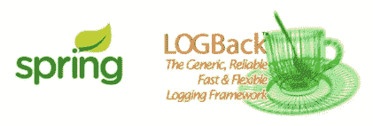
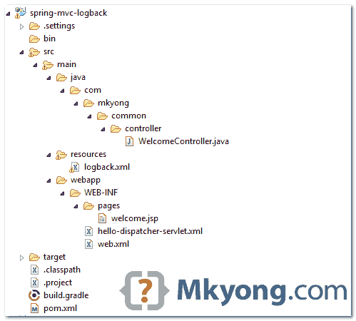

# Spring MVC + Logback SLF4j 示例

> 原文：<http://web.archive.org/web/20230101150211/http://www.mkyong.com/spring-mvc/spring-mvc-logback-slf4j-example/>



在本教程中，我们将向您展示如何在 Spring MVC web 应用程序中设置 slf4j 和 [logback](http://web.archive.org/web/20220517102912/http://logback.qos.ch/) 。

使用的技术:

1.  弹簧 4.1.6 释放
2.  回溯 1.1.3
3.  腹部 3 度或 2.0 度
4.  Tomcat 7
5.  Eclipse 4.4

**Note**
By default, Spring is using the Jakarta Commons Logging API (JCL), read [this](http://web.archive.org/web/20220517102912/https://docs.spring.io/spring/docs/4.1.x/spring-framework-reference/html/overview.html#overview-logging).

要设置回退框架，您需要:

1.  从`spring-core`中排除`commons-logging`
2.  通过`jcl-over-slf4j`将春季测井从 JCL 桥接到 SLF4j
3.  将回退作为依赖项包括在内
4.  在`src/main/resources`文件夹中创建一个`logback.xml`
5.  完成的

## 1.构建工具

1.1 对于 Maven

pom.xml

```
 <properties>
	<jdk.version>1.7</jdk.version>
	<spring.version>4.1.6.RELEASE</spring.version>
	<logback.version>1.1.3</logback.version>
	<jcl.slf4j.version>1.7.12</jcl.slf4j.version>
    </properties>

    <dependencies>

	<!-- 1\. exclude commons-logging -->
	<dependency>
		<groupId>org.springframework</groupId>
		<artifactId>spring-core</artifactId>
		<version>${spring.version}</version>
		<exclusions>
		  <exclusion>
			<groupId>commons-logging</groupId>
			<artifactId>commons-logging</artifactId>
		  </exclusion>
		</exclusions>
	</dependency>

	<dependency>
		<groupId>org.springframework</groupId>
		<artifactId>spring-webmvc</artifactId>
		<version>${spring.version}</version>
	</dependency>

	<!- 2\. Bridge logging from JCL to SLF4j-->
	<dependency>
		<groupId>org.slf4j</groupId>
		<artifactId>jcl-over-slf4j</artifactId>
		<version>${jcl.slf4j.version}</version>
	</dependency>

	<!-- 3\. logback -->
	<dependency>
		<groupId>ch.qos.logback</groupId>
		<artifactId>logback-classic</artifactId>
		<version>${logback.version}</version>
	</dependency>

    <dependencies> 
```

1.2 度

build.gradle

```
 apply plugin: 'java'
apply plugin: 'war'
apply plugin: 'eclipse-wtp'

repositories {
    mavenCentral()
}

//1\. exclude commons-logging
configurations.all {
   exclude group: "commons-logging", module: "commons-logging"
}

dependencies {
 	//2\. bridge logging from JCL to SLF4j
 	compile 'org.slf4j:jcl-over-slf4j:1.7.12'

	//3\. Logback
	compile 'ch.qos.logback:logback-classic:1.1.3'

	compile 'org.springframework:spring-webmvc:4.1.6.RELEASE'
} 
```

## 2.项目目录

在`src/main/resources`文件夹中创建一个`logback.xml`



## 3.logback.xml

此`logback.xml`将所有日志发送到控制台。

logback.xml

```
 <?xml version="1.0" encoding="UTF-8"?>
<configuration>

	<appender name="STDOUT" class="ch.qos.logback.core.ConsoleAppender">
	    <layout class="ch.qos.logback.classic.PatternLayout">
		<Pattern>
			%d{yyyy-MM-dd HH:mm:ss} %-5level %logger{36} - %msg%n
		</Pattern>
	    </layout>
	</appender>

	<logger name="org.springframework" level="debug" additivity="false">
		<appender-ref ref="STDOUT" />
	</logger>

	<logger name="com.mkyong.helloworld" level="debug" additivity="false">
		<appender-ref ref="STDOUT" />
	</logger>

	<root level="error">
		<appender-ref ref="STDOUT" />
	</root>

</configuration> 
```

对于其他附加器(日志输出)，比如日志到文件，请访问这个 [log.xml 示例](http://web.archive.org/web/20220517102912/http://www.mkyong.com/logging/logback-xml-example/)，或者这个[日志回溯附加器指南](http://web.archive.org/web/20220517102912/http://logback.qos.ch/manual/appenders.html)

## 4.回溯示例

WelcomeController.java

```
 package com.mkyong.common.controller;

import org.slf4j.Logger;
import org.slf4j.LoggerFactory;
import org.springframework.stereotype.Controller;
import org.springframework.ui.Model;
import org.springframework.web.bind.annotation.RequestMapping;
import org.springframework.web.bind.annotation.RequestMethod;

@Controller
public class WelcomeController {

	private static final Logger logger = 
		LoggerFactory.getLogger(WelcomeController.class);

	@RequestMapping(value = "/", method = RequestMethod.GET)
	public String welcome(Model model) {

		logger.debug("welcome() is executed, value {}", "mkyong");

		logger.error("This is Error message", new Exception("Testing"));

		model.addAttribute("msg", "Hello Spring MVC + Logback");
		return "welcome";

	}

} 
```

## 5.演示

下载[源代码](#download)，用 Maven 或者 Gradle 运行。

5.1 Maven

```
 mvn jetty:run 
```

5.2 Gradle

```
 gradle jettyRun 
```

访问网址:*http://localhost:8080/spring-MVC-log back*

Console

```
 ...
2015-06-19 21:53:33 DEBUG o.s.web.servlet.DispatcherServlet - Initializing servlet 'hello-dispatcher'
2015-06-19 21:53:33 DEBUG o.s.w.c.s.StandardServletEnvironment - Adding [servletConfigInitParams] PropertySource with lowest search precedence
2015-06-19 21:53:33 DEBUG o.s.w.c.s.StandardServletEnvironment - Adding [servletContextInitParams] PropertySource with lowest search precedence
2015-06-19 21:53:33 DEBUG o.s.w.c.s.StandardServletEnvironment - Adding [jndiProperties] PropertySource with lowest search precedence
2015-06-19 21:53:33 DEBUG o.s.w.c.s.StandardServletEnvironment - Adding [systemProperties] PropertySource with lowest search precedence
2015-06-19 21:53:33 DEBUG o.s.w.c.s.StandardServletEnvironment - Adding [systemEnvironment] PropertySource with lowest search precedence
2015-06-19 21:53:33 DEBUG o.s.w.c.s.StandardServletEnvironment - Initialized StandardServletEnvironment with PropertySources 

[servletConfigInitParams,servletContextInitParams,jndiProperties,systemProperties,systemEnvironment]
Jun 19, 2015 9:53:33 PM org.apache.catalina.core.ApplicationContext log
INFO: Initializing Spring FrameworkServlet 'hello-dispatcher'
20
...
2015-06-19 21:53:45 DEBUG o.s.b.f.s.DefaultListableBeanFactory - Returning cached instance of singleton bean 'welcomeController'
2015-06-19 21:53:45 DEBUG o.s.web.servlet.DispatcherServlet - Last-Modified value for [/spring-mvc-logback/] is: -1
2015-06-19 21:53:45 ERROR c.m.c.controller.WelcomeController - This is Error message
java.lang.Exception: Testing
	at com.mkyong.common.controller.WelcomeController.welcome(WelcomeController.java:21) [WelcomeController.class:na]
	at sun.reflect.NativeMethodAccessorImpl.invoke0(Native Method) ~[na:1.7.0_65]
	at sun.reflect.NativeMethodAccessorImpl.invoke(Unknown Source) ~[na:1.7.0_65]
	at sun.reflect.DelegatingMethodAccessorImpl.invoke(Unknown Source) ~[na:1.7.0_65]
	at java.lang.reflect.Method.invoke(Unknown Source) ~[na:1.7.0_65]
... 
```

Spring 和 web 应用程序日志都将被发送到控制台。

## 下载源代码

Download it – [spring-mvc-logback-example.zip](http://web.archive.org/web/20220517102912/http://www.mkyong.com/wp-content/uploads/2015/06/spring-mvc-logback-example.zip) (6 KB)

## 参考

1.  [春季官方指南——伐木](http://web.archive.org/web/20220517102912/https://docs.spring.io/spring/docs/4.1.x/spring-framework-reference/html/overview.html#overview-logging)
2.  [Logback 官网](http://web.archive.org/web/20220517102912/http://logback.qos.ch/documentation.html)
3.  [logback.xml 示例](http://web.archive.org/web/20220517102912/http://www.mkyong.com/logging/logback-xml-example/)
4.  [Spring MVC + Log4j](http://web.archive.org/web/20220517102912/http://www.mkyong.com/spring-mvc/spring-mvc-log4j-integration-example/)

<input type="hidden" id="mkyong-current-postId" value="13768">