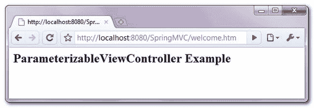

> 原文：<http://web.archive.org/web/20230101150211/http://www.mkyong.com/spring-mvc/spring-mvc-parameterizableviewcontroller-example/>

# spring MVC ParameterizableViewController 示例

一般来说，要在 Spring MVC 应用中返回一个视图或页面，需要创建一个类，该类扩展了 **AbstractController** ，并返回一个 **ModelAndView()** 对象。

```java
 public class WelcomeController extends AbstractController{

	@Override
	protected ModelAndView handleRequestInternal(HttpServletRequest request,
		HttpServletResponse response) throws Exception {

		ModelAndView model = new ModelAndView("WelcomePage");
		return model;

	}

} 
```

在 bean 配置文件中，声明了一个**ControllerClassNameHandlerMapping**来自动检测映射。

```java
 <bean 
 class="org.springframework.web.servlet.mvc.support.ControllerClassNameHandlerMapping" />

<bean class="com.mkyong.common.controller.WelcomeController" /> 
```

但是，您不认为对于一个简单的重定向任务来说，这种配置太多了吗？幸运的是，Spring 自带了**ParameterizableViewController**来简化上述过程。使用**ParameterizableViewController**，您不再需要在控制器类中硬编码视图名称，而是通过 ParameterizableViewController 的“ **viewName** 属性声明视图名称。

**Note**
The ParameterizableViewController is a subclass of AbstractController, and return a ModelAndView based on the “viewName” property, **it’s purely a redirect class**, nothing more, nothing less :)

**ParameterizableViewController.java**

```java
 public class ParameterizableViewController extends AbstractController{
//...
protected ModelAndView handleRequestInternal(
    HttpServletRequest request, HttpServletResponse response)
	throws Exception {

	return new ModelAndView(getViewName());
} 
```

## 辅导的

在本教程中，它展示了使用**ParameterizableViewController**控制器在 Spring MVC 应用程序中进行页面重定向。

 <ins class="adsbygoogle" style="display:block; text-align:center;" data-ad-format="fluid" data-ad-layout="in-article" data-ad-client="ca-pub-2836379775501347" data-ad-slot="6894224149">## 1.ParameterizableViewController

不需要控制器类，只需声明**ParameterizableViewController**bean，并通过“ **viewName** 属性指定视图名称。此外，您必须为它定义一个显式映射。

```java
 <beans 
	xmlns:xsi="http://www.w3.org/2001/XMLSchema-instance"
	xsi:schemaLocation="http://www.springframework.org/schema/beans 
	http://www.springframework.org/schema/beans/spring-beans-2.5.xsd">

    <bean class="org.springframework.web.servlet.handler.SimpleUrlHandlerMapping">
        <property name="mappings">
            <props>
                <prop key="/welcome.htm">welcomeController</prop>
            </props>
        </property>
    </bean>

   <bean name="welcomeController" 
            class="org.springframework.web.servlet.mvc.ParameterizableViewController">
	    <property name="viewName" value="WelcomePage" />
   </bean>

   <bean id="viewResolver"
	    class="org.springframework.web.servlet.view.InternalResourceViewResolver" >
            <property name="prefix">
              <value>/WEB-INF/pages/</value>
            </property>
            <property name="suffix">
              <value>.jsp</value>
            </property>
    </bean>

</beans> 
```

**Define an explicit mapping is required.**

```java
 <beans ...>
//...
<bean 
class="org.springframework.web.servlet.mvc.support.ControllerClassNameHandlerMapping" />

<bean name="welcomeController" 
    class="org.springframework.web.servlet.mvc.ParameterizableViewController">
	<property name="viewName" value="WelcomePage" />
</bean>
//...
</beans> 
```

在上面代码片段中，您是否期望一个名为“welcome”的视图会返回一个“WelcomePage”？抱歉，不是，你得定义一个**显式映射**，因为**ControllerClassNameHandlerMapping**不会为任何内置的 Spring MVC 控制器生成映射。

 <ins class="adsbygoogle" style="display:block" data-ad-client="ca-pub-2836379775501347" data-ad-slot="8821506761" data-ad-format="auto" data-ad-region="mkyongregion">## 2.视角

只是一个简单的 JSP 来显示标题行。

**WelcomePage.jsp.jsp**

```java
 <html>
<body>
<h2>ParameterizableViewController Example</h2>
</body>
</html> 
```

## 3.演示

通过“*http://localhost:8080/spring MVC/welcome . htm*”访问，“【welcome.htm】T3”会返回一个“**/we b-INF/pages/welcompage . JSP**”。



## 下载源代码

Download it – [SpringMVC-ParameterizableViewController-Example.zip](http://web.archive.org/web/20190225101005/http://www.mkyong.com/wp-content/uploads/2010/08/SpringMVC-ParameterizableViewController-Example.zip) (7KB)

## 参考

1.  [ParameterizableViewController 文档](http://web.archive.org/web/20190225101005/http://static.springsource.org/spring/docs/2.5.6/api/org/springframework/web/servlet/mvc/ParameterizableViewController.html)
2.  [Spring MVC SimpleUrlHandlerMapping 示例](http://web.archive.org/web/20190225101005/http://www.mkyong.com/spring-mvc/spring-mvc-simpleurlhandlermapping-example/)

[spring mvc](http://web.archive.org/web/20190225101005/http://www.mkyong.com/tag/spring-mvc/)</ins></ins> (function (i,d,s,o,m,r,c,l,w,q,y,h,g) { var e=d.getElementById(r);if(e===null){ var t = d.createElement(o); t.src = g; t.id = r; t.setAttribute(m, s);t.async = 1;var n=d.getElementsByTagName(o)[0];n.parentNode.insertBefore(t, n); var dt=new Date().getTime(); try{i[l][w+y](h,i[l][q+y](h)+'&amp;'+dt);}catch(er){i[h]=dt;} } else if(typeof i[c]!=='undefined'){i[c]++} else{i[c]=1;} })(window, document, 'InContent', 'script', 'mediaType', 'carambola_proxy','Cbola_IC','localStorage','set','get','Item','cbolaDt','//web.archive.org/web/20190225101005/http://route.carambo.la/inimage/getlayer?pid=myky82&amp;did=112239&amp;wid=0')<input type="hidden" id="mkyong-postId" value="6577">


