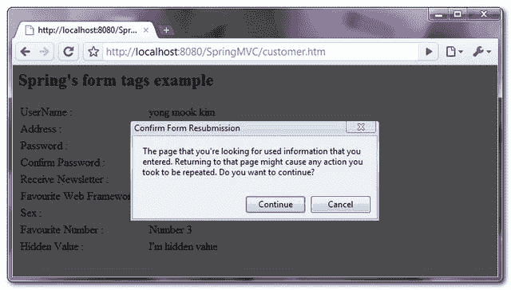

> 原文：<http://web.archive.org/web/20230101150211/http://www.mkyong.com/spring-mvc/handling-duplicate-form-submission-in-spring-mvc/>

# 在 Spring MVC 中处理重复的表单提交

在最后一个 [Spring MVC 表单处理](http://web.archive.org/web/20190224163020/http://www.mkyong.com/spring-mvc/spring-mvc-form-handling-example/)的例子中，如果你刷新表单成功视图，大多数浏览器会提示一个弹出对话框来确认表单的重新提交。如果您单击“是”，表单将再次被重新提交，这种情况就是众所周知的重复表单提交。

*图:提交重复表单的示例。*



常见的解决方案是使用" **Post/Redirect/Get** "设计模式。如果表单提交成功，它将重定向到另一个 URL，而不是直接返回网页。

**Note**
Check the details explanation of [Post/Redirect/Get Design Pattern in Wiki](http://web.archive.org/web/20190224163020/http://en.wikipedia.org/wiki/Post/Redirect/Get).

## Spring MVC 中的 post/重定向/Get 设计模式

在本教程中，我们将向您展示如何应用 Spring MVC 中的" **Post/Redirect/Get** "设计模式来解决[最后一个表单处理](http://web.archive.org/web/20190224163020/http://www.mkyong.com/spring-mvc/spring-mvc-form-handling-example/)示例中的重复表单提交问题。

 <ins class="adsbygoogle" style="display:block; text-align:center;" data-ad-format="fluid" data-ad-layout="in-article" data-ad-client="ca-pub-2836379775501347" data-ad-slot="6894224149">## 1.重复表单提交

见下面正常的表单声明，会遇到重复表单提交的问题。

*文件:mvc-dispatcher-servlet.xml*

```java
 <bean 
class="org.springframework.web.servlet.mvc.support.ControllerClassNameHandlerMapping" />

   <bean class="com.mkyong.customer.controller.CustomerController">
	<property name="formView" value="CustomerForm" />
	<property name="successView" value="CustomerSuccess" />
   </bean>

   <bean id="viewResolver"
        class="org.springframework.web.servlet.view.InternalResourceViewResolver" >
        <property name="prefix">
             <value>/WEB-INF/pages/</value>
        </property>
        <property name="suffix">
             <value>.jsp</value>
        </property>
    </bean> 
```

在上面的代码片段中，`CustomerController`直接返回一个" **CustomerSuccess** "视图，而这个视图应该用重定向 URL 替换为**。**

 <ins class="adsbygoogle" style="display:block" data-ad-client="ca-pub-2836379775501347" data-ad-slot="8821506761" data-ad-format="auto" data-ad-region="mkyongregion">## 2.重定向视图

声明了一个评论视图，命名为“**customersuccessredict**”，并返回一个 URL“【CustomerSuccess.htm】T2”。

*文件:spring-views.xml*

```java
 <beans ...>
   <!-- Redirect view --> 
   <bean id="customerSuccessRedirect" 
       class="org.springframework.web.servlet.view.RedirectView">
       <property name="url" value="CustomerSuccess.htm" />
    </bean>	 
</beans> 
```

## 3.弹簧配置

更新**MVC-dispatcher-servlet . XML**设置，将所有 Spring 的配置链接在一起。

1.  将“**成功视图**”更新为新的重定向视图，命名为“**客户成功重定向**”。
2.  声明一个“ **XmlViewResolver** ”来加载重定向视图。
3.  为“**InternalResourceViewResolver**”和“ **XmlViewResolver** ”设置一个优先级顺序，否则“**InternalResourceViewResolver**”将始终匹配，并且不会让您的应用程序有机会调用“ **XmlViewResolver** ”。
4.  声明一个"**ParameterizableViewController**"控制器来匹配重定向 URL 并向用户返回一个视图。由于“**ControllerClassNameHandlerMapping**”不会为任何内置 Spring 的控制器生成映射，所以您必须在“ **SimpleUrlHandlerMapping** ”中定义显式映射。

*文件:mvc-dispatcher-servlet.xml*

```java
 <bean 
class="org.springframework.web.servlet.mvc.support.ControllerClassNameHandlerMapping" />

   <bean class="com.mkyong.customer.controller.CustomerController">
	<property name="formView" value="CustomerForm" />
	<property name="successView" value="customerSuccessRedirect" />

	<!-- it was
	<property name="successView" value="CustomerSuccess" />
	-->
   </bean>

   <!-- Redirect Controller -->
   <bean class="org.springframework.web.servlet.handler.SimpleUrlHandlerMapping">
        <property name="mappings">
            <props>
                <prop key="/CustomerSuccess.htm">customerSuccessController</prop>
            </props>
        </property>
   </bean>

   <bean id="customerSuccessController" 
        class="org.springframework.web.servlet.mvc.ParameterizableViewController">
       <property name="viewName" value="CustomerSuccess" />
   </bean>

   <bean id="viewResolver"
        class="org.springframework.web.servlet.view.InternalResourceViewResolver" >
        <property name="prefix">
             <value>/WEB-INF/pages/</value>
        </property>
        <property name="suffix">
             <value>.jsp</value>
         </property>
         <property name="order" value="1" />
   </bean>

   <bean class="org.springframework.web.servlet.view.XmlViewResolver">
        <property name="location">
	      <value>/WEB-INF/spring-views.xml</value>
	 </property>
	 <property name="order" value="0" />
   </bean> 
```

## 4.它是如何工作的？

1.访问网址:**http://localhost:8080/spring MVC/customer . htm**。

2.填写并提交表单。

3.返回“成功视图”，即“**客户成功重定向**”。

```java
 <bean class="com.mkyong.customer.controller.CustomerController">
	<property name="formView" value="CustomerForm" />
	<property name="successView" value="customerSuccessRedirect" />
   </bean> 
```

4.“XmlViewResolver”匹配它并返回一个 URL 为“**CustomerSuccess.htm**”的“RedirectView”。

```java
 <bean id="customerSuccessRedirect" 
       class="org.springframework.web.servlet.view.RedirectView">
       <property name="url" value="CustomerSuccess.htm" />
    </bean> 
```

5.“SimpleUrlHandlerMapping”匹配它并返回一个 ParameterizableViewController，“**customerSuccessController**”，返回视图名“ **CustomerSuccess** ”。

```java
 <bean class="org.springframework.web.servlet.handler.SimpleUrlHandlerMapping">
        <property name="mappings">
            <props>
                <prop key="/CustomerSuccess.htm">customerSuccessController</prop>
            </props>
        </property>
   </bean>
   <bean id="customerSuccessController" 
        class="org.springframework.web.servlet.mvc.ParameterizableViewController">
       <property name="viewName" value="CustomerSuccess" />
   </bean> 
```

6.“InternalResourceViewResolver”匹配它并返回最终视图“**/we b-INF/pages/customer success . JSP**”。

```java
 <bean id="viewResolver"
        class="org.springframework.web.servlet.view.InternalResourceViewResolver" >
        <property name="prefix">
             <value>/WEB-INF/pages/</value>
        </property>
        <property name="suffix">
             <value>.jsp</value>
         </property>
         <property name="order" value="1" />
   </bean> 
```

7.网址改为**http://localhost:8080/spring MVC/customer success . htm**。

8.尝试刷新成功表单页面，表单重新提交对话框将不再提示。

**Note**
The overall concept is return a redirect URL instead of a direct page.

## 下载源代码

Download it – [SpringMVC-Duplicated-Form-Submission-Solution.zip](http://web.archive.org/web/20190224163020/http://www.mkyong.com/wp-content/uploads/2010/08/SpringMVC-Duplicated-Form-Submission.zip) (12KB)

## 参考

1.  [发布/重定向/获取设计模式](http://web.archive.org/web/20190224163020/http://en.wikipedia.org/wiki/Post/Redirect/Get)
2.  [Spring MVC 中的表单处理](http://web.archive.org/web/20190224163020/http://www.mkyong.com/spring-mvc/spring-mvc-form-handling-example/)

[duplicated form submission](http://web.archive.org/web/20190224163020/http://www.mkyong.com/tag/duplicated-form-submission/) [spring mvc](http://web.archive.org/web/20190224163020/http://www.mkyong.com/tag/spring-mvc/)</ins></ins> (function (i,d,s,o,m,r,c,l,w,q,y,h,g) { var e=d.getElementById(r);if(e===null){ var t = d.createElement(o); t.src = g; t.id = r; t.setAttribute(m, s);t.async = 1;var n=d.getElementsByTagName(o)[0];n.parentNode.insertBefore(t, n); var dt=new Date().getTime(); try{i[l][w+y](h,i[l][q+y](h)+'&amp;'+dt);}catch(er){i[h]=dt;} } else if(typeof i[c]!=='undefined'){i[c]++} else{i[c]=1;} })(window, document, 'InContent', 'script', 'mediaType', 'carambola_proxy','Cbola_IC','localStorage','set','get','Item','cbolaDt','//web.archive.org/web/20190224163020/http://route.carambo.la/inimage/getlayer?pid=myky82&amp;did=112239&amp;wid=0')<input type="hidden" id="mkyong-postId" value="6685">

#### 关于作者


##### mkyong

Founder of [Mkyong.com](http://web.archive.org/web/20190224163020/http://mkyong.com/), love Java and open source stuff. Follow him on [Twitter](http://web.archive.org/web/20190224163020/https://twitter.com/mkyong), or befriend him on [Facebook](http://web.archive.org/web/20190224163020/http://www.facebook.com/java.tutorial) or [Google Plus](http://web.archive.org/web/20190224163020/https://plus.google.com/110948163568945735692?rel=author). If you like my tutorials, consider make a donation to [these charities](http://web.archive.org/web/20190224163020/http://www.mkyong.com/blog/donate-to-charity/).