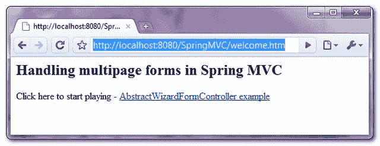
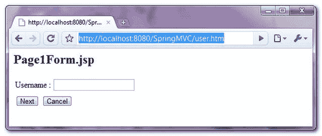
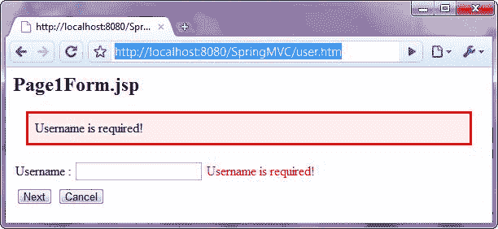
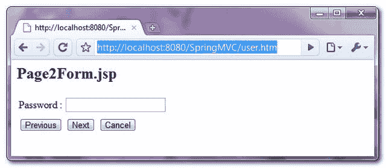
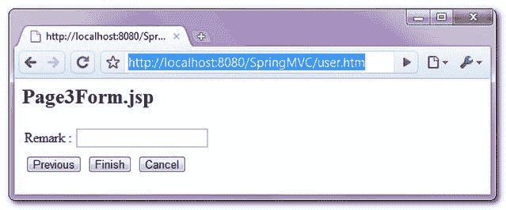
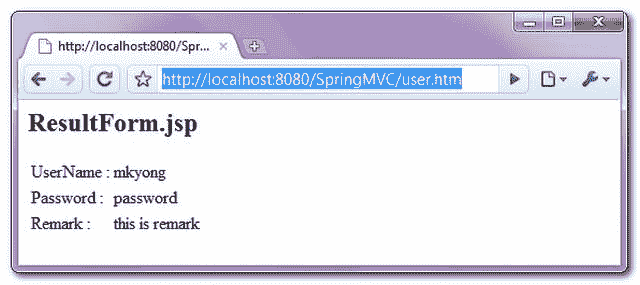

# 用 AbstractWizardFormController 处理多页表单

> 原文：<http://web.archive.org/web/20230101150211/http://www.mkyong.com/spring-mvc/spring-mvc-handling-multipage-forms-with-abstractwizardformcontroller/>

在上一个 [Spring MVC 表单处理示例](http://web.archive.org/web/20210507045915/http://www.mkyong.com/spring-mvc/spring-mvc-form-handling-example/)中，我们将向您介绍如何使用 **SimpleFormController** 来处理单页表单提交，这非常简单明了。

但是，有时，您可能需要处理"**向导表单**，这需要将表单处理成多页，并要求用户逐页填写表单。在这种向导表单情况下，主要关心的是如何存储模型数据(由用户填写的数据)并将其带到多个页面上？

## SAbstractWizardFormController

幸运的是，Spring MVC 自带了**AbstractWizardFormController**类来轻松处理这个向导表单。在本教程中，我们将向您展示如何使用**AbstractWizardFormController**类来跨多个页面存储和携带表单数据，应用验证并在最后一页显示表单数据。

## 1.向导表单页面

本演示共 5 页，按以下顺序进行:

```java
 [User] --> WelcomePage --> Page1 --> Page2 --> Page3 --> ResultPage 
```

使用**AbstractWizardFormController**，页面顺序由提交按钮的“名称”决定:

1.  _finish:完成向导表单。
2.  _cancel:取消向导表单。
3.  _targetx:移动到目标页面，其中 x 是从零开始的页面索引。例如 **_target0** 、 **_target1** 等。

*1。WelcomePage.jsp*
一个欢迎页面，带有一个超链接来启动向导表单过程。

```java
 <html>
<body>
	<h2>Handling multipage forms in Spring MVC</h2>
	Click here to start playing -
	<a href="user.htm">AbstractWizardFormController example</a>
</body>
</html> 
```

*2。Page1Form.jsp*
第 1 页，有一个“用户名”文本框，显示错误信息(如果有的话)，并包含 2 个提交按钮，其中:

1.  _ target 1–移至第 2 页。
2.  _ cancel–取消向导表单流程，并将其移至取消页面

```java
 <%@ taglib prefix="form" uri="http://www.springframework.org/tags/form"%>
<html>
<head>
<style>
.error {
	color: #ff0000;
}

.errorblock {
	color: #000;
	background-color: #ffEEEE;
	border: 3px solid #ff0000;
	padding: 8px;
	margin: 16px;
}
</style>
</head>

<body>
	<h2>Page1Form.jsp</h2>

	<form:form method="POST" commandName="userForm">
		<form:errors path="*" cssClass="errorblock" element="div" />
		<table>
			<tr>
				<td>Username :</td>
				<td><form:input path="userName" />
				</td>
				<td><form:errors path="userName" cssClass="error" />
				</td>
			</tr>
			<tr>
			<tr>
				<td colspan="3"><input type="submit" value="Next"
					name="_target1" /> <input type="submit" value="Cancel"
					name="_cancel" /></td>
			</tr>
		</table>
	</form:form>

</body>
</html> 
```

*3。Page2Form.jsp*
第 2 页，有一个“密码”字段，显示错误信息(如果有的话)，并包含 3 个提交按钮，其中:

1.  _ target 0–移至第 1 页。
2.  _ target 2–移至第 3 页。
3.  _ cancel–取消向导表单流程，并将其移至取消页面

```java
 <%@ taglib prefix="form" uri="http://www.springframework.org/tags/form"%>
<html>
<head>
<style>
.error {
	color: #ff0000;
}

.errorblock {
	color: #000;
	background-color: #ffEEEE;
	border: 3px solid #ff0000;
	padding: 8px;
	margin: 16px;
}
</style>
</head>

<body>
	<h2>Page2Form.jsp</h2>

	<form:form method="POST" commandName="userForm">
		<form:errors path="*" cssClass="errorblock" element="div" />
		<table>
			<tr>
				<td>Password :</td>
				<td><form:password path="password" />
				</td>
				<td><form:errors path="password" cssClass="error" />
				</td>
			</tr>
			<tr>
			<tr>
				<td colspan="3"><input type="submit" value="Previous"
					name="_target0" /> <input type="submit" value="Next"
					name="_target2" /> <input type="submit" value="Cancel"
					name="_cancel" /></td>
			</tr>
		</table>
	</form:form>

</body>
</html> 
```

*4。Page3Form.jsp*
第 3 页，有一个“备注”文本框，显示错误信息(如果有)，并包含 3 个提交按钮，其中:

1.  _ target 1–移至第 2 页。
2.  _ finish–完成向导表单流程，并将其移至完成页面。
3.  _ cancel–取消向导表单流程，并将其移至取消页面。

```java
 <%@ taglib prefix="form" uri="http://www.springframework.org/tags/form"%>
<html>
<head>
<style>
.error {
	color: #ff0000;
}

.errorblock {
	color: #000;
	background-color: #ffEEEE;
	border: 3px solid #ff0000;
	padding: 8px;
	margin: 16px;
}
</style>
</head>

<body>
	<h2>Page3Form.jsp</h2>

	<form:form method="POST" commandName="userForm">
		<form:errors path="*" cssClass="errorblock" element="div" />
		<table>
			<tr>
				<td>Remark :</td>
				<td><form:input path="remark" />
				</td>
				<td><form:errors path="remark" cssClass="error" />
				</td>
			</tr>
			<tr>
			<tr>
				<td colspan="3"><input type="submit" value="Previous"
					name="_target1" /> <input type="submit" value="Finish"
					name="_finish" /> <input type="submit" value="Cancel"
					name="_cancel" /></td>
			</tr>
		</table>
	</form:form>

</body>
</html> 
```

*5。ResultForm.jsp*
显示前 3 页收集的所有表单数据。

```java
 <html>
<body>
	<h2>ResultForm.jsp</h2>

	<table>
		<tr>
			<td>UserName :</td>
			<td>${user.userName}</td>
		</tr>
		<tr>
			<td>Password :</td>
			<td>${user.password}</td>
		</tr>
		<tr>
			<td>Remark :</td>
			<td>${user.remark}</td>
		</tr>
	</table>

</body>
</html> 
```

## 2.模型

创建一个模型类来存储表单数据。

*文件:User.java*

```java
 package com.mkyong.common.model;

public class User{

	String userName;
	String password;
	String remark;

	//getter and setter methods
} 
```

## 3.AbstractWizardFormController

扩展**AbstractWizardFormController**，只需覆盖以下方法

1.  **process finish**–当用户点击名为 **_finish** 的提交按钮时触发。
2.  **process cancel**–当用户点击名为 **_cancel** 的提交按钮时触发。
3.  **formBackingObject**–使用“User”模型类将所有表单数据存储在多个页面中。

*文件:UserController.java*

```java
 package com.mkyong.common.controller;

import javax.servlet.http.HttpServletRequest;
import javax.servlet.http.HttpServletResponse;
import org.springframework.validation.BindException;
import org.springframework.validation.Errors;
import org.springframework.web.servlet.ModelAndView;
import org.springframework.web.servlet.mvc.AbstractWizardFormController;
import com.mkyong.common.model.User;
import com.mkyong.common.validator.UserValidator;

public class UserController extends AbstractWizardFormController{

	public UserController(){
		setCommandName("userForm");
	}

	@Override
	protected Object formBackingObject(HttpServletRequest request)
		throws Exception {

		return new User();
	}
	@Override
	protected ModelAndView processFinish(HttpServletRequest request,
		HttpServletResponse response, Object command, BindException errors)
		throws Exception {

		//Get the data from command object
		User user = (User)command;
		System.out.println(user);

		//where is the finish page?
		return new ModelAndView("ResultForm", "user", user);
	}

	@Override
	protected ModelAndView processCancel(HttpServletRequest request,
		HttpServletResponse response, Object command, BindException errors)
		throws Exception {

		//where is the cancel page?
		return new ModelAndView("WelcomePage");
	}
} 
```

一个简单的控制器返回一个" **WelcomePage** "视图。

*文件:WelcomeController.java*

```java
 package com.mkyong.common.controller;

import javax.servlet.http.HttpServletRequest;
import javax.servlet.http.HttpServletResponse;

import org.springframework.web.servlet.ModelAndView;
import org.springframework.web.servlet.mvc.AbstractController;

public class WelcomeController extends AbstractController{

	@Override
	protected ModelAndView handleRequestInternal(HttpServletRequest request,
		HttpServletResponse response) throws Exception {

		return new ModelAndView("WelcomePage");
	}

} 
```

## 4.多页/向导表单验证

在`SimpleFormController`中，创建一个验证器类，将所有的验证逻辑放在 **validate()** 方法中，并将验证器装饰性地注册到简单表单控制器中。

但是，在**AbstractWizardFormController**中有点不同。首先，创建一个验证器类，以及每个页面的验证方法，如下所示:

*文件:UserValidator.java*

```java
 package com.mkyong.common.validator;

import org.springframework.validation.Errors;
import org.springframework.validation.ValidationUtils;
import org.springframework.validation.Validator;
import com.mkyong.common.model.User;

public class UserValidator implements Validator{

	@Override
	public boolean supports(Class clazz) {
		//just validate the User instances
		return User.class.isAssignableFrom(clazz);
	}

	//validate page 1, userName
	public void validatePage1Form(Object target, Errors errors) {
		ValidationUtils.rejectIfEmptyOrWhitespace(errors, "userName",
		        "required.userName", "Field name is required.");
	}

	//validate page 2, password
	public void validatePage2Form(Object target, Errors errors) {
		ValidationUtils.rejectIfEmptyOrWhitespace(errors, "password",
			"required.password", "Field name is required.");
	}

	//validate page 3, remark
	public void validatePage3Form(Object target, Errors errors) {
		ValidationUtils.rejectIfEmptyOrWhitespace(errors, "remark",
			"required.remark", "Field name is required.");
	}

	@Override
	public void validate(Object target, Errors errors) {
		validatePage1Form(target, errors);
		validatePage2Form(target, errors);
		validatePage3Form(target, errors);
	}
} 
```

*File:user . Properties*–存储错误消息的属性

```java
 required.userName = Username is required!
required.password = Password is required!
required.remark = Remark is required! 
```

并且，在向导表单控制器(`UserController.java`)中，通过手动调用验证器来覆盖 **validatePage()** (不再有像简单表单控制器那样的声明)。

见**UserController.java**的更新版本。

```java
 public class UserController extends AbstractWizardFormController{
	//other methods, see above

	@Override
	protected void validatePage(Object command, Errors errors, int page) {

		UserValidator validator = (UserValidator) getValidator();

		//page is 0-indexed
		switch (page) {
		   case 0: //if page 1 , go validate with validatePage1Form
			validator.validatePage1Form(command, errors);
			break;
		   case 1: //if page 2 , go validate with validatePage2Form
			validator.validatePage2Form(command, errors);
			break;
		   case 2: //if page 3 , go validate with validatePage3Form
			validator.validatePage3Form(command, errors);
			break;
		}
	}
} 
```

在 **validatePage()** 方法中，使用一个“**开关**函数来确定哪个页面正在调用，并将其与相应的验证器相关联。该页面的索引为 0。

## 5.弹簧配置

声明向导表单控制器(`UserController.java`)，按正确的顺序排列所有页面，并注册一个验证器。

```java
 <bean class="com.mkyong.common.controller.UserController" >
    	   <property name="pages">
		<list>
		<!-- follow sequence -->
		<value>Page1Form</value> <!-- page1, _target0 -->
		<value>Page2Form</value> <!-- page2, _target1 -->
		<value>Page3Form</value> <!-- page3, _target2 -->
		</list>
	   </property>
	   <property name="validator">
		<bean class="com.mkyong.common.validator.UserValidator" />
	   </property>
       </bean> 
```

**Note**
In the “pages” property, the order of the list value is used to define the sequence of the page in the wizard form.

查看完整示例:

```java
 <beans 
	xmlns:xsi="http://www.w3.org/2001/XMLSchema-instance"
	xsi:schemaLocation="http://www.springframework.org/schema/beans 
	http://www.springframework.org/schema/beans/spring-beans-2.5.xsd">

 <bean 
  class="org.springframework.web.servlet.mvc.support.ControllerClassNameHandlerMapping" />

    <bean class="com.mkyong.common.controller.WelcomeController" />  
    <bean class="com.mkyong.common.controller.UserController" >
    	<property name="pages">
	   <list>
		<!-- follow sequence -->
		<value>Page1Form</value> <!-- page1 -->
		<value>Page2Form</value> <!-- page2 -->
		<value>Page3Form</value> <!-- page3 -->
	   </list>
	   </property>
	   <property name="validator">
		<bean class="com.mkyong.common.validator.UserValidator" />
	   </property>
      </bean>

      <!-- Register User.properties for validation error message -->
      <bean id="messageSource"
           class="org.springframework.context.support.ResourceBundleMessageSource">
	   <property name="basename" value="User" />
      </bean>

      <bean id="viewResolver"
           class="org.springframework.web.servlet.view.InternalResourceViewResolver" >
           <property name="prefix">
                <value>/WEB-INF/pages/</value>
           </property>
           <property name="suffix">
                <value>.jsp</value>
           </property>
       </bean>
</beans> 
```

## 5.演示

网址:**http://localhost:8080/spring MVC/welcome . htm**

**1。WelcomePage.jsp**，点击链接，移动到 Page1Form.jsp**。**



**2。Page1Form.jsp**，包含一个“用户名”文本框和两个按钮:

1.  “下一步”按钮–移动到 Page2Form.jsp。
2.  “取消”按钮–移至 WelcomePage.jsp



如果提交表单时“用户名”为空，则显示错误消息。



**3。Page2Form.jsp**，包含一个“密码”字段和 3 个按钮:

1.  “上一页”按钮–移至 Page1Form.jsp。
2.  “下一步”按钮–移动到 Page3Form.jsp。
3.  “取消”按钮–移至 WelcomePage.jsp。



**4。Page3Form.jsp**，包含一个“备注”文本框和 3 个按钮:

1.  “上一页”按钮–移至 Page2Form.jsp。
2.  “完成”按钮–移动到 ResultForm.jsp。
3.  “取消”按钮–移至 WelcomePage.jsp。



**5。ResultForm.jsp**，显示所有表单的数据。



## 下载源代码

Download it – [SpringMVC-MultiPage-Form-Handling-Example.zip](http://web.archive.org/web/20210507045915/http://www.mkyong.com/wp-content/uploads/2010/08/SpringMVC-MultiPage-Form-Handling-Example.zip) (12KB)

## 参考

1.  [AbstractWizardFormController Javadoc](http://web.archive.org/web/20210507045915/http://static.springsource.org/spring/docs/2.5.x/api/org/springframework/web/portlet/mvc/AbstractWizardFormController.html)
2.  [Spring MVC 表单处理示例](http://web.archive.org/web/20210507045915/http://www.mkyong.com/spring-mvc/spring-mvc-form-handling-example/)

Tags : [spring mvc](http://web.archive.org/web/20210507045915/https://mkyong.com/tag/spring-mvc/)<input type="hidden" id="mkyong-current-postId" value="6710">