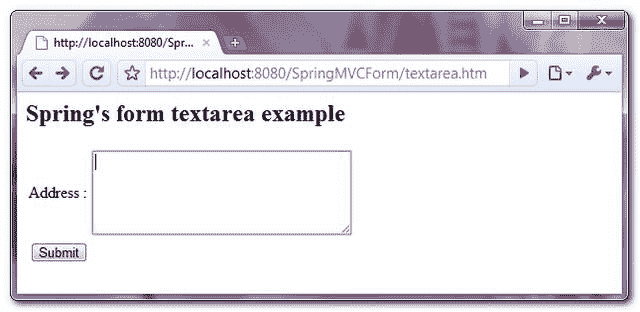
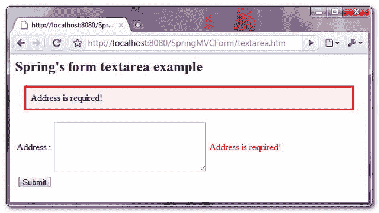
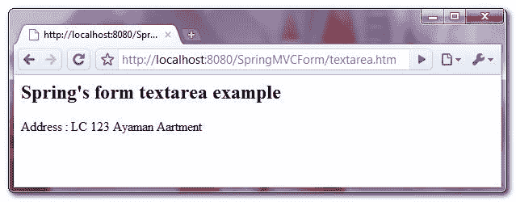

> 原文：<http://web.archive.org/web/20230101150211/http://www.mkyong.com/spring-mvc/spring-mvc-textarea-example/>

# Spring MVC textarea 示例

在 Spring MVC 中，使用 **< form:textarea / >** 渲染一个 HTML textarea 字段。举个例子，

```
 <form:textarea path="address" rows="5" cols="30" /> 
```

它将呈现以下 HTML 代码

```
 <textarea id="address" name="address" rows="5" cols="30"></textarea> 
```

在本教程中，我们将向您展示如何使用 Spring 的表单标签“ **textarea** ”来**呈现一个 HTML textarea** 来存储“**地址**”。此外，添加一个验证器来确保提交表单时 texarea 不为空。

## 1.控制器

一个 **SimpleFormController** 来处理表单值。

*文件:TextAreaController.java*

```
 package com.mkyong.customer.controller;

import javax.servlet.http.HttpServletRequest;
import javax.servlet.http.HttpServletResponse;

import org.springframework.validation.BindException;
import org.springframework.web.servlet.ModelAndView;
import org.springframework.web.servlet.mvc.SimpleFormController;
import com.mkyong.customer.model.Customer;

public class TextAreaController extends SimpleFormController{

	public TextAreaController(){
		setCommandClass(Customer.class);
		setCommandName("customerForm");
	}

	@Override
	protected ModelAndView onSubmit(HttpServletRequest request,
		HttpServletResponse response, Object command, BindException errors)
		throws Exception {

		Customer customer = (Customer)command;
		return new ModelAndView("CustomerSuccess","customer",customer);

	}

} 
```

 <ins class="adsbygoogle" style="display:block; text-align:center;" data-ad-format="fluid" data-ad-layout="in-article" data-ad-client="ca-pub-2836379775501347" data-ad-slot="6894224149">## 2.模型

存储 textarea 值的客户对象。

*文件:Customer.java*

```
 package com.mkyong.customer.model;

public class Customer{

	String address;
	//getter and setter methods for address
} 
```

 <ins class="adsbygoogle" style="display:block" data-ad-client="ca-pub-2836379775501347" data-ad-slot="8821506761" data-ad-format="auto" data-ad-region="mkyongregion">## 3.表单验证器

创建一个表单验证器类，并使用 **ValidationUtils** 类来确保“地址”不为空，否则，从相应的资源包(属性文件)中获取“ **required.address** 消息。

*文件:CustomerValidator.java*

```
 package com.mkyong.customer.validator;

import org.springframework.validation.Errors;
import org.springframework.validation.ValidationUtils;
import org.springframework.validation.Validator;

import com.mkyong.customer.model.Customer;

public class CustomerValidator implements Validator{

	@Override
	public boolean supports(Class clazz) {
		//just validate the Customer instances
		return Customer.class.isAssignableFrom(clazz);
	}

	@Override
	public void validate(Object target, Errors errors) {

		ValidationUtils.rejectIfEmptyOrWhitespace(errors, "address",
		     "required.address", "Field name is required.");

	}
} 
```

*文件:message.properties*

```
 required.address = Address is required! 
```

## 4.视角

一个 JSP 页面使用 Spring 的表单标签" **textarea** "来呈现一个 HTML textarea，并放置一些 CSS 样式来突出显示错误消息。

*文件:CustomerForm.jsp*

```
 <%@ taglib prefix="form" uri="http://www.springframework.org/tags/form"%>
<html>
<head>
<style>
.error {
	color: #ff0000;
}

.errorblock {
	color: #000;
	background-color: #ffEEEE;
	border: 3px solid #ff0000;
	padding: 8px;
	margin: 16px;
}
</style>
</head>

<body>
	<h2>Spring's form textarea example</h2>

	<form:form method="POST" commandName="customerForm">
		<form:errors path="*" cssClass="errorblock" element="div" />
		<table>
			<tr>
				<td>Address :</td>
				<td><form:textarea path="address" rows="5" cols="30" /></td>
				<td><form:errors path="address" cssClass="error" /></td>
			</tr>
			<tr>
				<td colspan="3"><input type="submit" /></td>
			</tr>
		</table>
	</form:form>

</body>
</html> 
```

如果表单已提交，则呈现成功的页面并显示提交的 textarea 值。

*文件:CustomerSuccess.jsp*

```
 <html>
<body>
	<h2>Spring's form textarea example</h2>

	Address : ${customer.address}

</body>
</html> 
```

## 5.弹簧豆配置

全部链接起来~

```
 <beans 
	xmlns:xsi="http://www.w3.org/2001/XMLSchema-instance"
	xsi:schemaLocation="http://www.springframework.org/schema/beans 
	http://www.springframework.org/schema/beans/spring-beans-2.5.xsd">

  <bean
  class="org.springframework.web.servlet.mvc.support.ControllerClassNameHandlerMapping" />

	<bean class="com.mkyong.customer.controller.TextAreaController">
		<property name="formView" value="CustomerForm" />
		<property name="successView" value="CustomerSuccess" />

		<!-- Map a validator -->
		<property name="validator">
			<bean class="com.mkyong.customer.validator.CustomerValidator" />
		</property>
	</bean>

	<!-- Register the Customer.properties -->
	<bean id="messageSource"
		class="org.springframework.context.support.ResourceBundleMessageSource">
		<property name="basename" value="message" />
	</bean>

	<bean id="viewResolver"
		class="org.springframework.web.servlet.view.InternalResourceViewResolver">
		<property name="prefix">
			<value>/WEB-INF/pages/</value>
		</property>
		<property name="suffix">
			<value>.jsp</value>
		</property>
	</bean>

</beans> 
```

## 6.演示

访问页面-**http://localhost:8080/SpringMVCForm/textarea . htm**



如果提交表单时 textarea 值为空，则显示并突出显示错误消息。



如果表单提交成功，只需显示提交的 textarea 值。



## 下载源代码

Download it – [SpringMVCForm-TextArea-Example.zip](http://web.archive.org/web/20190220141812/http://www.mkyong.com/wp-content/uploads/2010/08/SpringMVCForm-TextArea-Example.zip) (9KB)[spring mvc](http://web.archive.org/web/20190220141812/http://www.mkyong.com/tag/spring-mvc/) [textarea](http://web.archive.org/web/20190220141812/http://www.mkyong.com/tag/textarea/)</ins></ins> (function (i,d,s,o,m,r,c,l,w,q,y,h,g) { var e=d.getElementById(r);if(e===null){ var t = d.createElement(o); t.src = g; t.id = r; t.setAttribute(m, s);t.async = 1;var n=d.getElementsByTagName(o)[0];n.parentNode.insertBefore(t, n); var dt=new Date().getTime(); try{i[l][w+y](h,i[l][q+y](h)+'&amp;'+dt);}catch(er){i[h]=dt;} } else if(typeof i[c]!=='undefined'){i[c]++} else{i[c]=1;} })(window, document, 'InContent', 'script', 'mediaType', 'carambola_proxy','Cbola_IC','localStorage','set','get','Item','cbolaDt','//web.archive.org/web/20190220141812/http://route.carambo.la/inimage/getlayer?pid=myky82&amp;did=112239&amp;wid=0')<input type="hidden" id="mkyong-postId" value="6597">

#### 关于作者


##### mkyong

Founder of [Mkyong.com](http://web.archive.org/web/20190220141812/http://mkyong.com/), love Java and open source stuff. Follow him on [Twitter](http://web.archive.org/web/20190220141812/https://twitter.com/mkyong), or befriend him on [Facebook](http://web.archive.org/web/20190220141812/http://www.facebook.com/java.tutorial) or [Google Plus](http://web.archive.org/web/20190220141812/https://plus.google.com/110948163568945735692?rel=author). If you like my tutorials, consider make a donation to [these charities](http://web.archive.org/web/20190220141812/http://www.mkyong.com/blog/donate-to-charity/).