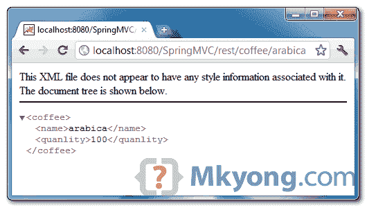

> 原文：<http://web.archive.org/web/20230101150211/http://www.mkyong.com/spring-mvc/spring-3-mvc-and-xml-example/>

# Spring 3 MVC 和 XML 示例

在 Spring 3 中，“ [mvc:annotation-driven](http://web.archive.org/web/20190214225812/http://static.springsource.org/spring/docs/3.0.x/spring-framework-reference/html/mvc.html#mvc-annotation-driven) ”的一个特性是支持将对象转换为 XML 文件，如果 JAXB 在项目类路径中的话。

在本教程中，我们将向您展示如何将返回对象转换为 XML 格式，并通过 Spring @MVC 框架将其返回给用户。

使用的技术:

1.  弹簧 3.0.5 释放
2.  JDK 1.6
3.  Eclipse 3.6
4.  maven3

**JAXB in JDK6**
JAXB is included in JDK6, so, you do not need to include JAXB library manually, as long as object is annotated with JAXB annotation, Spring will convert it into XML format automatically.

## 1.项目相关性

没有额外的依赖，你只需要在你的 Maven `pom.xml`中包含 Spring MVC。

```java
 <properties>
		<spring.version>3.0.5.RELEASE</spring.version>
	</properties>

	<dependencies>

		<!-- Spring 3 dependencies -->
		<dependency>
			<groupId>org.springframework</groupId>
			<artifactId>spring-core</artifactId>
			<version>${spring.version}</version>
		</dependency>

		<dependency>
			<groupId>org.springframework</groupId>
			<artifactId>spring-web</artifactId>
			<version>${spring.version}</version>
		</dependency>

		<dependency>
			<groupId>org.springframework</groupId>
			<artifactId>spring-webmvc</artifactId>
			<version>${spring.version}</version>
		</dependency>

	</dependencies> 
```

 <ins class="adsbygoogle" style="display:block; text-align:center;" data-ad-format="fluid" data-ad-layout="in-article" data-ad-client="ca-pub-2836379775501347" data-ad-slot="6894224149">## 2.模型+ JAXB

一个简单的 POJO 模型并用 **JAXB 注释**进行了注释，稍后将这个对象转换成 XML 输出。

```java
 package com.mkyong.common.model;

import javax.xml.bind.annotation.XmlElement;
import javax.xml.bind.annotation.XmlRootElement;

@XmlRootElement(name = "coffee")
public class Coffee {

	String name;
	int quanlity;

	public String getName() {
		return name;
	}

	@XmlElement
	public void setName(String name) {
		this.name = name;
	}

	public int getQuanlity() {
		return quanlity;
	}

	@XmlElement
	public void setQuanlity(int quanlity) {
		this.quanlity = quanlity;
	}

	public Coffee(String name, int quanlity) {
		this.name = name;
		this.quanlity = quanlity;
	}

	public Coffee() {
	}

} 
```

 <ins class="adsbygoogle" style="display:block" data-ad-client="ca-pub-2836379775501347" data-ad-slot="8821506761" data-ad-format="auto" data-ad-region="mkyongregion">## 3.控制器

在方法返回值中添加“**@ response body**”,[Spring 文档](http://web.archive.org/web/20190214225812/http://static.springsource.org/spring/docs/3.0.x/javadoc-api/org/springframework/web/bind/annotation/ResponseBody.html)中没有太多细节。

据我所知，当春天来临

1.  用 JAXB 注释的对象
2.  类路径中存在 JAXB 库
3.  启用“mvc:注释驱动”
4.  用@ResponseBody 批注的返回方法

它会自动处理转换。

```java
 package com.mkyong.common.controller;

import org.springframework.stereotype.Controller;
import org.springframework.web.bind.annotation.PathVariable;
import org.springframework.web.bind.annotation.RequestMapping;
import org.springframework.web.bind.annotation.RequestMethod;
import org.springframework.web.bind.annotation.ResponseBody;
import com.mkyong.common.model.Coffee;

@Controller
@RequestMapping("/coffee")
public class XMLController {

	@RequestMapping(value="{name}", method = RequestMethod.GET)
	public @ResponseBody Coffee getCoffeeInXML(@PathVariable String name) {

		Coffee coffee = new Coffee(name, 100);

		return coffee;

	}

} 
```

## 4.mvc:注释驱动

在您的一个 Spring 配置 XML 文件中，启用“`mvc:annotation-driven`”。

```java
 <beans 
	xmlns:context="http://www.springframework.org/schema/context"
	xmlns:mvc="http://www.springframework.org/schema/mvc" 
	xmlns:xsi="http://www.w3.org/2001/XMLSchema-instance"
	xsi:schemaLocation="
        http://www.springframework.org/schema/beans     
        http://www.springframework.org/schema/beans/spring-beans-3.0.xsd
        http://www.springframework.org/schema/context 
        http://www.springframework.org/schema/context/spring-context-3.0.xsd
        http://www.springframework.org/schema/mvc
        http://www.springframework.org/schema/mvc/spring-mvc-3.0.xsd">

	<context:component-scan base-package="com.mkyong.common.controller" />

	<mvc:annotation-driven />

</beans> 
```

**Note**
Alternatively, you can declares “**spring-oxm.jar**” dependency and include following `MarshallingView`, to handle the conversion. With this method, you don’t need annotate **@ResponseBody** in your method.

```java
 <beans ...>
	<bean class="org.springframework.web.servlet.view.BeanNameViewResolver" />

	<bean id="xmlViewer" 
		class="org.springframework.web.servlet.view.xml.MarshallingView">
		<constructor-arg>
		  <bean class="org.springframework.oxm.jaxb.Jaxb2Marshaller">
			<property name="classesToBeBound">
				<list>
					<value>com.mkyong.common.model.Coffee</value>
				</list>
			</property>
		  </bean>
		</constructor-arg>
	</bean>
</beans> 
```

## 5.演示

网址:*http://localhost:8080/spring MVC/rest/coffee/arabica*



## 下载源代码

Download it – [SpringMVC-XML-Example.zip](http://web.archive.org/web/20190214225812/http://www.mkyong.com/wp-content/uploads/2011/07/SpringMVC-XML-Example.zip) (7 KB)

## 参考

1.  [Spring MVC 和 Rss 示例](http://web.archive.org/web/20190214225812/http://www.mkyong.com/spring-mvc/spring-3-mvc-and-rss-feed-example/)
2.  [mvc 注释驱动的 JavaDoc](http://web.archive.org/web/20190214225812/http://static.springsource.org/spring/docs/3.0.x/spring-framework-reference/html/mvc.html#mvc-annotation-driven)
3.  [Jaxb2Marshaller JavaDoc](http://web.archive.org/web/20190214225812/http://static.springsource.org/spring-ws/sites/1.5/apidocs/org/springframework/oxm/jaxb/Jaxb2Marshaller.html)
4.  ResponseBody.html·哈瓦多克

[spring mvc](http://web.archive.org/web/20190214225812/http://www.mkyong.com/tag/spring-mvc/) [spring3](http://web.archive.org/web/20190214225812/http://www.mkyong.com/tag/spring3/) [xml](http://web.archive.org/web/20190214225812/http://www.mkyong.com/tag/xml/)</ins></ins> (function (i,d,s,o,m,r,c,l,w,q,y,h,g) { var e=d.getElementById(r);if(e===null){ var t = d.createElement(o); t.src = g; t.id = r; t.setAttribute(m, s);t.async = 1;var n=d.getElementsByTagName(o)[0];n.parentNode.insertBefore(t, n); var dt=new Date().getTime(); try{i[l][w+y](h,i[l][q+y](h)+'&amp;'+dt);}catch(er){i[h]=dt;} } else if(typeof i[c]!=='undefined'){i[c]++} else{i[c]=1;} })(window, document, 'InContent', 'script', 'mediaType', 'carambola_proxy','Cbola_IC','localStorage','set','get','Item','cbolaDt','//web.archive.org/web/20190214225812/http://route.carambo.la/inimage/getlayer?pid=myky82&amp;did=112239&amp;wid=0')<input type="hidden" id="mkyong-postId" value="9751">


