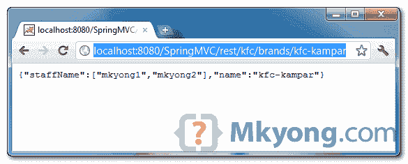

# Spring 3 MVC 和 JSON 示例

> 原文：<http://web.archive.org/web/20230101150211/http://www.mkyong.com/spring-mvc/spring-3-mvc-and-json-example/>

在本教程中，我们将向您展示如何在 Spring MVC 框架中输出 JSON 数据。

使用的技术:

1.  弹簧 3.2.2 释放
2.  杰克逊 1.9.10
3.  JDK 1.6
4.  Eclipse 3.6
5.  maven3

在 Spring 3 中，要输出 JSON 数据，只需将 [Jackson](http://web.archive.org/web/20220809101938/http://jackson.codehaus.org/) 库放在项目类路径中。

## 1.项目相关性

获得杰克逊和春天的依赖。

pom.xml

```
 <project  
        xmlns:xsi="http://www.w3.org/2001/XMLSchema-instance"
	xsi:schemaLocation="http://maven.apache.org/POM/4.0.0 
        http://maven.apache.org/maven-v4_0_0.xsd">
	<modelVersion>4.0.0</modelVersion>
	<groupId>com.mkyong.common</groupId>
	<artifactId>SpringMVC</artifactId>
	<packaging>war</packaging>
	<version>1.0-SNAPSHOT</version>
	<name>SpringMVC Json Webapp</name>
	<url>http://maven.apache.org</url>

	<properties>
		<spring.version>3.2.2.RELEASE</spring.version>
		<jackson.version>1.9.10</jackson.version>
		<jdk.version>1.6</jdk.version>
	</properties>

	<dependencies>

		<!-- Spring 3 dependencies -->
		<dependency>
			<groupId>org.springframework</groupId>
			<artifactId>spring-core</artifactId>
			<version>${spring.version}</version>
		</dependency>

		<dependency>
			<groupId>org.springframework</groupId>
			<artifactId>spring-web</artifactId>
			<version>${spring.version}</version>
		</dependency>

		<dependency>
			<groupId>org.springframework</groupId>
			<artifactId>spring-webmvc</artifactId>
			<version>${spring.version}</version>
		</dependency>

		<!-- Jackson JSON Mapper -->
		<dependency>
			<groupId>org.codehaus.jackson</groupId>
			<artifactId>jackson-mapper-asl</artifactId>
			<version>${jackson.version}</version>
		</dependency>

	</dependencies>

	<build>
		<finalName>SpringMVC</finalName>
		<plugins>
		  <plugin>
			<groupId>org.apache.maven.plugins</groupId>
			<artifactId>maven-eclipse-plugin</artifactId>
			<version>2.9</version>
			<configuration>
				<downloadSources>true</downloadSources>
				<downloadJavadocs>false</downloadJavadocs>
				<wtpversion>2.0</wtpversion>
			</configuration>
		  </plugin>
		  <plugin>
			<groupId>org.apache.maven.plugins</groupId>
			<artifactId>maven-compiler-plugin</artifactId>
			<version>2.3.2</version>
			<configuration>
				<source>${jdk.version}</source>
				<target>${jdk.version}</target>
			</configuration>
		  </plugin>
		</plugins>
	</build>

</project> 
```

## 2.模型

一个简单的 POJO，稍后将这个对象输出为格式化的 JSON 数据。

```
 package com.mkyong.common.model;

public class Shop {

	String name;
	String staffName[];

	//getter and setter methods

} 
```

## 3.控制器

添加`@ResponseBody`作为返回值。闻春见

1.  项目类路径中存在 Jackson 库
2.  `mvc:annotation-driven`被启用
3.  用@ResponseBody 批注的返回方法

Spring 会自动处理 JSON 转换。

JSONController.java

```
 package com.mkyong.common.controller;

import org.springframework.stereotype.Controller;
import org.springframework.web.bind.annotation.PathVariable;
import org.springframework.web.bind.annotation.RequestMapping;
import org.springframework.web.bind.annotation.RequestMethod;
import org.springframework.web.bind.annotation.ResponseBody;
import com.mkyong.common.model.Shop;

@Controller
@RequestMapping("/kfc/brands")
public class JSONController {

	@RequestMapping(value="{name}", method = RequestMethod.GET)
	public @ResponseBody Shop getShopInJSON(@PathVariable String name) {

		Shop shop = new Shop();
		shop.setName(name);
		shop.setStaffName(new String[]{"mkyong1", "mkyong2"});

		return shop;

	}

} 
```

## 4.mvc:注释驱动

在 Spring 配置 XML 文件中启用`mvc:annotation-driven`。

mvc-dispatcher-servlet.xml

```
 <beans 
	xmlns:context="http://www.springframework.org/schema/context"
	xmlns:mvc="http://www.springframework.org/schema/mvc" 
	xmlns:xsi="http://www.w3.org/2001/XMLSchema-instance"
	xsi:schemaLocation="
        http://www.springframework.org/schema/beans     
        http://www.springframework.org/schema/beans/spring-beans-3.0.xsd
        http://www.springframework.org/schema/context 
        http://www.springframework.org/schema/context/spring-context-3.0.xsd
        http://www.springframework.org/schema/mvc
        http://www.springframework.org/schema/mvc/spring-mvc-3.0.xsd">

	<context:component-scan base-package="com.mkyong.common.controller" />

	<mvc:annotation-driven />

</beans> 
```

## 5.演示

网址:*http://localhost:8080/spring MVC/rest/KFC/brands/KFC-kampar*



## 下载源代码

Download it – [SpringMVC-Json-Example.zip](http://web.archive.org/web/20220809101938/http://www.mkyong.com/wp-content/uploads/2011/07/SpringMVC-Json-Example.zip) (21 KB)

## 参考

1.  [mvc 注释驱动的文档](http://web.archive.org/web/20220809101938/http://static.springsource.org/spring/docs/3.0.x/spring-framework-reference/html/mvc.html#mvc-annotation-driven)
2.  [高性能 JSON 处理器](http://web.archive.org/web/20220809101938/http://jackson.codehaus.org/)
3.  [Spring MVC 和 XML 示例](http://web.archive.org/web/20220809101938/http://www.mkyong.com/spring-mvc/spring-3-mvc-and-xml-example/)

<input type="hidden" id="mkyong-current-postId" value="9757">