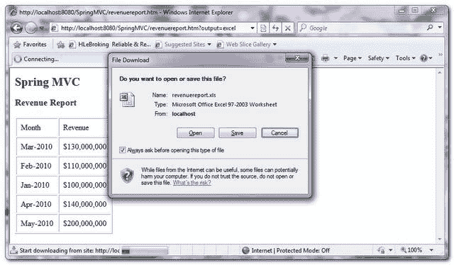

# 通过 AbstractJExcelView 弹出 MVC 和 Excel 文件

> 原文：<http://web.archive.org/web/20230101150211/http://www.mkyong.com/spring-mvc/spring-mvc-export-data-to-excel-file-via-abstractjexcelview/>

Spring MVC 自带 **AbstractJExcelView** 类，通过 **JExcelAPI** 库将数据导出到 Excel 文件。在本教程中，将展示如何在 Spring MVC 应用程序中使用 **AbstractJExcelView** 类将数据导出到 Excel 文件以供下载。

## 1.杰克斯拉皮

获取 [JExcelAPI 库](http://web.archive.org/web/20210110082325/http://jexcelapi.sourceforge.net/)。

```
 <!-- JExcelAPI library --> 
    <dependency>
	<groupId>net.sourceforge.jexcelapi</groupId>
	<artifactId>jxl</artifactId>
	<version>2.6.3</version>
    </dependency> 
```

## 2.控制器

一个控制器类，生成虚拟数据用于演示，并获取请求参数以确定返回哪个视图。如果请求参数等于“Excel”，则返回一个 EXCEL 视图( **AbstractJExcelView** )。

*文件:RevenueReportController.java*

```
 package com.mkyong.common.controller;

import java.util.HashMap;
import java.util.Map;
import javax.servlet.http.HttpServletRequest;
import javax.servlet.http.HttpServletResponse;
import org.springframework.web.bind.ServletRequestUtils;
import org.springframework.web.servlet.ModelAndView;
import org.springframework.web.servlet.mvc.AbstractController;

public class RevenueReportController extends AbstractController{

	@Override
	protected ModelAndView handleRequestInternal(HttpServletRequest request,
		HttpServletResponse response) throws Exception {

		String output =
			ServletRequestUtils.getStringParameter(request, "output");

		//dummy data
		Map<String,String> revenueData = new HashMap<String,String>();
		revenueData.put("Jan-2010", "$100,000,000");
		revenueData.put("Feb-2010", "$110,000,000");
		revenueData.put("Mar-2010", "$130,000,000");
		revenueData.put("Apr-2010", "$140,000,000");
		revenueData.put("May-2010", "$200,000,000");

		if(output ==null || "".equals(output)){
			//return normal view
			return new ModelAndView("RevenueSummary","revenueData",revenueData);

		}else if("EXCEL".equals(output.toUpperCase())){
			//return excel view
			return new ModelAndView("ExcelRevenueSummary","revenueData",revenueData);

		}else{
			//return normal view
			return new ModelAndView("RevenueSummary","revenueData",revenueData);

		}	
	}
} 
```

## 3.抽象视图

通过扩展 **AbstractJExcelView** 类创建一个 Excel 视图，并覆盖 **buildExcelDocument()** 方法将数据填充到 Excel 文件中。 **AbstractJExcelView** 正在使用 <string>JExcelAPI 创建 Excel 文件细节。</string>

**Note**
For detail about how to use the JExcelAPI , please refer to the [JExcelAPI documentation](http://web.archive.org/web/20210110082325/http://jexcelapi.sourceforge.net/)

*文件:ExcelRevenueReportView.java*

```
 package com.mkyong.common.view;

import java.util.Map;
import javax.servlet.http.HttpServletRequest;
import javax.servlet.http.HttpServletResponse;
import jxl.write.Label;
import jxl.write.WritableSheet;
import jxl.write.WritableWorkbook;
import org.springframework.web.servlet.view.document.AbstractJExcelView;

public class ExcelRevenueReportView extends AbstractJExcelView{

	@Override
	protected void buildExcelDocument(Map model, WritableWorkbook workbook,
	   HttpServletRequest request, HttpServletResponse response)
	   throws Exception {

	   Map<String,String> revenueData = (Map<String,String>) model.get("revenueData");
	   WritableSheet sheet = workbook.createSheet("Revenue Report", 0);

           sheet.addCell(new Label(0, 0, "Month"));
           sheet.addCell(new Label(1, 0, "Revenue"));

           int rowNum = 1;
	   for (Map.Entry<String, String> entry : revenueData.entrySet()) {
		//create the row data
		sheet.addCell(new Label(0, rowNum, entry.getKey()));
	        sheet.addCell(new Label(1, rowNum, entry.getValue()));
	        rowNum++;
           }
       }
} 
```

**Note**
Alternatively, you can use the **AbstractExcelView**, which is using the **Apache POI** API to create the same Excel view, see this [AbstractExcelView example](http://web.archive.org/web/20210110082325/http://www.mkyong.com/spring-mvc/spring-mvc-export-data-to-excel-file-via-abstractexcelview/).

## 4.弹簧配置

为 Excel 视图创建一个 **XmlViewResolver** 。

```
 <beans ...>

 <bean 
  class="org.springframework.web.servlet.mvc.support.ControllerClassNameHandlerMapping" />

    <bean class="com.mkyong.common.controller.RevenueReportController" />

    <bean class="org.springframework.web.servlet.view.XmlViewResolver">
       <property name="location">
          <value>/WEB-INF/spring-excel-views.xml</value>
       </property>
    </bean>

</beans> 
```

*文件:spring-excel-views.xml*

```
 <beans ...">

   <bean id="ExcelRevenueSummary"
   	class="com.mkyong.common.view.ExcelRevenueReportView">
   </bean>

</beans> 
```

## 5.演示

URL:**http://localhost:8080/springmvc/revenue report . htm？output=excel**

它生成一个 Excel 文件供用户下载。

<noscript></noscript>


## 下载源代码

Download it – [SpringMVC-ExcelFile-AbstractJExcelView-Example.zip](http://web.archive.org/web/20210110082325/http://www.mkyong.com/wp-content/uploads/2010/08/SpringMVC-ExcelFile-AbstractJExcelView-Example.zip) (9KB)

## 参考

1.  [JExcelAPI 文件](http://web.archive.org/web/20210110082325/http://jexcelapi.sourceforge.net/)
2.  [AbstractJExcelView Javadoc](http://web.archive.org/web/20210110082325/http://static.springsource.org/spring/docs/2.5.x/api/org/springframework/web/servlet/view/document/AbstractJExcelView.html)
3.  [Spring MVC 通过 AbstractExcelView 将数据导出到 Excel 文件](http://web.archive.org/web/20210110082325/http://www.mkyong.com/spring-mvc/spring-mvc-export-data-to-excel-file-via-abstractexcelview/)

Tags : [excel](http://web.archive.org/web/20210110082325/https://mkyong.com/tag/excel/) [spring mvc](http://web.archive.org/web/20210110082325/https://mkyong.com/tag/spring-mvc/)<input type="hidden" id="mkyong-current-postId" value="6749">

### 相关文章

*   [通过 AbstractExcelView 弹出 MVC 和 Excel 文件](/web/20210110082325/https://mkyong.com/spring-mvc/spring-mvc-export-data-to-excel-file-via-abstractexcelview/)
*   [如何在 Java 中获取 HTTP 请求头](/web/20210110082325/https://mkyong.com/java/how-to-get-http-request-header-in-java/)
*   [jQuery - Ajax 请求返回 200 OK 但错误偶](/web/20210110082325/https://mkyong.com/jquery/jquery-ajax-request-return-200-ok-but-error-event-is-fired/)
*   [Ant - Spring MVC 和 WAR 文件示例](/web/20210110082325/https://mkyong.com/ant/ant-spring-mvc-and-war-file-example/)
*   [Maven -如何创建一个 Java web 应用项目](/web/20210110082325/https://mkyong.com/maven/how-to-create-a-web-application-project-with-maven/)

*   [混合 XML 和 JavaConfig](/web/20210110082325/https://mkyong.com/spring/spring-mixing-xml-and-javaconfig/)
*   [春季 MVC 教程](/web/20210110082325/https://mkyong.com/tutorials/spring-mvc-tutorials/)
*   [无法更改 HTTP 接受标头-使用不同的](/web/20210110082325/https://mkyong.com/spring-mvc/cannot-change-http-accept-header-use-a-different-locale-resolution-strategy/)
*   [春天 3 休息你好世界示例](/web/20210110082325/https://mkyong.com/spring-mvc/spring-3-rest-hello-world-example/)
*   [Spring 3 MVC ContentNegotiatingViewResolver 示例](/web/20210110082325/https://mkyong.com/spring-mvc/spring-3-mvc-contentnegotiatingviewresolver-example/)