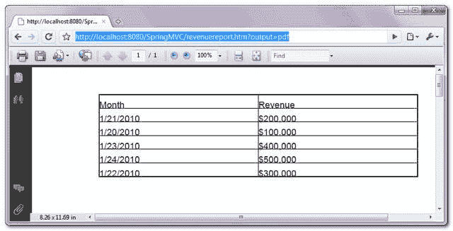

# 通过 AbstractPdfView 的 Spring MVC 和 PDF 文件

> 原文：<http://web.archive.org/web/20230101150211/http://www.mkyong.com/spring-mvc/spring-mvc-export-data-to-pdf-file-via-abstractpdfview/>

Spring MVC 自带 **AbstractPdfView** 类，通过 Bruno Lowagie 的 **iText** 库将数据导出为 pdf 文件。在本教程中，展示了在 Spring MVC 应用程序中使用 **AbstractPdfView** 类将数据导出为 pdf 文件以供下载。

## 1\. iText

获取 [iText 库](http://web.archive.org/web/20210110105618/http://www.lowagie.com/iText/)生成 pdf 文件。

```java
 <!-- Pdf library --> 
    <dependency>
	<groupId>com.lowagie</groupId>
	<artifactId>itext</artifactId>
	<version>2.1.7</version>
    </dependency> 
```

## 2.控制器

一个控制器类，生成虚拟数据用于演示，并获取请求参数以确定返回哪个视图。如果请求参数等于“ **PDF** ”，则返回一个 PDF 视图( **AbstractPdfView** )。

*文件:RevenueReportController.java*

```java
 package com.mkyong.common.controller;

import java.util.HashMap;
import java.util.Map;
import javax.servlet.http.HttpServletRequest;
import javax.servlet.http.HttpServletResponse;
import org.springframework.web.bind.ServletRequestUtils;
import org.springframework.web.servlet.ModelAndView;
import org.springframework.web.servlet.mvc.AbstractController;

public class RevenueReportController extends AbstractController{

	@Override
	protected ModelAndView handleRequestInternal(HttpServletRequest request,
		HttpServletResponse response) throws Exception {

		String output =
			ServletRequestUtils.getStringParameter(request, "output");

		//dummy data
		Map<String,String> revenueData = new HashMap<String,String>();
		revenueData.put("1/20/2010", "$100,000");
		revenueData.put("1/21/2010", "$200,000");
		revenueData.put("1/22/2010", "$300,000");
		revenueData.put("1/23/2010", "$400,000");
		revenueData.put("1/24/2010", "$500,000");

		if(output ==null || "".equals(output)){
		    //return normal view
		    return new ModelAndView("RevenueSummary","revenueData",revenueData);

		}else if("PDF".equals(output.toUpperCase())){
		    //return excel view
		    return new ModelAndView("PdfRevenueSummary","revenueData",revenueData);

		}else{
		    //return normal view
		    return new ModelAndView("RevenueSummary","revenueData",revenueData);

		}	
	}	
} 
```

## 3.PdfRevenueReportView

通过扩展 **AbstractPdfView** 类创建 pdf 视图，覆盖 **buildExcelDocument()** 方法将数据填充到 pdf 文件中。 **AbstractPdfView** 正在使用 <string>iText API 生成 pdf 文件。</string>

*档案:PdfRevenueReportView.java*

```java
 package com.mkyong.common.view;

import java.util.Map;
import javax.servlet.http.HttpServletRequest;
import javax.servlet.http.HttpServletResponse;
import org.springframework.web.servlet.view.document.AbstractPdfView;
import com.lowagie.text.Document;
import com.lowagie.text.Table;
import com.lowagie.text.pdf.PdfWriter;

public class PdfRevenueReportView extends AbstractPdfView{

	@Override
	protected void buildPdfDocument(Map model, Document document,
		PdfWriter writer, HttpServletRequest request,
		HttpServletResponse response) throws Exception {

		Map<String,String> revenueData = (Map<String,String>) model.get("revenueData");

		Table table = new Table(2);
		table.addCell("Month");
		table.addCell("Revenue");

		for (Map.Entry<String, String> entry : revenueData.entrySet()) {
			table.addCell(entry.getKey());
			table.addCell(entry.getValue());
                }

		document.add(table);
	}
} 
```

## 4.弹簧配置

为 Pdf 视图创建一个 **XmlViewResolver** 。

```java
 <beans ...>

 <bean 
  class="org.springframework.web.servlet.mvc.support.ControllerClassNameHandlerMapping" />

    <bean class="com.mkyong.common.controller.RevenueReportController" />

    <bean class="org.springframework.web.servlet.view.XmlViewResolver">
       <property name="location">
          <value>/WEB-INF/spring-pdf-views.xml</value>
       </property>
    </bean>

</beans> 
```

*文件:spring-pdf-views.xml*

```java
 <beans ...">

   <bean id="PdfRevenueSummary"
   	class="com.mkyong.common.view.PdfRevenueReportView">
   </bean>

</beans> 
```

## 5.演示

URL:**http://localhost:8080/springmvc/revenue report . htm？output=pdf**

它生成一个 pdf 文件供用户下载。

<noscript></noscript>


## 下载源代码

Download it – [SpringMVC-PDF-Example.zip](http://web.archive.org/web/20210110105618/http://www.mkyong.com/wp-content/uploads/2010/08/SpringMVC-PDF-Example.zip) (9KB)

## 参考

1.  [iText 网站](http://web.archive.org/web/20210110105618/http://www.lowagie.com/iText)
2.  [iText Wiki](http://web.archive.org/web/20210110105618/https://en.wikipedia.org/wiki/IText)
3.  [AbstractPdfView Javadoc](http://web.archive.org/web/20210110105618/http://static.springsource.org/spring/docs/2.5.x/api/org/springframework/web/servlet/view/document/AbstractPdfView.html)

Tags : [pdf](http://web.archive.org/web/20210110105618/https://mkyong.com/tag/pdf/) [spring mvc](http://web.archive.org/web/20210110105618/https://mkyong.com/tag/spring-mvc/)<input type="hidden" id="mkyong-current-postId" value="6756">

### 相关文章

*   [如何用 Java 打开 PDF 文件](/web/20210110105618/https://mkyong.com/java/how-to-open-a-pdf-file-in-java/)
*   [如何在 Java 中获取 HTTP 请求头](/web/20210110105618/https://mkyong.com/java/how-to-get-http-request-header-in-java/)
*   [jQuery - Ajax 请求返回 200 OK 但错误偶](/web/20210110105618/https://mkyong.com/jquery/jquery-ajax-request-return-200-ok-but-error-event-is-fired/)
*   [Ant - Spring MVC 和 WAR 文件示例](/web/20210110105618/https://mkyong.com/ant/ant-spring-mvc-and-war-file-example/)
*   [Maven -如何创建一个 Java web 应用项目](/web/20210110105618/https://mkyong.com/maven/how-to-create-a-web-application-project-with-maven/)

*   [混合 XML 和 JavaConfig](/web/20210110105618/https://mkyong.com/spring/spring-mixing-xml-and-javaconfig/)
*   [春季 MVC 教程](/web/20210110105618/https://mkyong.com/tutorials/spring-mvc-tutorials/)
*   [无法更改 HTTP 接受标头-使用不同的](/web/20210110105618/https://mkyong.com/spring-mvc/cannot-change-http-accept-header-use-a-different-locale-resolution-strategy/)
*   [春天 3 休息你好世界示例](/web/20210110105618/https://mkyong.com/spring-mvc/spring-3-rest-hello-world-example/)
*   [Spring 3 MVC ContentNegotiatingViewResolver 示例](/web/20210110105618/https://mkyong.com/spring-mvc/spring-3-mvc-contentnegotiatingviewresolver-example/)