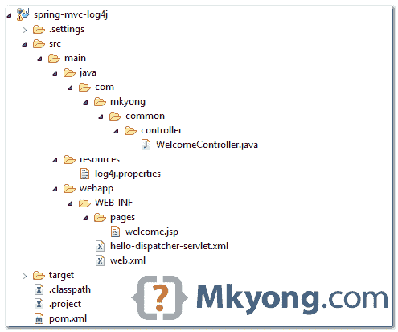

# Spring MVC + Log4j 示例

> 原文：<http://web.archive.org/web/20230101150211/http://www.mkyong.com/spring-mvc/spring-mvc-log4j-integration-example/>


在本教程中，我们将向您展示如何使用 log4j 框架在 Spring MVC web 应用程序中进行日志记录。

使用的技术和工具:

1.  Log4j 1.2.17
2.  弹簧 4.1.6 释放
3.  maven3
4.  tomcat6
5.  日食开普勒 4.3

**Note**
By default, Spring (spring-core) is using the JCL ([commons-logging](http://web.archive.org/web/20221002193422/https://commons.apache.org/proper/commons-logging/)) for logging, and the JCL has a runtime discovery algorithm to find out for other logging frameworks in well known places on the project classpath.

要集成 log4j，您需要做的就是:

1.  将`log4j.jar`放在项目类路径中。
2.  在项目根类路径中创建一个`log4j.properties`或`log4j.xml`文件(如果遵循 Maven 标准目录结构，这应该是`resources`文件夹)。

## 1.项目目录

审查最终的项目结构。



## 2.项目相关性

声明以下依赖项:

pom.xml

```java
 <properties>
		<spring.version>4.1.6.RELEASE</spring.version>
		<log4j.version>1.2.17</log4j.version>
	</properties>

	<dependencies>

		<!-- Spring -->
		<dependency>
			<groupId>org.springframework</groupId>
			<artifactId>spring-webmvc</artifactId>
			<version>${spring.version}</version>
		</dependency>

		<!-- Log4j -->
		<dependency>
			<groupId>log4j</groupId>
			<artifactId>log4j</artifactId>
			<version>${log4j.version}</version>
		</dependency>

	</dependencies> 
```

## 3.log4j.properties

创建一个`log4j.properties`文件，放在`resources`中。文件夹，参考上面的项目目录结构。

log4j.properties

```java
 # Root logger option
log4j.rootLogger=DEBUG, stdout, file

# Redirect log messages to console
log4j.appender.stdout=org.apache.log4j.ConsoleAppender
log4j.appender.stdout.Target=System.out
log4j.appender.stdout.layout=org.apache.log4j.PatternLayout
log4j.appender.stdout.layout.ConversionPattern=%d{yyyy-MM-dd HH:mm:ss} %-5p %c{1}:%L - %m%n

# Redirect log messages to a log file
log4j.appender.file=org.apache.log4j.RollingFileAppender
#outputs to Tomcat home
log4j.appender.file.File=${catalina.home}/logs/myapp.log
log4j.appender.file.MaxFileSize=5MB
log4j.appender.file.MaxBackupIndex=10
log4j.appender.file.layout=org.apache.log4j.PatternLayout
log4j.appender.file.layout.ConversionPattern=%d{yyyy-MM-dd HH:mm:ss} %-5p %c{1}:%L - %m%n 
```

## 4.Spring MVC 控制器+消息日志

返回欢迎页面的简单控制器。此外，它还向您展示了如何使用 log4j 进行日志记录。

WelcomeController.java

```java
 package com.mkyong.common.controller;

import org.apache.log4j.Logger;
import org.springframework.stereotype.Controller;
import org.springframework.web.bind.annotation.RequestMapping;
import org.springframework.web.bind.annotation.RequestMethod;
import org.springframework.web.servlet.ModelAndView;

@Controller
public class WelcomeController {

	private static final Logger logger = Logger.getLogger(WelcomeController.class);

	@RequestMapping(value = "/", method = RequestMethod.GET)
	public ModelAndView getWelcome() {

		//logs debug message
		if(logger.isDebugEnabled()){
			logger.debug("getWelcome is executed!");
		}

		//logs exception
		logger.error("This is Error message", new Exception("Testing"));

		ModelAndView model = new ModelAndView("welcome");
		model.addObject("msg", "Hello Spring MVC + Log4j");
		return model;

	}

} 
```

## 5.演示

5.1 下载[源代码](#download)，运行内嵌 Jetty 容器的 web app。

```java
 $ mvn jetty:run 
```

访问网址:*http://localhost:8080/spring-MVC-log4j/*

5.2 所有记录信息将显示在控制台中。

log4j.properties

```java
 # Redirect log messages to console
log4j.appender.stdout=org.apache.log4j.ConsoleAppender
log4j.appender.stdout.Target=System.out
log4j.appender.stdout.layout=org.apache.log4j.PatternLayout
log4j.appender.stdout.layout.ConversionPattern=%d{yyyy-MM-dd HH:mm:ss} %-5p %c{1}:%L - %m%n 
```

Jetty console

```java
 2015-06-19 14:10:35 DEBUG WelcomeController:19 - getWelcome is executed!
2015-06-19 14:10:35 ERROR WelcomeController:23 - This is Error message
java.lang.Exception: Testing
        at com.mkyong.common.controller.WelcomeController.getWelcome(WelcomeController.java:23)
        at sun.reflect.NativeMethodAccessorImpl.invoke0(Native Method)
        at sun.reflect.NativeMethodAccessorImpl.invoke(NativeMethodAccessorImpl.java:57)
        at sun.reflect.DelegatingMethodAccessorImpl.invoke(DelegatingMethodAccessorImpl.java:43)
        at java.lang.reflect.Method.invoke(Method.java:606) 
```

## 下载源代码

Download it – [spring-mvc-log4j.zip](http://web.archive.org/web/20221002193422/http://www.mkyong.com/wp-content/uploads/2010/07/spring-mvc-log4j.zip) (5 KB)

## 参考

1.  [弹簧参考–使用 log4j](http://web.archive.org/web/20221002193422/https://docs.spring.io/spring/docs/4.1.x/spring-framework-reference/html/overview.html#overview-logging)
2.  [log4j 1.2 官方页面](http://web.archive.org/web/20221002193422/https://logging.apache.org/log4j/1.2/)
3.  [log4j hello world 示例](http://web.archive.org/web/20221002193422/http://www.mkyong.com/logging/log4j-hello-world-example/)
4.  [log4j.properties 示例](http://web.archive.org/web/20221002193422/http://www.mkyong.com/logging/log4j-log4j-properties-examples/)

<input type="hidden" id="mkyong-current-postId" value="6501">