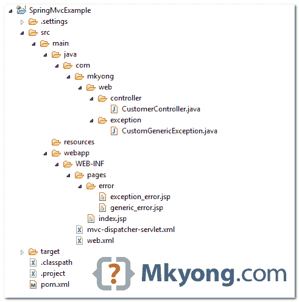
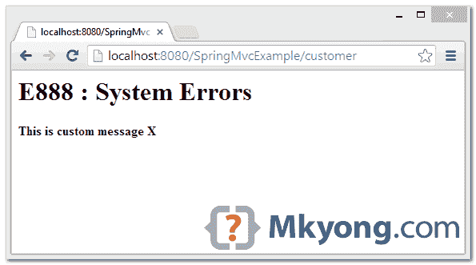

> 原文：<http://web.archive.org/web/20230101150211/http://www.mkyong.com/spring-mvc/spring-mvc-exception-handling-example/>

# Spring MVC 异常处理示例

在 J2EE / servlet web 应用程序中，您可以映射错误页面来指定如下异常:

web.xml

```
 <error-page>
	<error-code>404</error-code>
	<location>/WEB-INF/pages/404.jsp</location>
  </error-page>

  <error-page>
	<exception-type>com.mkyong.web.exception.CustomException</exception-type>
	<location>/WEB-INF/pages/error/custom_error.jsp</location>
  </error-page>

  <error-page>
	<exception-type>java.lang.Exception</exception-type>
	<location>/WEB-INF/pages/generic_error.jsp</location>
  </error-page> 
```

上面的代码应该是自我探索的。如果异常处理功能存在于 servlet 容器中，为什么我们仍然需要使用 Spring 来处理异常？

一般来说，有两个原因:

1.  **自定义错误页面**–servlet 容器会直接渲染错误页面；而 Spring 允许你将模型或数据填充到错误页面，这样你就可以定制一个更加用户友好的错误页面。
2.  业务逻辑–Spring 允许您在呈现错误页面之前应用额外的业务逻辑，如日志、审计等。

在本教程中，我们将向您展示两个在 Spring 中处理异常的例子。

1.  对于 Spring 2.x，我们在 XML 文件中使用`SimpleMappingExceptionResolver`。
2.  对于 Spring 3.x，我们可以通过`@ExceptionHandler`注释来简化 XML 配置。

## 1.SimpleMappingExceptionResolver 示例

查看目录结构。



自定义异常。

CustomGenericException.java

```
 package com.mkyong.web.exception;

public class CustomGenericException extends RuntimeException {

	private static final long serialVersionUID = 1L;

	private String errCode;
	private String errMsg;

	//getter and setter methods

	public CustomGenericException(String errCode, String errMsg) {
		this.errCode = errCode;
		this.errMsg = errMsg;
	}

} 
```

这个控制器类，只是抛出一个`CustomGenericException`，带有自定义的错误代码和错误描述。

CustomerController.java

```
 package com.mkyong.web.controller;

import javax.servlet.http.HttpServletRequest;
import javax.servlet.http.HttpServletResponse;
import org.springframework.web.servlet.ModelAndView;
import org.springframework.web.servlet.mvc.AbstractController;
import com.mkyong.web.exception.CustomGenericException;

public class CustomerController extends AbstractController {

  @Override
  protected ModelAndView handleRequestInternal(HttpServletRequest request,
	HttpServletResponse response) throws Exception {

	throw new CustomGenericException("E888", "This is custom message - ABC");

  }

} 
```

查看下面的`SimpleMappingExceptionResolver`:

mvc-dispatcher-servlet.xml

```
 <beans 
	xmlns:context="http://www.springframework.org/schema/context"
	xmlns:xsi="http://www.w3.org/2001/XMLSchema-instance" 
	xmlns:mvc="http://www.springframework.org/schema/mvc"
	xsi:schemaLocation="
        http://www.springframework.org/schema/beans     
        http://www.springframework.org/schema/beans/spring-beans-3.0.xsd
        http://www.springframework.org/schema/mvc 
	http://www.springframework.org/schema/mvc/spring-mvc-3.0.xsd
        http://www.springframework.org/schema/context 
        http://www.springframework.org/schema/context/spring-context-3.0.xsd">

	<context:component-scan base-package="com.mkyong" />

	<bean
	class="org.springframework.web.servlet.mvc.support.ControllerClassNameHandlerMapping"/>

	<!-- Register the bean -->
	<bean class="com.mkyong.web.controller.CustomerController" />

	<bean
	  class="org.springframework.web.servlet.handler.SimpleMappingExceptionResolver">
	  <property name="exceptionMappings">
		<props>
			<prop key="com.mkyong.wb.exception.CustomGenericException">
				error/generic_error
			</prop>
			<prop key="java.lang.Exception">error/exception_error</prop>
		</props>
	  </property>
	</bean>

	<bean
	  class="org.springframework.web.servlet.view.InternalResourceViewResolver">
		<property name="prefix">
			<value>/WEB-INF/pages/</value>
		</property>
		<property name="suffix">
			<value>.jsp</value>
		</property>
	</bean>

	<mvc:annotation-driven />

</beans> 
```

在上面，当

1.  抛出 CustomGenericException，它将映射到视图名“error/generic_error”。
2.  任何其他异常被抛出，它将映射到视图名“error/exception_error”。

在 JSP 页面中，可以通过`${exception}`访问异常实例。

pages/error/generic_error.jsp.jsp

```
 <%@taglib prefix="c" uri="http://java.sun.com/jsp/jstl/core"%>
<html>
<body>

	<c:if test="${not empty exception.errCode}">
		<h1>${exception.errCode} : System Errors</h1>
	</c:if>

	<c:if test="${empty exception.errCode}">
		<h1>System Errors</h1>
	</c:if>

	<c:if test="${not empty exception.errMsg}">
		<script async src="//pagead2.googlesyndication.com/pagead/js/adsbygoogle.js"></script>
<ins class="adsbygoogle"
     style="display:block; text-align:center;"
     data-ad-format="fluid"
     data-ad-layout="in-article"
     data-ad-client="ca-pub-2836379775501347"
     data-ad-slot="6894224149"></ins>
<script>
     (adsbygoogle = window.adsbygoogle || []).push({});
</script><h2>${exception.errMsg}</h2>
	</c:if>

</body>
</html> 
```

演示-*http://localhost:8080/spring MVC example/customer*

Download it – [SpringMvc-SimpleMappingExceptionResolver-Example.zip](http://web.archive.org/web/20190225100332/http://www.mkyong.com/wp-content/uploads/2010/08/SpringMvc-SimpleMappingExceptionResolver-Example.zip) (13KB) <ins class="adsbygoogle" style="display:block" data-ad-client="ca-pub-2836379775501347" data-ad-slot="8821506761" data-ad-format="auto" data-ad-region="mkyongregion">## 2.@ExceptionHandler 示例

从 Spring 3.0 开始，有了一个新的注释`@ExceptionHandler`来简化 XML 配置。下面是使用`@ExceptionHandler`的等效版本。

CustomerController.java

```
 package com.mkyong.web.controller;

import org.springframework.stereotype.Controller;
import org.springframework.web.bind.annotation.ExceptionHandler;
import org.springframework.web.bind.annotation.RequestMapping;
import org.springframework.web.bind.annotation.RequestMethod;
import org.springframework.web.servlet.ModelAndView;
import com.mkyong.web.exception.CustomGenericException;

@Controller
public class CustomerController {

	@RequestMapping(value = "/customer", method = RequestMethod.GET)
	public ModelAndView getPages() throws Exception {

		throw new CustomGenericException("E888", "This is custom message X");

	}

	@ExceptionHandler(CustomGenericException.class)
	public ModelAndView handleCustomException(CustomGenericException ex) {

		ModelAndView model = new ModelAndView("error/generic_error");
		model.addObject("exception", ex);
		return model;

	}

	@ExceptionHandler(Exception.class)
	public ModelAndView handleAllException(Exception ex) {

		ModelAndView model = new ModelAndView("error/exception_error");
		return model;

	}

} 
```

Spring XML 文件中没有要声明的内容。

mvc-dispatcher-servlet.xml

```
 <beans 
	xmlns:context="http://www.springframework.org/schema/context"
	xmlns:xsi="http://www.w3.org/2001/XMLSchema-instance" 
	xmlns:mvc="http://www.springframework.org/schema/mvc"
	xsi:schemaLocation="
        http://www.springframework.org/schema/beans     
        http://www.springframework.org/schema/beans/spring-beans-3.0.xsd
        http://www.springframework.org/schema/mvc 
		http://www.springframework.org/schema/mvc/spring-mvc-3.0.xsd
        http://www.springframework.org/schema/context 
        http://www.springframework.org/schema/context/spring-context-3.0.xsd">

	<context:component-scan base-package="com.mkyong" />

	<bean
		class="org.springframework.web.servlet.view.InternalResourceViewResolver">
		<property name="prefix">
			<value>/WEB-INF/pages/</value>
		</property>
		<property name="suffix">
			<value>.jsp</value>
		</property>
	</bean>

	<mvc:annotation-driven />

</beans> 
```

Download it – [SpringMvc-ExceptionHandler-Example.zip](http://web.archive.org/web/20190225100332/http://www.mkyong.com/wp-content/uploads/2010/08/SpringMvc-ExceptionHandler-Example.zip) (15KB)**Note**
You may interest at this [Spring MVC @ExceptionHandler Example](http://web.archive.org/web/20190225100332/http://www.mkyong.com/spring-mvc/spring-mvc-exceptionhandler-example/)

## 参考

1.  [SimpleMappingExceptionResolver JavaDoc](http://web.archive.org/web/20190225100332/http://docs.spring.io/spring/docs/3.0.7.RELEASE/javadoc-api/org/springframework/web/portlet/handler/SimpleMappingExceptionResolver.html)
2.  [@ExceptionHandler JavaDoc](http://web.archive.org/web/20190225100332/http://docs.spring.io/spring/docs/3.0.x/javadoc-api/org/springframework/web/bind/annotation/ExceptionHandler.html)
3.  [Spring MVC @ExceptionHandler 示例](http://web.archive.org/web/20190225100332/http://www.mkyong.com/spring-mvc/spring-mvc-exceptionhandler-example/)

[exception handler](http://web.archive.org/web/20190225100332/http://www.mkyong.com/tag/exception-handler/) [spring mvc](http://web.archive.org/web/20190225100332/http://www.mkyong.com/tag/spring-mvc/)</ins> (function (i,d,s,o,m,r,c,l,w,q,y,h,g) { var e=d.getElementById(r);if(e===null){ var t = d.createElement(o); t.src = g; t.id = r; t.setAttribute(m, s);t.async = 1;var n=d.getElementsByTagName(o)[0];n.parentNode.insertBefore(t, n); var dt=new Date().getTime(); try{i[l][w+y](h,i[l][q+y](h)+'&amp;'+dt);}catch(er){i[h]=dt;} } else if(typeof i[c]!=='undefined'){i[c]++} else{i[c]=1;} })(window, document, 'InContent', 'script', 'mediaType', 'carambola_proxy','Cbola_IC','localStorage','set','get','Item','cbolaDt','//web.archive.org/web/20190225100332/http://route.carambo.la/inimage/getlayer?pid=myky82&amp;did=112239&amp;wid=0')<input type="hidden" id="mkyong-postId" value="6569">

#### 关于作者


##### mkyong

Founder of [Mkyong.com](http://web.archive.org/web/20190225100332/http://mkyong.com/), love Java and open source stuff. Follow him on [Twitter](http://web.archive.org/web/20190225100332/https://twitter.com/mkyong), or befriend him on [Facebook](http://web.archive.org/web/20190225100332/http://www.facebook.com/java.tutorial) or [Google Plus](http://web.archive.org/web/20190225100332/https://plus.google.com/110948163568945735692?rel=author). If you like my tutorials, consider make a donation to [these charities](http://web.archive.org/web/20190225100332/http://www.mkyong.com/blog/donate-to-charity/).